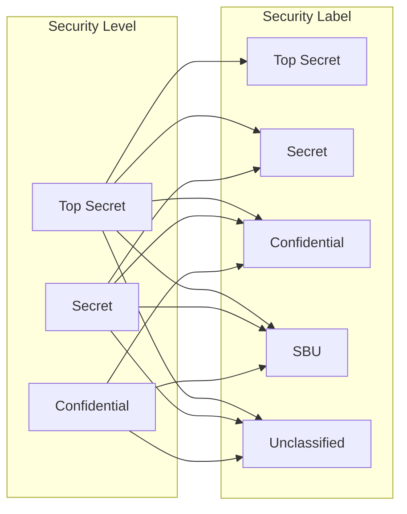
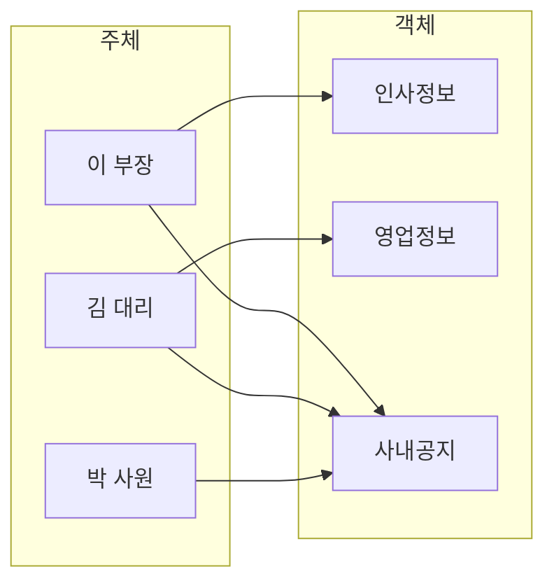

<!-- PDF page: 043 -->

② 최대권한정책(Maximum Privilege Policy)

이 정책은 데이터 공유의 장점을 증대시키기 위하여 적용하는 최대 가용성 원리에 기반 한다. 즉, 사용자와 데이터 교환의
신뢰성 때문에 특별한 보호가 필요하지 않은 환경에 효과적으로 적용할 수 있다.

#### 다) 접근통제 정책의 종류

권한이 있는 사용자에게만 정보 자원에 접근이 가능하도록 하기 위한 접근통제 체계를 구현하기 위한 정책으로 대표적인
접근통제 정책에는 강제적 접근통제, 임의적 접근통제 정책, 역할 기반 접근통제 정책 등이 있다.

① 강제적 접근통제(MAC: Mandatory Access Control)

주체에게 보안 등급(Security Level)을 부여하고 객체에게는 보안 레이블(Security Label)을 부여한 후 사전에 정한 규칙에
따라 해당 주체가 객체에 대하여 접근이 가능한지의 여부를 판단할 수 있도록 하는 정책이다. 주로 군사적 목적으로 사용
하는 정책으로 강력한 보안 체계를 유지할 수 있지만 관리 효율성은 저하된다.

[그림 23] 강제적 접근통제

② 임의적 접근통제(DAC: Discretionary Access Control)

주체의 계정 또는 계정이 속한 그룹의 신원에 근거하여 객체에 대한 접근을 제어하며, 객체의 소유자가 직접 접근 여부를
결정하는 모델 이다. 주로 유닉스나 리눅스의 시스템 접근통제로 사용되는 정책이다.

[그림 24] 접근통제 수행 절차

③ 역할기반 접근통제(RBAC: Role Based Access Control)

관리자에 의해 사전에 역할(Role)을 정의하고, 각 역할에 따라 접근이 가능한 객체를 매핑한 후 주체에게 역할을 부여하여
접근을 제어하는 정책이다. 이 정책은 변화가 빈번한 조직이나 시스템에서 활용될 수 있는 모델로 관리 효율성은 향상될
수 있지만 보안성이 저하될 수 있는 단점이 있다.
