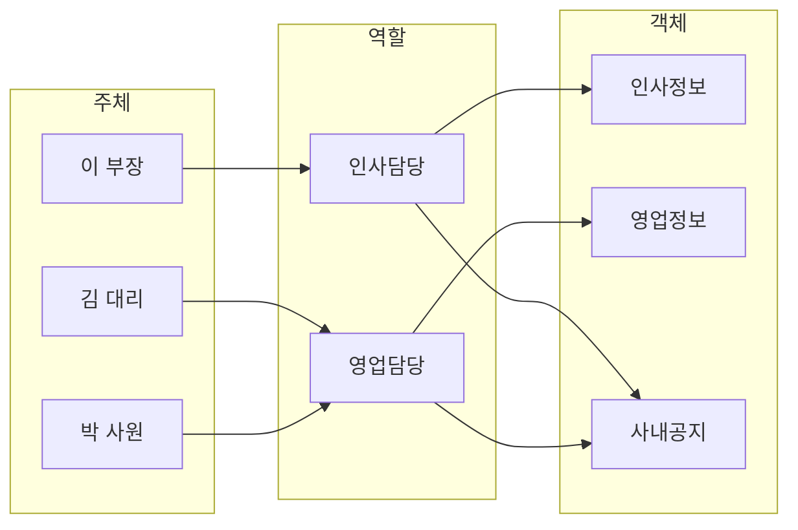

<!-- PDF page: 044 -->

[그림 25] 접근통제 수행 절차

#### 라) 접근통제 메커니즘

① 접근통제 행렬(Access Control Matrix)

주체와 객체를 행과 열로 표현하고 행렬의 각 엔트리는 접근 권한을 표시한다. 주체와 객체의 모든 관계를 행렬로 관리하는데 특정 자원에 접근하기 위해 행렬을 검색하는 것은 비효율적이므로 Capability List와 Access Control List 나누어 관리한다.

<table>
<tr><th colspan="2" rowspan="2"></th><th colspan="4">객체</th></tr>
<tr><th>객체1</th><th>객체2</th><th>객체3</th><th>객체4</th></tr>
<tr><th rowspan="4">주체</th><th>사용자A</th><td>읽기, 쓰기</td><td>읽기</td><td>읽기, 쓰기</td><td>접근불가</td></tr>
<tr><th>사용자B</th><td>읽기, 쓰기</td><td>읽기, 쓰기</td><td>읽기, 쓰기</td><td>읽기, 쓰기</td></tr>
<tr><th>사용자C</th><td>읽기</td><td>접근불가</td><td>접근불가</td><td>접근불가</td></tr>
<tr><th>사용자D</th><td>읽기, 쓰기</td><td>읽기, 쓰기</td><td>접근불가</td><td>접근불가</td></tr>
</table>

[그림 26] 접근통제 행렬(Access Control Matrix)

② ACL(Access Control List)

객체를 기준으로 주체에 대한 접근 권한을 관리하며, Access Control Matrix의 열에 해당한다.

③ CL(Capability List)

주체를 기준으로 객체에 대한 접근 권한을 링크드리스트 형식으로 관리하며, Access Control Matrix의 행에 해당한다.

④ SL(Security Label)

객체에 부여된 보안 속성 정보의 집합을 말한다.

#### 마) 접근통제 모델

① Bell–Lapadula 모델

최초의 수학적 모델이며, 강제적 정책에 의한 접근 통제 모델(MAC 정책)로 미 국방성의 지원에 따라 설계된 모델로서 기밀성을 강조한다. 정보의 불법적인 파괴나 변조보다 기밀 유출 방지에 중점을 두었으며, 정보가 높은 레벨에서 낮은 레벨로 흐르는 것을 방지하기 위한 모델이다.

② Biba 모델

Bell–Lapadula 모델의 단점인 무결성을 보장하도록 만들어진 모델(기밀성 보장하지 않음)로 주체에 의한 객체 접근의 항목으로 무결성을 다룬다.
