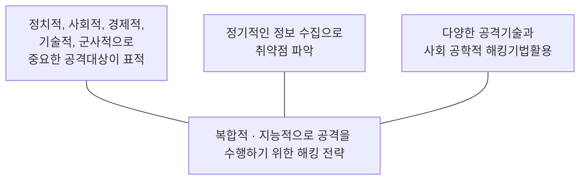

<!-- PDF page: 048 -->

### 01 최신 정보보안 위협

#### 가) APT(Advanced Persistent Threat) 공격

① APT 공격의 개념

[그림 27] APT 공격의 개념

② APT 공격의 절차

APT 공격은 침투, 검색, 수집 및 유출 단계 등의 과정을 거쳐 공격이 수행된다.

• 1단계: 공격자가 취약한 시스템이나 직원들의 PC 악성코드 감염

• 2단계: 악성코드를 이용한 내부 네트워크 침투

• 3단계: 침투한 내부 시스템 및 인프라 구조에 대한 정보를 수집 및 공격 준비

• 4단계: 취약한 시스템으로부터 중요 정보 유출, 시스템 파괴 또는 서비스 거부 공격

③ APT 공격의 사례

• 국내에서는 2011년 N 금융기관 해킹에 의한 데이터 삭제를 통한 전산망 마비 사건
• H 금융기관 해킹에 의한 175만 고객정보 유출사건

• N 포털사 해킹에 의한 3,500만 명 고객정보 유출 사건

④ APT 공격의 대응방안

〈표 13〉 APT 공격의 대응방안

<table>
<tr><td>대응방안</td><td>내용</td></tr>
<tr><td>보안관리 및 운영, 교육 강화</td><td>• 표적이 되는 대상의 보안체계 분석을 바탕으로 여러 취약점을 분석함으로써 조직의 종합적인 보안위협을 분석하고 보안체계를 재정비 • 지속적 운영을 위한 보안 관리 조직을 중심으로 꾸준한 관리와 상시적인 보안관제 및 정기적인 모의해킹을 포함한 관리 필요</td></tr>
<tr><td>엔드포인트 보안</td><td>• APT 공격의 1차 목표는 엔드포인트이며, 엔드포인트에서는 인터넷, 메일, SNS, 메신저 P2P, USB 등의 매체를 통해 악성코드 잠입이 가능 • 운영체제 보안 업데이트, 보안 소프트웨어 설치 및 운용, 화이트리스트 기반 애플리케이션 제어 필요</td></tr>
<tr><td>접근 권한 관리</td><td>• 중요정보에 대한 접근권한 관리, 접근권한 최소화, 정보의 중요도에 따른 정보권한 세분화 • 중요도 높은 정보의 경우 사람 및 기기 인증, 권한관리의 전략적 수행, 권한의 자동할당 및 회수</td></tr>
<tr><td>중요정보 암호화 및 DLP</td><td>• APT공격의 최종 목표는 데이터이므로 데이터를 암호화 저장 • 중요 정보의 저장형태에 따라 정보유출의 다양화가 가능하므로, DLP(Data Loss Prevention) 등의 솔루션 도입 필요</td></tr>
</table>
