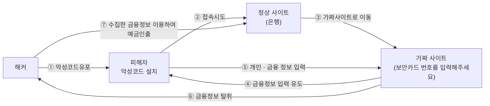

<!-- PDF page: 049 -->

#### 나) 파밍(Pharming)

① 파밍(Pharming) 공격의 개념

악성코드에 감염된 PC의 호스트 파일(C:₩windows₩system32₩drivers₩hosts)이나 브라우저의 ‘즐겨찾기’를 조작해서
금융회사나 포털사이트 등의 홈페이지에 접속하게 되면 자동으로 피싱(가짜)사이트로 유도되어 금융정보나 접속정보를
탈취함으로써 불법금융사기나 개인정보유출 등의 피해를 야기시키는 사기수법을 말한다.

② 파밍 공격의 수행 절차

③ 파밍 공격의 대응방법

• 웹 브라우저의 [인터넷 옵션] 메뉴를 클릭하고 [보안]탭을 선택하여 보안 수준을 강화

• 백신 프로그램을 최신 상태로 유지하고, 악성코드 감염여부를 수시로 점검
• PC의 호스트 파일(C:₩windows₩system32₩drivers₩hosts)의 위변조 여부를 수시로 확인

#### 다) 큐싱(Qshing)

① 큐싱의 개념

큐싱은 'QR코드'와 개인정보, 금융정보를 '낚는다'(fishing)의 합성어로 QR코드를 통해 악성 링크로 접속하게 하거나 직접
악성코드를 감염시키는 공격기법이다.

② 큐싱 공격 절차

스마트폰을 악성코드에 감염시켜 사용자가 정상 금융 사이트에 접속하더라도 가짜 금융사이트(피싱사이트)로 연결→가짜
금융사이트에서 추가인증이 필요한 것처럼 QR코드를 보여주고 이를 통해 악성 앱이 설치되도록 유도→악성 앱을 통해 보
안카드, 전화번호, 문자메시지 등의 정보를 탈취하고 문자 수신방해, 착신전환 서비스 설정 등 모바일 환경을 조작→소액
결제, 자금이체 등 금전적 이득을 위한 금융사기 피해를 유발

③ 파밍(Pharming)과 큐싱(Qshing)의 결합

악성코드가 기존 PC 인터넷 뱅킹을 노리는 파밍(Pharming)에 스마트폰의 금융정보를 노리는 큐싱(Qshing)을 결합한 형태
로 진화하고 있는 것으로 확인되었다.
