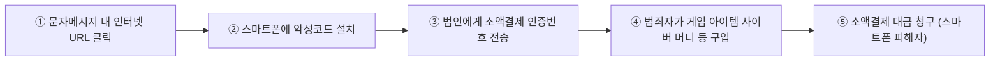

<!-- PDF page: 050 -->

④ QR코드 관련 공격 대응

QR코드 관련 악성코드로 인한 피해를 예방하기 위해서는 백신, 웹 브라우저 등 응용소프트웨어의 보안을 최신 버전으로
유지하도록 관리해야 한다. 또한 QR코드 등을 통해 악성 앱이 설치되는 것을 예방하기 위해 스마트폰에서 '출처를 알 수
없는 앱 설치' 허용 옵션을 사용하지 않도록 설정을 변경해야 한다.

#### 라) 스미싱(Smishing)

① 스미싱공격의 개념

스미싱(Smishing)은 문자(SMS)와 피싱(Phishing)의 합성어로 스마트폰 보급 확대와 소액결제와 같은 다양한 금융서비스가
확대됨에 따라 SMS를 통하여 무료쿠폰 지급을 사칭하거나 이벤트 당첨 등을 사칭하여 스마트폰 소액결제 서비스를 악용
하여 공격이 진행되는 사기수법이다.

② 스미싱 공격의 수행 절차

[그림 28] 스미싱 공격의 수행 절차

③ 스미싱 공격의 대응방법

• 출처가 불명확한 홍보성 SMS의 웹사이트 링크 접속 자제

• SMS에 포함된 웹사이트 링크 접속 시 정확한 도메인 URL 확인

• 스미싱 차단앱 설치

• 동의없이 애플리케이션이 설치될 경우 다운로드/설치 취소

• 불법 애플리케이션이 설치된 경우 애플리케이션 관리 메뉴에서 삭제

• 스미싱 피해가 예상될 경우 본인의 휴대폰 결제 내역 확인(통신사 또는 결제대행사)

#### 마) 스피어 피싱(Spear Phishing)

① 스피어 피싱의 개념

공격자는 정보보안 체계가 잘 구축된 조직의 시스템이나 네트워크를 공격 목표로 하기 보다는 해당 기업에서 근무하는 주
요 직무자(기밀데이터나 중요 시스템의 접근 권한자 등)를 공격 목표로 설정한다. 공격 준비 단계에서 대상자에 대해 수집
한 정보를 바탕으로 스피어 피싱 이메일을 보낸다. 이러한 사회공학적 기법을 이용하여 주요 직무자의 단말기 권한을 획
득한 후 수개월 이상 모니터링을 통해 계정정보(ID, 비밀번호 등)를 가로채거나 원격 제어 도구를 이용해 주요 시스템과 네
트워크를 장악한다.

② 스피어 피싱의 대응 방안

보안관리자, 웹서버 운영자 등 주요 직무자 및 최종 사용자에 대해서는 스피어 피싱 위협에 대한 인식과 대응 교육을 수행
해야 한다. 웹서버 운영자의 경우는 특히 악성코드 유포 탐지, 웹 방화벽 운영, 웹 서버 보안 등의 대책을 마련해야 하며 응
용 프로그램 및 운영체제의 경우, 지속적인 보안 취약점을 모니터링하고 보안 패치를 주기적으로 이행하도록 해야 한다.
