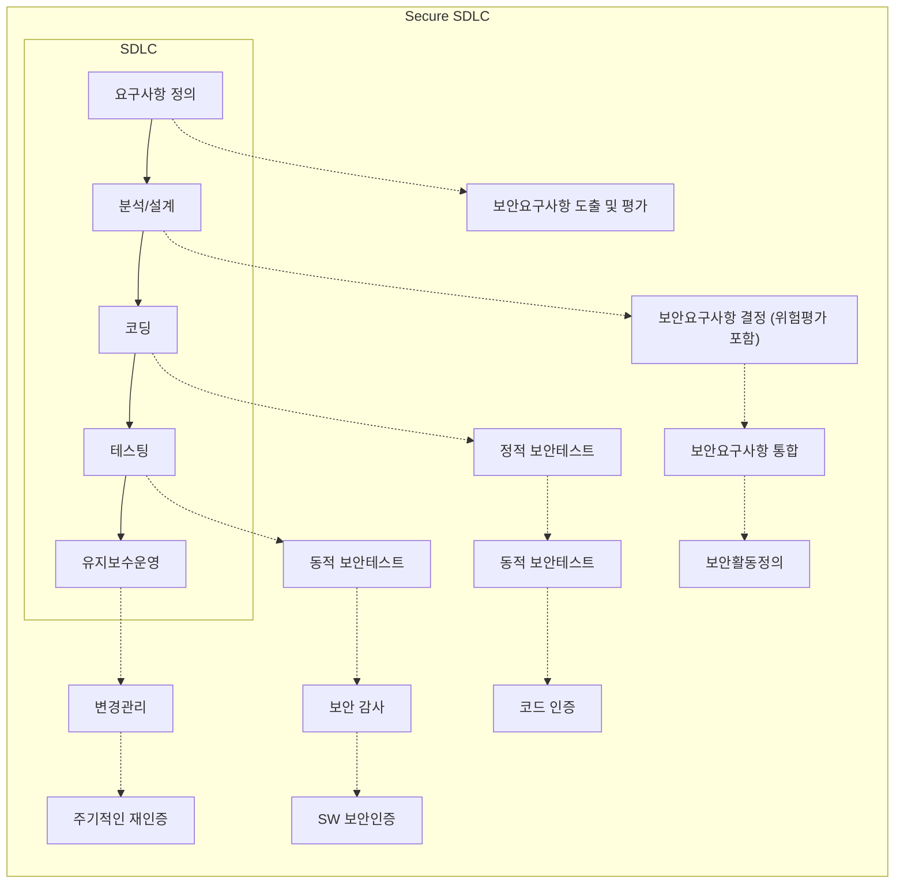

<!-- PDF page: 070 -->

### 01 시큐어 코딩의 필요성

#### 가) 시큐어 코딩의 필요성

사이버 공격의 약 75%가 SW 자체의 보안 취약점을 악용하는 공격으로 분석되고 있다. 또한 개발단계에서 수정하는 비용
이 제품 출시 이후 수정하는 비용보다 수십 배의 비용을 절감할 수 있는 것으로 분석되고 있다.
이에 따라 사이버 공격을 예방 및 대응하기 위해서는 제품 출시 이전 단계인 SW 개발단계에서 보안 취약점을 제거하는
것이 효과적인 방법으로 부각되고 있다.
시큐어 코딩은 소프트웨어 개발 단계(SDLC, Software Development Life Cycle)에서 보안 약점을 제거함으로써 소프트웨어
의 취약점과 해킹의 위험성을 줄여주는 방어적 프로그래밍 기법이다.

### 02 시큐어 코딩 주요내용

#### 가) SW 보안약점과 보안 취약점

① 보안약점(Weakness): 소프트웨어의 결함, 오류, 버그 등 설계, 구현 단계에서 발생하는 에러로 소프트웨어의 취약점으로
이어질 수 있는 원인이 된다. 대표적인 예로는 CWE(Common Weakness Enumeration)가 있다.

② 보안취약점(Vulnerability): 해커가 시스템이나 네트워크에 접근하여 사용할 수 있는 소프트웨어의 실수로, 접근 가능한 보안
약점을 악용하여 Exploit 될 수 있는 것을 말한다. 예로는 CVE(Common Vulnerabilities and Exposures)가 있다.

#### 나) 시큐어 개발 생명주기(Secure SDLC)

[그림 34] Secure SDLC
