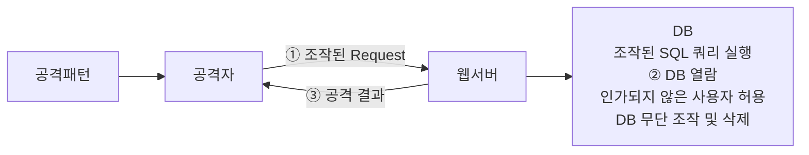

<!-- PDF page: 071 -->

① 시큐어 SDLC 요구사항 정의 단계

프로젝트 및 SW 특성에 따른 보안 목표를 정의하고, 잠재적 위협에 따른 보안 취약점 및 영향도를 분석하는 단계로서 SW
개발을 위한 보안 요구사항을 도출한다.

② 시큐어 SDLC 분석/설계 단계

전체 아키텍처 설계과정에서 보안 아키텍처를 설계하고 보안 요구사항을 정의하는 단계로서 안전한 보안 시스템 구축을
위한 개발자 교육 실시 및 보안 테스트 계획을 설계한다.

③ 시큐어 SDLC 코딩 단계

보안 관점에서 사용 프로그래밍 언어의 약점과 강점을 파악하여 코딩 규칙을 정의하고 개발된 코드에 대한 정적 단위 테
스트 실시 및 사전 정의한 시큐어 코딩 규칙의 준수 여부를 검증한다. 상용 패키지를 이용하는 경우 해당 패키지에서 발견
된 보안 취약점 내용 및 조치 내용을 점검한다.

④ 시큐어 SDLC 테스팅 단계

개발된 프로그램에 대한 동적 단위 테스트를 실시하고, 보안 적용된 응용 프로그램의 사용성 테스트를 수행한다. 인프라
및 응용 프로그램에 대해 시스템의 독립적인 취약성을 점검 수행하여 보안 개선사항을 도출하여 적용한다.

⑤ 시큐어 SDLC 유지보수 단계

SW 변경관리 절차에 따라 변경 시 보안 영향도 평가를 수행하고, 주기적인 취약성 점검 수행 및 보안 개선사항을 도출하
여 적용한다.

### 03 시큐어 코딩 주요기법

#### 가) JAVA 시큐어 코딩 주요기법

① SQL 삽입 공격 대응을 위한 시큐어 코딩 기법

• 공격개요
데이터베이스(DB)와 연동된 웹 응용프로그램에서 입력된 데이터에 대한 유효성 검증을 하지 않을 경우, 공격자가 입력
폼 및 URL 입력란에 SQL 문을 삽입하여 DB로부터 정보를 열람하거나 조작할 수 있는 보안약점을 말한다.

공격패턴

```sql
'or 1=1--
admin'--
'or 1=1#
```



[그림 35] SQL 삽입 보안 취약점
