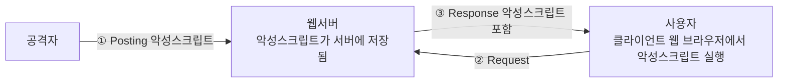
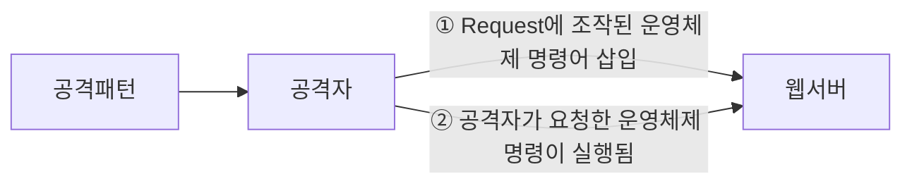

<!-- PDF page: 073 -->



[그림 36] XSS 보안 취약점

•코딩기법
외부 입력값에 스크립트가 삽입되지 못하도록 문자변환 함수 또는 메소드를 사용하여 `<` `>` `&` `"` 등을 `&lt;` `&gt;` `&amp;`
`&quot;` 로 치환한다. HTML 태그를 허용하는 게시판에서는 허용되는 HTML 태그들을 화이트리스트로 만들어 해당 태그
만 지원하도록 한다.

〈표 20〉 안전한 코드 사례

안전한 코드

```java
String name = request.getParameter("name");
if(name != null)
{
    name = name.replaceAll("<", "&lt;");
    name = name.replaceAll(">", "&gt;");
    name = name.replaceAll("&", "&amp;");
    name = name.replaceAll("\"\"", "&quot;");
}
```

사용자로부터 입력받은 name에 포함된 스크립트 관련 문자열을 필터링하여 변환한다.

③ 운영체제 명령어 삽입 공격 대응을 위한 시큐어 코딩 기법

• 공격개요
적절한 검증절차를 거치지 않은 사용자 입력값이 운영체제 명령어의 일부 또는 전부로 구성되어 실행되는 경우, 의도하
지 않은 시스템 명령어가 실행되어 부적절하게 권한이 변경되거나 시스템 동작 및 운영에 악영향을 미칠 수 있다.

공격패턴: `usr_name=tom;/bin/ls`



[그림 37] 운영체제 명령어 삽입 보안 취약점
