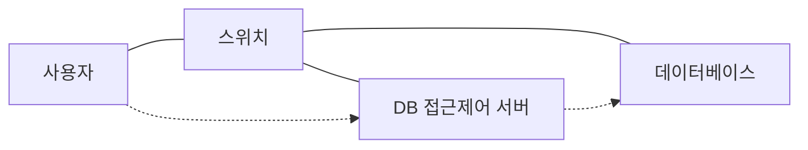
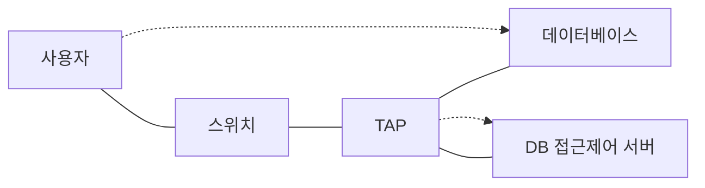

<!-- PDF page: 084 -->

② 게이트웨이 방식

DB서버로 접속하기 위한 모든 요청을 DB접근통제 서버(프록시 서버)를 경유하도록 하는 방식으로 가장 강력한 접근통제
기능을 제공한다. DB접근통제 서버는 이중화 구성이 가능하여 장애발생 시에도 업무에 영향을 초래하지 않는다.

[그림 40] 게이트웨이 방식 데이터베이스 접근통제

③ 네트워크 스니핑 방식

네트워크 패킷들에 대하여 TAP 장비 등을 통해 패킷 분석 및 로깅하는 방식으로 DB서버와 클라이언트 사이에 별도의 에
이전트 설치가 불필요하며, 네트워크에 부하 없이 시스템 구축이 용이하나, 부적절한 변조로 인한 데이터의 무결성 훼손
을 원천적으로 차단하기가 용이하지 않다.

[그림 41] 네트워크 스위치 방식 데이터베이스 접근통제

④ 하이브리드 방식

DB접근통제 구축을 위하여 각 방식의 단점을 보완하기 위해 각각의 방식을 혼합하는 방식의 하이브리드 방식을 일반적
으로 많이 사용하는데, 하이브리드 방식은 에이전트 + 게이트웨이 방식, 게이트웨이 + 네트워크 스니핑 방식, 에이전트 +
게이트웨이 + 네트워크 스니핑 방식 등의 형태로 구성하여 사용한다.
