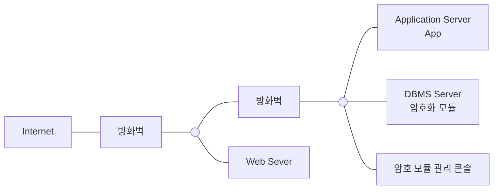

<!-- PDF page: 086 -->

으로 다수의 응용프로그램 수정이 필요하며, AP서버와 DB서버간 암호화된 상태로 데이터가 송수신 된다. DB서버의 부하
발생 가능성이 낮으며, AP서버 부하발생 가능성이 높다.

[그림 42] API 방식 데이터베이스 암호화

응용프로그램 변경이 용이하고 DB서버의 성능이 좋지 않은 경우, 네트워크 구간에서도 암호화된 상태로 데이터가 송수신
되는 이 방식을 선택하는 것이 바람직하다.

② 플러그인(Plug–in) 방식

플러그인 방식은 암복호화 모듈을 DB서버 내에 설치하여 암복호화를 수행하는 구조로 암복호화 시 DB서버의 부하가 발
생할 수 있으며, AP서버와 DB서버간의 평문 형태로 데이터가 송수신 된다.

[그림 43] 플러그인 방식 데이터베이스 암호화

DB서버의 성능이 우수하고 응용프로그램의 수정이 어렵거나 불가능한 경우, 이 방식을 선택하는 것이 바람직하다.

③ TDE 방식

DBMS에 내장 또는 옵션으로 제공되는 암복호화 기능을 이용하는 방식으로 DBMS종류 및 버전에 따라 지원이 가능하다.
해당 DBMS커널 레벨에서 처리되므로 응용프로그램에 대한 수정이 없으나, DBMS의 종류나 버전에 따라 지원이 불가한
경우도 있다. DBMS를 신규로 도입하는 경우, 이 방식의 선택을 고려해 볼 수 있다.
