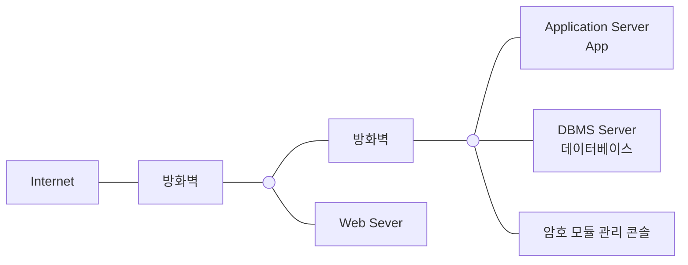
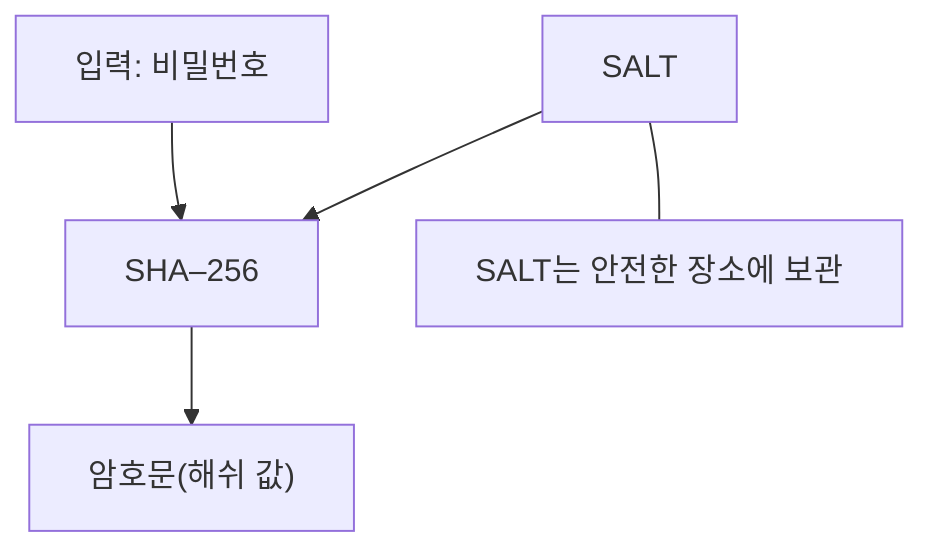

<!-- PDF page: 087 -->

[그림 44] TDE방식 데이터베이스 암호화

#### 라) 데이터베이스 암호화 적용

일방향 암호 알고리즘과 양방향 암호 알고리즘의 개념을 데이터베이스에 다음과 같이 적용하여 활용할 수 있다.

① 일방향 암호 알고리즘의 적용

비밀번호 등의 데이터는 일방향 암호 알고리즘인 해쉬 암호 알고리즘을 사용하여 데이터 원문 추출이 계산적으로 불가능
하도록 해야 하며, SHA-256 이상의 해쉬 암호 알고리즘을 사용하는 것이 일반적이다.
현재 일방향 암호 알고리즘을 적용해야 하는 상황은 크게 두 가지로 정리해 볼 수 있는데, 기존 데이터베이스 내에 평문으
로 저장하고 있는 경우와, MD5나 SHA–1 등 안전하지 않은 해쉬 암호 알고리즘을 사용하고 있는 경우로 정리할 수 있다.

• 평문으로 저장하고 있는 경우
비밀번호를 평문으로 저장하고 있는 경우, 비밀번호만 해쉬 암호 알고리즘을 적용하면 레인보우(Rainbow) 공격 등 사전
(Dictionary) 공격에 취약할 수 있기 때문에 임의의 문자열인 SALT값을 사용자의 비밀번호에 추가하여 해쉬 암호 알고리
즘을 적용하고, SALT값은 안전한 장소에 보관한다.

비밀번호를 평문으로 저장하고 있는 경우

| EmpNum | LastName | FirstName | Password(평문) |
| --- | --- | --- | --- |
| 10001 | KIM | NAMIL | 1234 |
| 10002 | LEE | YOUNGPYO | god |
| 10003 | CHA | DORI | angel |

| EmpNum | LastName | FirstName | Password(평문) |
| --- | --- | --- | --- |
| 10001 | KIM | NAMIL | 03ac674216.. |
| 10002 | LEE | YOUNGPYO | 11043a8795.. |
| 10003 | CHA | DORI | C9d751a1a.. |

<!-- 아래 표의 Password(평문) 제목은 원본 그대로 유지. -->

[그림 45] 비밀번호를 평문으로 저장하고 있는 경우
