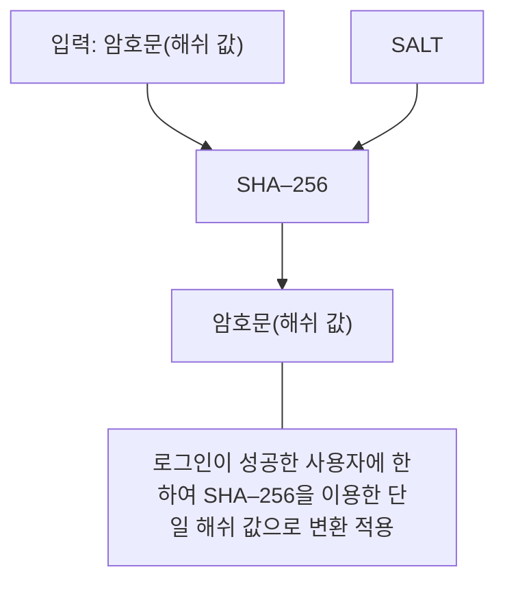

<!-- PDF page: 088 -->

• 안전하지 않은 해쉬 암호 알고리즘을 사용하고 있는 경우
MD5나 SHA–1 등 안전하지 않은 해쉬 암호 알고리즘을 사용하고 있는 경우, 1차적으로 기존 저장된 해쉬 값을 SHA—256
해쉬 암호 알고리즘을 적용하여 이중 해쉬된 값으로 저장하고, 로그인이 성공한 사용자에 한하여 점차적으로 SHA-256
을 이용한 단일 해쉬 값으로 변환하여 적용한다. 이때, 단일 해쉬 값인지 이중 해쉬 값인지를 구별하기 위하여 로그인 성
공시간을 이용하거나, 별도의 컬럼을 추가하여 구별한다.

안전하지 않은 해쉬 암호 알고리즘을 사용하고 있는 경우

| EmpNum | LastName | FirstName | Password(MD5) |
| --- | --- | --- | --- |
| 10001 | KIM | NAMIL | 930e1c89.. |
| 10002 | LEE | YOUNGPYO | 347ed2f4.. |
| 10003 | CHA | DORI | ed6f836d.. |

| EmpNum | LastName | FirstName | Password(SHA–256) |
| --- | --- | --- | --- |
| 10001 | KIM | NAMIL | 03ac674216.. |
| 10002 | LEE | YOUNGPYO | 11043a8795.. |
| 10003 | CHA | DORI | C9d751a1a.. |

[그림 46] 안전하지 않은 해쉬 암호 알고리즘을 사용하고 있는 경우

② 양방향 암호 알고리즘의 적용

개인정보 등의 데이터는 양방향 암호 알고리즘을 사용하여 암복호화를 수행해야 하며, SEED, ARIA, AES(Rijndael) 등의 안
전한 블록 암호 알고리즘을 사용하는 것이 일반적이다.
현재 안전한 블록 암호 알고리즘을 적용해야 하는 상황은 크게 두 가지로 정리해 볼 수 있는데, 기존 데이터베이스 내에
평문으로 저장하고 있는 경우와, DES, 3—DES 등 안전하지 않은 암호 알고리즘을 사용하고 있는 경우로 정리할 수 있다.

• 평문으로 저장하고 있는 경우
개인정보를 평문으로 저장하고 있는 경우, 128비트 이상의 비밀키를 사용하여 암호화하여 저장하고, 사용한 비밀키는 별
도의 안전한 장소에 보관하여야 한다.
