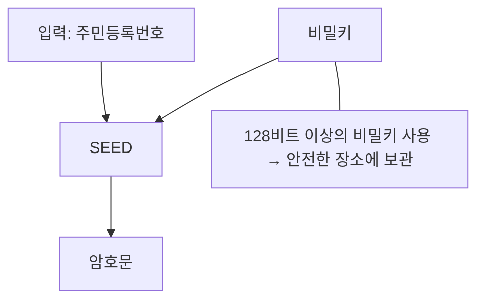
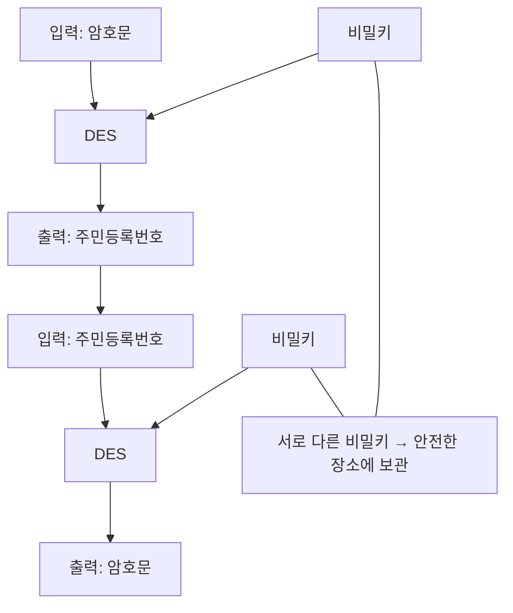

<!-- PDF page: 089 -->

개인정보를 평문으로 저장하고 있는 경우

| EmpNum | LastName | FirstName | Password(평문) |
| --- | --- | --- | --- |
| 10001 | KIM | NAMIL | 761108–1234567 |
| 10002 | LEE | YOUNGPYO | 750624–2345678 |
| 10003 | CHA | DORI | 820301–3456789 |

| EmpNum | LastName | FirstName | SSN(SEED) |
| --- | --- | --- | --- |
| 10001 | KIM | NAMIL | 7ocbf16566d.. |
| 10002 | LEE | YOUNGPYO | 26505d34366.. |
| 10003 | CHA | DORI | e318286c064.. |

[그림 47] 개인정보를 평문으로 저장하고 있는 경우

• 안전하지 않은 블록 암호 알고리즘을 사용하고 있는 경우
DES나 3-DES 등 안전하지 않은 블록 암호 알고리즘을 사용하고 있는 경우, 배치 작업 처리 방식으로 기존 암호화된 데
이터를 복호화한 후, 안전한 블록 암호 알고리즘을 사용하여 암호화를 수행한다.

안전하지 않은 블록 암호 알고리즘을 사용하고 있는 경우

| EmpNum | LastName | FirstName | SSN(DES) |
| --- | --- | --- | --- |
| 10001 | KIM | NAMIL | 70a627096.. |
| 10002 | LEE | YOUNGPYO | 0644e74bf.. |
| 10003 | CHA | DORI | cabc6b542.. |

<!-- 두 번째 암호화 단계의 DES 표기는 원본 그대로 유지. -->

| EmpNum | LastName | FirstName | SSN(SEED) |
| --- | --- | --- | --- |
| 10001 | KIM | NAMIL | 03ac674216.. |
| 10002 | LEE | YOUNGPYO | 11043a8795.. |
| 10003 | CHA | DORI | C9d751a1a.. |

[그림 48] 안전하지 않은 블록 암호 알고리즘을 사용하고 있는 경우

#### 마) 데이터베이스 암호화 적용절차

데이터베이스 암호화 적용은 [그림 49]와 같이 사전협의, 사전 영향도 분석, 테스트 검증, 구축 및 안정화 등의 절차로 진
행된다.
