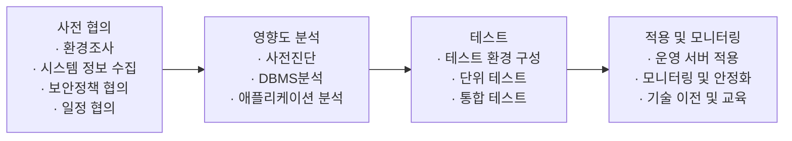

<!-- PDF page: 090 -->

<!-- 그림 제목은 원본 그대로 유지. -->

[그림 49] 안전하지 않은 블록 암호 알고리즘을 사용하고 있는 경우

① DB암호화 적용 사전협의

DB애플리케이션 보안을 적용하기에 앞서 프로젝트에 참여하는 모든 이해관계자는 사전에 충분히 필요한 정보를 공유할
목적으로 사전협의를 진행하며, DB애플리케이션 보안을 적용하기 위한 DB암호화 대상, 적용 환경 및 보안 정책 등 사전
에 필요한 사항에 대해 협의를 진행한다.

② DB암호화 적용 영향도 분석

DB애플리케이션 보안 적용 이전에 운영서버에 대한 모니터링을 통해 애플리케이션과 DBMS의 영향도를 분석하는 단계
이다. DB애플리케이션 보안 적용 단계 중 중요한 하나로 운영시스템에 암호화를 적용하기 전에 암호화 대상 추출, 암호화
관련 SQL쿼리 등을 미리 추출하여 테스트 시스템에서 성능 테스트를 수행하는 등 암호화 사전 진단을 수행하는 것이 필
요하다. 전체적으로 DBMS분석, 애플리케이션 분석 단계를 수행하여 암호화 이후 성능 및 시스템 리소스 등의 변화에 대
한 영향도를 분석을 실시한다.

• 암호화 대상 선정
운영 중인 전체 DBMS의 테이블과 컬럼을 검색하여 암호화 대상이 되는 컬럼을 추출하여, 암호화 대상을 정한다.

• 쿼리문 분석
운영 중인 전체 DBMS에서 사용하고 있는 전체 쿼리문을 추출하여, 쿼리문 수행 시 추출되는 데이터 양과 쿼리문 수행
시간 등을 분석하고, 최적화가 필요할 것으로 예상되는 대상 쿼리문을 선정한다.

• DBMS 분석
DBMS에서 사용 중인 CPU, 메모리 및 스토리지 등의 리소스를 확인하고, 암호화 적용에 따라 추가적으로 필요한 적정
수준의 리소스를 산정한다.

• 애플리케이션 분석
암호화 적용에 따라 영향을 받는 애플리케이션 모듈을 추출하고, 암호화 적용을 위하여 추가적으로 필요한 공통 모듈 및
변경이 필요한 애플리케이션 로직 등에 대하여 분석하고 최적화가 필요한 애플리케이션 모듈을 선정한다.

③ DB암호화 적용 테스트

DB 애플리케이션 운영 환경과 동일한 테스트 환경을 구축하여 암호화를 적용한 후, 애플리케이션 등의 업무 테스트를 진
행하는 단계이다. 테스트를 통해 운영 환경에 이행 시 발생할 수 있는 문제를 도출하고 모든 이슈를 해결하여 운영 환경으
로의 이행을 준비해야 한다. 모든 애플리케이션과 모든 쿼리문에 대한 테스트를 수행한다.
