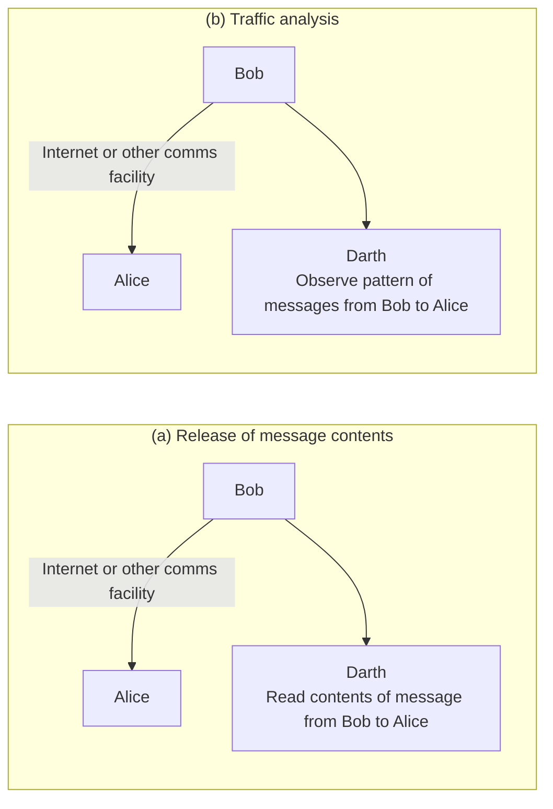
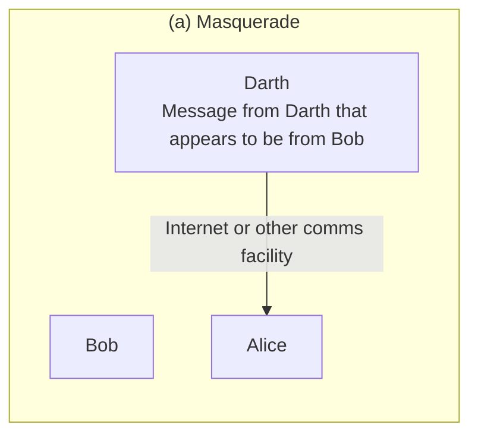

<!-- PDF page: 104 -->

[그림 53] 소극적 공격
(출처: W. Stallings, Cryptography and Network Security -Principles and Practice, Prentice Hall, p.17)

• 적극적 공격
적극적 공격(능동적 공격이라고도 함)은 [그림 54]에서와 같이 전송 데이터에 대해 불법적 수정이나 거짓 데이터의 생성을 수반하는 신분 위장(masquerade), 재연(replay), 메시지 불법 수정(modification of message), 서비스 거부 공격(DOS:
Denial of Service) 등으로 구분된다.
신분 위장은 하나의 실체가 다른 실체의 행세를 할 때 발생하며 대개 적극적 공격의 다른 유형 중 하나를 포함하여 공격
이 이루어진다.
재연은 비 인가된 결과를 얻기 위해 하나의 메시지를 소극적 공격으로 획득하여 다시 전송하는 공격이다.
메시지 불법 수정은 단순히 적법한 메시지의 일부를 불법적으로 변경하거나 메시지 전송을 지연시키거나 혹은 순서를
바꾸어 비 인가된 결과를 얻는 공격이다.
서비스 거부 공격은 통신 설비(특정 컴퓨터 혹은 네트워크)가 정상적으로 사용되거나 관리되지 못하게 방해하는 공격으로 보통 DoS 공격이라고 부른다. 이 공격은 특정 목표물을 대상으로 이루어지는 경우가 대부분이다.
적극적 공격은 소극적 공격과 반대되는 특성을 가진다. 적극적 공격은 모든 통신 설비와 통신 회선을 항상 물리적으로
보호할 수 없기 때문에 완전 예방이 매우 어렵다. 적극적 공격에 대한 대응은 공격을 탐지하고 또 공격에 의한 붕괴나
지연 등으로부터 복구하는 것을 목표로 한다.

