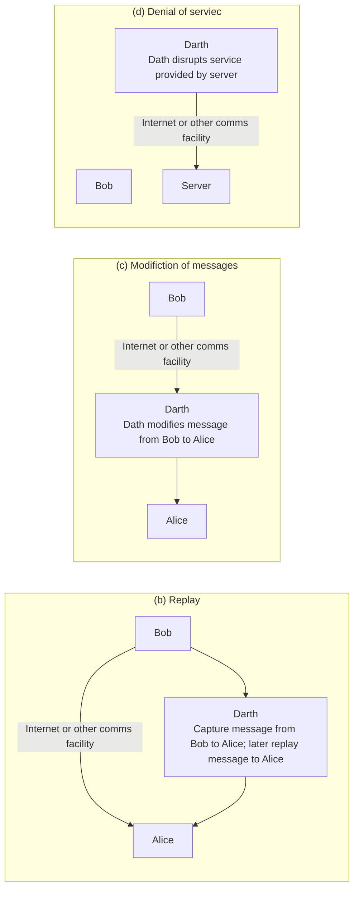

<!-- PDF page: 105 -->

<!-- 원본 그림의 Modifiction, Dath, serviec 표기를 유지함. -->

[그림 54] 적극적 공격
(출처: W. Stallings, Cryptography and Network Security— Principles and Practice, Prentice Hall, p.18, 19)

② 네트워크 보안 모델

컴퓨터 네트워크는 통신 개체들인 컴퓨터와 통신 시스템(송수신 장치와 통신 회선의 집합)으로 구성되는 것으로 송신 컴퓨터와 수신 컴퓨터 간에 거리 개념 없이 데이터를 전송할 수 있도록 지원하기 위하여 존재한다.

[그림 55]는 보안 측면에서 네트워크 통신의 요소들을 추상화하여 표현한 것이다. 인터넷과 같은 네트워크를 통해 하나의
메시지가 송신자에서 수신자 방향으로 전송된다. 이 과정에서 두 통신 주체는 메시지 교환을 위해 서로 협력하여야 한다.
논리적 정보 채널(송신 컴퓨터와 수신 컴퓨터 사이에는 다수의 통신 장치로 구성된 경로(path)가 배정되어 데이터가 전달
되는데 사용되는데 이를 의미함)이 메시지 출처(source)에서 목적지(destination) 사이의 인터넷 경로 설정과 두 통신 주체
간의 통신 프로토콜 등의 협상을 통하여 개설된다.
기밀성 및 인증 등에 대한 공격으로부터 전송 데이터를 보호해야 할 경우 그에 대응하는 보안 조치가 시작된다. 보안을 위
한 모든 기법들이 포함하는 두 가지 요소는 다음과 같다.

• 전송될 데이터에 대한 보안 관련 변환, 예를 들면 메시지를 공격자가 읽지 못하도록 뒤섞는 암호화와 송신자 식별을 위
하여 메시지 내용에 근거한 코드(해쉬 코드)를 추가하는 일 등이 여기에 해당된다.

• 공격자에게 알려지지 않은 두 통신 주체가 공유하는 비밀 정보, 예를 들면 메시지 전송 전에 메시지를 뒤섞기 위한 변환
에 사용하고 또 수신하여 재 변환하는데 사용하는 암호기가 여기에 해당한다.
