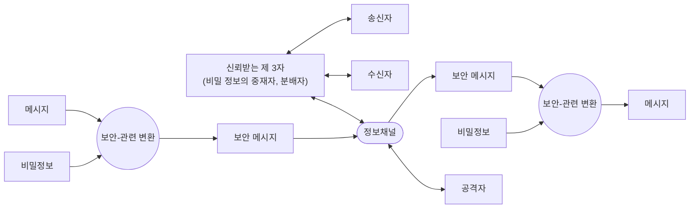

<!-- PDF page: 106 -->

[그림 55] 네트워크 보안 모델
(출처: W. Stallings, Cryptography and Network Security -Principles and Practice, Prentice Hall, p.25)

안전한 전송을 위하여는 신뢰할 수 있는 제 3자가 필요할 수 있다. 예를 들면, 제 3자는 공격자가 알지 못하도록 양쪽 통신
주체에게 암호기와 같은 비밀 정보를 분배하는 역할을 수행하거나 분쟁 발생 시 이를 조정하는 역할을 할수 있다.
이와 같은 일반적인 네트워크 보안 모델은 특정 보안 서비스를 설계함에 있어 다음 4가지 기본 사항을 가진다.

• 보안 관련 변환을 수행하는 알고리즘의 설계로 이 알고리즘은 공격자가 변환의 목적을 파괴할 수 없어야 한다.

• 변환 알고리즘에 사용될 비밀 정보의 생성

• 비밀 정보를 배분하고 공유하기 위한 방법의 개발

• 특정 보안 서비스를 위한 보안 알고리즘과 비밀 정보를 사용할 두 통신 주체가 사용할 프로토콜의 지정

③ 네트워크 접근 보안 모델

공격자는 정보 시스템에 침입하여 정보 시스템에 손상을 입히거나 개인정보 등을 파괴 혹은 탈취하려고 한다. 또 바이러스나 웜 등과 같은 악성 소프트웨어가 네트워크를 통하여 정보 시스템에 감염될 수 있다.
이러한 원하지 않는 접근에 대한 보안 대응 기법은 [그림 56]에서와 같이 크게 2가지 범주로 나누어진다. 첫 번째 범주는
문지기(gate keeper) 기능으로 인가된 사용자 외에는 정보 시스템에 접근을 거부하는 방법으로 패스워드 등을 이용한 로그인 절차가 여기에 해당된다. 사용자나 소프트웨어에 의해 일단 접근이 이루어진 후에는 다양한 내부 보안 통제(internal
security control) 기능에 의해 두 번째 단계의 대응이 이루어진다. 내부 보안 통제를 수행하는 대표적인 방안으로 정보 시스템의 활동 상황을 감시하고 침입자의 존재를 탐지하는 침입탐지시스템(IDS)을 들 수 있다.

| 공격자 | 접근 채널 | 문지기 | 정보 시스템 |
| --- | --- | --- | --- |
| - 해커 - 바이러스, 웜 | 접근 채널 | 문지기 | 컴퓨팅 자원(CPU, 메모리, I/O) 데이터 프로세스 소프트웨어 내부 보안 통제 |

<!-- 원본 그림 56의 공간 배치를 표로 옮김. 원본에 없는 연결 화살표는 추가하지 않음. -->

[그림 56] 네트워크 접근 보안 모델
(출처: W. Stallings, Cryptography and Network Security— Principles and Practice, Prentice Hall, p.26)
