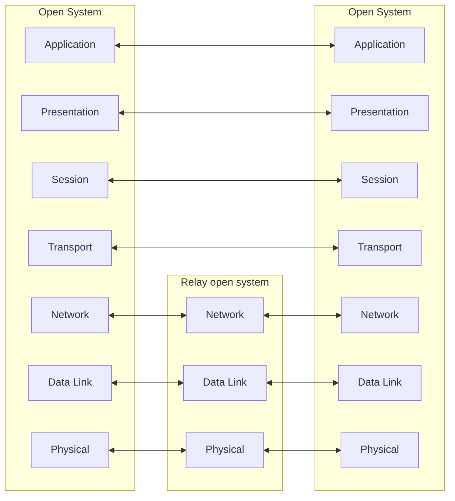

<!-- PDF page: 107 -->

#### 나) 통신 프로토콜 계층과 보안

① OSI 7계층 참조 모형과 TCP/IP 프로토콜 계층 구조

[그림 57]은 ISO/IEC 7498-1:1994(E) 표준 문서의 OSI(Open System Interconnection) 7계층 참조 모델로 개방 시스템 간의
상호 연결 구조를 나타낸다.

Physical media for OSI

[그림 57] OSI 7계층 참조 모델

OSI 7계층 참조 모델의 각 계층에 해당하는 프로토콜과 기능이 〈표 36〉에 보인다.

〈표 36〉 OSI 7계층 참조 모델 각 계층의 프로토콜과 기능

<table>
<tr><td>계층</td><td>프로토콜</td><td>기능</td></tr>
<tr><td>응용계층</td><td>HTTP, SMTP, SNMP, FTP, Telnet, SSH, DNS 등</td><td>사용자 인터페이스, 전자우편, 데이터베이스 관리 등과 같은 서비스를 사용자에게 제공한다.</td></tr>
<tr><td>표현계층</td><td>JPEG, MPEG, XDR 등</td><td>전송되는 데이터를 공통의 표현 방식을 이용하여 변환한다.</td></tr>
<tr><td>세션계층</td><td>TLS, RPC, NetBIOS 등</td><td>통신 세션을 관리하는 계층으로, 통신장치 간의 세션을 설정하고 유지, 동기화한다.</td></tr>
<tr><td>전송계층</td><td>TCP, UDP, SCTP 등</td><td>발신지 대 목적지(종단 대 종단) 프로세스 간 데이터 전송과 오류 제어를 수행한다.</td></tr>
<tr><td>네트워크 계층</td><td>IP, IPX, ICMP, X. 25, ARP, OSPF 등</td><td>다중 네트워크 환경에서 패킷을 발신지로부터 목적지 호스트로 전달할 책임을 갖는다.</td></tr>
<tr><td>데이터링크 계층</td><td>Ethernet, Token Ring, 무선랜 등</td><td>오류 없이 한 장치에서 다른 장치로 프레임(frame)을 전달하는 역할을 한다.</td></tr>
<tr><td>물리계층</td><td>전파, 동축케이블, UTP, 광섬유 등</td><td>물리적 매체를 통해 비트(bit)를 신호로 변환하여 전송하는 기능을 한다.</td></tr>
</table>

인터넷에 사용되는 TCP/IP 프로토콜 구조는 OSI 7 계층 참조 모델보다 먼저 등장한 ARPANET 참조 모델에 기반하고 있
으며 다음과 같이 3개 계층으로 구성된다.
