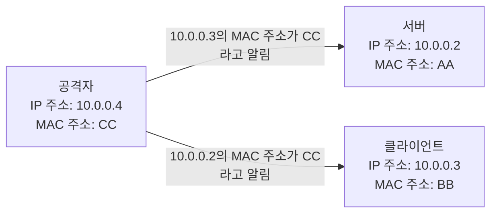

<!-- PDF page: 111 -->

[그림 60]에서와 같이 먼저 공격자는 클라이언트에게 서버인 10.0.0.2에 해당하는 가짜 MAC 주소 CC를 알리고, 서버에게는 클라이언트인 10.0.0.3에 해당하는 가짜 MAC 주소 CC를 알린다.
공격자가 서버와 클라이언트 컴퓨터에게 서로 통신하는 상대방을 공격자 자신의 MAC 주소로 알렸기 때문에 서버와 클라이언트는 공격자에게 각각 패킷을 보내게 된다.
공격자는 각자에게 받은 패킷을 읽은 후 서버가 클라이언트에 보내는 패킷은 클라이언트에게 정상적으로 전달하고, 클라이언트가 서버에게 보내고자 하던 패킷 역시 서버에게 전달하는 방식으로(서버와 클라이언트 간의 통신 내용을 불법적으로 획득하게 된다.

[그림 60] ARP 스푸핑
(출처: 양대일, 정보보안개론, 한빛미디어, P. 156)

ARP 스푸핑은 TCP/IP 프로토콜 구조의 자체 문제로 근본적인 대응 방안은 없다. 다만, ARP 테이블이 변경되지 않도록
arp 명령을 이용하여 ARP 테이블의 속성을 설정하여 MAC 주소의 변경을 막을 수 있으나, 이 방안은 시스템이 재 부팅
될 때마다 설정 명령을 실행시켜야 한다.

• IP 스푸핑
공격자가 악용하고자 하는 호스트의 IP 주소를 변경하여 해킹 하는 공격을 IP 스푸핑이라 한다. 즉, 다른 사용자가 이용
하는 IP 주소를 탈취하여 불법적으로 로그인 등과 같은 권한을 획득하는 공격이다.
네트워크 환경에서 서로 신뢰관계에 있는 A, B 두 시스템 간에는 A 시스템의 계정을 가지고 B 시스템에 접속을 할 수
있는 서비스가 있는데 이를 트러스트(trust) 인증이라고 한다. 이 방식은 네트워크에서의 신뢰 서비스가 패스워드가 아닌
네트워크 주소에 기반하여 이를 인증한다. 즉, 서버에서 신뢰하는 클라이언트의 IP 주소를 저장해 놓고 저장된 IP 주소에
해당하는 클라이언트가 로그인 요청을 하는 경우 아이디(ID)와 패스워드없이 로그인을 허락한다.
IP 스푸핑에 대한 대응 방안은 특별한 경우를 제외하고는 트러스트 인증 방식을 사용하지 않는 것이다.

• DNS 스푸핑
공격자가 어떤 도메인의 DNS 서버를 장악하여 통제하고 있다면 최종적으로 얻어진 IP 주소가 사용자가 접속하려던 시스템이 아니므로, 공격자가 지정한 시스템에 연결된다. 즉, 주소 변환 요청을 발송했던 사용자 지정 DNS와 응답을 주는
상위 단 DNS 사이트로부터의 트래픽을 공격자가 스니퍼링하여 공격자가 의도하는 사이트의 IP 주소를 최종 응답으로
넘겨주도록 하는 것이다.
DNS 스푸핑에 대한 대응 방안으로는 중요 접속 서버의 IP 주소 정보를 자신의 hosts 파일에 등록을 하여 DNS 서버의 도움을 받지 않고 IP 주소를 얻을 수 있도록 하는 것이다. 그러나 모든 서버의 IP 주소를 등록하고 관리하는 것은 현실적으로 불가능할 것이다.
