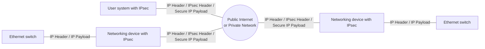

<!-- PDF page: 112 -->

### 02 보안 프로토콜과 보안 솔루션

#### 가) IPSec

① 개념

인터넷 프로토콜(IP)의 버전 4는 인증 기능이 없고, 도청이나 패킷 변경 등과 같은 공격에 취약하다. 이러한 IP의 보안 취약점을 보완하기 위하여 IPsec(Internet Protocol Security)이 개발되었다. IPSec은 IP에 암호와 인증 서비스를 패킷 단위로 제공하여 IP가 안전하게 동작하도록 지원하므로 모든 응용 프로그램에 보안 기능을 제공하게 된다. IPSec의 보안 기능 영역은 크게 인증, 기밀성과 키 관리이며, IPv4에서는 선택 사항이었으나, IPv6에서는 기본 기능으로 구현되어 있다.

② 구성과 동작

[그림 61]은 한 조직이 여러 곳에 산재되어 있는 LAN을 사용하고 있을 때, LAN 안에서는 IP 트래픽이 전송되나, LAN 외부로 나가는 트래픽은 안전한 통신을 위하여 IPSec 프로토콜을 이용하여 전송됨을 보여주고 있다. IPSec 프로토콜은 라우터
혹은 방화벽과 같은 장치에서 실행되며, 이 장치들에서 IPSec이 실행되고 있다는 사실은 LAN상의 컴퓨터에게는 투명하게
보인다.

<!-- 단말의 장식 아이콘은 생략함. -->

[그림 61] IPSec의 동작
(출처: W. Stallings, Network Security Essentials, Pearson, p.272)

[그림 62]는 IPSec의 구조를 보여준다. 크게 보안 연관(SA: Security Association) 협상을 위한 인터넷 키 교환(IKE: Internet Key Exchange), SA들의 저장소인 보안 연관 데이터베이스(SAD: Security Association Database), IP 트래픽을 특정 SA에 연관시키는 방법을 규정하고 있는 보안 정책을 저장하는 SPD(Security Policy Database)와 실제 인증 서비스를 제공하는 프로토콜인 AH(Authentication Header)와 인증과 암호 서비스를 제공하는 ESP(Encapsulating Security Payload) 프로토콜로 구성된다.
