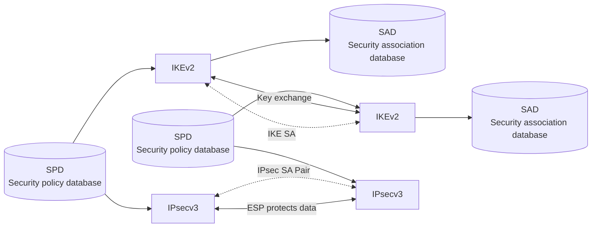

<!-- PDF page: 113 -->

[그림 62] IPSec 구조
(출처: W. Stallings, Network Security Essentials, Pearson, p.276)

• 전송 모드와 터널 모드
AH와 ESP는 전송(transport) 모드나 터널(tunnel) 모드를 지원한다. [그림 63]에서와 같이 전송 모드에서는 IP 헤더는 변하지 않고 IP 데이터그램의 페이로드만 암호화되며, 터널 모드에서는 전체 IP 데이터그램이 암호화되고 새로운 IP 패킷의
페이로드로서 전송된다. 터널 모드에서는 보통 라우터가 IPSec의 프록시 역할을 수행한다.
전송 모드는 주로 상위 계층 프로토콜의 보호 즉, IP 데이터그램의 페이로드 범위를 보호하기 위해 사용한다. 예를 들면
TCP 프래그멘테이션이나 ICMP 패킷 등을 보호하기 위해 사용한다. 전송 모드의 IPSec은 IP 계층 바로 위에서 동작하며,
전송 모드에서 ESP는 IP 페이로드를 암호화하나 IP 헤더는 암호화하지 않으며, 인증은 선택사항이다. 전송 모드에서 AH는 IP 페이로드와 IP 헤더의 선별된 부분만을 인증한다.
터널 모드는 IP 데이터그램 전체를 보호한다. 이를 위해 새로운 외부 IP 헤더를 가진 “외부” IP 데이터그램을 생성한다.
이 데이터그램이 전달되는 과정에서는 어떠한 라우터도 내부 IP 헤더를 검사할 수 없다. 이러한 이유로 터널 모드를 이용하면 개념적인 터널을 통해서 IP 데이터그램을 외부 네트워크로 전송할 수 있는 것이다.
터널 모드에서 ESP는 내부 IP 헤더를 포함하는 내부 IP 데이터그램 전체를 암호화하며 인증은 선택사항이다. 터널 모드
에서 AH는 내부 IP 데이터그램 전체와 외부 IP 헤더의 선별된 부분만을 인증한다.
