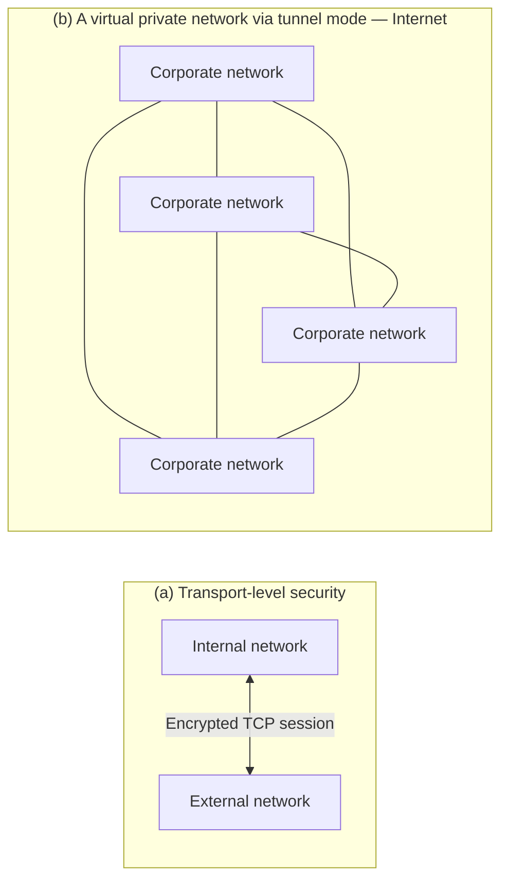

<!-- PDF page: 114 -->

Encrypted tunnels carrying IP traffic

[그림 63] 전송 모드와 터널 모드의 암호화
(출처: W. Stallings, Network Security Essentials, Pearson, p.285)

• 보안 연관(SA)
IPSec을 이용하여 상대방과 안전한 통신을 하기 위해서는 두 통신 개체가 사용할 인증 혹은 암호 알고리즘과 암호화 키
등이 필요하다. 보안 알고리즘과 키에 관한 정보를 본격적인 통신 이전에 교환하고 저장해야 하는데 이와 같은 정보를
기록한 것을 SA이라고 부른다. 하나의 시스템에는 많은 SA들이 존재하게 되므로 임의로 부여된 고유번호인 SPI(Security
Parameter Index)와 목적지 IP 주소에 의하여 SA들이 식별된다. 한 방향으로의 안전한 통신을 위해서 하나의 SA가 필요
하므로, 두 통신 개체가 양방향 통신을 하려면 2개의 SA가 있어야 한다.
SA가 저장되어 있는 상태에서 시스템 A와 시스템 B 간의 통신 과정은 〈표 37〉과 같다. 단, 이 표에서는 시스템 A가 통신
을 개시한다고 가정한다.

〈표 37〉 IPSec 환경에서의 통신 단계

<table>
<tr><td>순서</td><td>설명</td></tr>
<tr><td>1단계</td><td>시스템 A가 시스템 B와 안전한 통신을 하기 위하여 자신의 SAD를 검색하여 시스템 B의 SA를 찾는다.</td></tr>
<tr><td>2단계</td><td>시스템 B의 SA의 정보로부터 암호화 키와 사용 알고리즘을 파악하고 이들을 이용하여 전송할 IP 데이터그램을 암호화하고 IPSec 헤더에 SPI를 삽입하여 시스템 B에게 전송한다.</td></tr>
<tr><td>3단계</td><td>시스템 B의 SA의 정보로부터 암호화 키와 사용 알고리즘을 파악하고 이들을 이용하여 전송할 IP 데이터그램을 암호화하고 IPSec 헤더에 SPI를 삽입하여 시스템 B에게 전송한다.</td></tr>
<tr><td>4단계</td><td>암호화된 IP 데이터그램을 수신한 시스템 B는 IPSec 헤더에 있는 SPI와 발신지 주소 A를 이용하여 자신의 SAD 로부터 해당 SA를 검색한다.</td></tr>
<tr><td>5단계</td><td>해당 SA의 정보로부터 암호화 키와 사용 알고리즘을 파악하고 이들을 이용하여 수신한 패킷으로부터 IP 데이터그램을 복호화한다.</td></tr>
</table>

• IKE

IPSec의 키 관리(Key Management)는 암호키 결정과 분배 기능을 포함한다. 두 응용 사이에 통신에는 4개의 키가 필요
하다. 즉, 무결성과 기밀성을 위해 각각 한 쌍의 송신용 키와 수신용 키가 필요하다.
IKE에서는 메시지 교환을 통하여 안전하게 두 응용 사이에 상호 인증을 통한 IPSec 통신을 위한 SA를 생성하여 저장하도록 한다. IKE는 SA의 설립, 협상, 수정, 제거를 위한 절차와 패킷 형식을 정의하고 있다.
