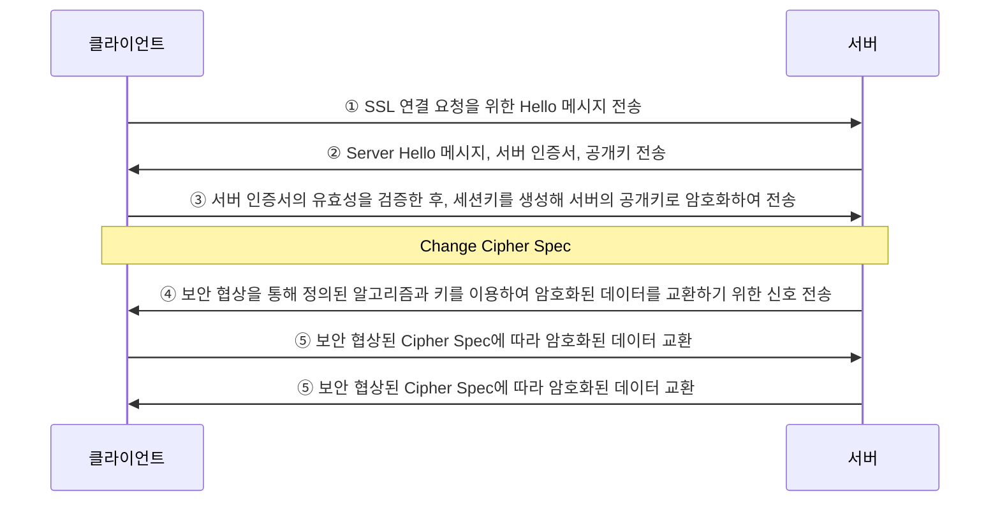

<!-- PDF page: 116 -->

〈표 38〉 SSL 프로토콜의 기능

<table>
<tr><th>종류</th><th>설명</th></tr>
<tr><td>핸드쉐이크 프로토콜</td><td>서버와 클라이언트의 상호 인증 수행 사용할 암호 알고리즘, MAC 알고리즘 및 암호 키 협상 모든 응용 데이터 전송 이전에 수행됨</td></tr>
<tr><td>레코드 프로토콜</td><td>SSL 연결을 위해 기밀성과 무결성 서비스를 제공 결정된 비밀키 암호 알고리즘에 의해 메시지 암호화 분배된 대칭키를 이용하여 암호화 작업 수행</td></tr>
<tr><td>암호 명세 변경 프로토콜</td><td>암호 명세에 정의된 인증, 암호화 방식이 이후부터 적용됨을 상대에게 알림 값 1을 갖는 한 바이트 길이의 메시지</td></tr>
<tr><td>경고 프로토콜</td><td>SSL 수행 과정에서 오류 등 경고를 전달하기 위해 사용, 2바이트로 구성되며, 첫 바이트는 메시지의 심각성을 전달: Warning(1), Fatal(2)</td></tr>
</table>

SSL 프로토콜 동작 절차
SSL 프로토콜의 주요 동작 절차는 [그림 65]에, 각 단계에서의 동작 내용은 〈표 39〉에 보인다.

[그림 65] SSL 프로토콜의 동작 절차

〈표 39〉 SSL 프로토콜의 단계별 동작

<table>
<tr><td>순서</td><td>설명</td></tr>
<tr><td>1단계</td><td>클라이언트는 서버에게 SSL 연결 요청을 위한 Hello 메시지를 전송</td></tr>
<tr><td>2단계</td><td>서버는 클라이언트에게 Server Hello 메시지와 서버 인증서와 공개키를 전송하며, 만약 클라이언트의 인증서가 필요할 경우, 인증서 요청도 함께 전송</td></tr>
<tr><td>3단계</td><td>클라이언트는 서버의 인증서의 유효성을 검증하고, 암호화에 사용될 세션을 생성하고 서버의 공개키로 암호화하여 암호 명세와 서버가 클라이언트의 인증서를 요청한 경우에는 클라이언트의 인증서도 함께 전송</td></tr>
<tr><td>4단계</td><td>보안 협상을 통하여 암호 명세에 정의된 알고리즘과 키를 이용하여 암호화된 데이터 교환을 하기 위한 신호를 보냄</td></tr>
<tr><td>5단계</td><td>보안 협상된 암호 명세에 따라 암호화된 데이터를 교환</td></tr>
</table>
