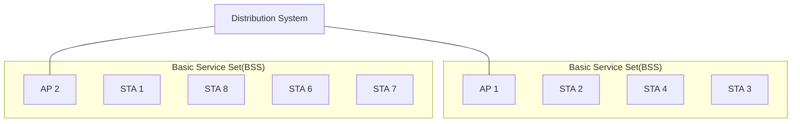

<!-- PDF page: 118 -->

Service Set)이란 동일한 MAC 프로토콜로 동작하며 동일한 무선 매체에 대한 접근을 가지고 경쟁하는 지국(STA)들로 구성되는 단위를 말하며, 확장 서비스 집합은 다수의 기본 서비스 집합들이 분배 시스템에 연결되어 서로 통신할 수 있는 환경을 의미한다.

[그림 66] IEEE 802.11의 확장 서비스 집합
(출처: W. Stallings, Network Security Essentials, Pearson, p.180)

#### 나) 보안 위협과 대응

무선랜은 전파를 이용해 통신하므로 통신매체에 대한 물리적 접근 제어가 불가능하여 누구나 무선랜 서비스를 이용할 수
있고 전파 수집 및 교란을 통한 다양한 보안위협을 야기할 수 있다. [그림 67]은 무선랜에서의 다양한 보안위협을 보여주고 있다.

<!-- 그림 67의 복잡한 장비 배치와 곡선 경로는 텍스트 도식으로 재현하지 않음. 그림 내 항목만 아래에 전사함. -->

- 와이파이존에서 침해사고 유발
- 무료 인터넷 접속
- 중요 시스템 권한 없는 접근
- 도청/스니핑
- 무선 DoS
- MAC Spoofing
- 해킹
- 내부 정보 수집
- 스피닝 등

인터넷망, OPENAP, Firewall IPS, IPPBX, 웹서버, 그룹웨어서버, UC서버, OPEN AP, Rogue AP, misconfigured AP, External AP

[그림 67] 무선랜 보안 위협
(출처: 백종현, 국내 Wi-Fi 보안 현황 및 안전한 무선랜 이용 가이드, TTA Journal)
