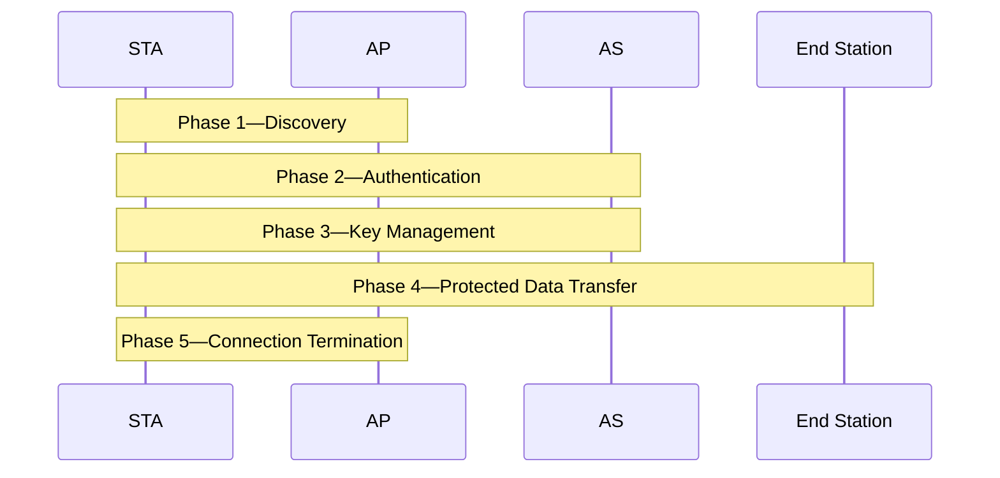

<!-- PDF page: 121 -->

<!-- 원본 Phase 4의 자물쇠 아이콘은 생략함. -->

[그림 69] IEEE 802.11i 동작 단계
(출처: W. Stallings, Network Security Essentials, Pearson, P 185)

[참고 및 추천 자료]

[1] 한국인터넷진흥원&순천향대학교, “전자인증 수단 이용기반 확대를 위한 안전성 기준 연구”, 한국인터넷진흥원, 2011.

[2] 양대일, IT CookBook 정보 보안 개론(개정3판): 한 권으로 배우는 보안 이론의 모든 것, 한빛미디어, 2018.

[3] 한국과학기술정보연구원, “정보시스템 보안가이드”, 한국과학기술정보연구원, 2010.
