<!-- PDF page: 001 -->

# 프로젝트 관리 및 테크니컬 커뮤니케이션

TOPCIT

ESSENCE Ver. 3

**비즈니스영역**

06 프로젝트 관리 및 테크니컬 커뮤니케이션

<!-- PDF page: 002 -->

<!-- 빈 페이지 -->

<!-- PDF page: 003 -->

TOPCIT

ESSENCE Ver. 3

**비즈니스영역**

06 프로젝트 관리 및 테크니컬 커뮤니케이션

<!-- PDF page: 004 -->

TOPCIT 에센스는 TOPCIT을 준비하는 응시생들에게 학습자료를 제공하기 위해 발행되었습니다.
더 나아가 실무중심의 ICT관련 지식을 습득하고자 하는 학습자들이 자기주도적 학습을 위한 자원으로 활용할 수 있기를 바랍니다.

이 책의 내용에 대한 추가 지원과 문의는 TOPCIT 홈페이지 또는 홈페이지에 안내된 이메일을 이용해 주시기 바랍니다.

TOPCIT 에센스의 내용 중 일부는 집필진의 주관적인 의견이 반영되어 있으며, 해당 의견은 TOPCIT 사업단의 공식적인 입장이 아님을 밝혀둡니다.

| 구분 | 기관 |
| --- | --- |
| 주관부처 | 과학기술정보통신부 |
| 주관기관 | 정보통신기획평가원 |
| 참여기관 | 한국생산성본부 |
| 펴낸 곳 | TOPCIT 사업단 |

<!-- 연락처 제외 -->

| 판 | 발행일 |
| --- | --- |
| 1판 발행일 | 2014. 12. 10. |
| 2판 발행일 | 2016. 02. 26. |
| 3판 발행일 | 2020. 02. 26. |

TOPCIT 에센스의 저작권은 과학기술정보통신부에 있으며 모든 내용의 무단전재와 복제를 금합니다.

<!-- PDF page: 005 -->

TOPCIT

ESSENCE Ver. 3

**비즈니스영역**

06 프로젝트 관리 및 테크니컬 커뮤니케이션

<!-- PDF page: 006 -->

TOPCIT

ESSENCE Ver. 3

<!-- PDF page: 007 -->

**비즈니스영역**

06 프로젝트 관리 및 테크니컬 커뮤니케이션

<!-- PDF page: 008 -->

**CONTENTS**

| 목차 | 교재 쪽수 |
|---|---:|
| I. 비즈니스 커뮤니케이션 개요 | 14 |
| 01 비즈니스 커뮤니케이션 개념 및 요소 | 16 |
| 가) 비즈니스 커뮤니케이션의 정의 | 16 |
| 나) 비즈니스 커뮤니케이션의 요소 | 16 |
| 다) 비즈니스 커뮤니케이션의 유형 | 17 |
| 02 비즈니스 커뮤니케이션 방법 | 19 |
| 가) 상향식, 하향식, 수평식 비즈니스 커뮤니케이션 | 19 |
| 나) 소통채널과 정보충실도 | 19 |
| 다) 논리적 설명과 설득방법 | 20 |
| II. 비즈니스 문제해결 기법 | 22 |
| 01 비즈니스 문제해결 기법 | 23 |
| 가) 비즈니스 문제해결 개념 | 23 |
| 나) 비즈니스 문제해결 프로세스 | 23 |
| 다) 창의적 사고기법 | 24 |
| 라) 논리적 사고기법 | 26 |
| 마) 합리적 의사결정 기법 | 27 |
| 바) 문제해결 능력 | 27 |
| Ⅲ. 비즈니스 문서 작성기법 | 29 |
| 01 비즈니스 문서의 개념과 종류 | 30 |
| 가) 비즈니스 문서의 개념 | 30 |
| 나) 비즈니스 문서의 종류 | 30 |

<!-- PDF page: 009 -->

**CONTENTS**

| 목차 | 교재 쪽수 |
|---|---:|
| 02 비즈니스 문서의 작성원칙 | 31 |
| 03 비즈니스 문서 작성 방법 |32 |
| 가) 비즈니스 문서 작성 방법 | 32 |
| 나) 공문서 작성의 원칙 및 방법 | 36 |
| 다) 회의록 작성 방법 |37 |
| 라) 이메일 작성 방법 | 39 |
| 마) 비즈니스 문서 | 40 |
| 바) 비즈니스 문서작성 시 체크리스트 | 41 |
| 사) 비즈니스 문서 작성도구의 활용 | 42 |
| Ⅳ. 테크니컬 문서 작성방법 | 43 |
| 01 테크니컬 문서 개념과 종류 | 45 |
| 가) 테크니컬 문서의 정의 | 45 |
| 나) 테크니컬 문서의 특징 | 45 |
| 다) 테크니컬 문서의 종류 | 45 |
| 02 테크니컬 문서 작성의 원칙과 방법 | 46 |
| 가) 테크니컬 문서작성 시 표현 및 서술방식 |46 |
| 나) 테크니컬 문서작성 시 유의사항 | 47 |
| 다) 명확한 테크니컬 문서 작성 |47 |
| 03 테크니컬 문서 작성 |47 |
| 가) 사업계획서(기획서) |47 |
| 나) 정보제공요청서(RFI: Request For Information) | 48 |
| 다) 제안요청서(RFP: Request For Proposal) | 48 |
| 라) 제안서 | 49 |

<!-- PDF page: 010 -->

**CONTENTS**

| 목차 | 교재 쪽수 |
|---|---:|
| 마) Requirement Traceability Matrix | 49 |
| 바) 분석서 | 49 |
| 사) 설계서 | 50 |
| 아) 테스트 설계서 | 51 |
| 자) 설명서 | 51 |
| 차) 프로젝트완료 보고서 | 52 |
| 04 목적에 부합하는 테크니컬 문서 작성 |52 |
| 가) 테크니컬 문서 작성을 위한 핵심 체크리스트 | 53 |
| 나) 테크니컬 문서 점검을 위한 핵심 체크리스트 | 53 |
| Ⅵ. 프레젠테이션 | 54 |
| 01 프레젠테이션 구상 및 준비절차 | 55 |
| 가) 프레젠테이션 목적 | 55 |
| 나) 프레젠테이션 과정 | 55 |
| 다) 시나리오 작성 | 56 |
| 02 프레젠테이션 자료 작성 기법 | 56 |
| 가) 전체 자료 구성 | 56 |
| 나) 발표 시나리오 구상 |57 |
| 다) 발표 자료 작성 | 57 |
| 라) 발표 자료 검토 | 60 |
| 마) 프레젠테이션 도구 | 60 |
| 03 프레젠테이션 실행 방법 | 61 |
| 가) 현장발표 전, 점검 체크리스트 | 61 |
| 나) 바디랭귀지의 효과적인 활용 | 62 |

<!-- PDF page: 011 -->

**CONTENTS**

| 목차 | 교재 쪽수 |
|---|---:|
| 다) 시나리오와 리허설(예행연습)을 실시 | 63 |
| 라) 시작 전 긴장 완화 | 63 |
| 마) 첫인사 | 64 |
| 바) 청중의 반응에 따른 대응 | 64 |
| VII. 프로젝트 이해 | 65 |
| 01 프로젝트 개념 | 66 |
| 가) 프로젝트 정의 | 66 |
| 나) 프로젝트 특징 |67 |
| 다) 실무 프로젝트 사례 |67 |
| 02 프로젝트 조직구조와 역할 | 68 |
| 가) 프로젝트 조직구조 | 68 |
| 나) 프로젝트 관리자의 책임과 역할 | 69 |
| 다) 프로젝트 전담조직(PMO) | 70 |
| VIII. 프로젝트 프로세스와 관리 |73 |
| 01 프로젝트 생명주기 |74 |
| 가) 프로젝트 생명주기 | 74 |
| 나) 프로젝트 기획 및 착수 | 76 |
| 02 프로젝트관리 방법론 |78 |
| 가) 프로젝트관리 방법론 | 78 |
| 나) 애자일 방법론 | 78 |
| 다) 프로젝트관리 영역 |79 |

<!-- PDF page: 012 -->

**CONTENTS**

| 목차 | 교재 쪽수 |
|---|---:|
| Ⅸ. 범위관리 | 81 |
| 01 범위관리 개념과 프로세스 | 82 |
| 가) 범위관리 개념 |82 |
| 나) 범위관리 프로세스 | 83 |
| 02 범위관리 기법 | 85 |
| 가) 작업분류체계(WBS: Work Breakdown Structure) | 85 |
| X. 일정관리 | 88 |
| 01 일정관리 개념과 프로세스 | 90 |
| 가) 일정관리 개념 | 90 |
| 나) 일정관리 프로세스 | 91 |
| 02 일정관리 기법 | 93 |
| 가) 일정개발 기법-임계경로기법(CPM: Critical Path Method) | 93 |
| 나) 일정개발 기법-주공정연쇄기법(CCM: Critical Chain Method) |97 |
| 다) 일정단축 기법-공정압축법과 공정중첩단축법 | 98 |
| XI. 원가관리 | 99 |
| 01 원가관리의 개념 | 101 |
| 가) 원가개념 | 101 |
| 나) 원가관리의 중요성 | 101 |
| 다) 원가관리의 개념 | 101 |
| 02 원가관리 프로세스 | 101 |

<!-- PDF page: 013 -->

**CONTENTS**

| 목차 | 교재 쪽수 |
|---|---:|
| 가) 원가관리 계획수립 | 101 |
| 나) 원가산정 | 101 |
| 다) 예산 결정 | 102 |
| 라) 원가통제 | 102 |
| 03 원가산정 기법 | 103 |
| 가) 기능점수법(FP, Function Point) | 103 |
| 나) 투입공수 산정법(MM, Man/Month) | 105 |
| 다) COCOMO(Constructive Cost Model) | 106 |
| 라) COCOMO 2(Constructive Cost Model 2) | 107 |
| 04 원가집행 관리기법-획득가치 관리 | 107 |
| 가) 획득가치 개념 | 107 |
| 나) 획득가치 관리방법 | 107 |
| XII. 품질관리 | 111 |
| 01 품질관리의 개념 | 113 |
| 가) 소프트웨어 품질 개념 | 113 |
| 나) 품질관리 개념 | 113 |
| 02 품질 관리 프로세스 | 114 |
| 가) 품질계획(Quality Plan) | 114 |
| 나) 품질보증(Quality Assurance) |115 |
| 다) 품질통제(Quality Control) |117 |
| 03 품질 평가관점과 품질표준 | 119 |
| 가) 품질 평가관점 | 119 |

<!-- PDF page: 014 -->

**CONTENTS**

| 목차 | 교재 쪽수 |
|---|---:|
| 나) 품질표준 | 119 |
| XIII. 위험관리 | 123 |
| 01 위험관리의 개념 | 124 |
| 02 위험관리 프로세스 | 125 |
| 가) 위험식별 | 125 |
| 나) 위험분석: 정성적 위험분석 | 126 |
| 다) 위험분석: 정량적 위험분석 | 126 |
| 라) 위험대응 | 127 |
| 마) 위험통제 | 128 |
| XIV. 프로젝트 도구 및 평가 | 129 |
| 01 프로젝트관리 도구 이해 | 130 |
| 가) 프로젝트관리 도구(Project Management System, PMS) | 130 |
| 나) 위험관리 도구(Risk Management System, RMS) | 131 |
| 다) 형상관리도구(Configuration Management System, CMS) | 132 |
| 라) 프로젝트 관리시스템 활용의 장점 | 132 |
| 02 프로젝트 모니터링 및 평가의 개념 | 132 |
| 가) 프로젝트 모니터링 및 평가의 개념 | 132 |
| 나) 프로젝트 평가 수행 | 133 |
| 다) 프로젝트 평가단계와 주안점 | 134 |

<!-- PDF page: 015 -->

<!-- 인쇄 머리말·꼬리말만 있는 빈 페이지 -->

<!-- PDF page: 016 -->

## I. 비즈니스 커뮤니케이션 개요

### 최근 동향 및 주요 이슈

비즈니스 수행에 있어 상대방과의 의사소통은 비즈니스 활동에서 가장 중요한 부분이라고 할 수 있다. 효과적 이고 효율적인 의사소통은 비즈니스 비용을 절감하고, 좋은 결과를 가져다 줄 수 있기 때문에 비즈니스 커뮤니케이션은 기업 활동에 중요한 요소 중 하나이다.

### 학습 목표

1. 비즈니스 커뮤니케이션의 개념과 주요 요소와 유형을 설명할 수 있다. 2. 이해관계자와 효과적으로 커뮤니케이션하는 방법을 설명할 수 있다.

<!-- PDF page: 017 -->

### 실무 미리보기

K 시스템은 핀테크(FinTech) 분야의 지급결제 및 환전서비스를 중심으로 하는 인터넷뱅크 사업에 새로 진입하기로 결정하였다.
하지만 인터넷뱅크 사업을 시작하기 위해서는 금융위원회에 사업계획서를 제출하고 프레젠테이션을 통해 심사를 받은 후 승인을 받아야만 한다.

K 시스템의 이 대표는 김 부장을 사업진행의 매니저로 임명하여 사업을 추진하기로 하였다.
김 부장은 새로운 사업인 인터넷뱅크 사업 진행을 위하여 최 차장과 박 과장, 오 대리, 신입사원인 유 사원을 인터넷뱅크 팀원으로 타스크포스를 구성하고, 팀원 및 이 대표, 각 이해당사자들과의 커뮤니케이션을 시작하였다.
김 부장은 K 시스템의 현재 상황과 인터넷뱅크의 외부환경 분석을 수행하고, 인터넷뱅크 구축전략을 포함한 사업계획서를 작성하기로 하였다. 또한, 오 대리를 금융위원회에서 발표하는 프레젠테이션 전담자로 지정하여 집중교육과 연습을 수행하도록 하였다.
김 부장은 개성이 강한 팀원들과 적극적인 커뮤니케이션을 통하여 성공적으로 인터넷뱅크 사업 진행을 추진하기 위해서 노력하고 있다.

IT 비즈니스 실무에서 커뮤니케이션은 시작과 끝을 의미한다. 비즈니스 커뮤니케이션에 대하여 정의하고 비즈니스 문제 발생 시 해결하는 기법들, 그리고 비즈니스 커뮤니케이션을 위해 필요한 문서들은 어떻게 작성하는지 알아보도록 한다.

<!-- PDF page: 018 -->

### 01 비즈니스 커뮤니케이션 개념 및 요소

비즈니스 커뮤니케이션이란 무엇인지에 대해 살펴보기 위해서 우선 각각 비즈니스와 커뮤니케이션에 대해 살펴보고, 이후 비 즈니스 커뮤니케이션에 대한 최종 정의를 내려보고자 한다. 마지막으로 비즈니스 커뮤니케이션을 구성하는 핵심요소들을 살펴봄으로써 비즈니스 커뮤니케이션의 전반적인 개요를 이해하고자 한다.

#### 가) 비즈니스 커뮤니케이션의 정의

비즈니스란 사전적 의미로 어떤 일을 일정한 목적과 계획을 가지고 짜임새 있게 지속적으로 경영함1을 의미한다. 통상 적으로 비즈니스라는 용어는 일반 기업이 하는 제반 활동들을 의미하지만, 사업 아이템이나 사업 분야를 말하는 경우 도 있다. 경영학에서는 비즈니스란 고객에게 제품과 서비스를 제공하고 대가로 이익을 획득하는 일련의 활동이라고 할 수 있다.

영어로 communication은 라틴어 communicare 에서 유래했고 공유한다는 의미이다. 커뮤니케이션은 서로 다른 두 사람 혹은 집단 간에 상호 이해가능한 수단으로 정보나 의미를 공유하는 시스템이나 프로세스를 말한다.

비즈니스 커뮤니케이션은 결국 기업이 고객에게 제품이나 서비스를 제공하고 이윤을 획득하는 일련의 비즈니스 수행 과 정 속에서 발생하는 정보나 의미들을 다양한 이해관계자들과 공유하는 시스템이자 프로세스 일체를 말한다. 이를 통해 비즈니스 목표달성을 이루려고 하는 것이 목적이다.

비즈니스 목표달성의 과정 속에서 정보를 공유하기 위해서는 전달(Transference)과 상호이해(Understanding)를 바탕으 로 개인 또는 집단 간을 불문하고 다양한 이해관계자들과 회의를 하거나 통화를 하고, e-메일을 주고받고, 발표자료를 만드는 등 여러 가지 방식으로 이루어진다.

#### 나) 비즈니스 커뮤니케이션의 요소

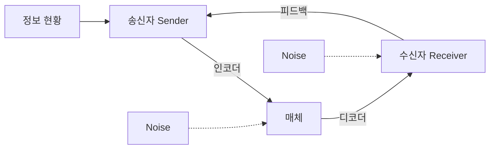

[그림 1] 비즈니스 커뮤니케이션 프로세스와 요소

1 출처: 네이버 국어사전

2 출처: 위키피디아

<!-- PDF page: 019 -->

비즈니스 커뮤니케이션의 핵심요소는 다른 커뮤니케이션들과 마찬가지로 공유하고자 하는 정보, 해당 정보를 주고받는 송신 자와 수신자 그리고 정보공유를 위한 매체이다. 또한, 송신자가 매체에 정보를 담기 위해서는 인코딩(Encoding)의 과정이 필 요하고, 수신자가 매체로부터 정보를 획득하기 위해서는 반대로 디코딩(Decoding)의 과정이 필요하다. 해당 과정 중에 송신 자, 인코딩, 매체, 디코딩, 수신자의 모든 요소로부터 불가피하게 잡음(Noise)이 발생할 수 있다. 따라서, 비즈니스 커뮤니케이 션을 수행하는 과정 중에는 반드시 잡음을 최소화하고, 명확한 정보 수신 여부를 확인하기 위해 피드백(Feedback) 과정이 필 수적이다.

#### 다) 비즈니스 커뮤니케이션의 유형

| 문서 | 언어 | 비언어 |
|---|---|---|
| 보고서, 기획서, e-Mail, 품의서, 메모, 각종 전자문서 | 회의, 토론, 발표, 대화, 사적 대화 | 표정, 제스처, 스타일, 환경 |

<!-- 그림 2의 문서·언어·비언어 사이 양방향 연결선 생략. 항목 내용은 표로 보존. -->

[그림 2] 비즈니스 커뮤니케이션의 유형

〈표 1〉 커뮤니케이션 유형별 특징

<table>
<tr><td>유형</td><td>설명</td></tr>
<tr><td>문서</td><td>• 문자를 사용하여 일정한 형식을 갖춰 커뮤니케이션 수행 • 커뮤니케이션 목적에 따라 다양한 형식 활용 가능 • 시차를 두고 피드백 가능한 특정시점에서 단방향 의사전달만 가능함</td></tr>
<tr><td>언어</td><td>• 말을 사용하여 비교적 자유로운 형식으로 커뮤니케이션 수행 • 커뮤니케이션 목적에 따라 다양한 형식 활용 가능 • 실시간으로 피드백이 가능한 커뮤니케이션 수행 가능함</td></tr>
<tr><td>비언어</td><td>• 표정, 목소리, 몸짓을 활용하여 커뮤니케이션 수행 특별히 정해진 형식보다는 상황에 걸맞는 유연한 활용 가능 • 이성보다는 감성에 호소하는 커뮤니케이션 방법</td></tr>
</table>

모든 상황의 커뮤니케이션에는 다양한 형태의 유형이 있는데 기본적으로 말(언어), 글(문서), 몸짓(비언어)을 통한 커뮤니 케이션으로 구분해 볼 수 있다. 말과 몸짓은 커뮤니케이션을 하며 자연스럽게 상황을 파악할 수 있기 때문에, 상대적으 로 정확한 의사 전달을 할 수 있지만 글을 통한 커뮤니케이션의 경우에는 다양한 환경을 고려한 의사 전달이 어렵기 때

<!-- PDF page: 020 -->

문에 일정한 형식에 따라 작성할 필요가 있다 예를 들어 이메일을 작성할 때는 제목, 중요한 사항에 대한 요약, 전체 내 용, 부연 설명 등 작성방법에 대한 일정한 전략이 필요하다.

커뮤니케이션 유형 중에서 가장 중요한 것은 몸짓(비언어)이다. 몸짓은 말이나 음성에 비해 가장 명확하게 보이지 않는 다고 생각할 수 있으나, 커뮤니케이션은 논리적인 설명만 중요한 것이 아니라 보이지 않는 부분이 매우 중요하게 의사전 달에 영향을 미친다.

| 구분 | 비율 |
|---|---:|
| 논리적인 설명 | 7% |
| 어조, 억양, 음성 | 38% |
| 비언어적 몸짓(호흡변화, 피부색변화, 눈물, 땀, 노려봄, 눈맞춤, 회피, 물러서기, 다가서기 등) | 55% |

[그림 3] 메라비언의 법칙(The Law of Mehrabian)

예를 들어 얼굴, 신체 등의 장점보다 목소리가 매우 매력적이어서 성공한 영화배우들이 많은 것처럼 목소리가 좋다면 상 대를 본인의 말에 집중시키기 용이하다. 밝은 웃음으로 상대방과 소통할 수만 있더라도 일정수준의 커뮤니케이션 목적 을 달성하는데 도움이 된다.

<!-- PDF page: 021 -->

### 02 비즈니스 커뮤니케이션 방법

#### 가) 상향식, 하향식, 수평식 비즈니스 커뮤니케이션

비즈니스 커뮤니케이션은 크게 수평적 커뮤니케이션과 수직적 커뮤니케이션 두 가지 유형으로 구분할 수 있다. 수평적 커뮤니케이션은 동료 사이의 커뮤니케이션, 수직적 커뮤니케이션은 상사와 부하직원 간의 커뮤니케이션을 의미한다. 각 각의 경우 다른 방식의 커뮤니케이션이 필요하다.

수직적 커뮤니케이션은 하향식 커뮤니케이션과 상향식 커뮤니케이션으로 구분할 수 있는데, 하향식 커뮤니케이션은 조 직의 상부에서 하부로 전달하는 지시, 명령, 전달 등을 포함하며, 상향식 커뮤니케이션은 조직의 하부에서 상부로 전달 하는 보고 등을 포함한다. 일반적으로 상사와의 공식적인 형태의 의사소통은 일정한 표준화된 문서양식과 전달기법이 필요하다.

수평적 커뮤니케이션은 조직 내 위치가 비슷한 수준의 구성원 혹은 부서 간의 커뮤니케이션을 말한다. 업무수행 과정에 서 기능적으로 분할된 조직 상호 간의 유기적 작용을 통해 공통의 목표달성을 가능케 한다. 점차 복잡하고 융합된 형태 의 새로운 문제나 도전이 빈번히 발생하는 최근에 수평적 커뮤니케이션의 중요성은 점점 높아져가고 있다. 사전 협의, 회람, 위원회, 태스크포스 등이 그 예이다.

#### 나) 소통채널과 정보충실도

비즈니스 커뮤니케이션을 하기 위한 소통채널로는 여러 가지가 있지만 보통 회의, 이메일, 전화, 보고서 공식문서 등을 사용한다. 해당 소통 채널별로 전달할 수 있는 정보의 양과 다양성이 다르다. 이런 소통 채널별로 전달할 수 있는 정보의 양과 다양성 정도를 정보충실도라 한다.

<!-- 그림 4 정보충실도에 따른 소통채널 선택: 정보충실도 및 전달 속도, 복잡성과 언어 다양성 축의 그래프 생략. 채널 명칭은 아래 보존. -->

수치와 도표로 만든 공식문자, 글로 쓴 공식문서, 비공식 메모나 편지, E-mail, 음성전달, 전화로 대화, 전자화상회의, 직접 대화

[그림 4] 정보충실도에 따른 소통채널 선택

[그림 4]와 같이 직접 대화의 경우 전달정보의 양이 많고 다양한 언어로 전달할 수 있고, 전달 속도 및 피드백 속도도 빠

<!-- PDF page: 022 -->

르다는 면에서 정보충실도가 매우 높다고 볼 수 있다. 이에 비해 공식문서와 같은 채널은 정보충실도가 매우 낮음을 알 수 있다. 최근 비즈니스 커뮤니케이션을 위해 빈번히 사용되는 E-mail의 경우 정보충실도가 중간 정도이다. E-maiI은 직 접 대화 할 수 없는 시간적, 공간적 제약을 극복할 수 있고, 전화와 다르게 송수신 이메일 내용을 근거로 남겨둘 수 있으 며, 빠른 전달속도와 다양한 문서를 첨부하여 소통을 할 수 있는 장점이 있다.

토론, 회의, 이메일의 특성 및 장단점을 비교하면, 〈표 2〉와 같다.

〈표 2〉 토론, 회의, 이메일 비교

<table>
<tr><td>구분</td><td>토론</td><td>회의</td><td>이메일</td></tr>
<tr><td>정의</td><td>• 논제에 대해 찬성자와 반대자가 논리적인 근거를 들어 입장을 발표하고 반박하는 의사전달의 형태</td><td>• 일정한 주제를 가지고 정해진 시간에 관련자들이 모여 의논하고 협의점을 도출하는 모임</td><td>• 인터넷 환경하에서 전자적으로 메일을 주고받는 의사소통의 형태</td></tr>
<tr><td>목적</td><td>• 논제에 대해 올바른 판단과 논리적 사고를 통해 좋은 결정과 판단을 내릴 수 있도록 함</td><td>• 정보전달 및 공유 • 결정사항 동의획득 • 여러 주제에 대한 논의 • 계획 대비 진척도 점검</td><td>• 정보전달 및 공유 • 결정사항 동의획득 • 비즈니스관련 요청사항 등 다양한 목적</td></tr>
<tr><td>과정</td><td>• 발제 • 확인 질문 • 반론 • 최종 발언</td><td>• 회의 전 관련정보 공유 • 회의계획서 작성 • 사회자 임명 진행 • 적절한 시간 배정 • 종료 후 내용정리 공유</td><td>• 제목 작성 • 수신자 및 참조자 결정 • 간결한 내용 작성 및 관련 문서 첨부</td></tr>
<tr><td>특징</td><td>• 찬성자와 반대자가 각각의 논거를 들어 의사전달</td><td>• 실시간 상호 의견 교환 유관자들의 참석</td><td>• 인터넷 기술 활용 • 시공간에 제약 없음</td></tr>
<tr><td>장점</td><td>• 논리적 판단능력 배양 • 자료수집 및 타당한 근거에 기반한 분석 가능 • 타인의 말을 경청하는 올바른 자세 함양 가능</td><td>• 정보공유의 용이성 실시간적 의견교환 • 상대적 빠른 결론 도출</td><td>• 시간적 공간적 제약없이 의사소통 가능 • 다양한 주제에 대해 논의 가능함 • 증거 및 근거자료 활용가능</td></tr>
<tr><td>단점</td><td>• 본질과 동떨어진 논쟁 • 사전 자료수집 부족 시, 일방적인 의견전달의 장으로 전락가능 • 논거 없는 무차별 비판이나 주장의 장으로 전락가능</td><td>결론이 없는 논의 • 지루한 시간 낭비</td><td>• 실시간 의사소통 불가능 • 다양한 주제 전달하기 어려움 • 보안이나 해킹, 스팸 등에 악용 가능</td></tr>
<tr><td>실무 상황</td><td>• 의사결정이 필요한 많은 부문과 특히 R&amp;D나 Engineering의 영역에서 특정 기술적 사안에 대해 솔루션을 결정하는 과정에서 토론을 수행함</td><td>• 실무에서 자주 사용함 • 회의 주제를 명확히 하고, 논의에 집중 하면 짧은 시간에 많은 정보공유 가능 단, 반대의 경우, 무의미한 시간낭비가 되는 경우도 많음</td><td>• 실무에서 빈번히 사용함 • 다양한 이해관계자와의 업무수행 시, 진행 상황에 대한 정보 공유 및 근거 자료로 활용함 • 내용을 두괄식으로 간단하고 명료하게 작성하는 게 중요함</td></tr>
</table>

#### 다) 논리적 설명과 설득방법

비즈니스 커뮤니케이션을 통해 이해관계자를 설득하기 위해서는 논리적 설명이 필수적이다. 논리적 설명이라 함은 객관 적 근거와 주관적 주장을 논거로 잘 연결하여 상대방을 나의 주장에 귀 기울이도록 하는 것이다. 이를 위한 대표적인 논 리전개 방법인 연역법과 귀납법에 대해서 알아보자. 연역법은 이미 알고있는 일반적인 전제로부터 구체적 사실을 도출하는 방법이다. 하나의 전제에서 하나의 사실을 도출 해내는 직접 추론과 둘 이상의 전제(대전제, 소전제)로부터 구체적 사실을 도출해 내는 간접 추론이 있다. 아래 예시가 연역적 간접추론의 대표적 사례이다.

<!-- PDF page: 023 -->

모든 사람은 죽는다(대전제).

소크라테스는 사람이다(소전제).

따라서 소크라테스는 죽는다(결론).3

귀납법은 1620년에 프랜시스 베이컨이 창안한 추론방법이다. 베이컨의 방법에 따르면 경험적 사실로부터 추측 혹은 가 설과 원리를 생각해 내고 경험적 사실로 참/거짓을 판단하는 방법을 말한다.4 다시 말해 여러 구체적 사실로부터 일반적 원리를 도출해 내는 방법이다. 아래 예시가 귀납적 추론의 대표적 사례이다.

소크라테스도 죽었다(구체적 사실).

소크라테스는 사람이다.

따라서 사람은 죽는다(일반적 원리).

연역법과 귀납법은 모두 논리적 설명을 위한 추론방법이지만, 이해관계자를 설득하기 위해서 논리적 설명으로만 되는 것은 아니다. 이해관계자를 효과적으로 설득하기 위해서는 논리적 설명 외에 더 필요한 것이 있다.

통계적 방법을 이용해서 수립된 가설을 설명하거나 검증해야 하는 경우도 있는데, 이때에 사용하는 서로 배타적인 두 서 술문이 귀무가설(Null Hypothesis)과 대립가설(AIternative Hypothesis)이다. 귀무가설은 기존 지식을 기반으로 인정되는 초기 주장이고, 대립가설은 검정을 통해 새로운 참으로 증명되기를 바라는 새로운 주장이다. 예를 들어, '대한민국 남자 의 평균수명은 70세다.' 라는 기존 주장이 있고, 최근에 평균수명이 늘어 70세를 넘는다라는 주장이 있다면, 아래와 같이 귀무가설과 대립가설을 세울 수 있다.

귀무가설: 대한민국 남자의 평균수명은 70세다.

대립가설 대한민국 남자의 평균수명은 70세가 아니다.

상기와 같은 두 개의 가설을 토대로 통계적 가설검정 기법을 이용해서 가설을 채택하거나 기각한다. 위의 예에서 귀무가 설이 기각되고 대립가설이 채택되면, 평균수명은 70세가 아니다.

[참고 및 추천 자료]

[1] 임장희, 홍용기, “비즈니스커뮤니케이션”, 1판, 도서출판청람, 2010.

[2] 이근주, 허남식, “2014년 지방행정연수원 기획실무”, 지방행정연수원 시/도공무원교육원, 2014.

[3] 강길호, 김현주, “커뮤니케이션과 인간”, 한나래, 1995.

[4] 세버린, 탠카드 공저, 박천일 외 역, “커뮤니케이션이론”, 나남, 2004.

[5] 데니스맥퀘일 저, 양승찬, 이경형 역, “커뮤니케이션이론”, 나남, 2008.

[6] 이윤석, 최강의 보고법, 새로운 제안, 2009.

3 출처: 위키피디아(연역) 4 출처: 위키피디아(귀납)

<!-- PDF page: 024 -->

## II. 비즈니스 문제해결 기법

### 학습 목표

1. 비즈니스 문제의 정의 및 유형을 식별할 수 있다.

2 비즈니스 문제해결 프로세스를 설명할 수 있다.

3. 상황에 맞는 문제해결 기법을 적용할 수 있다.

### 실무 미리보기

K 시스템은 핀테크(FinTech) 분야의 지급결제 및 환전서비스를 중심으로 하는 인터넷뱅크 사업에 새로이 진입하기로 결정하였다.

하지만, 인터넷뱅크 사업을 시작하기 위해서는 금융위원회에 사업계획서를 제출하고 프레젠테이션을 통해 심 사를 받은 후 승인을 받아야만 한다. 사업을 총괄하는 김 부장은 K 시스템의 현재 상황과 인터넷뱅크의 외부환경 분석 등을 수행하고, 인터넷뱅크 구축 전략이 포함된 사업계획서를 작성하기로 하였다. 현재 K 시스템의 정확한 상태를 파악하고, 경쟁기업의 상황을 파악하여 어떻게 인터넷뱅크 사업을 추진할 것인 가 결정하기 위해서 김 부장은 다양한 비즈니스 문제해결 기법을 적용하고 있다.

성공적인 비즈니스 수행을 위해서는 소비자 정보, 경쟁사 정보, 산업 동향에 관한 정보 등을 적시에 분석하고, 창의적인 아이디어를 통해서 전략 수립, 제품 개발 등에 활용하는 것이 매우 중요하다.

<!-- PDF page: 025 -->

### 01 비즈니스 문제해결 기법

#### 가) 비즈니스 문제해결 개념

비즈니스 환경에서 문제란 크게 새로운 기회를 창출하는 기획과 내부 프로세스의 개선, 두 가지로 정의해 볼 수 있다. 기 획은 사업기회인 '블루오션'을 찾는 과정이라고 말할 수 있으며 이는 현재 문제점이 있으나 이를 해결할 수 있는 방안을 통해 새로운 시장을 창출하는 과정을 말한다. 내부 프로세스 개선은 현재 가지고 있는 기회시장을 보다 효율적으로 운영 하기 위한 과제이다. 두 경우 모두 정확히 인식되고 정의하고 해결할 때, 비즈니스의 안정적 연속성을 보장할 수 있고 새 로운 기회창출이 가능해진다. 따라서 비즈니스 문제는 최적의 문제해결 프로세스와 비즈니스적 사고를 통해 해결해 나 가는 것이 무엇보다도 중요하다.

| 폭넓고 깊이있는 지식/정보 | + 최적의 조합을 찾아내는 노력 | = 문제해결(지혜) |
|---|---|---|
| 좋은 정보를 확보하기 위한 다양한 노력 자세히 관찰하고 구체적으로 분석하여 깊이있는 지식을 얻는 역량 남으로부터 양질의 노하우를 얻어내는 역량 | 고정관념을 뛰어넘어 항상 원점에서 다시 생각해보는 제로베이스 사고 남의 말에 귀를 열고 듣는 노력 감정을 배제한 냉철함 | 직관(체험)없는 개념은 공허하고, 개념없는 직관은 맹목적이다(칸트). |

[그림 5] 지식/정보와 최적 조합의 노력을 통한 문제해결 프로세스

#### 나) 비즈니스 문제해결 프로세스

비즈니스 문제해결 프로세스는 업무수행 과정에서 발생하는 다양한 형태의 문제를 인식하고, 이를 분석하여 해결하기까 지의 과정을 이해하고 합리적인 근거를 바탕으로 기존의 문제해결 방식을 적절하게 응용하여 새로운 해결 방안을 제시하는 것이다. 문제해결 기법은 일반적으로 다음과 같이 제시된다.

| 문제정의 | 원인분석 | 대안개발 및 평가 | 해결안적용 및 피드백 |
|---|---|---|---|
| 문제의 인식 문제정의 기술 | 프로파일링 및 분석기법 활용 | 평가기준 & 가중치 기반 평가 | 실행 및 평가 피드백 및 개선 |

[그림 6] 일반적 문제해결 프로세스 상세

<!-- PDF page: 026 -->

① 1단계: 문제정의

- 문제정의 단계에서는 해결하고자 하는 문제가 무엇인지를 정한다. 문제기술서 작성을 통하여 문제의 핵심을 파악할 수 있도록 정리하고, 문제가 근본적인 해결이 가능한지를 확인하여야 한다. 문제정의 시에는 하나의 문제가 아닌 MECE5한 형태로 분류하여 정의하는 것이 보다 정확한 문제정의에 도움이 된다.

② 2단계: 원인분석

- 원인분석 단계에서는 정의된 문제를 논리적인 기준에 따라 분류하고 단계별 구조를 형성한다. 구조화된 문제는 발생하 게 된 원인을 구체적으로 분석하기 위해 가장 큰 문제점부터 논리적인 순서에 따라 작은 단위로 분해하여 트리 형태로 정리하는 이슈트리를 이용한다. 정리된 문제의 하위부터 프로파일링과 다양한 분석기법을 활용하여 문제의 근본원인을 찾아낸다. 또한 최종적으로 식별된 문제의 원인들은 우선순위를 정하여 문제해결의 근본에서 중요하지 않은 원인들을 덜어내는 과정이 필요하다.

③ 3단계: 대안개발 및 평가

- 대안개발 및 평가 단계에서는 원인분석 단계에서 최종 도출된 문제의 원인을 해결하기 위한 다양한 측면의 대안을 개발 한다. 문제의 근본원인으로부터 다양한 가설을 수립하고 프로파일링으로 발견된 사실들을 대입하여 개발된 대안들은 평 가기준과 각 기준별 가중치를 통해 평가되고 하나 또는 몇 가지 대안이 최종 선택된다.

④ 4단계: 해결안 적용 및 피드백

- 해결안 적용 및 피드백 단계에서는 최종 선택된 대안을 검증하는 단계이다. 수립된 대안을 가장 효율적으로 검증가능한 테스트베드와 방법을 찾고 이를 실행하기 위한 준비를 하도록 한다. 상세 WorkpIan을 기반으로 대안을 실행함과 동시에 효과성을 정량적으로 피드백하여 대안의 타당성을 검증 및 피드백하도록 한다.

#### 다) 창의적 사고기법

직무수행 과정에서 발견되는 일상적인 문제를 명확히 정의하고 이를 해결하기 위한 솔루션이나 프로세스를 다양한 아이 디어를 통해 이끌어내는 것이 중요하다. 이를 위해서는 사고의 흐름을 적절한 기법을 통해 의식적으로 유도할 필요가 있 다. 이러한 수평적 프로세스를 통해 창의적으로 문제를 해결하는 사고기법에는 다음과 같은 방법이 있다.

① 브레인 스토밍(Brainstorming)

1940년대 미국의 광고업자 알렉스 오스본(AIex Osborn)이 아이디어를 내기 위한 일종의 회의방법으로 고안해 낸 것으로. Brainstorming이란 말의 원래 의미는 정신병 환자의 두뇌 산란상태를 말하는 것이다. 즉, 두뇌에서 폭풍우가 몰아치는 것 과 같은 이상현상을 회의에서의 아이디어 발상법으로 사용하고 있다. 문제의 원인분석, 해결안의 도출, 평가기준 개발 및 실행계획의 수립 등 문제해결 전 과정에서 활용될 수 있다.

[그림 7] 브레인스토밍의 흐름

② 여섯 가지 생각모자(6 Thinking Hat)

여섯 가지 생각모자는 에드워드 드보노(Edward de Bono)에 의해 개발된 방법으로 단순하면서도 효과적으로 사고하기 위

<!-- PDF page: 027 -->

한 방법이다. 즉, 다양한 관점에서 접근해 볼 수 있도록 여섯 명이 서로 다른 역할들을 맡아 자기 역할에 맞는 발상으로 최 적의 의사결정을 도출하는 방법이다.

〈표 3〉 6 Thinking Hat 구성

<table>
<tr><td>모자 유형</td><td>역할</td></tr>
<tr><td>하얀 모자</td><td>중립적으로 객관적 사실이나 데이터를 설명하는 역할</td></tr>
<tr><td>빨간 모자</td><td>감정적인 발상을 하는 역할</td></tr>
<tr><td>검은 모자</td><td>부정적이거나 반대하는 입장의 역할</td></tr>
<tr><td>노란 모자</td><td>긍정적이고 낙관적인 입장의 역할</td></tr>
<tr><td>초록 모자</td><td>창조적으로 새로운 아이디어를 내는 역할</td></tr>
<tr><td>파란 모자</td><td>냉정하고 객관적으로 결과를 정리하는 역할</td></tr>
</table>

③ 랜덤 워드(Random Word)

랜덤워드는 드보노(Edward de Bono) 교수가 고안한 발상법으로. 독특한 아이디어가 나올 때까지 다양한 단어들을 제시하 고 그 중 무작위로 단어를 선택 • 조합하여 단어의 유추를 통해 강제로 과제와 연결시켜 새로운 발상을 유도한 기법이다.

④ 스캠퍼(SCAMPER)

스캠퍼란 아이디어를 창출하고자 하는 브레인 스토밍 기법을 창안한 오스본의 체크리스트를 에이벌(Bob EberIe)이 발전 시킨 분석기법이다. 스캠퍼(SCAMPER)란 용어는 '대체(Substitute)', '결합(Combine)', '응용(Adapt)', '변형(Modify)' 혹은 '확대 (Magnify)', '다르게 활용(Put To Other Uses)', '제거(Eliminate)', '재배열(Rearrange)' 혹은 '뒤집기(Reverse)'의 각 첫 글자를 따서 만든 것이다. 아이디어 발상법이라는 점에서 자유롭게 대안을 도출하는 브레인스토밍과 유사한 성격을 가지고 있지 만, 스캠퍼는 미리 준비한 리스트를 보면서 아이디어 발상을 한다는 점에서 차이가 있다.

⑤ TRIZ(Theory Of lnventive Problem Solving) 러시아의 발명가 알트슐러 박사가 수만 건의 기존 발명에 대한 분석을 통해 창출한 문제해결 및 아이디어 구체화 기법이 다. TRIZ는 특정문제를 추상화를 통해 일반화된 문제로 모형화한 후, 일반적 해결 모형을 찾아 해결방안을 도출한다. 급격 한 경영환경 변화 속에 신속하고 정확한 의사결정이 기업의 생존에 가장 중요한데 TRIZ는 비즈니스 과정에서 발생하는 각 종 문제와 모순을 객관화하고 이미 검증된 원리와 해결책을 적용하여 혁신적인 해결방법을 제시해 준다.

| 구분 | 내용 |
|---|---|
| 문제해결 절차 | 특정 문제 → 일반화된 문제 → 일반화된 해결책 → 특정 해결책 |
| 문제해결 원리 | 4가지 분리의 원리, 40가지 발명의 원리, 76가지 표준 해결책 문제해결 프로세스(ARIZ): 발명수준의 문제해결을 위한 연속적, 반복적 과정 |

[그림 8] TRIZ이론을 이용한 문제해결

<!-- PDF page: 028 -->

#### 라) 논리적 사고기법

창의적인 문제해결과는 다르게 때로는 근본원인에 따라 문제를 분류하고 사실에 입각해 문제를 풀어나가야 하는 경우들 도 있다. 즉, 현재까지의 발견된 사실들, 객관적 지표기반 데이터를 통해 미래를 예측하기 위한 논리적 사고기법이 필요 하다. 직무수행 과정에서 발견되는 일상적인 문제를 명확히 정의하고 이를 해소하기 위한 해결책을 수직적인 프로세스 를 통해 도출하는 기법들은 다음과 같다.

① MECE(MutuaIIy Exclusive and CoIIectiveIy Exhaustive) 영문표현을 통해서도 파악할 수 있듯이 MECE는 '상호 중복 없이 전체적으로 빠진 것이 없는' 상태로 어떤 정보나 메시지 를 중복이나 누락이 없이 구성하는 것이다. 즉, 문제를 분석하기 위하여 누락과 중복이 없도록 각각의 항목을 나누어 전체 의 합이 모든 경우의 수를 포함하도록 처리하는 것이다. 간단히 예를 들어 '시간'이라는 전체를 과거, 현재, 미래로 그룹화 (Grouping)하면, MutuaIIy(상호 간에) / ExcIusive(중복 없이), Collectively(전체로서) / Exhaustive(누락 없이)를 만족한다고 할 수 있다. 그러나, 음료라는 것 전체를 이온음료와 탄산음료로만 구분한다면 MutuaIIy(상호 간에) / ExcIusive(중복 없이)를 만족하지만 생수 등 음료라고 말할 수 있는 다른 구성요소가 누락되기 때문에 Collectively(전체로서) / Exhaustive(누락 없음)를 만족한다고는 할 수 없다.

| MECE인 경우 | MECE가 아닌 경우 |
|---|---|
| (예) 전체: 시간 A: 과거 B: 현재 C: 미래 | (예) 전체: 음료 A: 이온음료 B: 탄산음료  (예) 전체: 남성 A: 미혼 B: 기혼 C: 직장인 |

<!-- 그림 9의 사각형 분할과 원의 포함·교차 영역 도형 생략. 사례 분류 항목은 보존. -->

[그림 9] MECE 예시

② 로직트리(Logic Tree)

로직트리(Logic Tree)란 MECE의 사고방식에 따라 주요항목을 트리 형태로 분해한 것으로서, 논리적인 사고를 촉진할 수 있고 폭 넓은 아이디어를 창출할 수 있으며 누락되는 것이 없도록 하여 전략수립 및 문제해결에 있어 체크리스트적인 성 격으로도 이용할 수 있다.

<!-- 그림 10 현황분석의 사업환경·3C 분석 트리 및 연결선 생략. 원본 노드: 현황분석, 사업환경, MECE, 3C 분석, 규제, 회사 Trend, 고객(Customer), 경쟁자(Competitor), 고객(Company), 성과, 마케팅전략. -->

[그림 10] 로직트리를 통한 구조화 예시

<!-- PDF page: 029 -->

예를 들어 '현황분석'은 MECE의 사고방식에 따라 사업환경과 3C분석으로 분해할 수 있고 다음 단계의 각 구성요소들도 MECE에 따라 Tree 형태로 분해하여 작성한다면 주어진 핵심내용에 대해서 체크할 수 있게 된다

③ 80:20의 법칙

80:20의 법칙은 파레토라는 이탈리아의 경제학자가 유럽의 소득분포를 분석하다가 발견한 법칙으로 상위 20% 사람들 이 전체 부(富)의 80%를 가지고 있다는 것이다. 이런 80:20의 법칙은 다양한 경우에 발견되는데 상위 20% 고객이 매출의 80%를 창출하고 핵심인 20%의 문제를 해결하면 전체 문제의 80%가 해결되는 경향이 있다는 것을 의미한다.

전략과 파레토 법칙은 매우 잘 매칭이 되는데 에너지를 문제의 핵심인 원인변수를 해결하는데 자원을 집중하면 결과적으 로 문제의 80% 이상을 해결할 수 있다는 것을 이해할 수 있다.

#### 마) 합리적 의사결정 기법

합리적 사고는 참/거짓을 정확히 나눌 수는 없으나 가장 효율적이고 효과적인 결정을 내리기 위한 사고 기법이다. 즉, 여 러 대안 중 목적에 가장 잘 부합하는 의사결정을 위한 사고기법이라고 할 수 있다. 이러한 합리적 의사결정을 위해 다음 과 같은 기법들이 있다.

① 다요소의사결정(MADM, Multi-Criteria Decision Making) 다요소의사결정 기법이란, 최선의 대안을 선정하는 과정에서 하나의 기준이 아닌, 다양한 요소의 기준을 고려하여 의사결 정하는 기법이다. 고려하는 요소는 대상의 특징이 되는 속성들을 의미하며 각 요소별로 목적성에 부합하는 정도를 평가함으로써 최종 의사결정에 반영하게 된다

② AHP(분석적 계층화기법, AnaIytic Hierarchy Process) AHP기법은 의사결정을 위해 상황을 트리구조로 분할하고 이를 단계적으로 분석함으로써 최종적인 의사결정에 이르는 기 법이다. 이 기법은 복잡하고 정량화하기 어려운 문제를 분석하기 쉽게 분할하고 분할된 문제를 각각의 쌍대비교(Pairwise Comparison)를 통해 평가하는 방식으로 진행된다. 분할을 통해 문제는 보다 이해하기 쉬운 형태로 쪼개어지고 의사결정 자는 쉽게 계층별 요소를 비교하여 판단이 가능하다.

#### 바) 문제해결 능력

최근 기업에서는 공통역량으로 문제해결 능력을 강조하고 있다. 실질적인 문제를 해결하려면 문제인식 습관이 더욱 필 요하다. 문제해결은 쉽게 정의하면 '원하는 수준과 현 수준의 갭(Gap)을 인지하고 그것을 개선해 나가는 활동'이라고 할 수 있다. 즉, 현재 수준에 만족하거나 단순히 기존 방식을 따라해서는 실질적인 문제해결이 어렵기 때문에 다양한 정보 수집과 경험을 통해 원하는 수준(품질기준선)을 계속해서 높여나가는 노력이 필요하다. 문제해결 수준을 높이는 요소는 크게 다음 3가지가 있다.

① 항상 “왜”를 고민해야 한다.

무엇보다 항상 '왜'라는 생각으로 문제를 인지하려고 노력하는 것이 문제해결의 핵심이다. 문제 자체를 인지하지 못하면 당연히 문제를 해결할 수 없기 때문에, 항상 '왜'라는 문제의식을 가지고 있어야 문제해결 능력을 갖출 수 있다.

② 반드시 해결하겠다는 적극적인 자세가 필요하다.

모든 문제에는 여러 변수가 있기 마련이므로 잠깐의 고민으로 해결책이 나오지 않는다. 따라서 문제해결에 대한 긍정적 인 생각과 더불어 발상의 전환능력이 중요하다. 전혀 상관없는 것들이 엮여서 새로운 대안을 제시하는 경우가 많기 때

<!-- PDF page: 030 -->

문이다.

③ 문제에 대한 오너십이 필요하다.

내 것이라는 주인의식(Ownership)과 반드시 완수하고야 말겠다는 책임감이 가장 중요하다. 문제해결이 어려우면 '~무엇 때문에', '누구 때문에' 등 책임을 미루는 경우가 많은데, 이래서는 문제해결을 할 수도 프로 직장인이 될 수도 없다.

[참고 및 추천 자료]

[1] 진 젤라즈니, “맥킨지 차트의 기술”, 서울: 스마트비즈니스 2006

[2] 김성영, 라선아, “마케팅조사”, 서울: 한국방송통신대학교출판문화원, 2014.

[3] 이현수, “문제해결 잘하는 사람 잘하는 회사”, 서울: 더난출판, 2002

[4] 장건태 외 직무글쓰기연구회, “직무 글쓰기”, 경기: 앞장감, 2012

[5] consulting.sbc.or.kr

[6] 이윤석, 최강의 보고법, 서울: 새로운제안, 2009.

<!-- PDF page: 031 -->

## III. 비즈니스 문서 작성기법

### 최근 동향 및 주요 이슈

비즈니스의 대부분의 활동은 문서를 통해서 마무리 된다. 구두 커뮤니케이션 능력과 함께 문서 작성 능력이 뒷 받침 되어야 다양한 비즈니스 활동, 개발 활동을 성공시킬 수 있다. 특히 비즈니스 환경이 더욱 복잡해지고 있 는 최근에는 간결 명료하게 의사를 전달하는 비즈니스 문서 작성능력이 매우 중요하다.

### 학습 목표

1. 비즈니스 문서 작성의 핵심 원칙과 방법을 이해하고 설명할 수 있다. 2. 각종 업무 상황에 맞는 이메일, 회의록, 1페이지 보고서, 대외공문 등의 비즈니스 문서를 작성하는 방법을 이 해하고 설명할 수 있다.

<!-- PDF page: 032 -->

### 실무 미리보기

P 사원은 첫 프로젝트에서 매우 엄한 상사를 만났다. 그 상사는 P 사원뿐만 아니라 누가 만든 보고서든 쉽게 결재해 주는 법이 없었다. 항상 “이건 왜 이런데?”, “근거가 뭐야?”라고 세세히 따지거나 “왜 이렇게 복잡해?” “도대체 뭐 하자는 거야?” 등의 질책을 쏟아 붓곤 했다.

당연히 P 사원이 쓴 보고서는 늘 빨간 펜으로 도색되기 일쑤였다. 한동안 '내가 그렇게 업무능력이 부족한가? 도대체 뭐가 문제일까?'하고 고민하던 P 사원은 어느 날 문득 이런 생각이 떠올랐다 '아, 내 보고서를 최종적으 로 받는 사람은 부장님이 아니라 사장님이라는 사실을 생각하지 못했구나!' 다시 말해 P 사원이 만든 보고서의 최종 보고자가 자신이 아닌 상사라는 사실을 그제야 깨달은 것이다.

그때부터 P 사원은 보고서를 만드는 기준을 이렇게 세웠다. 일단 머릿속에 '사장님은 얼마나 알고 있을까?', '이 문서를 보고 사장님이 쉽게 이해할 수 있을까?' 등을 생각하고, 사장님께 보고 드리는 상사를 상상하며 문서를 만들기 시작했다. 특히 상사에게 보고할 때 미리 사장님이 궁금해 할 사항에 대한 근거나 자료를 준비했다. 즉, 사장님은 해당 분야에서의 전문가가 아니라는 생각으로 일반적인 지식을 가지고 있는 사람이 물어볼 만한 예 상질문과 그에 해당하는 답변을 뽑아 보고서와 함께 상사에게 제출한 것이다. 그때부터 P 사원은 상사의 칭찬 은 물론 업무평가도 월등히 좋아졌다.

### 01 비즈니스 문서의 개념과 종류

#### 가) 비즈니스 문서의 개념

비즈니스 문서란, 프로세스 기획문서, 업무보고서, 회의록, 결과 및 현황보고서 등 비즈니스 활동에 필요한 모든 형태의 문서를 말한다. 이러한 비즈니스 문서는 일반적인 문서와 달리 정형화된 형태를 기반으로 오해의 소지가 없도록 정확하 게 기술되어야 한다. 또한 장황한 문구와 감정적인 표현을 배제하고 간결한 문구와 객관적인 표현을 통해 문서를 보고받 는 사람이 직관적으로 이해할 수 있도록 작성되어야 한다.

#### 나) 비즈니스 문서의 종류

① 비즈니스 문서의 유형

비즈니스 문서의 유형은 업무의 내용에 따라 아래와 같이 다양하며, 보고서, 제안서, 사업계획서가 그 중 가장 많이 활용되

<!-- PDF page: 033 -->

고 있다.

- 보고서: 제품이나 아이디어에 대한 사업성 또는 그와 관련한 비즈니스 환경 등에 대한 보고를 위해 작성하는 문서

- 의견서: 제품이나 아이디어 등에 대한 가치를 평가하기 위해 작성하는 문서

- 기획서: 제품이나 아이디어에 대한 사업 추진 승인을 받기 위해 작성하는 문서

- 계획서: 제품이나 아이디어에 대한 승인 후, 사업화계획을 작성하는 문서

- 설명서: 기획 • 제품 등에 대한 상세 내용을 설명하는 문서

② 보고서의 유형과 종류

보고서란 업무계획. 업무추진 상황 등을 논리적으로 설명하거나 설득하기 위해 작성한 문서를 말한다. 보고서는 성격에 따라 상황을 전달하는 보고서와, 판단을 구하는 보고서로 나눌 수 있는데, 전자는 객관적인 입장에서 육하원칙에 따라 내 용을 전개하고 속도와 정확성을 우선시한다(예: 현황보고서, 상황보고서 등). 후자는 보고받는 자의 입장에서 논리적인 목 차 순서에 따라 내용을 전개하고, 논리와 이유를 명확히 제시하는 것이 중요하다(예: 계획보고서, 대책보고서 등).

또한, 용도에 따라서도 구분할 수 있는데 계획보고서와 같이 계획과정에서 작성하는 보고서를 정보보고서라고 하고, 점검 결과보고서 등 통제과정에서 작성하는 보고서를 관리보고서라 한다.

### 02 비즈니스 문서의 작성원칙

① 최종소비자의 관점에서 쉬운 이해

비즈니스 문서를 만들 때는 자신의 입장이 아닌, 보는 사람이나 최종 의사결정권자의 입장에서 이해와 공감이 되도록 만 들어야 한다. 최종 소비자가 갖춘 지식수준 경험, 니즈(Needs) 등을 종합적으로 고려하여 최종소비자가 이해하고 공감할 수 있도록 문서가 작성이 되어야 한다. 최종소비자가 경영진일 수도 있고, 일반적인 구성원일 수도 있다. 각각에 맞추어 다르게 작성되어야 한다. 즉, 문서를 보는 사람이 느끼는 감정을 상상하면서 문서를 작성해야 한다.

② 간결/명료하게 작성

비즈니스 환경에서 문서를 읽는 사람은 시간이 많지 않다. 따라서 빠르게 핵심을 파악할 수 있도록 간결/명료하게 문서를 작성해야 한다. 비즈니스 문서가 학술문서나 일반적인 문서와 다른 것은 결론을 앞쪽으로 기술하여 빠르게 내용을 이해할 수 있도록 할 필요가 있다.

③ 명확한 근거 반영

정확한 정보와 사실에 기반해서 작성하여야 하며 막연한 추측은 지양해야 한다. 규정, 방침, 각종 정보나 자료의 출처를 명확히 밝혀야 한다.

④ 논리적인 기술

목적, 배경, 현황 원인, 대안 등의 흐름으로 왜 이 문서가 필요한지, 원인이 무엇이고 어떻게 하겠다는 식으로 기술된 내 용이 논리적으로 구성되어야 한다

<!-- PDF page: 034 -->

### 03 비즈니스 문서 작성 방법

#### 가) 비즈니스 문서 작성 방법

비즈니스 환경에서 가장 많이 쓰이는 문서는 1페이지 보고서이다. 1페이지 보고서를 잘 작성할 수 있게 되면, 기획서, 사 업계획서, 제안서 등 다양한 문서에 응용을 할 수 있게 된다. 작성의 원리는 동일하다. 1페이지 보고서 작성 방법을 중심 으로 구체적인 비즈니스 문서 작성의 방법은 아래와 같다.

① 1페이지에 핵심 스토리를, 부연설명 자료는 첨부에 반영

보고서 1페이지에 핵심적인 의견을 기술하고 기타 부연설명이나 근거자료는 첨부문서로 만든다. 물론 보고내용을 뒷받침 하는 자료가 많을수록 좋긴 하겠지만, 정작 보고를 받거나 회의를 하는 사람은 20~30페이지에 달하는 두툼한 보고서를 검토할 시간이 없다. 핵심내용을 1페이지에 담는 방법을 활용하면 20~30페이지를 모두 완벽하게 만드느라 소요되는 시 간이 획기적으로 줄어드는 장점도 있다.

② 목차를 잡은 후 자연스럽게 기술 후 키워드 중심으로 개조식으로 압축 먼저 목차를 잡은 후에 세부내용을 기술한다. 처음부터 모든 메시지를 1페이지로 압축하려는 것은 과욕이다. 먼저 설명하 고자 하는 내용에 대해 '1. 목적, 2. 현황/이슈, 3. 추진방향 또는 개선방안, 4. 예산, 5. 의사결정사항 등으로 목차를 잡은 후, 각 목차에 따라 자연스럽게 브레인스토밍 하듯이 내용을 기술한 후 키워드 중심으로 압축한다.

목차를 잡을 때 많은 초보자들이 내용을 빼 먹는 경우가 많다. 목차를 잡을 때 많이 활용하는 아래의 5W2H1T는 대부분의 보고서 작성 시에 뼈대가 되는 질문으로서, 이 질문에 답을 하는 방식으로 보고서를 작성한 뒤에 키워드 중심으로 요약하 면 중요사항이 빠짐 없는 보고서를 작성할 수 있다.

5W2H1T

- Why: 왜 이 기획을 입안하는가?(이유, 의의, 배경)

- What: 이 기획으로 무엇을 하려 하는가?(기획의 내용)

- Target: 어떤 목표로 이 기획을 실시하는가?(대상 기획의 표적)

- How: 이 기획을 어떻게 추진하려 하는가?(방법, 수단)

- When: 언제 어떠한 일정으로 추진하는가?(실시시기, 기간)

- Who: 누가 하는가?(실행자, 관계자)

- Where: 어디에서 실시하는가?(대상지역, 장소)

- How much: 비용과 이익은 어떠한가?(예산, 이익 계획)

그 후, 목차에 따라 자연스럽게 기술된 내용을 키워드 중심으로 압축한다. 화려한 수식어구는 되도록 빼고 간결 명료하게 핵심적인 키워드만을 뽑아내면 매우 훌륭한 1페이지 보고서가 완성된다.

아래 표의 예시와 같이 조직의 일은 수식어로 강조한다고 강조가 되는 것이 아니기에 Fact(사실) 그 자체를 바탕으로 기술 해야 한다. 아래 예시처럼 [너무 나도 멋지고 아름다운 밤입니다]는 그냥 [아름다운 밤]이면 내용 전달이 충분하다. 또 그 아래의 예시처럼 [상당히 많은 예산을 사용했고〕라는 문구는 [과도한 예산을 사용했음]이라고 하면 내용전달이 보다 명확 히 된다.

<!-- PDF page: 035 -->

〈표 4〉 불필요한 수식어구의 제거 예시

| 일반문장 | 보고문장 |
|---|---|
| 너무나도 멋지고 아름다운 밤입니다 | 아름다운 밤, 또는 밤 |
| XX회사는 상당히 많은 예산을 사용했고, 프로젝트 수행 결과 원하는 바를 달성하지 못함 | XX회사는 과도한 예산을 사용했으나, 목표를 달성하지 못함 |

③ 결론을 명확히 함

대부분의 잘못된 보고서는 현황과 분석은 잘된 반면, 정작 무엇을 주장하고 싶은지 또는 어떤 결론을 얻고 싶은지가 명확 하지 않은 경우가 많다. 1페이지 보고서를 작성하기 위해서는 논지를 명확히 하고, 결론을 도출해내는 것이 매우 중요하다. 특히 상사나 이해관계자의 “어떻게 할 건데(How)?”라는 질문에 대한 답이 있어야 한다.

④ 표의 효과적인 활용

1페이지 보고서는 압축이 중요하기 때문에 서술식 만으로 작성하기에는 한계가 있다. 따라서 서술식 문장과 표를 적절히 활용하면 많은 양의 내용을 1페이지에 압축해서 기술하는 데 도움이 된다.

⑤ 보고서 제목 작성방법

제목은 문서의 내용을 바로 알 수 있도록 구성해야 한다. 특히 바쁜 상사나 경영진에게는 제목만 보아도 바로 내용이 상상 되도록 제목을 잘 잡는 것이 매우 중요하다. 수요자가 제목만 보고도 전체 내용이나 취지, 보고 성격을 알 수 있도록 내용 을 최대한 포괄해야 하는데 되도록 20자 이내로 압축해서 표현하는 것이 좋다.

아래 제목사례를 볼 때 좋은 사례는 연도, 문서의 성격 등이 잘 나타나 있으나 좋지 못한 사례는 구체적이지 않고 모호함 이 많다. 제목은 검토, 개선(안), 현황, 회의록 등으로 문서의 성격을 바로 알 수 있도록 기술을 해 주는 것이 필요하다. 너 무 길어질 것 같으면 -() 등으로 부제를 붙여 더 구체적으로 내용을 한정지어 주는 것도 효과적이다.

- 잘 된 보고서 제목(예시)

2009년 평가제도 개선방안(업적평가제도 개선을 중심으로)

우수 기업들의 EA(Enterprise Architecture) 도입 현황 ERP 도입을 위한 관계 부서 회의록(1차)

- 잘못된 보고서 제목(예시)

평가/보상제도 개선방안

부서 회의록

EA(Enterprse Architecture) 도입 현황

⑥ 작성일자 및 작성조직(작성자)

제목의 바로 오른쪽 하단에 작성일자 및 작성조직(작성자)을 표시해야 한다 나중에 시간이 지났을 때 문서를 식별할 수 있는 근거가 되며, 예전 버전과 혼동을 줄여줄 수 있어 중요하다. 초보들이 자주 이 부분을 빠트리는 실수를 범하곤 한다

⑦ 넘버링

넘버링 방식 중 자신이 좋아하거나, 조직에서 정한 것이 있다면 그것을 활용하도록 한다. 이때 조직에서 정한 것을 우선으 로 해야 하며, 그것이 없다면 자신이 잘 활용하는 방식으로 넘버링의 기준을 정해야 한다. 보통 일반 기획서에서는 아래의 넘버링 체계를 많이 활용한다.

<!-- PDF page: 036 -->

아래의 예시처럼 숫자로 대항목을 적고, 그 뒤에 도형을 적는 방식, 그리고 도형으로 넘버링을 하는 방식 두 가지가 주로 활용된다.

〈유형 1〉, 〈유형 2〉와 같은 코드식은 규정, 방침 등의 문서에, 〈유형 3〉, 〈유형 4〉와 같은 숫자, 문자 혼용방식은 공문, 품의

서 등을 만들 때 주로 활용한다.

- 일반 보고서 넘버링 샘플

| 유형 1 | 유형 2 | 유형 3 | 유형 4 |
|---|---|---|---|
| 1. ■ ○ － | ■ ○ ▷ － | 1. 1.1 1.1.1 1.1.1.1 | 1. 가. 1) 가) (1) (가) ① |

⑧ 각 항목별 세부 작성 방법

- 목적: 이 일을 왜하고 이 기획서를 왜 만드는지에 대한 내용이 한 두 문장으로 잘 기술되어 있어야 함

- 현황/이슈: 보통의 기획서는 개선사항을 목적으로 하기 때문에 목적을 이루기 위해서 현재 어떤 상황인지, 또 그 이슈/원 인이 무엇인지를 잘 기술해 주어야 함

- 개선방안 현황/이슈에 제기된 문제점을 해결할 수 있는 방안을 기술함. 이때는 표를 활용하는 것도 좋음. 특히 문서의 성격에 따라 상사가 장단점을 보고 〈1안〉, 〈2안〉중 선택하는 방식을 취하는 경우도 많음. 이럴 경우에는 표를 활용해서 각 안의 내용, 장점, 단점을 기술하면 좋음

- 일정: 각 항목별로 일정과 주요 이슈를 기술할 수 있도록 구성함

- 첨부: 첨부가 있는 경우 1, 2 등으로 표시하여 기술함. 1. 포상대상자 명단 1부, 2 공적조서 1부 등으로 표시함

- 끝: '끝' 표시는 문서가 끝났다는 것을 알려주는 표시임. 첨부가 없는 경우 문서의 맨 마지막 글자에서 2칸 떼어서 표시하 면 되고, 표가 마지막일 경우 표의 좌측 하단에 표시하면 됨. 첨부가 있는 경우 첨부의 맨 마지막 글자에서 2칸 띄어서 표시하면 됨

<!-- PDF page: 037 -->

- 1페이지 보고서 예시

| 항목 | 내용 |
|---|---|
| 제목 | 지식이력 관리 시스템 구축 계획 |
| 보고 부서 | 인력 팀/e-Management팀 |
| 유관 부서 | 기술전략 팀 |
| 일시 | '00년 00월 00일 |

1. 목적

- 구성원의 지식/기술 이력을 체계적으로 관리하여 인적자원의 효율적 활용 극대화

- 채용/배치/경력개발 등 각종 인사업무 시 최적의 의사결정 지원

2. 현황/이슈

- 구성원의 일반적인 이력은 관리되고 있으나, 프로젝트 수행 경험(사/내외), 보유기술 등의 지식이력에 대한 세밀한 관리는 미흡한 상황임

- 사내의 해당 분야 전문가를 찾아 도움을 받거나, 활용할 수 있는 체계가 미흡한 상황임

- 주요 프로젝트 수행 시 해당 경험자를 찾아 효과적인 PJT 조직을 구성하기가 어려움

3. 시스템 구축 방안

- 개요 직무/보유기술/주요경험 등 개인이력이 종합된 지식 이력 DB를 구축

- 주요 기능

<table>
<tr><td>구분</td><td>내용</td></tr>
<tr><td>지식이력관리/ 인재 검색 기능</td><td>• 직무/보유기술/주요경험 등 개인이력이 종합된 지식 이력 입력/관리 • 각종 조건(직무/경험/기술/역할/희망업무 등)을 부여하여 조건에 맞는 인재 검색</td></tr>
<tr><td>경력/기술 분석 및 통계</td><td>• 인사업무 및 각종 전략 수립 시 필요한 각종 인력분석 통계 출력 가능 (직무별/기술별 보유현황 등)</td></tr>
<tr><td>경험공유 장터</td><td>• 각종 지식에 대하여 구성원 상호 간 문답식 경험 공유가 가능한 공간 구축</td></tr>
<tr><td>Career Goal 및 희망업무 관리</td><td>• 개인별 Career Goal 및 희망직무 관리를 통한 경력개발 업무 지원 기능</td></tr>
</table>

4. 구축 절차

| 직무/기술분류 체계수립 | 시스템 설계 | 시스템 개발 | 전사원 경험/기술 조사 | 시스템OPEN |
|---|---|---|---|---|
| 10/3 ~ 28 | 10/3 ~ 10/15 | 10/17 ~ 11/30 | 12/1 ~ 12/15 | 12.15 |

5. 기대효과

<table>
<tr><td>구분</td><td>내용</td></tr>
<tr><td>전략지원 강화</td><td>• 전사 기술역량 자료를 바탕으로 각종 사업추진 시 의사결정자료 지원 • 전사적 인적자원의 핵심역량 수준 파악 가능</td></tr>
<tr><td>효과적인 인력활용 강화</td><td>• 필요한 조직에 필요한 자원을 適時適材 배치하기 위한 핵심자료 활용 • PJT 추진 시 필요한 각종 기술보유 인력에 대한 수시지원 가능</td></tr>
<tr><td>지식교류/ 육성업무 지원</td><td>구성원 상호 간 지식에 대한 교류가 가능한 체계를 구축하여 학습조직화 지원 • 부족한 기술역량에 대한 육성수요 파악/개발 지원 기능</td></tr>
</table>

끝.

[그림 11] 1페이지 보고서 예시

<!-- PDF page: 038 -->

#### 나) 공문서 작성의 원칙 및 방법

비즈니스 상황에서 조직과 조직 간의 명확한 의사표현을 하기 위해서 조직의 장의 명의로 전달하는 문서를 공문이라고 하며, 정식명칭으로는 기안문/시행문이라고 한다. 기안문은 조직 장의 결재를 받기 위해서 만드는 문서이다. 결재 후 이 것을 보존하고, 결재란을 지우고 시행문을 만들어 수신할 조직에 전달한다. 여기서는 공문서 작성에 필수적으로 필요한 원칙과 방법에 대하여 알아본다.

① 결재

문서는 결재권자가 해당 문서에 서명의 방식으로 결재를 함으로써 성립한다. 서명에는 전자이미지서명, 전자문자서명 및 행정전자서명을 포함한다.

결재란 정확한 권한을 가진 사람이 자신의 의사를 결정하는 행위를 말하며 종류로는 정규결재, 전결, 대결, 협조 등이 있다.

- 정규결재: 조직의 장이 하는 결재. 예를 들어 기관의 장 회사의 CEO 등이 하는 결재

- 전결: 조직의 장이 결재권한을 위임전결규정에 의해 하위 조직의 리더에게 위임한 것을 말함. 정확한 위임에 의해 이루 어진 결재의 경우 정규결재와 동일한 효력을 발휘함

- 대결: 결재권자가 장기간 부재 시 하위 구성원에게 일시적으로 권한을 위임하여 결재를 진행하는 경우를 말함

② 공문서작성 시 표기 방법

공문서는 정부 공문서를 기반으로 발전한 것으로 작성의 표기 방법은 정부 규정에 따른 아래의 방법을 기본으로 하여 작 성함

- 숫자: 아라비아 숫자로 표기하는 것이 기본. 화폐나 금액의 경우 천 단위에 콤마(,)를 표시하고 연도에는 콤마를 쓰지 않 음{예: 금113,560원(금일십일만삼천오백육십원)}

- 날짜: 숫자로 표기하되 연, 월, 일 등의 글자는 생략하고 각 자리에 점을 찍어 표시함(예: 2011. 12 12)

- 시간 시 • 분은 24시간을 바탕으로 숫자로 표기하며, 시 • 분의 글자는 생략하고 그 사이에 쌍점(:)을 찍어 표시함{예: 오 후 5시 30분(×) → 17:30(○)}

- 항목표기: 기안문 작성 시 항목표기의 방법은 〈행정업무의 효율적 운영에 관한 규정〉에 명확히 제시되어 있음. 아래와 같은 항목의 순서대로 작성함

- 〈공문서 항목표기 방법〉

1. → 가. → 1) → 가) → (1) → (가) → ① → ㉮

③ 공문서 각 항목별 작성법

발신조직명: 문서의 맨 위 정중앙에 발신조직명을 기록. 예를 들어 (주)○○○ 등으로 표기

- 수신: 공문을 받을 조직의 장을 기록함(예: 서울특별시장, (주)○○○ 대표이사), 수신 받을 조직이 많으면 '수신처 참조'라고

<!-- PDF page: 039 -->

기록하고 하단에 콤마를 찍고 여러 조직을 표시함(예: 서울특별시장, 의왕시장, 광주광역시장)

- 참조: 참조란에는 이 문서를 처리할 담당조직을 기록. 예를 들면 총무부장, 인사부장 등으로 담당조직의 장을 기록함. 담 당조직을 정확히 모를 경우 0 0 업무담당자 등으로 표시를 함

- 제목. 일반적인 1페이지 보고서나 품의서 작성 시 제목 작성의 방법처럼 문서의 내용을 포괄할 수 있는 제목을 기록

- 인사말: 공문의 내용에는 맨 처음 상대 조직에 대한 인사말을 기록함(예: 1. 귀 기관의 무궁한 발전을 기원합니다.)

- 관련근거: 문서를 발신하는 근거를 명확히 기록해 주는 것임. 관련근거가 없다면 생략해도 됨. 관련근거는 보통 '문서번호(시행일자) 문서제목' 등으로 표기. 너무 길면 문서제목은 생략해도 좋음(예: 서울특별시 공고 제 20XX-326 호 (20XX11.30) 20XX년 사회공헌 포상대상자 추천 요청)

- 내용: 공문의 핵심적인 내용을 요약하는 두문을 작성하고 그것에 대한 세부항목을 작성(예: 3. 위 관련근거에 의거 전산 자료 열람을 아래와 같이 신청하오니 많은 지원을 부탁 드립니다.)

- 첨부: 공공기관에서는 붙임이라고 씀. 첨부를 기록하는 방법은 아래와 같음. 첨부를 쓸 때의 위치는 수신, 참조, 제목 등 의 위치와 동일하게 문서의 맨 처음 시작하는 위치에 기록함. 첨부가 하나일 때는 1, 2 등의 번호를 매기지 않고 여러 개 일 경우 번호를 매김

수신:

참조:

제목:

첨 부: 1. 000 1부

2. XXX 1부. 끝.

[그림 12] 예시

- 끝 자 표시: 문서내용의 맨 마지막은 한 글자를 띄어쓰고 '끝'표시를 해 주어야 함. 문서의 끝이 표로 끝나면 표의 좌측하 단에 끝 자 표시를 함

- 발신명의: 문서의 아래쪽 중앙에 이 공문을 보내는 조직의 장의 명칭을 기록. 예를 들어 서울시면 서울시장, 법무부면 법 무부 장관 등이 되고 일반 기업이라면 (주)0 0 대표이사, 또는 (주)00 대표이사 000 등으로 성명까지 표기하는 경 우가 일반적으로 활용

- 담당자 연락처: 마지막으로 문서의 하단에는 담당자 주소, 이메일, 연락처 등을 기록해서 문서를 보고 궁금한 것이나 회 신을 할 때 도움이 되도록 함

- 문서번호: 조직의 문서번호 규칙에 맞게 작성. 보통 조직 별 약칭-연도-일련번호 등으로 구성됨. 위치는 조직 별 문서 형태에 따라 문서 맨 위 또는 맨 아래에 기록. 최근에 공공조직은 문서하단에 표시하고 있음

#### 다) 회의록 작성 방법

① 회의의 의의 및 중요성

사전적인 의미로 회의(會議, Meeting)란 여럿이 모여 의논하거나 그런 모임을 뜻하며 유사어로는 논의, 협의 등이 있다. 일 반적으로 비즈니스에서 회의는 사회자가 일정한 주제를 가지고 정해진 시간에 관련자들이 모여 의논하고 합의점을 도출 해 가는 과정이라고 정의할 수 있다.

<!-- PDF page: 040 -->

회의 참여자의 다양한 관점들이 충돌하고 수렴하면서 창의적인 대안이 도출되고, 어떤 일의 예상하지 못했던 리스크를 줄 일 수 있다. 회의는 집단지성을 활용하는 가장 효과적인 방법이다. 이러한 회의를 보다 체계적으로 활용하기 위해서는 최대한 회의록을 작성하도록 노력해야 한다. 세계문화유산인 조선왕 조실록처럼 국가경영의 각종 회의록이 500여 년 동안 남아 있어 역사를 연구하는데 도움을 주듯이 조직에서는 회의록을 통해서 업무의 히스토리 및 각종 결정사항을 정확히 알 수 있게 된다.

② 회의록 작성방법

회의록은 다르게 말하면 회의결과를 정리해서 의사소통을 명확히 하는 문서이다. 협업할 때 나중에 이해관계로 인해 커뮤 니케이션 내용이 은근히 변경될 수 있기 때문에 회의록을 정리해 놓는 것이 매우 중요하다. 회의록 작성의 구체적인 방법 은 아래와 같다.

일시, 장소, 회의주제, 참석자, 논의사항, 결정사항 등을 잘 기록한다. 회의가 장시간 이어진다면 전자녹음기를 활용할 수도 있다.

회의록은 기본적으로 육하원칙에 따라 작성을 한다. '언제, 어디서, 누가, 무엇을, 어떻게, 왜'가 잘 기록되어야 한다.

회의 결과 정리된 의견을 기록하는 것이 무엇보다 중요하다. 이것이 위에서 설명한 것처럼 서로 다른 말을 못하도록 하는 공문서 역할을 하게 되기 때문에 이 부분이 가장 중요하다.

완성된 회의록은 회의 참석자 들에게 메일로 회람하고, 의견을 받거나 공람하여 서명을 받는다. 회의록은 향후 중요한 과 정기록 문서가 되기 때문에 반드시 확인을 받아야 한다. 요즘은 보통 이메일로 회의록을 공유하기 때문에 이메일에 “위와 같이 정리하였는데 검토해 보시고 의견 부탁드립니다.”라고 쓴 뒤에 “특별한 의견 없으시면 이대로 공유 또는 진행하겠습 니다.”라고 이해관계자들에게 의견을 구해 놓는 것이 좋다.

<!-- PDF page: 041 -->

기술이력관리시스템 구축 회의록

일시: 20XX 12. 5(수) 14:00

장소: 3층 1회의실

참석자: 홍길동, 장길산, 임꺽정, 전우치(총 4명)

1. 주요 안건

- 기술이력관리 시스템 구축방안 논의

2 세부 논의사항

_ 기술이력관리시스템에는 기술분류가 코드로 반영될 필요가 있음

- 프로젝트 수행경험에 대한 세부 내용이 기술이력관리시스템에 반영되면 좋을 듯 함

- (중략)

3. 결정사항

_ 기술이력시스템에 보유기술, 프로젝트수행경험을 반영하기로 정보시스템 팀과 합의

4. 보류/추후 논의사항

- 기술분류 코드는 반영하는 것으로 정하되 구체적인 분류(안)가 나오면 한번 더 논의함

홍길동(서명), 장길산(서명), 임꺽정(서명), 전우치(서명)

[그림 13] 회의록 예시

#### 라) 이메일 작성 방법

① 이메일의 중요성

이메일은 인터넷 환경이 되면서 활성화된 의사소통 기법의 하나로 최근에는 가장 대중화되고 빈번하게 활용되고 있다. 특 히 소프트웨어 개발분야에서는 활용도가 매우 높은 의사소통 수단이고 공문서의 역할을 하는 경우가 많아 명확하고 신중하 게 잘 작성해야 한다. 이메일을 작성하는 기법이 다양하겠지만 통상적으로 비즈니스에서 참고해야 할 기법은 다음과 같다.

- 작성 목적이 명확히 드러나도록 제목을 작성한다.

- 작성 목적이 효과적으로 드러나도록 내용을 작성한다.

- 업무 범위를 고려하여 수신인 • 참조인을 지정한다.

- 내용은 간결하고 명료하게 작성하고, 주요 내용을 먼저 기술한다(두괄식, 연역법 사용).

② 효과적인 이메일 작성방법

- 메일 제목: 메일 제목만으로도 내용을 알 수 있도록 함. 이메일 제목은 핵심만 간결하게 표현하는 개조식 문장으로 만들 어야 함. 제목 앞에 [보고], [공유], [공지], [참고] 등의 머리말을 붙이면 효과적임

- 인사말: 인사말은 반드시 넣어서 상호 긍정적인 커뮤니케이션을 유도함

- 헤드메시지: 빨리 이해할 수 있도록 가급적 앞쪽에 중요한 정보가 나오도록 기술. 이메일의 구조는 인사말, 헤드메시지,

<!-- PDF page: 042 -->

번호를 붙인 각 세부내용, 마지막 감사인사 4부분으로 나눠짐. 헤드메시지는 메일 전체의 내용을 빨리 이해하도록 돕 는 역할을 함. 따라서 빨리 내용을 이해할 수 있도록 한 문장 안에 메일 전체의 내용을 이해할 수 있도록 구성하는 것 이 좋음

- 번호 부여: 이메일을 작성하는 핵심적인 Tip은 바로 이메일 내용에 1, 2, 3 등의 번호를 붙이면 보다 빠르게 메일 내용을 이해할 수 있음. 이메일 내용에는 항상 번호를 매기는 것이 중요. 번호를 매기면 좋은 점은 첫 번째로 빠르게 내용을 이 해할 수 있고, 둘째로는 상대방이 회신 할 때 각 번호 별로 답신을 보낼 수 있어서 편리함

- To와 Cc를 명확히 구분함. 'To(받는사람)'란에는 메일을 보고 의견을 줘야 하는 사람을, 'Cc(참조)'란에는 해당 이메일을 참조하는 사람을 반영

- 전체회신: 만일 여러 명이 동시에 협업하는 경우라면 효과적인 정보공유를 위해 관련 이해관계자를 모두 넣어서 전체 회신을 보냄. 다만 특별한 보안이 필요한 경우에는 단독(일반)회신을 사용

- 받는 사람란 확인: 보안 및 발신 오류를 줄이기 위해 메일을 보내기 전에 반드시 '받는 사람을 재확인

From: 김경희

Sent: Tuesday, October 14, 2018 1:38 PM

To: 홍길동

Cc: 반창고; 김치국

Subject: [검토요청] XXX 컨퍼런스 참석대상자 확인

안녕하세요, 팀장님! 잘 지내시지요?

'2018 XXX컨퍼런스'가 다음 주에 진행될 예정으로 오늘까지 참석자명단을 통보하기로 했습니다.
담당하시는 조직의 참석자에 대한 의견을 부탁드립니다.

1. 일시: 20XX. 10. 16(목), 10:00~16:45
2. 장소: 밀레니엄 서울 힐튼 호텔 그랜드볼룸 AB(지하1층)
3. 조직 별 참석자는 4명 이내 가능합니다. 참석자를 메일로 회신 부탁드립니다.
4. 첨부파일로 올해 참가기업 명단 공유해 드리니 업무에 참조하시기 바랍니다.

첨부: 20XX년 참가기업 명단 1부. 끝.

감사합니다. 즐거운 하루 되십시오.

김경희 드림

[그림 14] 이메일 예시

#### 마) 비즈니스 문서

문서의 성격은 커뮤니케이션에서도 중요하지만 인간의 망각을 넘어서 “찰나”를 “영원으로” 바꾸는 중요한 역할을 담당하고 비즈니스에서는 의사결정의 명확한 근거가 모두 문서로 이루어진다. 따라서, 문서는 업무의 계획 또는 추진 상황 등을 논리적으로 설명하거나 설득하기 위해 작성하기 때문에 Simple is the Best란 말처럼 자신이 설명할 논리를 잘 구조화(목차)하고 그 각각에 대하여 기술을 하는 것이 중요하다. 프로젝트 관리측면에서도 프로젝트 관리의 성공과 실패는

<!-- PDF page: 043 -->

문서관리에 달려있다고 보아도 무방하며, 개발자라고 코딩만 하는 것이 아니라 재활용 등의 생산성 향상을 위해서는 문 서화가 필수 조건이다. 미국 등 구미 각국이 생산성이 높은 것(미국의 생산성은 한국의 3배)은 문서관리에 힘입은 바가 크고. 품질관리에서도 문서관리가 매우 중요하며 ISO, SPICE CMMI 등 조직의 성숙도를 평가할 때에도 문서관리가 매우 중요한 비중을 차지한다.

① 비즈니스 문서의 유형

- 보고서: 제품이나 아이디어에 대한 사업성, 또는 그와 관련한 비즈니스 환경 등에 대한 보고를 위해 작성하는 문서

- 의견서: 제품이나 아이디어 등에 대한 가치를 평가하기 위해 작성하는 문서

- 제안서: 제품이나 아이디어에 대한 비즈니스로서의 가치를 주장하는 문서

- 기획서: 제품이나 아이디어에 대한 사업 추진 승인을 받기 위해 작성하는 문서

- 계획서: 제품이나 아이디어에 대한 승인 후, 이를 사업화하기 위해 실시 계획을 작성하는 문서

- 설명서. 기획 • 제품 등에 대한 상세 내용을 설명

#### 바) 비즈니스 문서작성 시 체크리스트

제3자의 객관적 시각에서 비즈니스 문서에 대한 마지막 점검 절차를 거치지 않으면 품질이 좋은 비즈니스 문서가 나오 지 못한다. 이를 위해서는 문서 작성 후 스스로 아래의 체크리스트에 기술된 요건들에 자신의 문서가 부합되는지 비교 검토를 해 볼 필요가 있다.

〈표 5〉 비즈니스 문서작성 시 체크리스트

<table>
<tr><td>구분</td><td>점검기준</td><td>확인</td></tr>
<tr><td>1</td><td>왜 이 보고서나 기획서가 필요한지 기술되어 있는가?</td><td></td></tr>
<tr><td>2</td><td>보고서를 최종적으로 읽을 사람의 관점에서 쉬운가?</td><td></td></tr>
<tr><td>3</td><td>제시한 방안에 대하여 &#x27;왜 이렇게 해야만 하죠?&#x27;라는 질문에 답이 있는가?</td><td></td></tr>
<tr><td>4</td><td>제시할 수 있는 대안들과 그 장단점이 잘 기술되어 있는가?</td><td></td></tr>
<tr><td>5</td><td>혹시 빠진 대안이 있는가? 그에 대한 답변은 구두로라도 준비되어 있는가?</td><td></td></tr>
<tr><td>6</td><td>문장이 간결 명료한가? 장황한 곳은 없는가?</td><td></td></tr>
<tr><td>7</td><td>보고서 제목은 보고서 전체의 내용을 잘 표현해 주고 있는가?</td><td></td></tr>
<tr><td>8</td><td>목차의 논리적인 오류는 없는가?</td><td></td></tr>
<tr><td>9</td><td>“구체적으로 어떻게 할 건데?”라는 질문에 잘 답변할 수준인가?</td><td></td></tr>
<tr><td>10</td><td>설명 없이도 이해할 정도로 쉬운가?</td><td></td></tr>
<tr><td>11</td><td>시각적으로 아름다운가? 여백의 미가 있는가?</td><td></td></tr>
<tr><td>12</td><td>구체적이고 직관적이며 논리적인 비약은 없는가?</td><td></td></tr>
<tr><td>13</td><td>색깔을 너무 많이 쓰지는 않았는가? 눈에 잘 들어오는 수준의 색깔인가?</td><td></td></tr>
<tr><td>14</td><td>근거는 명확한가? 근거 자료의 출처는 조사가 되어 있고 기술되어 있나?</td><td></td></tr>
</table>

<!-- PDF page: 044 -->

#### 사) 비즈니스 문서 작성도구의 활용

비즈니스 문서를 작성하는데 일반적으로 많이 쓰이는 상용도구들은 대표적으로 워드프로세서(아래아 한글, MS Word), 프레젠테이션 도구(MS Powerpoint, 프레지), 스프레드시트(MS Excel, 구글 스프레드시트) 등이 있다. 이러한 도구들은 비 즈니스 문서의 요건을 잘 갖출 수 있는 많은 기능 들을 지원하고 있으므로 잘 다루면 많은 도움이 된다.

① 워드프로세서(Word Processor)

보통 특정 작업의 산출물이나 회의록, 설명서 등 비교적 긴 형태의 문서를 작성하는 데 많이 활용되는 도구이다. 정형화 된 목차구조를 가지고 있으며 각 목차는 수준별로 트리구조의 형태를 띄고 있다. 표와 그림의 삽입, 레이아웃 구조의 유지 등이 주요기능이다.

② 프레젠테이션 도구

프레젠테이션 도구는 발표를 지원하는 자료나 시각적인 이해를 병행하는 보고서 작성에 주로 사용된다. 정형화 된 마스터 레이아웃 위에 목차와 내용이 시각적으로 작성되며 다양한 발표지원 효과를 구성할 수 있도록 지원하는 기능들이 있다.

③ 스프레드시트

스프레드시트는 수식기반 계산이 필요한 문서나 표 형태의 문서, 수치화된 내용의 보고 등 다양한 정량적 정보의 표현을 위해 많이 활용된다. 스프레드시트는 전체문서가 수많은 셀로 나뉘어 있으며 각 셀에는 글이나 수치를 입력할 수도 있고 약속된 펑션(Function)이나 반복작업을 위한 매크로(Macro)를 작성할 수도 있다.

[참고 및 추천 자료]

[1] 이윤석, 최강의 보고법, 서울: 새로운 제안, 2009.

[2] 나가노 아기오, 기획서 잘 쓰는 법, 나상억 역, 서울: 21세기북스, 2003.

[3] 행정업무의 효율적 운영에 관한 규정, 대통령령 제26456호 공포일 2015. 08.03 시행일 2015.08. 03.

[4] 노무현대통령비서실 보고서 품질향상 연구팀, 조미니(교육기관단체인), 대통령 보고서(청와대 비서실의 보고서 작성

법), 서울: 위즈덤하우스, 2007

[5] 심재우, GE처럼 커뮤니케이션하라, 서울:일빛, 2004.

<!-- PDF page: 045 -->

## IV. 테크니컬 문서 작성방법

### 최근 동향 및 주요 이슈

정보화 사회로 진입하면서 e메일을 이용한 문서교류, 전자결재 시스템을 이용한 의사결정 등이 확산되고 있다. 각종 프로젝트 제안서, 보고서, 업무수행계획서 등을 작성해야 하는 경우가 빈번해지면서 논리적이며 설득력 있 는 테크니컬 문서의 작성능력은 곧 자신의 업무에서 성공과 실패를 좌우하는 결정적인 요소가 되고 있다

### 학습 목표

1. 테크니컬 문서의 개념과 종류를 설명할 수 있다.

2. 목적에 부합하는 테크니컬 문서를 명확하게 작성할 수 있다.

<!-- PDF page: 046 -->

### 실무 미리보기

K 시스템의 인터넷뱅크팀의 김 부장은 인터넷뱅크 사업을 위해 정보시스템을 개발하기로 하였다. 정보시스템 개발을 위하여 인터넷뱅크 시스템개발을 위하여 발주기관으로서 제안요청서를 작성하여 IT 시스템 개발업체를 선정하기로 하였다.

P IT 서비스사는 K 시스템 인터넷뱅크사업의 수주를 위해 황 PM을 제안 및 사업 PM으로 선정하여 제안서를 작성하여 제공하고, 황 PM은 제안업체로의 선정을 위한 제안 프레젠테이션을 준비하여 P사가 사업진행을 위한 적격업체임을 주장하였다.

P사는 인터넷뱅크사업을 수주하였으며 사업수행을 위하여 프로젝트 사업계획서를 작성하고, 요구사항 문서들 을 작성하여 김 부장 및 인터넷뱅크팀과 협의 및 합의하였다.

황 PM은 인터넷뱅크 시스템의 작동을 위한 테크니컬 문서들을 작성하여 독자인 K 시스템에서 명확하게 이해 할 수 있도록 하였다.

IT 비즈니스에서 테크니컬 문서의 작성 및 프레젠테이션 활동은 시스템 개발과 더불어 중요한 대 고객 활동의 일환이다. 테크니컬 문서의 작성과 특징, 종류, 그리고 프레젠테이션의 기법과 방법에 대해서 알아보도록 한다.

<!-- PDF page: 047 -->

### 01 테크니컬 문서 개념과 종류

#### 가) 테크니컬 문서의 정의

테크니컬 문서는 참조문서의 기술 또는 제품의 취급방법, 기능 및 아키텍처 개발/사용 등을 기록한 문서로 최종 사용자 뿐 아니라 관리자나 서비스/유지보수 기술자 등이 제품의 내/외부를 이해할 수 있도록 충분한 정보를 제공하는 문서라 고 정의된다. 따라서, 엔지니어링, 기술, 과학 등 전문 분야의 의사소통 방식에 따라 전문용어를 많이 사용하여 작성하는 문서로 정의할 수 있다.

즉, 기술문서는 특정 사실에 대해 설명하거나 상대방을 설득 또는 어떤 행동을 지시하는 등의 내용을 포함한다. 최근에 는 TechnicaI Communication으로 개념을 확장하여 “비즈니스, 산업, 또는 전문영역에 상관없이 업무 수행을 위한 모든 글쓰기와 의사소통”을 의미하고 있다.

#### 나) 테크니컬 문서의 특징

① 명확성

단어나 문장의 의미가 독자에 따라 다르게 해석되거나 왜곡되지 않도록 해야 한다. 특히 추상적이고 은유적인 수사법은 혼란을 유발하기 쉽다는 점에서 사용을 지양하고 정확한 내용이 전달될 수 있도록 해야 한다.

② 정확성

테크니컬 문서는 다양한 자료나 데이터를 바탕으로 객관적인 사실에 부합하도록 정확한 내용으로 작성해야 한다. 또한 합 리적 사고를 바탕으로 주어진 자료나 데이터를 이용하여 사고가 정리되어 가는 과정이 정확하고 일관성이 유지되도록 해 야 한다.

③ 체계성

보고서, 설명서, 제안서 등에서도 알 수 있듯이 테크니컬 문서는 일정한 형식을 갖추는 경우가 많다. 글의 형식을 구성하 는 요소(서론, 본론, 결론 등)들이 짜임새 있게 구성되고 전체적으로 통일성을 이루도록 작성되어야 한다.

#### 다) 테크니컬 문서의 종류

테크니컬 문서는 독자들에게 어떤 정보를 제공하거나, 특정 문제를 해결해주는 역할을 한다. SW 개발과 관련되어서 일 반적으로 많이 사용되는 테크니컬 문서들은 SW 개발 프로젝트와 밀접한 관련을 가지고 있으며, 다음과 같이 나누어 볼 수 있다.

〈표 6〉 테크니컬 문서의 종류

| 구분 | 기술문서의 종류 |
|---|---|
| 프로젝트 관리 기술 문서 | 사업계획서 정보제공요청서 제안 요청서 제안서 프로젝트 관리 계획서 Requirement Traceability Matrix 프로젝트 완료 보고서 |

<!-- PDF page: 048 -->

| 구분 | 기술문서의 종류 |
|---|---|
| 프로젝트 개발 기술 문서 | 분석서 설계서 개발 문서 테스트 문서 설명서 |

### 02 테크니컬 문서 작성의 원칙과 방법

#### 가) 테크니컬 문서작성 시 표현 및 서술방식

테크니컬 문서는 정확성과 논리적 타당성을 갖추어야 하는 문서로 다른 문서에 비해서 엄격한 논리성과 형식을 중시한다. 따 라서 어문규정과 형식논리에 충실하고 오류가 없도록 작성하는 것이 중요하다. 아래 표처럼 문서작성의 번호체계, 자주 틀리 는 외래어표기법, 맞춤법 등에 유의해야 한다.

〈표 7〉 문서작성의 번호체계 사례

| 구분 | 항목 부호 |
|---|---|
| 1 수준 | I, II, III, IV, V, … |
| 2 수준 | 1, 2, 3, 4, 5, … |
| 3 수준 | 1), 2), 3), 4), 5), … |
| 4 수준 | (1), (2), (3), (4), (5), … |
| 5 수준 | ①, ②, ③, ④, ⑤, … |

〈표 8〉 자주 틀리는 외래어표기법 사례

| 원문 | 틀림 | 맞음 |
|---|---|---|
| Application | 어플리케이션 | 애플리케이션 |
| Accessory | 악세서리 | 액세서리 |
| Business | 비지니스 | 비즈니스 |
| Cache | 캐쉬 | 캐시 |
| Column | 컬럼 | 칼럼 |
| Contents | 컨텐츠 | 콘텐츠 |
| Control | 콘트롤 | 컨트롤 |
| Desktop | 데스크탑 | 데스크톱 |
| Drag and drop | 드래그앤드드랍 | 드래그 앤드 드롭 |
| Manual | 메뉴얼 | 매뉴얼 |
| Message | 메세지 | 메시지 |
| Network | 네트웍 | 네트워크 |
| Presentation | 프리젠테이션 | 프레젠테이션 |
| Shareware | 쉐어웨어 | 셰어웨어 |

<!-- PDF page: 049 -->

#### 나) 테크니컬 문서작성 시 유의사항

① 문서를 읽는 사람(독자) 관점에서 이해하기 쉽게 작성해야 하며, 테크니컬 문서를 읽는 독자의 정확한 판단을 도울 수 있 어야 한다. 독자의 정확한 판단을 위해서 테크니컬 문서는 전문용어의 사용을 억제하고 테크니컬 문서 작성자의 사적인 감정과 관계 등이 포함되지 않도록 하여 독자의 정확한 판단에 도움을 주도록 작성되어야 한다

② 테크니컬 문서는 테크니컬 문서를 읽는 독자가 다른 문서를 참고하지 않아도 이해할 수 있도록 작성되어야 한다. 기술 문 서를 보면서 의문사항이 생기거나 혼동을 주는 일이 없어야 된다.

③ 테크니컬 문서는 약속된 템플릿에 따라 작성되어야 한다.

#### 다) 명확한 테크니컬 문서 작성

문서 작성을 위해 비용과 시간을 무한정 투자할 수 없기 때문에 작성 주요 단계에서 리뷰를 통한 점검이 필요하다. 이를 통하여 정확성과 논리성을 높임으로 문서의 완성도를 높일 수 있다.

〈표 9〉 일관성과 연관성

<table>
<tr><td>연관성(Relevancy)</td><td>• 문서의 주요 요구사항과 핵심 내용 간, 선정된 핵심 내용과 작성된 내용이 상호 연결되는 논리적 인과관계가 있어야 함</td></tr>
<tr><td>일관성(Consistency)</td><td>• 하나의 방법이나 관점 등이 처음부터 끝까지 한결같은 성질을 가져야 함 문서에 기술되는 주요 내용의 표현이 비슷해야 함을 의미 예) 형식적으로는 폰트, 색상, 화법이 일정해야 하고 내용적으로는 교통수단이라면 기차, 버스, 택시 등으로 배치되어야 함</td></tr>
<tr><td>정확성</td><td>SW 테크니컬 문서작성 시에는 기본적으로 정확하게 작성하여야 함 • 기술되는구조 및 알고리즘 등은 SW에 요구되는 기능을 정확하게 수행할수 있도록 기술되어야 함</td></tr>
<tr><td>적합성</td><td>• 테크니컬 문서는 문서의 작성 목적에 맞도록 적합하게 기술되어야 함 • 기술 문서를 사용하는 사용자의 사용 목적에 맞도록 문서의 목적을 명확하게 기술 하도록 함</td></tr>
</table>

### 03 테크니컬 문서 작성

#### 가) 사업계획서(기획서)

사업계획서는 사업을 진행하기 전에 사업의 타당성을 검토하고, 미래에 생길 수 있는 위험을 미리 대비 할수 있도록 사 업의 내용과 사업대상 시장의 특성, 시장에서의 성공가능성 등 사업관련 내용들을 포함한 지침서이다

〈표 10〉 사업계획서의 구성

<table>
<tr><td>구분</td><td>내용</td></tr>
<tr><td>1. 일반현황</td><td>• 사업을 위한 개략적인 내용</td></tr>
<tr><td>2. 목표</td><td>• 해당 사업을 통해 얻으려고 하는 목표를 기술</td></tr>
<tr><td>3. 내용</td><td>• 사업의 내용</td></tr>
<tr><td>4. 사업 방법</td><td>• 사업을 수행하는 방법</td></tr>
<tr><td>5. 재무</td><td>• 추진 비용 추진 인력</td></tr>
<tr><td>6. 기대효과</td><td>• 사업을 통해 얻을 수 있는 기대효과</td></tr>
</table>

<!-- PDF page: 050 -->

〈표 11〉 사업계획서 작성 원칙

<table>
<tr><td>구분</td><td>내용</td></tr>
<tr><td>이해하기 쉽게 작성</td><td>• 사업계획서를 통해 투자자나 고객 등 제3자를 설득력 있게 납득시키기 위해 이해하기 쉽게 작성되어야 한다. 특히, 제품 및 기술성 • 분석에 대한 내용을 가급적 전문적인 용어의 사용을 피하고, 단순하고도 보편적인 내용으로 구성한다.</td></tr>
<tr><td>현실성 있게 작성</td><td>• 제3자가 보기에 실현가능성이 없다고 판단될 때에는 신뢰성에 큰 타격을 입을 수 있기 때문에 공공기관 또는 전문기관의 증빙자료를 근거로 작성하는 것이 좋다.</td></tr>
<tr><td>핵심내용 강조</td><td>• 사업계획이 평범해서는 제3자의 호감을 사지 못한다. 계획제품이 경쟁제품보다 소비자의 호응이 있으리라는 기대감을 갖고, 제품의 특성을 중심으로 제품을 설명할 필요가 있다.</td></tr>
<tr><td>일관성과 정확성</td><td>주장과 관점이 일치하지 않는 사업계획은 사업계획서 전체의 신뢰성을 떨어뜨린다. 따라서 숫자, 단위 등을 통일해서 표현하고, 일관된 흐름과 주제를 가지고 작성하여야 한다.</td></tr>
<tr><td>문제점 및 위험요인의 심층분석</td><td>• 계획사업에 잠재되어 있는 문제점과 향후 발생 가능한 위험요소를 심층 분석하고 예기치 못한 사정으로 인하여 사업이 지연되거나 불가능하게 되지 않도록 다각도에 걸친 점검이 요구된다.</td></tr>
</table>

#### 나) 정보제공요청서(RFI: Request For lnformation)

회사가 당면한 문제를 해결할 수 있는 외부 업체가 누구인지를 파악하기 위한 과정으로 볼 수 있으므로 통상적으로 요 청하는 정보는 외부 업체에 대한 간략한 소개, 신용 관련 정보, 관련 용역에 대한 수행 경험 등을 요청하게 되며, 필요한 경우 프로젝트 예산 범위 등을 질의하는 문서이다.

〈표 12〉 정보제공요청서의 구성

| 구분 | 내용 |
|---|---|
| 1. 사업 개요 | 사업명, 추진 배경 및 목적, 사업 범위, RFI 제출요령 등 |
| 2. 발주업체 정보 | 업무 현황(사업목표/추진방향 등), 정보화 현황, 개선사항 등 |
| 3. 주요 요구사항 | 비즈니스 및 기술적 요구사항, 구현, 교육, 프로젝트 관리, 프로젝트 예산 등 |

#### 다) 제안요청서(RFP: Request For Proposal)

발주기관이 정보시스템구축 등의 사업을 성공적으로 수행할 수 있도록 입찰대상자들에게 발주기관의 시스템 및 업무현 황과 문제점, 요구사항을 알리고 제안에 필요한 사항을 상세하게 기술한 문서이다. 이를 통해서 발주기관이 필요로 하는 사항을 제안자가 명확하게 제안하도록 하는 공식적인 문서이다.

〈표 13〉 제안요청서의 구성

<table>
<tr><td>구분</td><td>내용</td></tr>
<tr><td>1. 사업의 개요</td><td>추진배경 및 필요성, 서비스 내용, 사업 범위, 기대 효과</td></tr>
<tr><td>2. 현황 및 문제점</td><td>업무 현황, 정보화 현황, 문제점 및 개선방향</td></tr>
<tr><td>3. 사업추진 방향</td><td>추진 목표, 추진 전략, 추진 체계, 추진 일정</td></tr>
<tr><td>4. 제안 요청 내용</td><td>제안요청 개요, 목표시스템 개요도 개발대상업무 내역 및 구성요건, 도입대상장비 내역 및 구성요건. 초기 자료 구축요건, 표준화 요건, 시스템 운용조건. 교육지원 요건. 기술지원 요건, 유지보수 요건 등</td></tr>
</table>

<!-- PDF page: 051 -->

#### 라) 제안서

제안서는 제안업체가 발주된 사업을 수주하기 위해, 업체의 경험과 능력 및 사업을 구체적으로 분석한 내용을 제출하는 문서이다. 발주 업체는 제안서를 기반으로 하여 업체를 선정한다.

〈표 14〉 제안서의 구성

<table>
<tr><td>구분</td><td>내용</td></tr>
<tr><td>1. 제안개요</td><td>제안의 배경, 목적, 범위, 전제조건, 기대효과 등</td></tr>
<tr><td>2. 제안업체 일반</td><td>일반현황. 조직 및 인원, 주요사업내용, 주요사업실적</td></tr>
<tr><td>3. 기술부문</td><td>시스템 구성도, 시스템 구축방안(시스템 사양 및 기능 구성장치 내역 및 세부규격, 시스템 납품 및 설치방안 등), 소프트웨어 개발방안(개발방법론 활용방안, 업무 개발방안, 초기 데이터 구축방안, 시스템 통합방안등) 등</td></tr>
<tr><td>4. 사업관리부문</td><td>품질보증계획. 위험관리계획, 추진일정계획, 업무보고 및 검토계획, 수행조직 및 업무분장, 투입인력 및 이력사항 등</td></tr>
<tr><td>5. 지원부문</td><td>교육훈련계획, 유지보수계획, 기술이전계획, 기타지원사항</td></tr>
<tr><td>6. 기타</td><td>별첨: 가격산출근거서</td></tr>
</table>

#### 마) Requirement Traceability Matrix

Requirement Traceability Matrix는 사용자의 요구사항이 최종 인도물에 반영되기까지 과정을 추적하는 문서이다. 이 문 서를 통해 사용자의 요구사항이 제품에 어떻게 반영되었는지 추적하고, 구현된 제품이 어떠한 요구사항을 바탕으로 구 현되었는지 역추적이 가능하다. 문서에는 WBS, 설계, 개발된 제품, 테스트 시나리오 등을 사용자 요구사항과 매핑하여 관리한다.

〈표 15〉 Requirement Traceability Matrix 구성

<table>
<tr><td>구분</td><td>내용</td></tr>
<tr><td>1. 사용자 요구사항</td><td>RFP 요구사항 및 수집된 요구사항</td></tr>
<tr><td>2. 분석 산출물</td><td>사용자 요구사항에 매핑되는 분석내용들 Usecase, 요구사항 분석서 등</td></tr>
<tr><td>3. 설계 산출물</td><td>사용자 요구사항과 매핑되는 설계 내용들 • Architecture • 화면 설계서 • 모듈 설계서 • 인터페이스 설계서 • DB 설계서</td></tr>
<tr><td>4. 구현 및 테스트 산출물</td><td>구현 산출물 구현 기능 Source Manual 테스트 산출물 통합 시험 테스트 케이스 • 사용자 시험 테스트 케이스 • 시스템 시험 테스트 케이스</td></tr>
</table>

#### 바) 분석서

분석서는 SW 제품을 설계하거나 제조할 시 필요한 세부적인 요건사항들을 명시한 문서를 말한다. 즉, SW를 개발하기

<!-- PDF page: 052 -->

위해 SW에 대한 요구사항을 이해하기 위해 작성하는 문서이다. SW에 요구의 성격과 범위를 이해하고 제약사항들을 명 확히 기술하는 문서라고 할 수 있다. 분석서에는 설계에서 참조할 사항을 포함하여 구현 SW에 대한 전반적인 사항을 포함하도록 한다.

〈표 16〉 분석서 구성(예시)

<table>
<tr><td>구분</td><td>내용</td></tr>
<tr><td>1. 일반 사항</td><td>• 정의 및 개요</td></tr>
<tr><td>2. 일반 기술사항</td><td>• 제품의 기능 • 사용자 특성 • 가정 및 의존사항</td></tr>
<tr><td>3. 상세 내용</td><td>기능적 요구사항 입력물 프로세싱 • 산출물 • 수행 요구사항 디자인 제약사항 외부 인터페이스 요구사항 • 사용자 인터페이스 • 하드웨어 인터페이스 • 소프트웨어 인터페이스</td></tr>
</table>

〈표 17〉 분석서 작성 원칙

<table>
<tr><td>구분</td><td>내용</td></tr>
<tr><td>명확성</td><td>시스템이 수행할 모든 기능과 시스템에 영향을 미치는 제약 조건을 명확하게 기술</td></tr>
<tr><td>간결성</td><td>명세 내용은 고객과 개발자 사이에서 모두가 이해하기 쉽고 간결하게 작성</td></tr>
<tr><td>검증가능성</td><td>기술된 모든 요구사항은 검증이 가능하기 때문에 원하는 시스템의 품질, 상대적 중요도, 품질의 측정 및 검증 방법 및 기준 등을 명시</td></tr>
<tr><td>보편성</td><td>요구사항 명세서는 시스템의 외부 행위를 기술하는 것으로, 특정한 구조나 알고리즘을 사용하여 설계하지 않도록 함</td></tr>
<tr><td>변경용이성</td><td>참여자들이 시스템의 기능을 이해하거나, 변경에 대한 영향 분석 등을 위하여 계층적으로 구성</td></tr>
<tr><td>용이성</td><td>요구사항을 쉽게 참조할 수 있도록 고유의 식별자를 가지고 번호화하고, 모든 요구사항이 동등한 것이 아니기 때문에 요구사항을 우선 순위화</td></tr>
</table>

#### 사) 설계서

설계서는 SW 제품을 설계하거나 제조할 시 필요한 세부적인 요건사항들을 명시한 분석서를 바탕으로 기술된 요구사항 들을 구현하는 문서이다. 따라서, SW를 이루는 구성 및 프로그램들의 관계를 파악하는 구조설계, 모듈들 혹은 시스템 간 의 인터페이스 설계, 자료를 저장할 자료 저장소의 설계, 프로그램 알고리즘의 설계 및 사용자 인터페이스에 대한 설계 를 포함한다.

〈표 18〉 설계서 구성(예시)

| 구분 | 내용 |
|---|---|
| 1. 일반 사항 | 정의 및 개요 |

<!-- PDF page: 053 -->

<table>
<tr><td>구분</td><td>내용</td></tr>
<tr><td>2. 구조 설계</td><td>SW 구성품 • SW 구성품들의 관계</td></tr>
<tr><td>3. 프로그램 설계</td><td>SW 구성품의 알고리즘 설계 SW 구성품의 lnput, Output 설계</td></tr>
<tr><td>4. 인터페이스 설계</td><td>관련 SW 구성품 개요 • SW 구성품 간의 인터페이스 내역</td></tr>
<tr><td>5. 자료 설계</td><td>• 자료 저장소 개요 • 자료 저장소 설계</td></tr>
</table>

#### 아) 테스트 설계서

구현한 제품을 테스트(시험)하기 위해서는 테스트 대상을 정의하고 테스트 시에 정상 결과와 예외 결과 등 결과값에 대 해서 명확하게 이해하고 진행하여야 한다. 테스트 설계서는 테스트 대상과 테스트 케이스, 테스트 데이터를 정의하여 테스트 시에 활용하도록 작성한 문서이다.

〈표 19〉 테스트 설계서 구성(예시)

<table>
<tr><td>구분</td><td>내용</td></tr>
<tr><td>1. 테스트 항목</td><td>• 테스트의 유형 _기능성, 성능, 사용성 등 • 테스트 ID _테스트 항목을 Unique하게 정의 • 테스트 항목 -테스트되는 내용들을 정의</td></tr>
<tr><td>2. 테스트 케이스 및 데이터</td><td>• 테스트의 유형 _기능성, 성능, 사용성 등 테스트 ID -테스트 항목을 Unique하게 정의 입력 -테스트를 위해 입력해야 될 내용과 데이터 • 예상 출력 _테스트를 위해 입력된 내용에 따라 예상되는 결과값과 데이터</td></tr>
</table>

#### 자) 설명서

새로운 제품(또는 기술)을 잘 사용하려면, 사용자는 그 제품의 원리나 특징, 조작방법 등을 알아야 한다. 제품에 대해서 알지 못하는 고객 등을 대상으로 제품의 이치나 현상 지식이나 정보 등을 알기 쉽게 풀이하여 독자가 그 대상을 정확하 고 쉽게 이해할 수 있도록 작성한 문서이다.

<!-- PDF page: 054 -->

〈표 20〉 설명서 구성(예시)

<table>
<tr><td>구분</td><td>내용</td></tr>
<tr><td>1. 일반 사항</td><td>• 제품의 명칭. 제품 개요, 제품의 특성, 중요기능의 장단점 등</td></tr>
<tr><td>2. 사용법 및 설치/ 점검 방법</td><td>• 사용 시 주의사항 • 설치 시 주의사항 • 사용 및 설치 방법 • 점검 방법 등</td></tr>
<tr><td>3. 유지보수 및 문제해결</td><td>관리방법, 문제점의 증상 및 해결 방법 등</td></tr>
<tr><td>4. 기타</td><td>• 색인, 보증서, A/S 절차 등</td></tr>
</table>

#### 차) 프로젝트완료 보고서

프로젝트 목표 대비 실적과 프로젝트 교훈 그리고 후속 프로젝트 견적을 위한 통계항목 정리사항 등을 포함하여 프로젝 트 수행결과를 요약하고 사용자에게 프로젝트 완료를 확인하는 문서이다.

〈표 21〉 프로젝트완료 보고서 구성 사례

<table>
<tr><td>구분</td><td>내용</td></tr>
<tr><td>1. 프로젝트결과요약 시스템 기능 요약 프로젝트 이익 평가 계획 대비 실적 프로젝트 만족도 평가 향후 지원 계획 후속 프로젝트 계획</td><td>시스템 기능, 전달 산출물 목록, 시스템 설치 현황 등 정성적, 정량적 평가 등 예산, 투입공수, 기간 등 요구사항 충족도, 사용자 평가 등 유지보수, 고객 지원 방안 등 향후 계획</td></tr>
<tr><td>2. 프로젝트 교훈</td><td>교훈, 원인/문제점, 프로젝트 결과, 개선방안 등</td></tr>
<tr><td>3. 프로젝트 통계</td><td>항목유형. 통계 항목, 예측치, 실적치, 평가 등</td></tr>
</table>

### 04 목적에 부합하는 테크니컬 문서 작성

테크니컬 문서 작성에서 중요한 것은 작성을 하는 전문가나 과학자가 자신의 아이디어나 연구 성과 등을 독자(일반인)들에게 효과적으로 전달하는 것이다. 내용을 명확하고 효율적으로 전달하여야 하며 이러한 문서작성에 투자하는 시간과 노력은 굉장 히 중요하고 가치 있는 일이기 때문에, 자신의 전문 분야의 연구, 성과 및 업적에 대한 효과적인 문서작성 스킬이 필요하다.

<!-- PDF page: 055 -->

#### 가) 테크니컬 문서 작성을 위한 핵심 체크리스트

〈표 22〉 테크니컬 문서 작성을 위한 핵심 체크리스트

<table>
<tr><td>구분</td><td>내용</td></tr>
<tr><td>독자에게 말하고자 하는 작성자의 핵심 내용은 무엇인가?</td><td>테크니컬 문서 작성 방향과 작성 내용에 대한 지침이 되는 대상 기술의 핵심내용이 제공되어야 한다.</td></tr>
<tr><td>문서에서 다루는 기술의 특장점 및 차별화 요소는 무엇인가?</td><td>기존기술 또는 경쟁기술 대비 본 기술의 장점을 부각하고 단점을 최소화하여 본 기술의 차별적 특장점이 잘 전달될 수 있도록 한다.</td></tr>
<tr><td>독자들에게 어떻게 효과적으로 전달할 것인가?</td><td>독자가 동일조건(예산, 요구사항, 일정 등) 하에서 기존기술 또는 경쟁기술 보다 더 나은 가치를 제시하였다고 평가하도록 표현한다.</td></tr>
</table>

#### 나) 테크니컬 문서 점검을 위한 핵심 체크리스트

〈표 23〉 테크니컬 문서 작성을 위한 핵심 체크리스트

<table>
<tr><td>구분</td><td>내용</td></tr>
<tr><td>핵심 논리의 전개는 일관성이 있는가?</td><td>테크니컬 문서 작성내용의 논리전개가 일관적인지 여부와 논리를 뒷받침하기 위한 사실, 근거가 잘 제시되었는지 확인한다.</td></tr>
<tr><td>작성된 문서의 내용은 이해하기 쉽고 직관적인가?</td><td>문서를 구성하는 문장의 길이가 적당하고 이해하기 쉽게 작성되었는지 여부를 확인한다.</td></tr>
<tr><td>적절한 사례와 예시, 수치와 도식이 제공되었는가?</td><td>독자가 이해하기 쉽고 오해가 없도록 적재적소에 사례와 그림, 표와 도식이 제공되었는지 확인한다.</td></tr>
</table>

[참고 및 추천 자료]

[1] 데루야 하나코, 김영철 역, “로지컬 씽킹(맥킨지식 논리적 사고와 구성의 기술)”, 서울: 일빛, 2002

[2] 데루야 하나코, 송숙희 외 역, “로지컬 라이팅”, 서울: 리더스북, 2007.

[3] 오마에 겐이치, 김영철 역, “맥킨지 문제해결의 기술”, 서울: 일빛, 2005.

[4] 김해경, “공학적 글쓰기”, 생각의 날개, 2010.

[5] 지식경제부, 정보통신산업진흥원, “공공 SW사업 제안요청서작성 가이드라인”, 지식경제부, 정보통신산업진흥원, 2009.

[6] 장건태 외 직무글쓰기연구회, “직무 글쓰기”, 경기: 앞장감, 2012

[7] 산림조합중앙회, “임산물재해보험 시스템 구축 정보제공 요청서(RFI)”, 2013.

[8] 이윤석, 최강의 보고법, 서울: 새로운 제안, 2009.

<!-- PDF page: 056 -->

## VI. 프레젠테이션

### 최근 동향 및 주요 이슈

개발 사업을 수주하거나, 신제품 개발에 대한 투자유치, 조직 내 의사결정 확보, 프로젝트의 종료 등에 가장 중 요한 영향을 미치는 것이 프레젠테이션이다. 프레젠테이션에 따라 성패가 달라지는 경우도 많다. 문서작성 능력 과 함께 프레젠테이션 능력은 프로젝트에 대한 의사결정 및 지원을 확보하는데 매우 중요한 요소이다

### 학습 목표

1. 프레젠테이션 준비 시 필요한 사항을 이해하고 설명할 수 있다

2. 발표 자료 작성의 핵심 원칙과 방법을 이해하고 설명할 수 있다.

3. 실제 프레젠테이션을 효과적으로 수행하기 위한 발표 방법을 이해하고 설명할 수 있다.

<!-- PDF page: 057 -->

### 01 프레젠테이션 구상 및 준비절차

프레젠테이션은 발표자가 원하는 목표를 달성하기 위해 정해진 시간 안에 청중에게 어떠한 사실이나 정보, 자신의 의견 등을 전달하고 설득함으로써 발표자가 원하는 방향으로 청중의 의식이나 행동의 변화를 유도하는 일련의 과정이다.

#### 가) 프레젠테이션 목적

〈표 24〉 프레젠테이션의 목적

| 목적 | 내용 |
|---|---|
| 정보의 전달(To inform) | 모든 커뮤니케이션의 기본 근거의 제시와 상세 기술을 통해 정보를 충분히 전달 |
| 고객 설득(To persuade) | 발표자의 관점을 청중과 함께 공유 청중이 항상 발표자의 관점을 이해하거나 발표자와 같은 결론을 내리는 것은 아님 |
| 행동 유발(To provoke action) | 설명회를 포함한 문서 작성 전체의 최종 목적 선정, 수주, 채택, 합격 등을 의미함 |

#### 나) 프레젠테이션 과정

① 목표/주제설정

목표와 주제를 한 문장으로 정의해서 명료하게 하여야 한다. 목표가 불분명하면 프레젠테이션은 실패할 확률이 높다.

② 3P분석

Person(청중), Purpose(목적), Place(장소/환경)을 3P라고 한다. 이야기를 들을 청중의 상황(시간, 관심도 등), 프레젠테이션 의 목적/목표, 이야기하는 장소와 환경 등을 종합적으로 고려해서 분석해야 프레젠테이션을 성공할 수 있다.

③ 내용구성/설계

원하는 목표를 달성하기 위해 어떻게 이야기할지 컨셉을 결정하는 단계이다. 브레인스토밍 하듯이 서술식으로 문장을 작 성하고, 적절하게 다듬어 매력적인 메시지를 만드는 것이 중요하다.

④ 자료수집/분석

앞에서 구성된 메시지를 효과적으로 뒷받침해 줄 수 있는 자료를 수집하여 인용한다.

⑤ 전달매체로 작성

3P분석에 의하여 분석된 사항을 바탕으로 상대방에게 효과적으로 메시지를 전달할 수 있는 형태로 자료를 작성한다.

⑥ 리허설

작성된 자료를 바탕으로 실제와 마찬가지로 예행연습을 하는 단계이다. 실전에서 긴장하지 않으려면 많은 연습이 필요 하다.

⑦ 발표

발표 요령에 맞게 리허설과 마찬가지로 자신감 넘치게 간결 명료하게 설명한다.

<!-- PDF page: 058 -->

⑧ 사후처리(질의응답, 피드백)

발표한 사항에 대하여 질의응답을 하고, 프레젠테이션 결과에 대하여 피드백을 받으며 개선할 사항을 점검하는 단계이다. 예상질문을 미리 준비해 놓으면 긴장하지 않고 답할 수 있으며, 상대방의 질문을 잘 듣고 겸손하고 차분하게 설명할 수 있 어야 한다.

#### 다) 시나리오 작성

프레젠테이션 준비 시 가장 중요한 것이 시나리오이다. 초보 발표자는 발표자료만 만들고 시나리오를 작성하지 않는 실 수를 자주 범한다. 발표는 매우 긴장이 되기 때문에 미리 시나리오를 별도로 만들어서 지참하면 발표 시 긴장이 크게 완 화된다.

① 시나리오의 내용 구성

시나리오는 발표자료에서 중요한 발표 포인트를 도출하여 반영한다. 시간적인 제약이 있기 때문에 전개 순서를 정하는 것 으로 청중, 목적(기대), 장소에 맞는 발표가 가능하도록 구성해야 한다. 이야기의 큰 흐름, 키워드가 인지되는지를 보고 많 은 내용을 효율적으로 전달될 수 있도록 작성하고 점검해야 한다.

② 시나리오의 분량 구성

보통 A4지 1매에 3분 정도의 발표시간이 소요된다. 따라서 주어진 발표시간 분량만큼의 시나리오를 작성해야 한다. 시간 이 초과되는 것은 가장 지양해야 할 것으로 발표시간 안에 발표를 끝내고 질의 응답을 받을 수 있도록 구성하여야 한다.

### 02 프레젠테이션 자료 작성 기법

#### 가) 전체 자료 구성

전체 자료는 일반적으로 오프닝-목차-본문-마무리의 순으로 구성된다.

오프닝은 프레젠터의 첫 인상을 보여주는 시간으로 PT의 성패는 시작 30초 이내에 모두 결정되고 긍정적 인상과 신뢰 감 형성 실패는 회복이 어려워진다.

- 목차는 설명회 시간 및 분량, 내용의 복잡도를 고려하여 작성해야 하며, 일반적으로 30분 내외의 PT는 2단계, 한 시간 이 상은 3단계 구조를 사용한다. 본문 구성방식은 다음과 같이 나눌 수 있다.

- 요청 순서 형

_(장점) 요청한 대로 작성하여 작성이 쉽고, 모든 내용을 담을 수 있음 -(단점) 발표 내용이 많아서 핵심을 담기 어려울 경우가 많음

- 핵심 이슈 형

-(장점) 논리적이며 구조화가 쉽고 발표전략과 핵심이슈의 연결이 쉬움

-(단점) 핵심이슈는 아니지만 발표에 꼭 필요한 부분이 누락될 수 있음

- 발표 평가표 형

-(장점) 발표 평가자가 있을 경우 평가표(평가자 관심 부문)를 중심으로 구성 -(단점) 발표 내용의 구성이 자연스럽지 않음

<!-- PDF page: 059 -->

마무리는 본론 내용을 요약하는 단계로 인상에 깊이 남을 메시지를 전달하는데 감성적으로 마무리하거나 인용구를 활용 하는 것이 좋지만, 새로운 이야기를 꺼내지는 말아야 한다.

#### 나) 발표 시나리오 구상

① 목적, 대상, 장소에 적합한 논리전개

발표의 목적, 주제, 대상, 장소에 따라 두괄식이나 미괄식 등 논리전개 기법을 활용하도록 한다. 해결방안이 발표의 목적이 거나 대상의 직급이 높은 경우에는 두괄식이 바람직하다. 빠르게 결론을 먼저 제시함으로써 흥미를 유발할 수 있고 듣는 이의 집중력을 유지할 수 있는 장점이 있다. 반면 드라마틱한 스토리 전개가 필요한 경우나 청중이 교육대상자인 경우에 는 미괄식이 바람직하다. 천천히 공감해 가면서 결론을 충분히 이해할 수 있게 만들 수 있는 장점이 있다.

② 목차구성

논리전개 방식이 결정되었다면 흐름을 유지할 수 있는 목차를 구성하도록 한다. 목차는 먼저 핵심 주제목차를 먼저 생성 하고 세부 하위목차를 작성하도록 한다.

③ 논리흐름의 점검

작성된 목차를 바탕으로 논리흐름을 점검한다. 발표를 시뮬레이션해 보면서 흐름상 문제가 되는 부분은 없는지 점검한다.

④ 결론 정의

발표내용의 요약정리 및 최종 결론으로 제시할 주장이나 제언을 정리한다. 논리전개의 자연스러운 흐름에 따라 발표를 듣 는 청중이 공감할 수 있도록 정의하는 것이 중요하다.

#### 다) 발표 자료 작성

① 작성 전 고려 사항

발표 자료 작성을 위해서는 먼저 전체적인 발표의 스토리보드를 정리해야 한다. 전체적인 흐름과 목차를 정하고 결론으 로 발표할 내용을 명확하게 정의하여야 한다. 또한 스토리 외에 시각적인 사항들도 고려해야 하는데 그 사항들은 다음과 같다.

- 색상 색상은 청중을 고려하여 선정한다. 특정 기업 및 기관에 발표할 경우 그들이 홈페이지에 나오는 비전, CI, BI를 참조 하여 대표 색상을 선정하고 발표 장소의 밝기에 따라 색상의 강조 방식을 선택한다.

- 폰트: 세리프가 없는 고딕체를 사용하고, 가급적 제목은 20~24pt, 본문 내용은 14pt 크기 이상을 사용한다.

- 기타: 발표 용지는 인쇄를 고려하여 A4로 사용하는 게 용이하고 발표 도구는 파워포인트, 키노트, 프레지 등을 사용하며 도구 선정 시 반드시 발표 환경을 조사한다.

<!-- PDF page: 060 -->

〈표 25〉 프레젠테이션 자료작성 절차

| 스토리보드 → | 목업(Mockup) → | 초안 작성 → | 디자인 |
|---|---|---|---|
| 발표 자료의 도입, 본론, 마무리 부문의 전달 항목과 전개 순서를 한 페이지에 요약 정리 | 각 슬라이드의 메시지와 주요 내용, 도식Pattern 등을 스케치한 장표 | 목업 단계에서 잡은 구도 및 내용대로 발표 자료를 완성 | 초안으로 작성된 내용을 디자인을 적용하는 단계로 표지, 목차, 오프닝, 클로징이 포함 |

② 템플릿 선정

발표자료를 작성할 템플릿을 준비하여야 한다. 템플릿은 너무 복잡하고 화려하지 않게 준비하고 시각적으로 주제가 잘 나 타날 수 있도록 구성한다. 일반적으로는 아래 그림과 같이 제목, 헤드 메시지(리딩 메시지), 본문, Navigation, CI 등을 배치 하여 구성한다.

네비게이션

제목

리딩 메시지

고객사 CI

슬라이드번호

<!-- 그림 15의 슬라이드 화면영역 배치 및 지시선 생략. -->

[그림 15] 슬라이드의 레이아웃(예)

③ 레이아웃 선정

파워포인트와 같은 프레젠테이션 저작도구에서 제공하는 다양한 레이아웃을 사용할 수도 있으며, 사용자가 직접 레이아 웃을 구성하여 자료를 제작할 수 있다. 레이아웃은 작성하는 자료의 성격에 따라 표지, 간지, 본문으로 구분할 수 있으며, 일반적으로 많이 사용되는 본문 레이아웃은 다음과 같다.

<!-- 그림 16의 네 가지 본문 레이아웃 화면 예시 생략. -->

[그림 16] 일반적으로 많이 사용되는 본문 레이아웃

<!-- PDF page: 061 -->

④ 본문 작성 시 고려 사항

본문 내용을 작성할 때에는 아래 사항에 대해 유의하며 작성해야 한다.

- 청중(독자, 평가위원 등)을 위한 내용을 담을 것

글을 도식화하고 표현을 단순화할 것

- 일반적으로 사용되는 도식을 사용할 것

- 독창적인 이미지로 표현할 것

- 적절한 글씨체, 색상을 사용할 것

- 색상이 주는 메시지(또는 느낌)를 활용할 것

⑤ 헤드메시지(리딩 메시지) 작성 방법

헤드메시지(리딩 메시지)는 프레젠테이션 자료 작성에서 매우 중요한 역할을 한다. 메시지를 먼저 설정하고 그 메시지를 부연 설명할 수 있는 자료를 하단에 배치하기 때문이다. 작성의 핵심 Tip은 아래와 같다.

- 1페이지 1메시지: 헤드메시지는 하단의 내용을 설명하는 1개의 주제로 작성이 되어야 함. 2개의 주제가 한 문장에 들어 있으면 산만해 짐

- 짧아서 무슨 내용인지 몰라도 안 되고, 길어서 읽기 힘들어도 안 됨. 적절한 길이로 작성을 하여야 함. 헤드메시지의 길 이는 보통 1~2줄이 적정함. 길어도 3줄이 넘으면 가독성이 떨어지게 됨

- 헤드메시지에 담을 내용은 무엇을 하겠다(What), 또는 왜 그렇다(Why), 결론의 요약, 핵심 포인트 기술, 정보나 데이터의 Fact를 기록

- 구체적이지 않은 두루뭉실한 내용은 지양. 되도록 구체적인 내용을 반영 필요

⑥ 차트의 활용

프레젠테이션을 준비할 때에는 주장의 근거로써 제시할 다양한 차트를 준비하는 것이 중요하다. 차트는 보여주고자 하는 항목의 특징에 따라 적절한 형태를 선택하여야 듣는 사람이 잘 이해되어 주장하는 바를 잘 설득시킬 수 있게 되므로 프레 젠테이션에서 매우 중요한 요소이다.

대부분의 차트는 다음의 5가지 유형에 포함된다. 메시지에 맞게 차트를 잘 활용하여야 한다.

〈표 26〉 차트의 유형

| 구분 | 구성비교 | 항목비교 | 시간적 추이 비교 | 도수분포 비교 | 상관성 비교 |
|---|---|---|---|---|---|
| 내용 | 전체의 백분율 | 대상의 순위 | 시간에 따른 변화 | 범위에 포함되는 항목의 수 | 변수들 간의 관계 |
| 효과적 차트 유형 | 원그래프, 비율별 막대그래프 | 가로 막대그래프 | 세로막대그래프, 선그래프 | 세로 막대그래프 | 점그래프, 선그래프 |

<!-- 표 26 예시 행의 원그래프·막대그래프·선그래프·도수분포·산점도 이미지 생략. -->

⑦ 시각화 기본 패턴

시각화는 주제를 더 잘 이해시키기 위해 도식을 이용하는 방법으로서 적절한 도식을 활용하면 글로 장황하게 적는 것보다

<!-- PDF page: 062 -->

훨씬 효과적이다. 시각화를 위해서는 항목을 아래와 같은 패턴을 사용하여 메시지를 구조화하는 과정을 거친다.

〈표 27〉 구조화 기본패턴

<table>
<tr><td>구분</td><td>내용</td><td>시각화 예시</td></tr>
<tr><td>방안/요소</td><td>서로 다른 항목을 나열하고 각 항목에 대한 구체적인 내용을 서술할 때 유용</td><td><!-- 원본 도형 배치 예시 생략. --></td></tr>
<tr><td>흐름/단계</td><td>정해진 순서를 어기면 의미전달이 명확하게 안 되는 경우에 사용</td><td><!-- 원본 도형 배치 예시 생략. --></td></tr>
<tr><td>표/연관관계</td><td>상호 병렬 관계에 있는 항목을 서술할 때 사용 무엇이 원인이고 무엇이 결과인가의 인과관계를 설명</td><td><!-- 원본 도형 배치 예시 생략. --></td></tr>
</table>

⑧ 시각화 3원칙

- 1원칙: 적합한 구조로-키워드의 설명방식에 따른 도형 유형의 선택

- 2원칙. 이해하기 쉽게-직관적 이해가 가능하도록 논리 구조화

- 3원칙: 강조점은 부각-강조하고자 하는 포인트는 색이나 다른 도형으로 강조

#### 라) 발표 자료 검토

설명회 자료를 모두 작성한 후 내용을 객관적인 시각에 따라 제 3자가 검토를 해주는 것이 좋은데, 다음과 같은 내용을 주로 검토한다.

〈표 28〉 설명회 자료 검토

<table>
<tr><td>주요 항목</td><td>검토 내용</td></tr>
<tr><td>해당 주제에 적합한 차별화된 자료가 준비되어 있는가?</td><td>• 청중의 요구에 대한 명확한 답변이 제시되었나? • 강조, 부각해야 할 내용이 적절히 표현되었나?</td></tr>
<tr><td>본문 내용은 논리적으로 구조화되어 있는가?</td><td>• 주장(핵심 키워드)근거에 대한 논리성은 타당한가? • 내용 표현의 우선순위(목적 달성 기여도)가 정리되어 있는가?</td></tr>
<tr><td>각 장마다 핵심 메시지가 표현되어 있는가?</td><td>• 난해하고 복잡한 내용의 Key-word 판독이 잘 되어 있는가? • 도해의 사용이나 표현 방법에 무리가 없는가?</td></tr>
</table>

#### 마) 프레젠테이션 도구

테크니컬 문서 작성에 자주 사용하는 도구는 파워포인트, 키노트, 프레지 등이 있으며 각각의 특징과 장단점은 다음의 표와 같다.

<!-- PDF page: 063 -->

〈표 29〉 프레젠테이션 도구

<table>
<tr><td colspan="2">구분</td><td>설명</td></tr>
<tr><td rowspan="3">파워포인트 (Power point)</td><td>특징</td><td>• 마이크로소프트사에서 만든 상용 프레젠테이션 저작도구</td></tr>
<tr><td>장점</td><td>MS-Office 패키지 형태로 판매되며, 가장 많은 사용자 보유 • 다양한 템플릿과 멀티미디어 개체를 편집 • 활용할 수 있음 • 정형적인 보고 및 발표에 유리함</td></tr>
<tr><td>단점</td><td>• 디자인적인 면이나 외부 객체를 가져다 쓰는 면에서 제한</td></tr>
<tr><td rowspan="3">키노트 (Keynote)</td><td>특징</td><td>• 원래 잡스가 사용하기 위해 만들었던 프레젠테이션 프로그램을 상용화시켜서 내놓은 프로그램</td></tr>
<tr><td>장점</td><td>• 디자인적인 측면이나 작성자 사용이 편리함 • 외부의 객체들, 동영상이나 음악 등을 가져와서 정렬하고 편집하는데 강점 • 전문적 그래픽 작업이 용이함 • 화면전환, 애니메이션 효과 우수함</td></tr>
<tr><td>단점</td><td>• 맥에서만 사용이 가능하다는 치명적 단점 • 초보자가 사용하기에는 배워야 할 것들이 많음</td></tr>
<tr><td rowspan="3">프레지 (PREZI)</td><td>특징</td><td>• 인터넷을 기반으로 하는 프레젠테이션 프로그램으로 다운받아서 쓸 수도 있음</td></tr>
<tr><td>장점</td><td>• 웹 상에서 실행 가능(PC버전도 있음, 유료) • 인터넷 연결로 사용 가능하며, OS에 제한 받지 않음 • 여러 가지 템플릿이 많고, 기능들이 잘 정리되어 가져다 쓰면 초보자도 문서작성이 쉬움 • 스토리 기반의 발표에 유리함</td></tr>
<tr><td>단점</td><td>• 비슷비슷한 결과물이라는 한계 • 작성된 내용 확인은 인터넷에 연결이 되어있어야 하며, 적어도 한번은 연결해서 다운받아 두어야 함 • 기본 도형이나 제공된 템플릿이 제한됨 • 전문적 그래픽 작업이 한정됨</td></tr>
</table>

### 03 프레젠테이션 실행 방법

지금까지 프레젠테이션의 준비를 위한 여러 과정과 핵심기법에 대하여 살펴보았다. 여기에서는 프레젠테이션 실행 시에 고려 할 중요한 사항을 살펴보도록 하겠다.

#### 가) 현장발표 전, 점검 체크리스트

제안설명회, 사업설명회, 조직 내 프레젠테이션 등 실제 발표현장에서는 발표자료도 영향을 미치지만 발표자의 발표능 력이 상당한 영향을 미치게 된다. 자료가 약간 부족해도 발표자가 잘 대응을 하면 잘 마무리가 되기도 하고 발표자료가 좋은데 중요한 질문에 발표자가 답을 못하면 되려 좋지 않은 결과가 나오는 경우가 많다. 이와 같이 현장 발표 시 중요 한 포인트를 알아 보면 다음과 같다.

- 발표장소의 사전점검

발표장소는 미리 사전에 둘러보고 청중이 앉아있는 상태를 상상하며 동작범위, 제스쳐, 간단한 발표연습 등 시뮬레이션을 해보는 것이 필요하다.

- 발표자료 순서의 숙지

발표자료의 순서와 흐름을 정확히 숙지하고 있는지 점검한다. 자료를 자주 쳐다보는 것은 발표자가 청중과 눈이 마주치지 않아 자신감이 없어보이고 말하는 내용에 신뢰가 떨어지며 발표 자체가 지루해지게 된다. 따라서 항상 발표자료 순서를

<!-- PDF page: 064 -->

숙지하고 자료를 보지 않더라도 발표를 이어나갈 수 있도록 자연스러운 흐름을 준비하여야 한다.

- 적절하고 흥미를 유도할 수 있는 오프닝멘트

간단한 날씨나 현황, 최근 이슈 등 주제와 연관시킬 수 있으며 청중들의 흥미를 유발할 수 있는 얘기로 발표를 시작해야 한다. 처음부터 너무 딱딱하게 바로 주제로 들어가면 분위기가 부드럽지 못하고 발표자와 청중들 간의 관계도 어색하게 된다. 가벼운 얘기도 괜찮으니 첫 대면의 무거운 분위기를 자연스럽게 만들 수 있는 멘트를 준비하도록 한다.

- 발표자료의 점검

준비한 발표자료의 이상유무를 점검한다 상용도구의 버전이나 글꼴 등에 의해 준비한 자료가 보여지는 스타일이 달라질 수 있으므로 돌발상황에 대비할 수 있도록 노트북 등을 준비해 가는 것이 좋다.

- 각 시트별 주요 핵심포인트와 이해를 돕기 위한 적절한 경험사례

각 시트별로 발표하고자 하는 핵심포인트를 다시 한번 점검하고 이에 대해 이해를 돕기 위해 준비한 사례들이 잘 연결되 는지 점검한다. 발표도구를 잘 활용하거나 간단한 큐시트를 준비하는것도 좋다.

- 인상적인 클로징멘트

발표가 끝날 때 청중에게 인상적인 메시지를 남길 수 있도록 클로징멘트를 준비한다. 발표한 내용과 연관있는 격언이나 명언 등을 활용한다거나 책에서 본 좋은 글귀 등을 인상깊게 전하는것도 좋다. 중요한 점은 클로징멘트가 주제와 잘 연계 되어 주제내용을 더 깊이 공감할 수 있도록 하는 것이다.

#### 나) 바디랭귀지의 효과적인 활용

메라비언의 법칙에 의하면 실제 커뮤니케이션 시 상대방을 설득하는데 몸짓과 음색 등의 비언어적인 바디랭귀지가 93% 의 비중을 차지하고 있다. 논리적인 설명은 7%밖에 비중을 차지 하고 있지 못하다. 여기서 바디랭귀지란 목소리까지 포 함한 것이다.

| 원본 범례 | 비율 |
|---|---:|
| 논리적인 설명 | 55% |
| 어조, 음색, 억양 | 38% |
| 말의 내용 | 7% |

<!-- 원본 그림 17의 범례·비율을 그대로 전사. 그림 17의 색상 범례는 본문의 논리적인 설명 7%와 불일치함. 원본을 고치지 않고 각각 보존. -->

[그림 17]

일례로 목소리 좋은 배우가 연기를 잘 한다고 생각이 드는 것도 이와 같은 것이다. 아무리 연기를 잘 해도 발성이 안 되 면 연기를 잘 못하는 것 같이 느껴지게 되는 효과가 있다. 이러한 바디랭귀지를 프레젠테이션 시 효과적으로 활용하는 방법은 아래와 같다.

<!-- PDF page: 065 -->

① 의상, 이미지

외모와 이미지도 청중에 신뢰감을 주는 매우 중요한 요소이다. 이러한 이미지를 관리하기 위해서는 깔끔한 인상과 머리스 타일, 의상을 갖추어야 한다. 지저분해서는 좋은 인상과 신뢰감을 주기 어렵다. 그리고 미소를 띤 얼굴을 하고 있어야 한 다. 침울하거나 딱딱하면 상대에게 부정적인 이미지를 줄 수 있다.

② 아이컨택

또렷하고 맑은 눈빛을 유지해야 한다. 자신감 없는 눈빛은 자신감이나 신뢰감을 줄 수 없다. 아이컨택은 프레젠테이션을 성공시키기 위한 매우 효과적인 방법이다. 프레젠테이션 시에는 의사결정을 하는 핵심인물에게 아이컨택을 하는 것이 가 장 중요하다. 한번에 1명에게 눈을 맞추되 의사결정권자에게 약 60%, 나머지 청중에 약 40% 시선을 배분한다. '아이컨택' 으로 상대의 반응을 살피고 공감하는 것이 필요하다.

③ 목소리

정확한 발음과 적절한 스피드로 설명을 해야 하며, 울림이 있는 목소리로 발표를 하는 것이 전달력을 높이는데 도움이 된 다. 발표의 속도는 일정하게 하기 보다는 천천히, 빨리, 끊어서 등의 속도조절을 통해서 청중을 몰입시켜야 한다.

④ 적절한 동작을 활용

바디랭귀지는 중요한 점을 강조할 때 활용하는 것이 효과적이다. 너무 과장된 동작을 취하게 되면 상대방에게 부정적인 느낌을 줄 수 있다. 적절한 손동작을 적절한 타이밍에 활용하는 것이 좋다.

⑤ 강조와 동시에 활용

말로 강조를 하고 나서 바디랭귀지를 사용하게 되면 활용성이 저하된다. 말과 동시에 또는 약간 앞서서 활용하는 것이 효 과적이다. 강조를 하는 방법은 아이컨택을 하고 천천히 꾹꾹 누르듯이 발성하면서 손동작을 같이 활용하면 효과적이다.

#### 다) 시나리오와 리허설(예행연습)을 실시

시나리오라는 것은 주어진 시간을 이렇게 활용하겠다는 일종의 시뮬레이션과 같은 것으로 발표문서가 아무리 훌륭해도 이 시점에 무슨 메시지를 던지겠다는 준비가 없으면 상당히 위태로운 프레젠테이션이 될 확률이 높다

따라서 슬라이드 노트 등에 설명할 메시지를 기록하고 그것을 출력하여 리허설을 해보는 것이 좋다. 리허설은 청중이 있 다는 생각을 가지고 1~2회 정도 연습을 해보는 것이 좋다.

#### 라) 시작 전 긴장 완화

긴장은 프레젠테이션 최대의 적으로 긴장감을 낮추는 것이 실전 프레젠테이션에서 매우 중요한 요소이다. 프레젠테이션 전 긴장을 낮추는 방법의 예시는 아래와 같다.

- 주먹을 쥐었다 폈다 하는 것을 반복함

- 복식호흡을 한다. 깊게 들이마시고, 길게 내쉬고를 반복함

- 프레젠테이션 장소에 미리 가서 대기함

- 리허설 횟수를 높여서 자신감을 강화함

- 시작 전까지 동료와 대화를 나누면 긴장감이 내려가게 됨

- '좀 실수하면 어때'라고 스스로 격려하고, '지금 이순간! 괜찮아!'라고 마음속으로 반복적으로 선언하여 평정심을 가짐

<!-- PDF page: 066 -->

#### 마) 첫인사

대부분의 초보 프레젠터는 첫인사를 잘 하지 못한다. 그래서 첫 단추가 잘못 끼워진 것처럼 계속해서 불안한 프레젠테이션을 이끌어가는 경우가 많다 예를 들어서 아래와 같이 첫인사를 했다고 하자.

“안녕하십니까? 00회사 00 부서 누구 입니다.”(동시에 인사를 한다) “인사 드리겠습니다.”,(인사를 한다), “00회사 00 부서 누구 입니다. 여러분을 뵙게 되어서 반갑습니다.”

어느 것이 좋겠는가? 첫 번째의 경우 앞의 말이 길어져서 인사타이밍이 잘 맞지 않는다. 이로 인하여 청중의 박수와 약간 어긋나는 경우가 많다.

두 번째 예시처럼 청중에게 짧은 인사메시지로 청중에게 인사를 하고, 박수를 받은 뒤 주위를 둘러보며 자신을 소개하게 되면 좀 더 여유 있게 프레젠테이션을 실시할 수 있게 된다.

#### 바) 청중의 반응에 따른 대응

프레젠테이션은 생방송이다. 상대와 교감을 해서 소통해야 하고, 이로 인해 공감을 이끌어내고 상대가 의사결정을 내리 게 하는 것이 목적인데 상대가 반응을 하지 않는다면 실패할 확률이 높다.

상대의 반응을 수시로 살피며 말의 톤, 스피드, 내용, 강조점, 이야기 전환 등을 다각도로 고민할 수 있어야 한다. 청중의 긍정적, | 긍정적 반응 | 부정적 반응 |
|---|---|
| 눈빛을 마주쳐 준다. | 팔짱을 끼고 듣는다. |
| 고개를 끄덕이는 경우가 있다. | 눈빛이 집중하지 않는다. |
| 몸을 앞으로 기울인다. | 비스듬히 앉는다. |
| 미소를 띄는 경우가 있다. | 유인물만 바라보고 있다. |
| 느낌이 집중된다. | 느낌이 산만하다. |

부정적인 반응들이 나타나면 빠르게 판단해서 이야기를 전환시키든지, 잠깐 유머를 발휘하든지, 말의 톤과 스피드를 조정해서 다시 집중을 이끌어야 한다. 진행하는 중간 중간 계속 상황을 살피며 조절하는 것이 프레젠테이션 성공에 매우 중요하니 위의 반응들을 잘 숙지하여야 한다.

<!-- PDF page: 067 -->

## VII. 프로젝트 이해

### 최근 동향 및 주요 이슈

기업에서 소프트웨어 개발을 포함한 모든 활동이 운영업무와 프로젝트 활동임을 감안한다면 프로젝트의 성공 적인 수행을 위해서, 프로젝트 개념, 프로젝트 특징, 프로젝트 수행을 위한 조직구조, 프로젝트 관리자 및 참여 자들의 활동영역을 이해하는 것이 중요하다.

### 학습 목표

1. 프로젝트 개념에 대해 설명할 수 있다

2. 프로젝트 수행을 위한 조직 구조와 프로젝트 참여자의 역할을 설명할 수 있다.

### 개념 요약

- 프로젝트 특징: 일시적 노력, 고유한 제품 또는 서비스 제공, 목적, 점진적 상세화

- 유사 개념: 프로그램, 포트폴리오

- 조직구조: 기능 조직, 매트릭스 조직, 프로젝트 중심 조직

- 프로젝트 역할: 프로젝트 관리자, 프로젝트 리더, 품질보증팀, 아키텍트팀, 개발팀, 지원팀, 스폰서

전사적인 프로젝트와 포트폴리오 관리를 하는 PMO 조직 또는 유사 조직을 통해 기업의 프로젝트를 관리 및 운 용하는 사례가 늘어나고 있다 프로젝트는 조직의 요구사항을 달성하기 위한 활동이며, PMO는 조직의 전략이 되는 프로젝트, 프로그램의 우선순위를 선택하고 필요한 자원을 공급하여 관리하는 활동을 수행한다.

<!-- PDF page: 068 -->

### 실무 미리보기

모든 프로젝트는 똑같은 것이 없이 유일하며 진행되는 환경이 모두 다르기 때문에 천편일률적으로 프로젝트관 리 기법을 적용할 수는 없지만, 프로젝트 성공률을 높이기 위해서 프로젝트 지식, 기술, 기법, 도구에 어떤 표준 과 가이드가 있는지 알고 어떤 상황에 적용할 수 있는지 지식을 습득하는 것이 필요하다. 대표적인 프로젝트의 지식체계와 표준은 다음과 같다.

PMP는 PMI(Project Management Institute)에서 주관하는 프로젝트관리 전문자격으로 PMBOK이라는 5개 프로세 스 그룹, 49개 프로세스와 10가지 지식영역에 대한 프로젝트관리 지식체계가 있다. PRINCE2는 영국에서 만든 프로젝트관리 자격, 절차에 기반한 프로젝트관리 방식이다. ISO 21500은 기존의 민간 프로젝트관리가 2012년에 국제표준화기구(ISO, International Organization for Standardization)에 의해 글로벌 프로젝트관리 표준체계로 발 전하였고 11개의 중요한 프로젝트관리와 5개의 프로세스 그룹, 10개의 주제그룹, 39개의 프로세스로 구성되어 있다.

### 01 프로젝트 개념

#### 가) 프로젝트 정의

Frederick Brooks의 『The Mythical Man-Month』에 따르면, 인류 최초의 프로젝트는 바벨탑 쌓기였고 인류 최초의 성공 한 프로젝트는 노아의 방주였다고 한다. 이처럼 프로젝트는 특정한 목적을 가지고, 자원을 투입하여 목적한 바를 이루려 고 하는 모든 노력 일체를 말한다. 최근 프로젝트는 기업 내외부를 망라하여, 한정된 자원을 약속된 기간 내에 투입하여 다양한 제품 혹은 서비스 개발을 위한 목적으로 행해지고 있다. 이처럼 프로젝트란 유일한 제품(Product)이나 서비스 혹은 특정 목적의 결과물을 창출하기 위해 정해진 시간(temporary) 에 제한된 인적, 물적 자원과 노력을 투입하는 일체의 활동을 말한다.

<!-- PDF page: 069 -->

프로젝트와 유사한 용어로 프로그램(program)과 포트폴리오(portfolio)라는 용어들이 있다. 프로그램은 상호 관련된 여러 프로젝트들의 집합이다. 여러 프로젝트들을 프로그램으로 통합하여 관리하는 것은 프로젝트 간의 상호연관성을 고려하 여 공통의 목적을 달성하고, 개별 프로젝트들이 효과적 방식으로 수행되도록 통합관리하기 위함이다.

포트폴리오는 조직의 전략적 목표 달성을 위해 수행하는 프로그램과 프로젝트들의 집합이다. 포트폴리오 관리는 프로그 램과 프로젝트의 우선순위를 정하고, 적절한 자원을 제공해 주는 등 조직의 전략적 관점에서 수행된다.

<!-- 원본 그림 18의 포트폴리오·프로그램·프로젝트 중첩 도형과 변경요청 화살표는 생략. 원문 라벨: 상위 포트폴리오, 포트폴리오(전사 프로젝트 복수 관리), 프로그램(관련있는 프로젝트 집합), 프로젝트(단위 수행활동들), 변경요청. -->

[그림 18] 프로젝트, 프로그램, 포트폴리오의 관계

이 용어들은 기업 조직에서 프로젝트 규모, 프로젝트의 연관성 및 이익의 규모에 따라, 다음과 같은 공통점과 차이점을 가지고 있다. 프로젝트, 프로그램, 포트폴리오를 비교하면 다음과 같다.

〈표 31〉 프로젝트 프로그램, 포트폴리오의 규모 비교

<table>
<tr><th>구분</th><th>프로젝트</th><th>프로그램</th><th>포트폴리오</th></tr>
<tr><td>범위</td><td>프로젝트의 목표를 프로젝트 생명 주기 동안 달성할 목적을 가짐</td><td>프로젝트보다 상대적으로 더욱 중요한 이익 및 큰 범위를 가지는 프로젝트 그룹</td><td>조직의 전략적 목적 및 조직적인 범위를 가지는 프로젝트와 프로그램의 집합</td></tr>
<tr><td>변경</td><td>프로젝트 관리자는 변경관리프로세스를 통해 감시 및 통제 수행함</td><td>프로그램 관리자(Program manager) 는 프로그램 내 • 외부의 모든 것을 변경관리함</td><td>포트폴리오 관리자는 내 • 외부 환경의 지속적인 감시와 통제를 수행함</td></tr>
</table>

#### 나) 프로젝트 특징

- 일시적 노력(temporary): 일정한 시작과 끝을 가지는 일시적인 활동이다.

- 고유한 제품과 서비스 제공(uniqueness): 같은 프로젝트는 하나도 없는, 유일한 고유 서비스를 고객에게 제공한다.

- 점진적 상세화(progressive elaboration): 프로젝트 초기 상위의 개괄적인 범위 정의에서부터 점차 구체화된 서비스 및 제 품을 만드는 활동이다. 프로젝트 범위, 원가 및 시간 제약(constraint of scope, cost and time): 제약 조건으로 가장 많은 영향을 받는 것은 범위, 원가, 일정이다.

- 자원과 품질(resource and quality)을 제공: 고객 및 이해관계자들에게 자원을 통한 품질을 제공하는 서비스이다.

#### 다) 실무 프로젝트 사례

비즈니스 현장에서 프로젝트는 아주 다양한 목적과 목표를 가지고 수없이 많은 조직에서 오늘도 기획 또는 수행 중에 있다. 최근 활발히 진행되는 몇 가지 프로젝트의 사례를 들어 실무에서 프로젝트가 어떤 목적으로 진행되고, 수행되는지

<!-- PDF page: 070 -->

간단히 살펴보고자 한다.

〈표 32〉 실무 프로젝트 사례

<table>
<tr><th>구분</th><th>전자정부 프로젝트</th><th>스마트 공장 프로젝트</th><th>금융 차세대 프로젝트</th></tr>
<tr><td>목적</td><td>다양한 대국민 전자정부 서비스의 효율화를 위해 프레임워크를 활용한 공공정보화를 구축하는 사업</td><td>제조업체의 경쟁력 향상을 위한 IoT, MES. PLM, SCM 등 IT 시스템을 활용하여 공장 자동화 및 디지털화를 구축하는 사업</td><td>금융기관의 전사적 비즈니스 전략을 효과적으로 반영하고 지원할 수 있도록 비즈니스와 IT가 이상적으로 통합된 시스템 구축사업</td></tr>
<tr><td>적용</td><td>국가대표포털, 기업경쟁력지원 등 총 756여 개 공공 • 민간 정보화사업 적용 (&#x27;18년 3월 현재)5</td><td>2022년까지 스마트 공장 2만 개 구축 목표로 2017년 말 기준 5,003개 구축⁶</td><td>국내 대부분 시중은행과 지방은행이 2000년 이후 구축 및 진행 중</td></tr>
<tr><td>실무 사례</td><td>• 수요자맞춤형 행정정보공동이용 시스템 • 주민서비스통합 시스템 • 도시철도 이용시스템 • 119신고서비스 확대 • 건강보험진료비 포털</td><td>• 맞춤형 MES 시스템구축 • 재고, 공정관리, 불량률 감소를 위한 MES/POP • 특수공정의 맞춤형 ERP/웹관제 시스템 • 설비 실시간 모니터링</td><td>• 신한은행, 하나은행, 대구은행, JB전북은행, 경남은행 등 차세대시스템 • KB국민은행, 한국은행, 우체국금융, 한화생명 등 추진 예정</td></tr>
</table>

수많은 프로젝트들이 나름의 목표와 목적을 가지고 기획되거나 진행된다. 이는 기존 비즈니스 환경이나 고객, 시장이 시 시각각 변화해 감에 따라 비즈니스 생태계에서 생존하고, 살아남기 위한 조직이나 기업의 당연한 대응이다.

### 02. 프로젝트 조직구조와 역할

#### 가) 프로젝트 조직구조

프로젝트 수행과 관련된 조직구조는 기능 조직, 매트릭스 조직, 프로젝트 중심 조직 등으로 나눌 수 있다.

- 기능 조직(Functional Organization): 기업의 전통적인 조직으로 각 업무나 기능별로 조직이 구성되고 다른 조직과 독립 성을 유지하면서 프로젝트가 진행된다. 기능 조직에서는 프로젝트 관리자가 별도로 존재하지 않고, 각 기능 조직의 관 리자가 책임과 역할을 수행하는 구조이다. 기능 조직에서 프로젝트 관리자가 존재한다면 프로젝트에서 의사결정 권한 은 없고 촉진적인 역할을 수행한다.

- 프로젝트 중심 조직(Projectized Organization): 프로젝트 관리자가 프로젝트 수행의 전체 권한과 의사결정을 가지는 조 직 구조이다. 프로젝트 중심으로 같은 공간에 배치되며 신속한 의사소통과 결정이 가능하다.

- 매트릭스 조직(Matrix Organization): 매트릭스 조직은 기능 조직과 프로젝트 중심 조직의 복합적인 형태로 약한 매트릭 스, 균형 매트릭스, 강한 매트릭스 구조로 구분할 수 있다. 약한 매트릭스 조직은 기능 조직과 유사하며 프로젝트 관리 자는 촉진자 역할을 수행한다. 균형 매트릭스 조직은 기능 조직의 구성원이 프로젝트 관리자 역할을 수행하는 구조이 다. 프로젝트 관리자가 약간의 의사결정과 권한을 가지고 조정자 역할을 수행한다. 강한 매트릭스 조직은 프로젝트 중 심 조직과 유사하며 기능조직과 별도로 프로젝트 관리자가 존재하며, 프로젝트 관리자는 프로젝트 관리에 집중하고 대 부분의 의사결정과 권한이 있다.

5 출처: 전자정부 표준프레임워크 포털(전자정부 표준프레임워크 포털) 6 출처: 스마트공장 확산 및 고도화 전략, 4차산업혁명 위원회 산하 관계 부처합동. 18.3. 8.

<!-- PDF page: 071 -->

〈표 33〉 프로젝트 조직구조

| 구분 | 기능 조직 | 약한 매트릭스 | 균형 매트릭스 | 강한 매트릭스 | 프로젝트 중심 조직 |
| --- | --- | --- | --- | --- | --- |
| 권한 수준 | 거의 없음 | 최소 | 최소~보통 | 보통~강함 | 모든 권한 |
| 시간 투자 | 시간제 | 시간제 | 종일제 | 종일제 | 종일제 |
| 역할 | 촉진자 | 촉진자 | 조정자 | 관리자 | 관리자 |

일반적으로 SW 개발이나 시스템 구축을 위한 프로젝트를 진행하는 경우에는 고객사의 프로젝트 담당자들과 IT 개발사 인원들이 합쳐져서 프로젝트 조직을 꾸리게 된다.

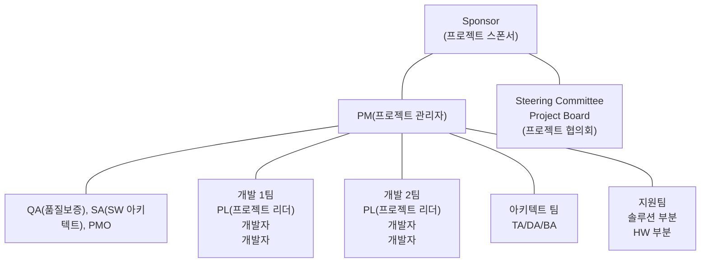

[그림 19] 프로젝트 수행 조직도

프로젝트 수행 조직은 프로젝트 관리자(PM, Project Manager)와 각 개발팀을 이끄는 프로젝트 팀장(PL, Project Leader), 개발자, 프로젝트 관리자의 직속 스태프인 품질보증 담당(QA, Quality Assurance), 아키텍트 지원 SA(Software Architect), 사업관리 지원 PMO(Project Management Office), 프로젝트를 지원하는 지원조직(UI 디자인팀, 테스트 조직 등), 아키텍트 팀, PM을 포함하여, 프로젝트의 범위나 일정상의 변경 같은 상위 의사결정을 지원하는 운영위원회 및 스폰서 등이 있다. 물론 프로젝트 수행 조직은 개별 프로젝트마다 목표와 성격에 따라 달라질 수 있다.

#### 나) 프로젝트 관리자의 책임과 역할

“프로젝트 관리자란 누구를 말하며, 그는 프로젝트에서 무엇을 하는 사람일까?”

'프로젝트 관리자는 프로젝트에 대한 전체범위와 일정을 책임을 지고 있는 사람이다. 즉 프로젝트 초기 단계부터 종료 시점까지 품질과 이해관계자에 대한 이슈와 위험의 해결뿐 아니라 프로젝트 진행률 전체를 관할하며 의사소통 하는 담당자’라고 할 수 있겠다. 프로젝트 관리자가 하나의 프로젝트를 수행하기 위해서는 다음의 3가지 구분된 역량을 이해하고, 수행할 수 있어야 한다.

<!-- PDF page: 072 -->

〈표 34〉 프로젝트 관리자의 역량 분류

<table>
<tr><th>구분</th><th>분류</th><th>세부분야</th></tr>
<tr><td rowspan="4">프로젝트관리 지식 역량</td><td>프로젝트관리 도구에 관한 지식</td><td>• 프로젝트관리 프로세스의 활용과 템플릿, 도구 사용에 대한 기본지식 • 프로젝트 활동의 프레임워크 제공 • 계획에 맞게 작업 진행관리</td></tr>
<tr><td>프로젝트영역에 관한 지식</td><td>• 범위, 일정, 원가, 품질, 인적자원, 의사소통, 위험, • 구매관리 및 통합관리, 형상 변경 및 계약 관리에 대한 지식</td></tr>
<tr><td>문제해결 능력</td><td>• 프로젝트 이슈 사항에 대한 해결능력</td></tr>
<tr><td>관리수행 경험</td><td>• 해당 업무의 경험 및 프로젝트관리 수행경험</td></tr>
<tr><td rowspan="2">기술 역량</td><td>프로젝트 관련 기술 지식</td><td>• 프로젝트 관련 현업 업무 및 프로세스에 관한 이해, 프로젝트 관련 실무 경험과 지식</td></tr>
<tr><td>정보기술 동향</td><td>• 정보기술의 포괄적 지식, 정보 산업 시장동향 • 정보기술 제품의 추이, 정보산업 관련 제도 • 법률 및 컴플라이언스(Compliance) 지식</td></tr>
<tr><td rowspan="3">의사소통 역량</td><td>협상력</td><td>• 프로젝트 논쟁에 대한 해결 능력, 갈등중재 • 프로젝트 승인자 및 상위 권한자와 협상력 기술</td></tr>
<tr><td>의사소통</td><td>• 팀을 효과적으로 이끌 수 있는 지도력을 발휘하고 팀원과 이해관계자, 고객과의 의사소통</td></tr>
<tr><td>인적자원 관리</td><td>• 팀원들을 효과적으로 운영 효율화 관리 능력</td></tr>
</table>

#### 다) 프로젝트 전담조직(PMO)

수많은 기업들이 공통적으로, 어떻게 하면 전사적으로 프로젝트 관리를 잘할 수 있을까?라는 고민을 수십 년 동안 해오고 있다. 이를 위해 만든 프로젝트 전담조직을 PMO(Project Management Office)라고 부른다.

국내에서 PMO는 전자정부법 64조의 2 “전자정부사업관리의 위탁” 규정에 따라 전자정부사업을 효율적으로 수행하기 위해 전문지식과 기술능력을 갖춘 자에게 위탁하는 제도로 기능하고 있다. 발주자의 전문성을 보완하는 입장에서 프로젝트 전반에 대한 관리감독, 이슈중재와 컨설팅의 역할을 수행하고 있다.

PMO는 비가시적이고 높은 신뢰도가 요구되는 정보화 사업의 경우 사전진단, 철저한 프로젝트 단계별 계획수립, 정량적 공정관리, 주기적 의사소통과 산출물 품질확보 등을 위해 필요하다.

PMO는 다음과 같이 PMO 타입, PMO 책임과 역할, 프로젝트의 시간 투여, PM의 Skill 구분에 따라 다음과 같이 4개의 유형으로 분류할 수 있다.

<!-- PDF page: 073 -->

PMO 주요 Model

| 구분 | 유형 |
| --- | --- |
| PMO 조직 위치 구분 유형 — PMO Type | Internal(내부조직구성) External(외부조직구성) Combined(Hybrid–혼합유형) |
| PMO R&amp;R에 대한 구분 유형 — Role &amp; Responsibility | The Weather Station(기상대 모델) Coach(지도 모델) Control Tower(관제탑) |
| PMO의 투여 시간 구분 유형 — PMO Position | Part-time PMO(일시) Full-time PMO(전담) |
| PMO 기술 구분에 따른 유형 — PMO Skill 구분 | 개발, 컨설팅, 프로젝트 평가, 프로세스, 개발방법론, 품질관리, 데이터베이스, 의사소통, 보고 및 조정자 기술 |

[그림 20] PMO 분류

① PMO 타입

PMO 조직이 기업내부 프로젝트 관리자로 구성이 되면 내부조직 구성이 되고, 외부 프로젝트 관리자로 구성이 되면 외부 조직 구성이 되고, 일부 인원이 같이 혼합이 되면, 혼합 유형이 된다.

② PMO 책임과 역할(R&amp;R, Role &amp; Responsibility)

PMO는 기업 조직적인 영향을 받게 된다. 이 영향으로 프로젝트 관리자의 역할과 책임에 따라 촉진자 역할을 수행하는 기상대 모델, 가이드 및 프로세스를 책임지는 지도 모델, 프로젝트에 대한 전반적인 책임과 프로세스에 지대한 영향력을 수행하는 관제탑 모델로 분류할 수 있다.

- 기상대 모델: 소수의 전문 인력으로 운영하고, 진행상황에 대한 정보만 확보 및 제공, 프로젝트 관리지식 보급, 방법론 개발 및 전파

- 코치형 모델: 기상대 모델의 확장 개념, 조직 안에 공통된 방법론과 소프트웨어 도구 사용 전파, 프로젝트 팀의 의사소통을 중계하기 위한 커뮤니티 운영, 프로젝트 성과 기록 및 모니터링, 프로젝트 관리 전문인력 공급

- 컨트롤 타워 모델: 모든 프로젝트에 관여, 의사결정에 깊이 개입, 모든 프로젝트는 동일한 방법론 적용, 중앙집중적 관리, 프로젝트에 투입될 자원을 조정 및 결정

③ PMO Position

프로젝트 관리자가 하나의 프로젝트만 전담해서 집중적으로 관리할 수도 있지만, 한 명의 프로젝트 관리자가 2~3개의 프로젝트를 동시에 맡을 수도 있다. 이때, 전담하는 경우를 전담(full-time) 유형, 복수 프로젝트를 같이 관리하는 경우를 일시 (part-time) 유형으로 분류한다.

④ PMO 기술유형

PMO는 프로젝트 관리자들로 이루어진 조직이고, 개별 프로젝트 관리자는 개발, 컨설팅, 프로젝트 평가, 데이터베이스, 품질관리, 개발방법론 등의 분야별 전문가이다. 구성된 프로젝트 관리자의 전문분야에 따라 PMO 조직의 기술유형이 결정 된다.

<!-- PDF page: 074 -->

[참고 및 추천 자료]

[1] Fred Brooks, “The Mythical Man–Month”, Addison–Wesley, 1975.

[2] 강정배, 서정훈, 이지현, “PMP 바이블”, 한빛미디어, 2015.

[3] 강정배, 서정훈, 이지현, “인사이트 프로젝트 관리”, 서울: 한국생산성본부, 2012.

[4] Project Management Institute, “A Guide to the Project Management Body of Knowledge”, 5e., PA: Project Management Institute, 2013.

[5] “http://cafe.naver.com/81th.cafe”, KPC 기술사회

[6] 프로젝트관리 표준(ISO 21500) 이행가이드, 산업통상자원부 기술표준원, 2013.

[7] [전문가기고] 정보시스템 감리와 PMO논쟁, 해결책은? 디지털데일리 강희석, 2018.

<!-- PDF page: 075 -->

## VIII. 프로젝트 프로세스와 관리

### 최근 동향 및 주요 이슈

프로젝트관리 프로세스는 정해진 한가지 방법으로 모든 프로젝트에 적용할 수는 없다. 프로젝트의 환경과 조건에 따라 적합한 프로젝트 생명주기와 관리 프로세스를 적용해야 한다. 최근에 활발하게 적용하고 있는 애자일 프로세스에 대해서도 이해하고 적용할 수 있는 능력을 기르는 것이 중요하다.

### 학습 목표

1. 프로젝트 사전준비 및 착수를 통한 프로젝트 생명주기를 설명할 수 있다.

2. 프로젝트관리 방법론을 설명할 수 있다.

3. 애자일 프로세스 개념과 수행방법을 설명할 수 있다.

### 개념 요약

- 프로젝트 생명주기: 예측 생명주기, 반복적 생명주기, 적응적 생명주기

- 프로젝트 프로세스 그룹: 착수 프로세스, 계획 프로세스, 실행 프로세스, 감시 및 통제 프로세스, 종료 프로세스

- 프로젝트관리 방법론: PMBOK, Iso 21500, PRINCE2

- 애자일 프로세스 유형: 스크럼, XP(eXtreme Programming), Kanban, Lean

- 애자일 프로세스 수행 방법: 백로그, 번다운 차트, 스크럼 마스터, 스프린트, 회고, Daily Meeting

<!-- PDF page: 076 -->

### 실무 미리보기

프로젝트관리 방법론과 프로세스들은 기업의 조직구조나 적용방법에 따라 영향을 받는다.

폭포수 방법론은 하나의 프로젝트를 단일 단계로 수행하는 정형적인 방법론인데 단일 단계를 중첩하거나 반복함으로써 반복적 생명주기나 적응적 생명주기로 발전할 수 있다.

폭포수 방법론이 계획 중심이라면 애자일은 가치 중심의 방법론이다. 스크럼은 형식보다는 적극적인 마음가짐과 사람들 간의 소통의 문제로 프로젝트 생산성을 향상하게 된다.

국내 개발환경의 경우, 발주자와 수주자 사이의 갑을 관계나 수직적 개발환경에서 애자일 방법론 적용에 어려움을 겪는 경우도 있지만, 게임회사나 스타트업 중심으로 스크럼이나 칸반 등을 활용하는 사례도 점차 증가하고 있다.

### 01 프로젝트 생명주기

#### 가) 프로젝트 생명주기

프로젝트는 일정한 주기를 가지고 있는데, 정상적인 프로젝트는 착수, 계획, 실행, 감시 및 통제, 종료의 5개 프로세스로 진행되고, 중간에 프로젝트가 멈추게 되면 전체 프로세스에서 바로 종료 프로세스를 수행하게 된다.

<!-- PDF page: 077 -->

<!-- 원본의 연속 곡선 그래프는 텍스트 도식으로 재현하지 않음. -->

프로세스 상호관계 레벨

착수 프로세스 그룹, 계획 프로세스 그룹, 실행 프로세스 그룹, 감시 및 통제 프로세스 그룹, 종료 프로세스 그룹

착수 — 계획 — 실행 — 종료

[그림 21] 프로젝트 관리 프로세스 그룹 연관 관계

착수, 계획, 실행, 종료의 프로세스는 각 해당 단계에서 주로 진행되는데 비해 감시 및 통제 프로세스는 생명주기의 전단계에 걸쳐서 고르게 진행된다.

〈표 35〉 프로젝트관리 프로세스 그룹

<table>
<tr><th>프로세스 그룹</th><th>설명</th></tr>
<tr><td>착수 프로세스</td><td>공식적인 프로젝트 시작, 이해관계자 식별, 프로젝트 관리자 임명, 프로젝트 헌장 개발을 수행</td></tr>
<tr><td>계획 프로세스</td><td>프로젝트 목표달성 및 산출물을 작성하기 위한 모든 계획 활동</td></tr>
<tr><td>실행 프로세스</td><td>프로젝트관리 계획에서 정의한 작업들을 완료하기 위해 수행하는 프로세스</td></tr>
<tr><td>감시 및 통제 프로세스</td><td>프로젝트 성과 및 진행상황을 추적하고 조정을 수행하는 프로세스</td></tr>
<tr><td>종료 프로세스</td><td>계약 의무 등 모든 활동을 끝마치기 위한 프로세스</td></tr>
</table>

생명주기는 하나의 서비스나 제품이 발표된 때로부터 더 이상 사용되지 않게 되거나 시장에서 폐기될 때까지의 기간을 의미한다. 프로젝트의 생명주기는 프로젝트 착수, 계획, 실행, 감시 및 통제, 종료까지의 구간을 가리킨다.

프로젝트 생명주기를 관리하는 이유는 프로젝트 관리를 공학체계적으로 접근하기 위함이다. 생명주기를 세부단계로 구분하고, 각 단계별로 투입물과 기술 및 도구, 산출물을 구분하여 체계적으로 관리함으로써 전체 프로젝트의 관리를 원활히 하기 위함이다. 생명주기는 단순히 전체 과정을 단계별로 표현하여 공학체계적 접근을 위한 토대를 마련한 것이고, 각 단계별 투입물과 기술, 도구, 산출물을 구체적으로 명시한 것이 방법론이라 할 수 있다.

예측 생명주기는 계획 중심의 생명주기로 프로젝트 범위, 일정, 원가에 대한 지식이 경험적으로 축적되어 있어 프로젝트 초기에 결정하게 된다. 주로 제품개발, 건축 프로젝트에서 기술이나 경험이 많이 축적된 경우에 적용한다. 프로젝트 착수단계에서 프로젝트 전체 범위를 정의하고 일정과 원가를 계획에 맞게 진행하는 주기이다.

반복적 생명주기는 제품의 일부분을 나누어 반복적으로 개발하여 최종 제품을 완성하는 생명주기 모델이다. 반복적 생

<!-- PDF page: 078 -->

명주기는 증분형과 진화형으로 나눌 수 있다.

- 증분형 생명주기: 프로젝트 범위를 N단계로 분할하여 프로젝트를 점진적이고 반복적인 병렬로 중첩해서 수행한다.

- 진화형 생명주기: 프로젝트 단계를 여러 단계로 구분하고 반복 자체를 순차적으로 진행한다.

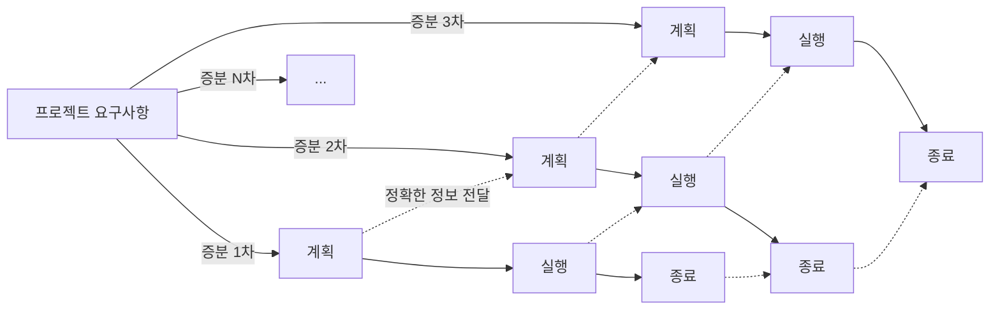

[그림 22] 증분형 생명주기

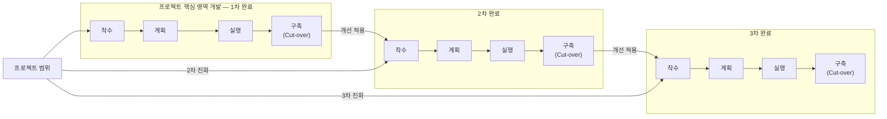

[그림 23] 진화형 생명주기

적응적 생명주기는 외부 변화에 민첩하게 반응하는 애자일 프로세스를 얘기하는 것이며 프로젝트의 가치에 맞게 요구사항 변화에 유연하게 대응하는 것이 목적이다.

#### 나) 프로젝트 기획 및 착수

프로젝트가 계약되어 착수되기 이전의 단계를 간단히 살펴보자면, 크게 기획단계와 발주단계, 계약단계를 거치게 된다.

기획단계에서는 해당 프로젝트의 타당성 분석, 예산편성 등의 선행 작업이 수행된다. 발주단계에서는 사업범위 정의 및 제안요청서(RFP, Request For Proposal) 작업이 이루어지고, 필요 시 제안요청 설명회를 개최할 수 있다. 이후 계약단계에서는 사업자를 선정하기 위해 제출된 제안서를 평가하고, 기술협상 등을 통하여 최종 사업자선정 및 계약이 이루어지게 된다.

<!-- PDF page: 079 -->

신규 프로젝트의 기획 시에는 조직의 전사적 전략목표 달성을 위해 관리 중인 포트폴리오에 따라 단위 프로젝트나 프로그램을 승인하도록 해야 한다. 또한, 유사한 연관성을 가진 프로젝트들이 통합관리되는 프로그램이 존재하는지 검토하여 해당 프로젝트에 대한 상위 수준의 계획을 검토해야 한다.

프로젝트 초기 계획단계의 중요성을 잘 보여주는 곡선으로 아래 그림과 같은 Project Cost/Efforts Curve가 있다. 초기 단계의 계획수립에 충분한 시간을 투입한다면 프로젝트 후반부로 갈수록 불필요한 혼란을 예방할 수 있다. 왜냐하면, 초기 계획수립 시, 발생가능한 다양한 리스크나 이슈 발생을 예측하고, 대응방안을 미리 수립하거나, 예측치 못한 문제 발생 시 처리 프로세스 등을 수립해 놓는다면, 추후 프로젝트 진행과정에서 발생하는 다양한 리스크나 이슈 처리 시 효과적으로 대응할 수 있다. 반면에 초기 계획수립을 부실하게 진행하고 바로 개발에 착수하는 경우, 처음에는 프로젝트의 진행이 빠른 듯 보이지만 후반부로 가면서 기하급수적으로 프로젝트의 혼란이 초래된다. 많은 프로젝트들이 초기 계획단계를 등한시하고 바로 실행단계로 들어감으로써 결과적으로 전체 프로젝트를 실패로 이끄는 경우가 많다.

<!-- 원본의 연속 곡선 그래프는 텍스트 도식으로 재현하지 않음. -->

Cost / Efforts — Time

Good Planning, Poor Planning

[그림 24] Project Cost/Efforts Curve

개발사 입장에서 프로젝트 착수를 위해서는 사전에 제안작업을 진행한다. 제안작업이란, 발주사의 제안요청서에 근거하여 사업을 수주하기 위해 제안 개요, 제안사 소개, 사업수행 내용, 사업관리 등의 내용을 작성하여 발주사에 제출하는 행위이다. 이후 제출된 제안서에 대한 평가를 받은 후, 우선협상 대상자로 선정이 되면, 기술협상을 거쳐 계약을 체결하게 되고 프로젝트에 착수하게 된다.

<!-- PDF page: 080 -->

### 02 프로젝트관리 방법론

#### 가) 프로젝트관리 방법론

포괄적인 프로젝트관리 방법론으로는 대표적으로 PMBOK, ISO 21500, PRINCE2 등이 있다. 가장 대표적인 PMBOK(Project Management Body of Knowledge)는 미국의 비영리 프로젝트관리 조직인 PMI(Project Management Institute)에 의해서 발간된 프로젝트관리 지식체계이다. 2017년 9월에 PMBOK 6판이 발표되었으며, 착수, 계획, 실행, 감시 및 통제, 종료의 5개 프로세스 그룹과 통합, 범위, 원가, 일정, 품질, 위험, 의사소통, 자원, 조달, 이해관계자 관리의 10개 지식영역, 총 49개의 프로세스로 구성된다. PMBOK 6판에서는 프로젝트 관리자의 Talent Triangle(Technical Project Management, Leadership, Strategic and Business Management)이 추가되었다. PMI에서는 프로젝트관리 전문가 인증으로 PMP(Project Management Professional) 자격 체계를 운영하고 있다.

ISO 21500는 국제표준화기구인 ISO(International Standard Organization)에서 제정한 프로젝트관리 표준이다. 전체적인 내용은 PMBOK과 유사하다.

PRINCE2(PRojects IN Controlled Environments)는 PMBOK과 달리 영국에서 개발되어 유럽과 호주 등에서 주로 사용되는 구조화된 프로젝트관리 방법론이자 프로젝트관리 전문가 자격증이다. 7개의 원칙(지속적 비즈니스 타당성, 경험을 통한 학습, 정의된 역할 및 책임, 단계별 관리, 예외에 대한 대처, 제품 자체에 집중, 맞춤형 프로젝트관리), 7개의 주제(비즈니스 내용, 조직, 품질, 계획, 위험, 변화, 진행), 7개의 프로세스(프로젝트 계획, 프로젝트 착수, 프로젝트 지휘, 단계별 통제, 산출물 관리, 프로젝트 범위관리, 프로젝트 종료)로 구성되어 있다. PMBOK은 프로젝트 관리자 중심으로 프로젝트관리를 기술한다면, PRINCE2는 프로젝트 관리자 외에 다양한 참여자와 산출물 중심으로 프로젝트 관리를 보다 실무적으로 다루고 있는 특징이 있다.

프로젝트관리 방법론은 프로젝트 수명주기를 정의하고, 정의된 각 단계별로 공학체계적 접근을 통하여 투입물(Input), 도구 및 기술(Tools &amp; Technology), 산출물(Outputs)을 구체적으로 명시하고 관리하여, 한정된 자원으로 프로젝트 목표를 달성할 수 있도록 지원한다. 최근에는 유연하고 실용적인 방식으로 프로젝트관리를 위한 애자일 방법론이 많은 관심을 끌고 있다.

#### 나) 애자일 방법론

애자일 방법론은 기존의 전통적인 방법론들이 철저한 사전 계획과 명시적인 산출물들을 기반으로 진행되었던 것에 비해 일정한 주기를 가지고 지속적인 프로토타입을 만들어내며 적시에 요구사항을 추가하고 수정하여 진행해 나가는 적응형 스타일이다.

애자일 개발방법론의 취지와 정신은 애자일 헌장(Agile Manifesto)에 잘 나타나 있다.

① 애자일 소프트웨어 개발 선언

- 공정과 도구보다 개인과 상호작용을

- 포괄적인 문서보다 작동하는 소프트웨어를

- 계약 협상보다 고객과 협력을

- 계획을 따르기보다 변화에 대응하기를 가치있게 여긴다.

이런 애자일 정신에 따라서 스크럼, XP, 칸반(Kanban) 같은 다양한 방법론들이 출현하였다. 가장 대표적인 애자일 개발

<!-- PDF page: 081 -->

방법인 스크럼은 1995년에 켄 슈와버와 제프 서덜랜드가 소프트웨어 개발에 소개하면서 처음 나타났다. 프로젝트관리를 위한 상호 점진적 개발방법론이다.

스크럼 프로세스는 스프린트 계획, 스프린트, 일일 미팅, 스프린트 리뷰, 회고로 진행되며, 주요 산출물은 제품 백로그, 스프린트 백로그, 번다운 차트가 있다.

반복적인 리뷰를 통해서 프로젝트 품질을 관리하게 되는데, 이를 위해 일일 미팅이나 스프린트 단위의 리뷰 회의를 활용한다. 대표적인 산출물로는 번다운 차트가 있다.

#### 다) 프로젝트관리 영역

PMBOK과 ISO 21500 관리방법론 기반으로 프로젝트관리는 5개의 프로세스 그룹과 10개의 지식 영역(Knowledge Areas), 49개의 세부 프로세스로 나누어진다. 10개의 지식영역은 다음 그림과 같다.

통합관리(Project Integration Management)

| 범위관리 | 일정관리 | 원가관리 | 자원관리 |
| --- | --- | --- | --- |
| Scope Management | Schedule Management | Cost Management | Resource Management |

| 의사소통관리 | 품질관리 | 조달관리 | 위험관리 | 이해관계자관리 |
| --- | --- | --- | --- | --- |
| Communication Management | Quality Management | Procurement Management | Risk Management | Stakeholders Management |

[그림 25] 프로젝트 지식 영역

지식영역별 간단한 설명과 더불어 주요 지식영역인 범위관리, 일정관리, 원가관리, 품질관리, 위험관리에 대해서 다음 장부터 자세히 살펴보기로 한다.

〈표 36〉 지식영역별 설명

<table>
<tr><th>지식영역</th><th>설명</th></tr>
<tr><td>통합관리</td><td>프로젝트 관리 프로세스 그룹 내에 있는 프로세스와 관리 활동들을 파악, 정의, 조정하기 위해 필요한 프로세스와 활동들을 관리하는 핵심 지식영역</td></tr>
<tr><td>범위관리</td><td>프로젝트를 통해 제공되는 제품과 서비스의 합으로 고객의 요구사항을 정의하고, WBS(Work Breakdown Structure)를 작성하는 등 프로젝트 관리 계획 수립 및 통제의 출발 활동들을 관리하는 핵심 지식영역</td></tr>
<tr><td>일정관리</td><td>고객과 합의한 기간 내에 프로젝트를 완료하는 것을 목표로 자원을 효율적으로 배분하고 프로젝트 활동들을 도출하는 등 각 활동들의 관계를 파악하여 일정표를 개발하는 핵심 지식영역</td></tr>
<tr><td>원가관리</td><td>승인된 예산 내에서 프로젝트를 완료하기 위해 원가에 대한 계획, 산정, 예산수립, 통제 활동들을 관리하는 핵심 지식영역</td></tr>
<tr><td>자원관리</td><td>프로젝트에 활용가능한 자원을 적절히 확보하고 적기에 투입하기 위해 수행하는 일련의 활동들을 관리하는 지식영역</td></tr>
<tr><td>의사소통관리</td><td>이해관계자들에게 프로젝트 정보 요구사항들을 생성, 수집, 저장, 분배, 통제, 모니터링 하기위해 수행하는 일련의 활동들을 관리하는 지식영역</td></tr>
</table>

<!-- PDF page: 082 -->

<table>
<tr><th>지식영역</th><th>설명</th></tr>
<tr><td>품질관리</td><td>수행 중인 프로젝트의 요구사항들을 충족시키기 위한 품질계획, 품질보증, 품질통제와 관련하여 수행하는 일련의 활동들을 관리하는 지식영역</td></tr>
<tr><td>조달관리</td><td>프로젝트에 필요한 제품, 서비스 등을 외부에서 구매계약, 변경통제, 계약종료까지 일련의 활동들을 관리하는 지식영역</td></tr>
<tr><td>위험관리</td><td>프로젝트에 발생 가능한 위험을 식별, 분석하여 대응하고 프로젝트의 성공가능성을 높이는 일련의 활동들을 관리하는 지식영역</td></tr>
<tr><td>이해관계자관리</td><td>프로젝트에 영향을 미치는 모든 사람이나 조직을 식별하고, 그들의 기대사항이나 관심사를 효과적으로 관리하기 위한 전략을 개발하는 일련의 활동들을 관리하는 지식영역</td></tr>
</table>

[참고 및 추천 자료]

[1] 강정배, 서정훈, 이지현, “PMP 바이블” 한빛미디어, 2015.

[2] 강정배, 서정훈, 이지현, “인사이트 프로젝트 관리”, 서울: 한국생산성본부, 2012.

[3] Project Management Institute, “A Guide to the Project Management Body of Knowledge”, 6th Project Management Institute, 2017.

[4] “http://cafe.naver.com/81th.cafe”, KPC 기술사회

[5] 프로젝트관리 표준(ISO 21500) 이행가이드, 산업통상자원부 기술표준원, 2013.

[6] 위키피디아, https://ko.wikipedia.org/wiki/PRINCE2#cite_note-1

<!-- PDF page: 083 -->

## IX. 범위관리

### 최근 동향 및 주요 이슈

프로젝트 실패의 가장 큰 원인은 반복적인 요구사항 변경으로 인한 범위 조정이다. 프로젝트 중반 이후 빈번한 범위 조정은 일정을 지체시키고, 이는 다시 투입 인력을 늘리거나 야근 등과 같은 원가 부담을 초래한다. 프로젝트의 성공적인 수행을 위해, 요구사항을 수집하고, 범위를 정의하고, 해당 범위가 타당한지 검증하고 통제하는 범위관리 프로세스를 이해할 필요가 있다.

### 학습 목표

1. 범위관리의 개념과 프로세스를 설명할 수 있다.

2. 작업분류체계(WBS: Work Breakdown Structure)의 개념을 설명할 수 있다.

### 핵심 키워드

- 범위관리 프로세스: 범위관리 계획수립, 요구사항 수집, 범위 정의, 작업분류체계 작성, 범위 확인, 범위 통제

- 작업분류체계 작성기법: 분할, 연동 계획

- 작업분류 체계 구성요소: 작업 패키지(Work Package), 작업분류체계 코드(Code of Account), 작업분류체계 사전(WBS Dictionary)

<!-- PDF page: 084 -->

### 실무 미리보기

종종 작업분류체계(WBS: Work Breakdown Structure)를 일정관리 산출물 혹은 일정관리 도구로 오해하는 경우가 있다. 이는 WBS의 구성요소인 작업 패키지(Work Package, 작업의 최하위 단위)에 시작일과 종료일을 명시하기 때문인데, 이렇게 계획을 명시한 WBS를 가지고 매번 진도를 체크하면 일정관리 산출물로 오해하기 쉽다. 더군다나 많이 사용하는 M사의 일정관리 도구는 아예 WBS를 파일 형태로 업로드하여 일정을 관리하는 구조로 되어 있어 일정관리를 위해 WBS가 존재한다고 생각한다고 해도 이상할 일이 아니다.

하지만, WBS는 PMI(Project Management Institute)의 PMBOK(Project Management Body of Knowledge)에서는 "Create WBS”라고 아예 절차 중 하나로 포함되어 있으니 범위관리 산출물임은 분명하다.

그렇다면, 'WBS가 범위관리 산출물이냐 일정관리 산출물이냐’를 구분하는 것이 왜 중요한 것일까? 그 이유는 바로 WBS가 범위관리를 수행하는 데 매우 중요한 역할을 하기 때문이다. 프로젝트에서 범위가 변경될 때 즉, 요구사항이 변경되거나 추가될 때 가장 먼저 WBS를 들여다 봐야 하는 것이다. 이렇게 WBS를 가지고 변경 관리를 한다는 인식이 있으면 일정, 원가, 품질 등을 연관된 관리 포인트를 한꺼번에 관리할 수 있기 때문이다.

이제부터 WBS를 일정관리가 아닌 범위관리의 도구로 적극 활용해 보자!

### 01 범위관리 개념과 프로세스

#### 가) 범위관리 개념

프로젝트 관리의 세 가지 중요한 지식 영역 중에 첫 번째가 범위관리다. 프로젝트는 유일하고 일시적이면서 목표달성을 위해 수행하는 활동이므로 프로젝트에서 달성해야 하는 목표와 범위가 분명해야 성공적인 프로젝트를 수행할 수 있다.

프로젝트는 해야 할 것을 분명하게 수행하고 불필요하거나 하지 않아도 되는 것은 고객이 요구하더라도 과감히 제외하는 것이 필요하다. 프로젝트 관리자로서 첫 번째 성공요소는 해야 할 범위를 분명하게 구분 짓고 정의하는 일이다.

<!-- PDF page: 085 -->

범위란 “프로젝트를 통해 제공되는 제품과 서비스의 합”으로서, 프로젝트를 성공적으로 완료하기 위해 요구되는 업무의 범위 또는 업무 자체를 의미한다. 범위는 프로젝트 범위와 제품 범위로 구분된다.

- 범위 = 프로젝트 범위 + 제품 범위

프로젝트 범위는 지정된 특징 및 기능의 제품, 서비스 결과물을 만들기 위해 필요한 모든작업을 말한다. 제품 범위는 제품, 서비스, 결과물을 구분짓는 제품의 특징, 기능을 말한다. 프로젝트 범위는 제품과 서비스를 제공하는 방법, 즉 HOW 측면에 대한 것이고, 제품 범위는 제품과 서비스 그 자체, 즉 WHAT 측면에 대한 것이다. 프로젝트 범위와 제품 범위별로 범위 완료의 판단 기준은 서로 다르다. 프로젝트 범위의 완료는 프로젝트 계획을 기준으로 측정되며, 제품 범위의 완료는 제품 요구사항을 기준으로 측정된다.

#### 나) 범위관리 프로세스

범위관리 프로세스는 범위관리 계획, 요구사항 수집, 범위정의, 작업분류체계(WBS) 작성, 범위확인, 범위통제의 순서로 진행된다.

① 범위관리 계획

- 범위관리 계획의 개념

프로젝트 범위는 프로젝트의 최종 산출물인 제품, 서비스를 고객에게 인도하기 위하여, 프로젝트 수행에 필요한 작업들을 말하며, 프로젝트 범위관리는 프로젝트 범위를 정의하고, 확인하고, 통제하기 위한 프로젝트 범위관리 계획서를 개발 하기 위한 프로세스이다.

- 프로젝트 범위관리 계획서

프로젝트 범위관리 계획서는 프로젝트 단계별로 진행하는 프로세스와 각 프로세스의 구현 수준을 정의한 것으로서 프로젝트 범위관리 계획서의 주요항목은 다음과 같으며, 고객과 서비스 구축 업체 간에 범위계획이 공유되어야 한다.

- 프로젝트 범위 기술 절차
- 작업분류체계(WBS) 작성 방법

- 고객에게 전달할 인도물에 대한 검증 및 확인 기준

- 범위 변경 요청 형식 및 절차 등에 대한 설명

② 요구사항 수집

프로젝트 현장에서는 고객이 무엇을 필요로 하는지, 또한 왜 필요하다고 생각하는지를 찾아내는 것이 중요하다. 다음은 요구사항 수집이 왜 중요한지에 대한 1970년대 F-16 전투기 개발 사례이다.

당시 F-16 전투기 요구사항은 속도가 마하 2.5가 되어야 한다고 하였다. 하지만 전투기는 설계상 속도를 마하 2 이상 낼 수 없었다. 전투기 설계 디자이너는 왜 이 요구사항이 나왔는지 속도에 대한 요구사항을 명확히 하고자 미 공군에 확인하였고, 미 공군으로부터 교전 능력을 높이기 위해서라는 답변을 받았다. 디자이너는 교전 능력을 높이기 위해서라면 속도가 아닌 기동성을 향상하는 것으로도 가능할 것이라 판단하였고, 플라이 바이 와이어, 일체형 캐노피, 디지털 항전장비 등을 적용함으로써 궁극적으로 ‘교전 능력 향상’이라는 요구사항을 달성할 수 있었다. 반면 비슷한 시기, 소련의 전투기 사례도 있었다. 소련 전투기의 요구사항은 세계에서 가장 빠른 전투기였다. 마하 3.25의 속도로 제작된 전투기는 도저히 외부에서 격추할 수 없을 정도로 빨랐지만, 속도만 빠를 뿐 비싸고, 수명이 짧으며, 전투 성능이 떨어져 80년도에 조기 퇴역하게 되었다. 요구사항 수집이라고 하면 개발해야 하는 대상(What)을 위주로 수집하게 되는데, 물론 '무엇(What)'도 중요하지만 '왜 (Why)' 개발해야 하는지도 이해하면서 수집하는 것은 더 중요하다. 그렇게 되면 불필요한 개발을 막고 중요한 것에 더 집중할 수 있다.

<!-- PDF page: 086 -->

③ 범위 정의

범위 정의 활동은 요구사항 수집 이후에 프로젝트 주요 범위를 식별하고 프로젝트에 포함될 비즈니스 기능에 대한 공통의 이해를 기반으로 범위를 정의하는 프로세스이다. 범위 정의는 프로젝트와 제품에 대한 상세한 범위 기술서(Scope Statement)를 작성하는 프로세스로 범위 기술서에는 프로젝트의 산출물과 인수기준을 명시하고 프로젝트 제외사항, 제약 사항, 가정사항 등의 특성을 포함한다. 즉 프로젝트 범위와 외부와의 경계를 명확히 구분하는 활동이다.

범위 정의 시 요구조건은 다음과 같다.

- 명확해야 한다(Clear Scope): 프로젝트 범위는 명확하게 정의되어야 한다. 명확하다는 것은 보는 사람에 따라 다르게 해석되지 않는다는 뜻이다. 명확성은 나머지 요구조건인 완전성, 합의, 관리용의성의 기본이 된다.

- 완전해야 한다(Complete Scope): 완전하다는 것은 누락되었거나, 지나치거나, 겹치는 부분이 없어야 한다는 뜻이다.

- 합의되어야 한다(Agreed—upon Scope): 이해관계자에 따라 범위에 대한 의견이 달라지는 경우가 많이 있다. 문제는 프로젝트 실행 중에 프로젝트 범위에 대한 이해관계자의 의견 차이가 발생하는 경우 이를 조정하는 과정이 여러 가지 부작용을 유발한다는 점이다. 따라서, 프로젝트의 전체 범위는 실행하기 전에 모든 이해관계자의 의견을 수렴하여 합의하는 과정을 거쳐야 한다.

- 관리가 쉬워야 한다(Manageable Scope): WBS는 다른 계획의 기본 틀을 제공한다. 따라서, 범위관리가 쉽도록 정의되지 않으면 일정, 예산 등 다른 분야의 계획을 통합하는 것이 어려워진다. 관리가 쉬워지도록 정의되어야 한다는 말은 구체적으로 다음과 같은 의미를 지닌다.

- 기간과 비용을 정확히 추정할 수 있어야 한다.

- 담당자를 명확히 지정할 수 있어야 한다.

- 성과를 현실적으로 평가할 수 있어야 한다.

④ 작업분류체계(WBS) 작성

WBS는 프로젝트의 산출물과 전체 범위를 관리 가능한 요소들로 분해하여서 작성하는 산출물이다. WBS 작성은 범위관리 뿐 아니라, 프로젝트 전체 활동 중에서도 가장 중요하다고 볼 수 있다. 프로젝트 팀이 달성해야 할 작업들을 세분화하고, 수행단계 별로 산출물을 정의함으로써 업무가 누락되는 것을 방지하고, 업무 간의 연관성을 파악할 수 있으며 이해관계자, 스폰서와 일관된 의사를 소통할 수 있다.

⑤ 범위 확인

범위 확인은 고객에게 인도할 산출물에 대해서 고객 혹은 프로젝트 상위 조직장에게 승인을 확인하는 프로세스이다. 프로젝트 범위에 대한 공식적인 확인을 위해서는 프로젝트 팀의 검사(Inspection) 및 기술적인 검토를 통해, 제품 에러, 규격, 표준에 맞지 않는 것들을 찾아내고, 확인된 결과를 산출물로 도출한다.

- 검사(Inspection)

프로젝트에서 수행되는 작업과 인도될 산출물이 요구사항과 제품 인수 기준을 만족하는지 확인하기 위해 수행하는 성과에 대해 측정, 검수, 확인하는 활동을 의미한다. 공식적인 절차를 가지는 검사는 검토(Review), 검토회의(Walkthrough) 등이 있다.

⑥ 범위 통제

프로젝트 상태와 제품 범위를 모니터링하고 공식적인 절차에 따라 관리하는 프로세스이다. 프로젝트 전반에 걸쳐 요청된 변경사항과 권고된 시정사항, 예방조치가 처리되도록 통제한다. 프로젝트 설계 및 분석 단

<!-- PDF page: 087 -->

계에서 범위정의를 통해 만들어진 범위기준선에 대한 변경요청은 실무에서 빈번하다. 범위 변경은 일정 및 원가와 밀접한 관련이 있기 때문에 해당 변경요청들은 프로젝트 변경통제 위원회(CCB, Change Control Board)에 보고되고, 프로젝트 전반에 걸친 영향을 검토하고 공식적인 절차에 따라 승인되고, 처리되어야 한다.

### 02 범위관리 기법

#### 가) 작업분류체계(WBS: Work Breakdown Structure)

범위관리를 위해 일반적으로 작업분류체계를 작성한다. 작업분류체계 작성을 위해서는 고객의 요구사항 수집이 선행되고, 요구사항 정의서가 작성되어야 한다.

요구사항은 일반적으로 아래와 같은 방법을 통해 수집된다.

〈표 37〉 요구사항 수집 기법

<table>
<tr><th>도출 기법</th><th>설명</th></tr>
<tr><td>인터뷰 기법</td><td>• 개인 및 그룹을 대상으로 필요한 정보를 구두로 도출하는 체계적인 요구사항 도출 접근방법</td></tr>
<tr><td>프로토타이핑 기법</td><td>• 개발하고자 하는 시스템 또는 그 일부분을 신속하고 개략적으로 구축하는 기법 • 사용자가 이해하고 대응하는 목적으로 명세서보다 프로토타입이 더 우수</td></tr>
<tr><td>사회자 회의 기법</td><td>• 특정 제품, 서비스 및 개선기회에 대한 아이디어를 도출하기 위한 기법 • 회의 사회자가 그룹 토의를 진행함에 있어, 특정 이슈사항에 대한 사전 계획된 내용을 충실히 이행하여 의도한 목적달성을 보증</td></tr>
<tr><td>문서 분석 기법</td><td>• 기존 시스템에 대한 문서 및 관련 자료들을 조사하여 시스템의 요구사항을 도출하는 기법 • 업무계획, 시장조사결과, 계약내용, RFP, SOW, 관련 기록, 기존 업무가이드/절차, 교육자료, 유사 제품 관련 문서, 문제 보고서, 고객 제안 기록 및 기존 시스템 설계서 등 분석</td></tr>
</table>

① 작업분류체계(WBS)의 개념

작업분류체계는 프로젝트 산출물을 중심으로 작업을 분류하고, 관리 가능한 범위로 분할한 계층적 작업 분류표이다. 작업 분류체계에서 각 하위 작업 항목을 작업 패키지(Work package)라고 하는데 인터넷 게시판을 만드는 프로젝트를 예를 들면, ‘글쓰기’, ‘글 삭제하기’, ‘글 수정하기’, ‘파일 업로드’를 작업 패키지로 구분할 수 있다. 다음은 Microsoft Project 프로그램으로 작성한 WBS 작성 사례이다.

작업을 상하 구조 분류

| 번호 | 작업 이름 | 기간 | 시작 | 완료 | 선행 작업 | 자원 이름 |
| --- | --- | --- | --- | --- | --- | --- |
| 1 | IT 역량지수 게시판 프로젝트 | 19 일 | 13-07-25 (목) | 13-08-20 (화) | | |
| 2 | 게시판 만들기 | 19 일 | 13-07-25 (목) | 13-08-20 (화) | | |
| 3 | 글쓰기 | 5 일 | 13-07-25 (목) | 13-07-31 (수) | | |
| 4 | 글 삭제하기 | 2 일 | 13-08-01 (목) | 13-08-02 (금) | 3 | |
| 5 | 글 수정하기 | 2 일 | 13-08-05 (월) | 13-08-06 (화) | 4 | |
| 6 | 파일 업로드 | 10 일 | 13-08-07 (수) | 13-08-20 (화) | 5 | |

<!-- 원본 작업 모드 아이콘은 생략함. -->

[그림 26] WBS 작성예시(인터넷게시판 만들기)

<!-- PDF page: 088 -->

② 작업분류체계(WBS)의 구조

작업분류체계는 트리 구조 형식을 가장 많이 사용하며 마치 부모-자식 간의 관계로 요소들을 표현하여 상하 관계를 직관적으로 파악하기 용이하다.

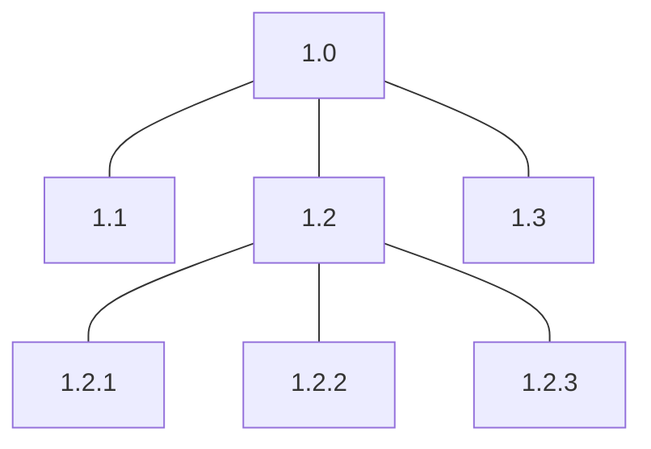

[그림 27] 작업분류체계 구조

③ 작업분류체계(WBS)의 구성 요소

작업분류체계의 구성 요소는 작업 패키지, 식별 번호, WBS 사전, RAM이며 이에 대한 설명은 다음과 같다.

〈표 38〉 작업분류체계의 구성 요소

<table>
<tr><th>구성 요소</th><th>설명</th></tr>
<tr><td>작업 패키지 (Work Package)</td><td>일정을 계획하고 원가를 산정, 감시, 통제할 수 있는 단위로 분할이 완료된 시점의 최하위 단위</td></tr>
<tr><td>식별 번호 (Code of Account)</td><td>작업분류체계의 구성요소에서 넘버링 체계를 가지는 고유한 ID, 이를 통해 작업 패키지에 유일한 번호가 부여됨</td></tr>
<tr><td>WBS 사전 (WBS Dictionary)</td><td>각 작업 패키지의 상세한 내용을 기술한 것(개요, 일정, 책임자, 예산)</td></tr>
<tr><td>RAM(Responsibility Assignment Matrix)</td><td>각 담당자별로 각 단계별 승인자, 품질검토자, 투입물 책임자 등의 기준이 됨</td></tr>
</table>

④ 작업분류체계(WBS)의 작성 방법

작업분류체계는 범위 기술서에 기술된 주요 인도물 및 작업을 식별할 수 있도록 작고, 관리 가능한 작업 패키지 수준으로 세분화하여 작성한다.

〈표 39〉 작업분류체계의 작성 방법

| 작성 원칙 | 설명 |
| --- | --- |
| 산출물 중심 | 업무 범위를 통제하여 관리하기 위한 명확한 실체를 갖는 산출물 중심 |
| 관리 가능 | 작업 성과를 통제하기 용이하게 WBS의 최하위 단위는 통상 80시간(2주) 내외의 기간으로 분할 |
| 상세 세분화 | 프로젝트 수행 인원이 보통 1~2주 안에 처리 할 수 있는 단위로 세분화 |
| 전후관계 정의 | 각 WBS별 선후 관계 및 연관 관계의 파악이 가능하도록 정의 |

<!-- PDF page: 089 -->

[참고 및 추천 자료]

[1] 강정배, 서정훈, 이지현, “인사이트 프로젝트 관리”, 서울: 한국생산성본부, 2012.

[2] Project Management Institute, “A Guide to the Project Management Body of Knowledge”, 5e., PA: Project Management Institute, 2013.

[3] “http://cafe.naver.com/81th.cafe”, KPC 기술사회

[4] Joseph Phillips, “IT Project Management: On Track from Start to Finish”, NY: McgrawHill, 2010.

[5] Kim Heldman, “CompTIA Project+ Study Guide Authorized Courseware”, NJ: Sybex, 2010.

[6] Richard Monson–Haefel, “97 things every Software architect should know”, CA: O’Reilly, 2009.

[7] 김병철, “프로젝트 관리의 이해”, 세화, 2006.

<!-- PDF page: 090 -->

## X. 일정관리

### 최근 동향 및 주요 이슈

자원의 역량을 과신하여 일정 산정을 하는 경우, 프로젝트 중 후반에 일정이 지연될 경우 프로젝트의 납기 준수가 어렵기 때문에 요구사항 범위와 자원의 역량에 맞추어 일정을 산정하여야 한다.

### 학습 목표

1. 일정관리의 개념과 프로세스를 설명할 수 있다.

2. 일정관리 기법에 대해 설명할수 있다.

3. 일정 단축 기법에 대해 설명할 수 있다.

### 핵심 키워드

- 일정관리 프로세스: 일정관리 계획수립, 활동 정의, 활동 순서 배열, 활동 자원 산정, 활동기간 산정, 일정 개발, 일정 통제

- 활동기간 산정 기법: 1점 산정, 3점 산정, 유사 산정, 모수 산정, 전문가 산정

- 일정관리 기법: 임계경로방법(CPM: Critical Path Method), 주공정연쇄기법(CCM: Critical Chain Method)

- 일정 단축 기법: 공정압축법(Crashing), 공정중첩단축법(Fast Tracking)

<!-- PDF page: 091 -->

### 실무 미리보기

프로젝트의 특징 중 하나는 '처음과 끝이 존재한다'는 것인데, 이는 '시간이 정해져 있다' 또는 '납기가 있다'는 것이다. 즉, 시간은 납기를 향해 한치의 오차도 없이 정확하게 흘러가기 때문에 프로젝트 수행 과정에서 작업을 효율적으로 해야 함은 물론, 잘못된 작업이나 불필요한 작업은 최소화하는 노력이 필요하다.

그럼에도 불구하고 프로젝트는 납기가 지연되는 경우가 발생하고 그로 인해 '프로젝트 실패'라는 결과를 남기게 된다.

이에 따라 일정을 체계적으로 관리하려는 접근이 시도되고 있는데, 그 중 하나가 프로젝트 일정을 쪼개서 반복적으로 수행하면서 채워가는 것이다. 즉, 먼저 수행한 일정을 통해 향후 일정을 가늠하면서 상황에 맞게 일정을 조정하는 것이다. 이러한 개념은 최근에 나온 것은 아니지만 시장에서의 경쟁이 심화되거나, 개발 내용이 다양화되면서 더욱 필요하게 되었다.

그 중 하나가 애자일 프로세스로 XP(eXtreme Programming)나 스크럼이라는 방법을 통해 빠르게 반복적으로 개발하는 것을 원칙으로 하고 있다. 즉, 전체 중 일부를 개발하는 짧은 일정을 '스프린트'라고 하여 이 스프린트를 여러 번 수행하면서 점차 완성도를 높이는 방향으로 프로젝트 일정을 정하는 것이다. 스프린트가 끝나는 시점에는 '회고'라는 절차를 두어 참여자들이 자유로운 분위기 속에서 의사소통을 함은 물론, 향후 계획도 현실적으로 조정하기도 한다.

<!-- PDF page: 092 -->

### 01 일정관리 개념과 프로세스

#### 가) 일정관리 개념

① 일정

일정(Schedule)이란 프로젝트를 구성하는 활동 각각의 시작일과 종료일로 개별 활동에 대한 날짜정보를 담은 문서로 표, 그래프, 네트워크 다이어그램과 같은 다양한 형식으로 표현될 수 있다. 그러나 일정에 나타나는 날짜정보는 활동 수행기간, 활동 선후행 관계, 활동 수행에 필요한 인적 • 물적 자원, 자원 투입에 따른 원가, 프로젝트 진행의 불확실성, 작업조건 등에 대한 종합적인 분석을 바탕으로 결정된다는 점에서 단순한 목표로 서의 시간표와 구분된다.

② 일정의 중요성

일정이 시간표와 구분되는 것은 작업과 시간과의 임의적 관계 외에, 활동 상호 간의 의존관계(Dependency), 각 활동의 수행에 필요한 자원의 종류 및 수량과 같이 전체 프로젝트 수행 시간과 원가에 영향을 주는 요소들을 논리적으로 포함하고 있다는 점이다. 일정을 잘 작성하는 것은 매우 중요하며, 그 이유는 다음과 같은 기능을 하기 때문이다.

- 좋은 계획도구: 합리적으로 프로젝트 수행 기간을 추정함으로써 실현 가능한 시간목표를 설정할 수 있다.

- 프로젝트의 조감도: 일정을 작성하는 과정에서 프로젝트 내용과 수행방법에 대한 전체적인 이해를 할 수 있다. 또, 완성된 일정은 고객과 경영층 등 이해관계자들에게 프로젝트 팀의 계획을 설명하는 좋은 도구가 된다.

- 효과적인 통제도구: 일정분석을 통해 중점적인 관리가 필요한 부분을 파악하여 자원을 집중시킬 수 있다.

- 효과적인 의사소통 도구: 일정은 그 자체로 프로젝트에 대한 많은 정보를 표현하고 있다. 따라서, 잘 작성된 일정은 효과적인 의사소통을 가능하게 한다.

③ 일정의 형식

일정은 다양한 형식을 가질 수 있다. 프로젝트 관리에서 많이 사용되는 일정 형식은 아래와 같다.

〈표 40〉 일정의 형식별 장단점

<table>
<tr><th>일정 형식</th><th>장단점</th></tr>
<tr><td>네트워크 일정</td><td>• 활동 간 관계를 알 수 있다. 프로젝트 계획에 사용된다.</td></tr>
<tr><td>간트 차트</td><td>• 활동별 진행 상황을 효과적으로 나타낼 수 있다. • 주로 경영층 보고에 사용된다</td></tr>
<tr><td>마일스톤 차트</td><td>• 마일스톤의 실행 여부와 시기만을 알 수 있다. • 마일스톤은 수행 기간이 영(0)인 프로젝트의 중요 체크시점이다. • 가장 단순화된 일정이다. • 고객과 경영층에 대한 요약 수준의 보고에 적합하다.</td></tr>
</table>

④ 일정관리의 정의

일정관리란 고객과 합의한 기간 내에 프로젝트를 완료하는 것을 목표로 자원을 효율적으로 배분하고 프로젝트 활동들을 도출하고 각 활동들의 선후관계를 파악하여 일정표를 개발하는 절차이다. 만약 이미 완료 일이 지정되어서 일정관리 프로세스를 무시하고 하향식으로 일정을 계획하는 경우에는 프로젝트 기간에 맞추어 해야 할 활동을 산정하게 되는데, 각 작업의 연관관계를 고려하지 않고 단계별 가중치로만 분할했기 때문에 일정

<!-- PDF page: 093 -->

이 촉박해지고 프로젝트는 악순환의 반복이 되기 쉽다. 프로젝트 일정은 작업규모와 자원역량을 고려하여 해야 하는 일정이 아닌, 할 수 있는 일정으로 계획해야 한다.

#### 나) 일정관리 프로세스

일정 관리 프로세스에는 프로젝트 일정 관리 계획수립, 활동 정의, 활동 순서 배열, 활동 기간 산정, 일정 개발, 일정 통제 이다. 기존의 활동 자원 산정 프로세스는 PMBOK 6판부터 자원관리 지식영역으로 이동되었다.

① 일정 관리 계획수립

프로젝트 일정관리 계획수립을 위해서 프로젝트 일정관리 계획서를 작성하고, 해당 산출물을 작성할 때는 프로젝트관리 계획서, 프로젝트 승인서, 프로젝트 일정을 측정하기 위한 규칙 등을 팀원들과 공유하여 세부계획을 작성하게 된다. 또한, 프로젝트 일정관리 계획서는 품질관리나 감리 시, 중요 산출물이므로, 확정된 일정을 변경 시, 프로젝트 운영위원회의 승인을 득한 후, 계획서를 갱신하고 기록을 유지해야 한다.

② 활동 정의

프로젝트 인도물을 생산하기 위해 수행할 관련 활동들을 식별하고 문서화하는 프로세스이다. 프로젝트의 범위 및 요구사항명세서를 바탕으로 프로젝트 팀이 활동들을 정의하게 된다. 프로젝트 초기에 활동을 모두 추출하는 것은 매우 어려운 작업이므로 작업분류체계(WBS)를 바탕으로 활동 분할과 연동기획기법(Rolling Wave Planning)을 적용해서 프로젝트 활동을 반복적, 점진적인 상세화를 통하여 구체화하게 된다.

③ 활동 순서 배열

활동 순서 배열은 세분화된 활동들의 연관 관계를 식별하고 논리적인 순서로 연결하는 프로세스이다. 활동들의 논리적인 관계는 다음과 같은 유형들로 구분된다

〈표 41〉 활동들의 논리적인 관계

<table>
<tr><th>항목</th><th>내용</th><th>사례</th></tr>
<tr><td>FS 관계 (Finish—to-Start 표현)</td><td>• 선행활동이 완료되면 후행활동이 시작할 수 있는 관계 • 일반적으로 가장 많이 사용</td><td>• 화면 설계 후 개발을 진행하는 관계</td></tr>
<tr><td>FF 관계 (Finish—to—Finish 표현)</td><td>• 두 개의 활동이 완료되면 연관성이 있는 활동이 같이 완료되는 관계</td><td>• 글쓰기, 글 삭제하기가 완료되어야 분석 단계가 완료되는 관계</td></tr>
<tr><td>SS 관계 (Start—to—Start 표현)</td><td>• 선행활동이 시작할 때까지, 연결된 다음 활동을 시작할 수 없는 관계</td><td>• 기획을 시작해야 개발 활동을 착수할 수 있는 관계</td></tr>
<tr><td>SF 관계 (Start—to—Finish 표현)</td><td>• 선행활동을 시작할 때까지, 연결된 활동이 완료될 수 없는 관계</td><td>• 3교대 작업장에서, A(선행활동)가 출근을 해야, B(후행활동)가 교대하고 퇴근을 할 수 있는 관계</td></tr>
</table>

④ 활동기간 산정

활동기간 산정은 산정된 자원으로 각 활동을 수행하는데 소요될 시간을 추정하는 프로세스이다. 산정방법은 다음과 같다.

<!-- PDF page: 094 -->

〈표 42〉 활동기간 산정 방법의 특징

<table>
<tr><th>산정 방법</th><th>특징 및 설명</th></tr>
<tr><td>전문가 판단 (Expert Judgment)</td><td>• 활동에 투입되어야 할 자원 산정을 위해 자원 산정 전문가가 유사 경험이 있는 내부 또는 외부에 있는 자원을 통해 산정하는 방법</td></tr>
<tr><td>유사 산정 (Analogous Estimating)</td><td>• 과거 수행한 유사한 프로젝트를 참조하여 산정하는 방법</td></tr>
<tr><td>3점 산정 (Three—point Estimates)</td><td>• 위험을 고려한 일정 추정 기법 • Optimistic(낙관치), Most Likely(최빈치), Pessimistic(비관치)의 베타평균으로 산출하는 방법 • 경험이 많지 않은 경우에 사용하는 대표적인 산정 방법</td></tr>
</table>

전문가 판단, 유사 산정 방법은 실무자 및 해당 분야의 경험이 많은 경우에 사용하는 대표적인 방법이다. 3점 산정 방식은 각 활동에 낙관치(Optimistic), 비관치(Pessimistic), 평균치(Most likely)의 산정 값을 계산하여, 정확도를 높이고 위험을 고려하여 일정을 산정하는 방법이다. 3점이라는 용어는 다음과 같은 의미를 가진다.

- 낙관치(Optimistic, O): 최상 시나리오에서 추정되는 기간, 최대한 짧게 추정하는 기간

- 최빈치(Most likely, M): 기대 가능한 활동 기간, 보통으로 추정하는 기간

- 비관치(Pessimistic, P): 최악 시나리오에서 추정되는 기간, 최대한 길게 추정하는 기간

3점 산정 방식은 평균치에 가중치 4를 곱하여 한 활동의 평균을 구한다. 어떤 활동이 낙관적으로는 4일, 비관적으로는 10일, 보통 가능치는 6일이 걸린다고 하면 3점산정 방식으로 활동기간을 산정하면(4+4*6+10)/6 = 6.3일이 된다.

평균 = (P + 4M + O) / 6

3점 산정 계산식은 기존 PERT(Program Evaluation and Review Technique) 기법에서 파생된 계산식이다. PERT는 1958년 미 해군 군수국 특수 프로젝트 부에서 폴라리스 잠수함용 미사일의 개발 진척 상황을 측정 관리하기 위해서 부스 엘렌 해밀턴사 가 개발한 기법이다. 신규 프로젝트에서 많이 사용하며, 다양한 위험요인과 변동상황을 고려하여 프로젝트의 일정을 예측할 수 있도록 지원하는 분석 기법이다.

⑤ 일정 개발

일정 개발은 활동 순서 배열, 산정된 기간, 자원 요구사항, 일정 제약조건 등을 분석하여 프로젝트 일정표를 만드는 프로세스이다.

<!-- 원본 Microsoft Project 간트 차트 화면은 생략함. 작업 목록, 날짜, 진척률과 막대 일정을 함께 보여 주는 화면이다. -->

[그림 28] 프로젝트 일정표 예시(간트 차트)

<!-- PDF page: 095 -->

⑥ 일정 통제

일정 통제는 계획을 달성하기 위해 프로젝트 활동의 상태를 감시하면서 프로젝트의 일정을 변경 • 관리하는 프로세스이다. 일정통제는 다음 사항에 중점을 둔다.

- 프로젝트 일정의 현재 상황 판단

- 일정 변경의 원인이 되는 요인 조정

- 프로젝트 일정의 변경 여부 판별

- 실제로 발생하는 변경 관리

애자일 프로세스를 활용하는 경우, 일정 통제는 다음에 중점을 둔다.

- 인도하여 수용한 작업의 총량을 경과한 시간주기에 완료된 작업 산정치와 비교하여 프로젝트 일정의 현재 상황 판단

- 프로세스 시정을 위해 후향적 검토 수행(교훈을 기록하기 위해 예정된 검토) 후 필요 시 개선

- 잔여 작업 계획의 우선순위 재지정(백로그) 반복주기 당 주어진 시간(합의된 작업주기 기간, 2주 또는 1개월이 일반적)에 인도물이 생산, 검증, 수용되는 비율 판단

- 프로젝트 일정의 변경 여부 판별

- 실제로 발생하는 변경 관리

### 02 일정관리 기법

#### 가) 일정개발 기법-임계경로기법(CPM: Critical Path Method)

임계경로 기법은 프로젝트의 최소 기간을 결정하는 데 사용되는 일정 네트워크 분석 기법이다. 다양한 프로젝트 진행 경로 중 프로젝트의 최소 기간을 결정하는 경로, 즉 임계경로(Critical Path)를 찾아, 해당 임계경로를 집중 관리하는 기법이다. 임계경로를 주공정이라 하여 주공정 기법 또는 간략히 주공정법이라고도 한다.

임계경로는 여유시간(float)이 ‘0’인 활동을 연결한 최소경로이다. 프로젝트 일정 네트워크 다이어그램(Project Schedule Network Diagrams)을 입력물로 활동 순서, 기간, 의존관계, 선도, 지연을 반영해서 전진계산(Forward Pass)과 후진계산 (Backward Pass) 분석을 수행하여 각 활동의 빠른 개시일(ES), 빠른 종료일(EF), 늦은 개시일(LS), 늦은 종료일(LF)을 계산한다.

〈표 43〉 임계경로기법 구성요소

<table>
<tr><th>구성요소</th><th>특징 및 설명</th></tr>
<tr><td>전진 계산</td><td>프로젝트 시작일을 기준으로 작업의 기간, 작업 간 연관관계를 통해 예상 종료일을 도출해 내는 방식 • 빠른 개시일(ES), 빠른 종료일(EF)을 구함</td></tr>
<tr><td>후진 계산</td><td>• 프로젝트 종료일을 기준으로 작업 기간, 작업 간 연관관계를 통해 시작일을 도출해 내는 방식 • 늦은 개시일(LS), 늦은 종료일(LF)을 구함</td></tr>
<tr><td>빠른 개시일</td><td>• ES, Early Start • 어떤 활동이 가장 빨리 시작되는 날</td></tr>
<tr><td>빠른 종료일</td><td>EF, Early Finish • 어떤 활동이 가장 빨리 끝날 수 있는 날</td></tr>
<tr><td>늦은 개시일</td><td>• LS, Late Start 프로젝트 종료일에 영향을 주지 않으면서 어떤 활동이 가장 늦게 시작되어도 되는 날</td></tr>
</table>

<!-- PDF page: 096 -->

<table>
<tr><td>구성요소</td><td>특징 및 설명</td></tr>
<tr><td>늦은 종료일</td><td>LF, Late Finish • 프로젝트 종료일에 영향을 주지 않으면서 어떤 활동이 가장 늦게 종료되는 날</td></tr>
<tr><td>총 여유시간</td><td>• Total Float • 프로젝트 종료일을 지연시키지 않으면서 한 활동이 가질 수 있는 총 여유시간 • 총 여유 = 늦은 종료일(LF)–빠른 종료일(EF) = 늦은 개시일(LS)–빠른 개시일(ES)</td></tr>
</table>

임계 경로법으로 일정을 수기로 산정하기 위해서 활동을 다음과 같이 표현한다.

<table>
<tr><td>ES</td><td>기간</td><td>EF</td></tr>
<tr><td colspan="3">활동 이름</td></tr>
<tr><td>LS</td><td>여유 시간</td><td>LF</td></tr>
</table>

[그림 29] 활동 표현 방법

아래는 임계 경로법으로 일정을 산정하는 예이다. 아래 예시를 통하여 임계 경로법에 대해 자세히 살펴보기로 한다.

〈표 44〉 임계 경로법 활동(예시)

| 활동 이름 | 기간 | 선행활동 |
| --- | --- | --- |
| 가 | 3일 | |
| 나 | 2일 | 가 |
| 다 | 2일 | 나, 라 |
| 라 | 4일 | 가 |
| 마 | 6일 | 라 |
| 바 | 3일 | 다, 마 |

① 활동정의 및 기간산정

프로젝트의 활동이 정의되고 각 활동마다 기간이 산정된다면 다음과 같이 선후관계에 따라 활동을 연결한다. 선후관계에 따라 식별된 활동을 배열하고 활동이름과 기간을 입력한다.

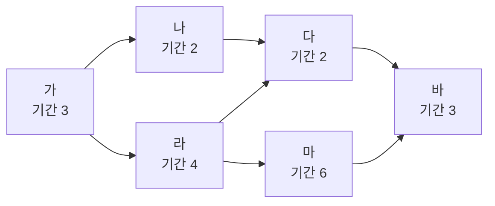

[그림 30] 주공정법①(예시)

<!-- PDF page: 097 -->

활동 이름 “나”의 경우, 선행활동이 “가”이므로 활동 “가”의 뒤에 위치하고, 활동 “나”의 기간은 2일이므로 “기간”에 2라고 입력한다. 다른 모든 활동들도 이와 같이 선행활동을 파악하여 순서를 배치하고, 해당 활동의 기간을 활동이름 상단에 기입한다.

② 전진계산

각 활동의 빠른 개시일(ES), 빠른 종료일(EF)을 계산하는데, 계산식은 아래와 같다.

- ES = 선행 EF + 1

- EF = 당행 ES + 기간–1

〈표 45〉 각 활동별 전진계산 결과

| 활동 이름 | ES(Early Start) | 기간 | EF(Early Finish) |
| --- | --- | --- | --- |
| 가 | 1 | 3 | 3(1 + 3–1) |
| 나 | 4(3 + 1) | 2 | 5(4 + 2–1) |
| 다 | 6(5 + 1) 8(7 + 1) | 2 | 9(8 + 2–1) |
| 라 | 4(3 + 1) | 4 | 7(4 + 4–1) |
| 마 | 8(7 + 1) | 6 | 13(8 + 6–1) |
| 바 | 14(13 + 1) | 3 | 16(14 + 3–1) |

“가” 활동의 경우, 선행 EF가 없으므로, ES는 1로 시작한다.

“다” 활동의 경우, 선행 활동이 “나”와 “라” 두가지가 있다. 이 경우, “다” 활동은 결국 “나” 와 “라” 활동 모두가 종료된 이후에 시작할수 있으므로, ES 계산 시 사용하는 선행 EF는 “라” 활동의 EF 인 7이 된다. 따라서, “다” 활동의 ES = 7 + 1= 8이 된다. 개별 활동의 ES 와 EF를 모두 계산한 후, 아래 그림과 같이 기입한다.

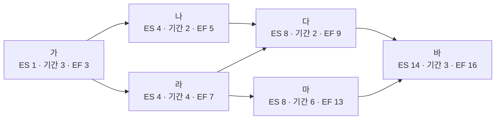

[그림 31] 임계 경로법②(예시)

③ 후진계산

각 활동의 늦은 개시일(LS), 늦은 종료일(LF)를 계산하는데, 계산식은 아래와 같다.

- LS= 당행 LF-기간 +1 이다.

- LF = 후행 LS–1

<!-- PDF page: 098 -->

〈표 46〉 각 활동별 후진계산 결과

| 활동 이름 | LS(Late Start) | 기간 | LF(Late Finish) |
| --- | --- | --- | --- |
| 가 | 1(3–3 + 1) | 3 | 9(10–1) 3(4–1) |
| 나 | 10(11–2 + 1) | 2 | 11(12–1) |
| 다 | 12(13–2 + 1) | 2 | 13(14–1) |
| 라 | 4(7–4 + 1) | 4 | 11(12–1) 7(8–1) |
| 마 | 8(13–6 + 1) | 6 | 13(14–1) |
| 바 | 14(16–3 + 1) | 3 | 16 |

“바” 활동의 경우, 후행 LS가 없으므로, LF는 16으로 시작한다. “라” 활동의 경우, 후행 활동이 “다”와 “마” 두가지가 있다. 이경우, “라” 활동이 끝나야 “다” 와 “마” 활동이 시작될 수 있는데, “다” 활동은 늦어도 12일에는 시작해야 하고(LS, Late Start). “마” 활동은 늦어도 8일에는 시작해야 한다. 따라서, “라” 활동이 7일에는 늦어도 끝나야(Late Finish), 두 활동 중 빠른 “마” 활동이 정상적으로 8일에 시작될 수 있다. 그래서, “라” 활동의 LF는 “마” 활동의 LS 8 에서 1을 뺀 7이 된다. 이어서 “라” 활동의 LS 또한, 7–4+ 1 = 4가 된다. 개별 활동의 LS 와LF 를 모두 계산한 후, 아래 그림과 같이 기입한다.

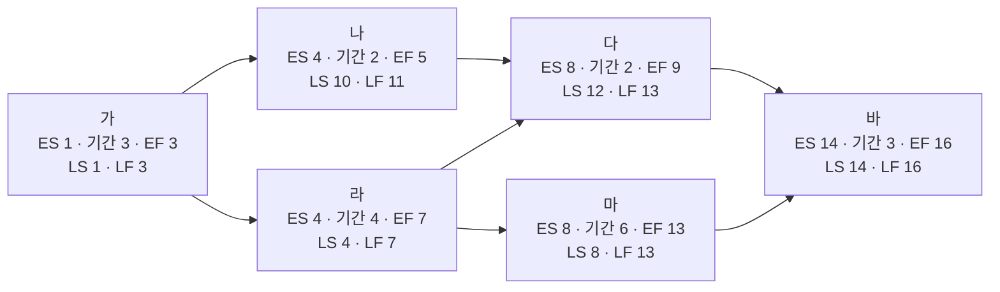

[그림 32] 임계 경로법③(예시)

④ 총 여유시간(Total Float) 확인, 임계경로 계산

개별 활동별 총 여유시간의 계산식은 아래와 같다.

- TF = LF—EF 또는

- TF = LS—ES

총 여유시간을 계산하는 이유는 임계경로(Critical Path)를 결정하기 위함이다. 즉, 임계경로는 총 여유시간이 '0'인 활동들을 연결한 경로다. 따라서, 다음 그림처럼 본 예시의 임계 경로는 붉은색으로 표시된 “가–라–마–바”가 된다.

<!-- PDF page: 099 -->

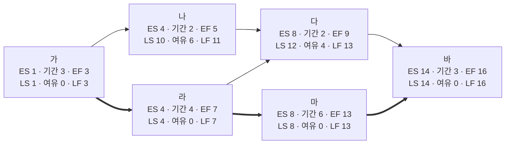

[그림 33] 임계 경로법④(예시)

해당 임계경로상의 활동이 지체되는 경우 전체 프로젝트 일정이 늦어지게 된다. 따라서, 임계경로상의 활동들은 일정관리의 집중적 대상이 된다.

#### 나) 일정개발 기법-주공정연쇄기법(CCM: Critical Chain Method)

주공정연쇄기법 혹은 주공정연쇄법은 프로젝트 팀에서 한정된 자원과 프로젝트 불확실성을 고려하여 프로젝트 일정 경로에 완충(Buffer)을 둘 수 있는 일정 계획 방법이다. 임계경로법으로 결정된 임계경로에 자원할당, 자원최적화, 자원평준화, 활동기간 불확실성이 미치는 영향을 고려하기 위해 주공정법에 완충과 완충관리라는 개념을 도입한다.

아래는 임계경로법 예시를 바탕으로 활동기간 불확실성을 상정하여 완충(Buffer)을 둔 그림이다.

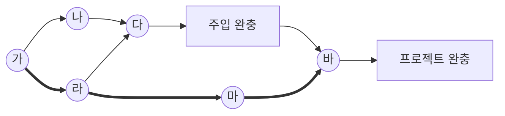

[그림 34] 주공정 연쇄법(예시)

주공정 연쇄의 끝에 추가된 완충을 프로젝트 완충(Project Buffer)이라고 하며, 목표 종료일이 주공정 연쇄에서 벗어나지 않도록 노력한다.

주공정 경로(붉은 색 경로)에 속하지 않은 종속 활동 경로가 주공정 경로에 주입되는 각 지점에 주입 완충(Feeding Buffer)이라고 하는 추가 완충을 배치한다. 주입 완충의 크기는 해당 완충까지 연결된 종속 활동 연쇄의 기간 불확실성을 고려하여 결정해야 한다.

완충 일정활동을 결정한 후에는 가능한 최근 예정개시일과 예정종료일로 예정된 활동의 일정을 계획한다. 결과적으로 주공정 연쇄법에서는 네트워크 경로의 총 여유를 관리하는 대신 활동 연쇄의 잔여 기간 대비 잔여 완충기간을 관리하는 데 주력한다.

<!-- PDF page: 100 -->

#### 다) 일정단축 기법–공정압축법과 공정중첩단축법

통상의 프로젝트에서 일정단축 필요성이 발생하는 가장 흔한 이유는 요구사항 변경이 발생했기 때문이다. 잦은 요구사항 변경에도 불구하고 프로젝트 종료일은 현실적으로 변경할 수 없기 때문에 프로젝트 후반부에 예정된 개발 일정이나 테스트 일정 등을 단축시켜야 하는 경우가 많이 발생한다.

아래 대표적인 일정단축 기법에 대해 살펴본다.

① 공정압축법(Crashing)

공정압축법은 자원을 추가하여 최소한의 추가 비용으로 일정을 단축하는 기법이다. 공정 압축법의 예로는 시간 외 근무 승인, 자원 보충. 주공정 경로의 활동에 대해 급행료 지불 등이 있다. 주공정 경로에서 자원 보충으로 활동 기간이 단축되는 활동에만 공정 압축법이 효과적이다. 그러나, 공정압축법은 오히려 원가 상승을 초래할 수 있다. 신규 투입 인력자원에 대해 기존의 프로젝트 내용을 공유하거나 의사소통 채널의 증가에 따른 리스크 증가 요인이 되기도 한다.

② 공정중첩단축법(Fast Tracking)

공정중첩단축법은 일반적으로 순차적으로 수행되는 활동이나 단계를 일정 기간의 특정 구간에서 동시에 수행하는 방식의 일정기간 단축 기법이다. 예를 들어, 건축 도면이 모두 완성되기 전에 기초 공사를 착공하는 경우이다. 공정중첩단축법은 재작업, 리스크 증가를 초래할 수도 있다. 프로젝트 기간을 단축하기 위하여 활동을 중첩할 수 있는 경우에만 공정중첩단축법이 효과적이다.

[참고 및 추천 자료]

[1] 강정배, 서정훈, 이지현, “인사이트 프로젝트 관리”, 서울: 한국생산성본부, 2012.

[2] Project Management Institute, “A Guide to the Project Management Body of Knowledge”, 5e., PA: Project Management Institute, 2013.

[3] “http://cafe.naver.com/81th.cafe”, KPC 기술사회

[4] Joseph Phillips, “IT Project Management: On Track from Start to Finish”, NY: McgrawHill, 2010.

[5] Kim Heldman, “CompTIA Project+ Study Guide Authorized Courseware”, NJ: Sybex, 2010.

[6] 김병철, “프로젝트 관리의 이해”, 세화, 2006.

<!-- PDF page: 101 -->

## XI. 원가관리

### 최근 동향 및 주요 이슈

원가관리는 승인된 예산 안에서 프로젝트를 완료하기 위해 원가에 대한 계획, 원가 산정, 예산 수립, 원가를 통제하는 프로세스이다. 프로젝트는 한정된 자원으로 수행되기 때문에 프로젝트 원가관리는 중요한 요소이다.

### 학습 목표

1. 원가관리의 개념과 프로세스를 설명할 수 있다.

2. 원가산정 기법에 대해 설명할수 있다.

3. 프로젝트 진행률에 따른 원가 파악에 대해 설명할 수 있다.

### 핵심 키워드

- 원가관리 프로세스: 원가관리 계획수립, 원가산정, 예산 결정, 원가통제

- 원가산정 기법: 1점 산정, 3점 산정, 유사 산정, 모수 산정, 전문가 산정, M/M(Man/Month), 기능 점수

- 기성고 관리(EVM), 프로젝트 진행률

- 측정 요소: 완료시점 예산(BAC: Budget At Completion), 계획 가치(Planned Value), 획득 가치(Earned Value), 실제 원가(Actual Cost)

- 분석 요소: 일정 차이(Schedule Variance), 원가 차이(Cost Variance), 일정 성과지수(Schedule Performance Index), 원가 성과지수(Cost Performance Index)

- 예측 요소: 완료시점 산정치(EAC: Estimate At Completion), 잔여분 산정치(ETC: Estimate To Complete)

<!-- PDF page: 102 -->

### 실무 미리보기

우리 SW기술자의 임금은 얼마나 될까?

한국소프트웨어산업협회에서는 SW기술인력의 임금동향을 파악하고 정책입안 기초자료로 활용하거나, SW 사업 수행 시 투입 기술자의 노임단가로 적용할 수 있도록 해당업체 및 유관기관에 제공하는 것을 목적으로 SW 사업체에서 근무하는 SW기술자의 실 지급 임금을 조사하고 있다. 한국소프트웨어산업협회 사이트(www.sw.or.kr) 알림란에서 확인할 수 있으며, 아래는 최근 공표된 SW기술자 평균임금 내역이다. 통계법 제27조(통계의 공표)에 따른 「2015년 SW기술자 임금실태조사(통계승인 제37501호)」에서의 SW기술자 평균임금(일평균, 월평균, 시간평균)

[단위 : 명, 원, %]

| 구분 | 인원 | 평균임금(일평균) 2017년 | 평균임금(일평균) 2018년 | 증가율 | 월평균임금(M/M) | 시간평균임금(M/H) |
| --- | --- | --- | --- | --- | --- | --- |
| 기술사 | 295 | 452,611 | 462,072 | (2.1) | 9,611,098 | 57,759 |
| 특급기술자 | 15,526 | 391,068 | 406,342 | (3.9) | 8,451,914 | 50,793 |
| 고급기술자 | 8,742 | 305,353 | 305,433 | (0.0) | 6,353,006 | 38,179 |
| 중급기술자 | 9,104 | 239,506 | 239,748 | (0.1) | 4,986,758 | 29,969 |
| 초급기술자 | 11,363 | 191,320 | 215,681 | (12.7) | 4,042,272 | 29,960 |
| 고급기능사 | 99 | 191,177 | 194,340 | (1.7) | 3,298,818 | 24,293 |
| 중급기능사 | 200 | 158,490 | 158,597 | (0.1) | 2,515,718 | 19,825 |
| 초급기능사 | 233 | 114,914 | 120,948 | (5.3) | 2,436,616 | 15,119 |
| 자료입력원 | 204 | 113,959 | 117,145 | (2.8) | 2,436,616 | 14,643 |
| 계/평균 | 45,766 | 289,473 | 302,665 | (4.6) | 6,295,432 | 37,833 |

〈평균임금 SW사업대가 활용 시 유의사항〉

※ 본 조사결과는 SW사업에서 반드시 활용해야 하는 강제사항은 아님

※ 등급별 평균임금은 2019년에는 공표하지 않고, IT 직무별 평균임금을 공표할 예정임

- SW기술자 평균임금은 소프트웨어산업진흥법 제22조(소프트웨어사업의 대가지급) 4항 '소프트웨어기술자의 노임단가'를 지칭함

- SW기술자 평균임금은 기본급+제수당+상여금+퇴직급여충당금+법인부담금을 모두 포함한 결과임

- 월평균임금은 일평균*근무일수(20.8일), 시간평균임금은 일평균÷8시간으로 각각 산정함

- SW기술자 평균임금은 2017년 대비 4.6% 증가함

- DB구축비 대가기준 가이드에서 활용되는 자료입력원 평균임금 내 기본급은 2018년 93,287원임

[시행일: 2018년 9월 1일부터 2019년 8월 31일까지 적용]

<!-- PDF page: 103 -->

### 01 원가관리의 개념

#### 가) 원가개념

가격은 거래관계에서 공급자가 제품 또는 서비스를 제공하는 대가로 고객이 지급하는 화폐의 크기로 고객과 공급자 간의 사업적 판단에 의해 결정된다. 반면에 원가는 제품 생산 또는 서비스 제공에 투입된 자원의 경제가치로 공급자의 생산능력에 의해 결정된다. 참고로 Cost는 원가를 기본으로 하고 경우에 따라 비용으로 번역한다. 즉, 프로젝트 수행에 따른 손실과 이익을 측정하는 관점에 따라 구별할 수 있는데, 원가는 주로 손익 측정기준을 개별 제품이나 서비스로 하는 경우에 사용되며, 비용은 측정기준이 기간인 경우에 사용된다.{예: 제품 원가(Product Cost), 기간 비용(Period Cost)}

#### 나) 원가관리의 중요성

프로젝트는 공식적인 승인을 거쳐서 계획된 자원과 예산을 할당 받아 진행되는데 만약 제대로 원가를 관리하지 않아 예산이 초과된다면 프로젝트 승인자(스폰서)나 경영이사회에 보고해야 한다. 원가가 초과되는 원인은 범위나 일정 관리를 잘못하는 데 있다. 범위가 추가 변경되거나, 일정이 지연되는 경우에 일정을 준수하기 위해서는 자원의 투입이 있어야 하므로 원가가 초과된다. 즉 원가관리를 잘 한다는 것은 초기에 적절한 프로젝트 원가를 산정하고 프로젝트 수행 기간 동안 범위와 일정 관리를 잘 해야 함을 의미한다.

#### 다) 원가관리의 개념

프로젝트 원가관리는 결국 프로젝트가 승인된 예산 내에서 완료될 수 있도록 예산을 계획, 산정, 조달, 관리, 통제하기 위한 일련의 활동들이다.

### 02 원가관리 프로세스

원가관리 프로세스는 프로젝트 원가관리 계획수립, 원가 산정, 예산 결정, 원가 통제이다.

#### 가) 원가관리 계획수립

원가관리 계획은 프로젝트 생명주기 동안 원가관리 방법을 수립하고 결정하는 작업이다. 프로젝트 활동을 완료하는데 필요한 예산을 추정하는 활동에서부터 관리하는 원가의 담당자별 책임을 식별하고 주어진 시점에서 프로젝트와 관련된 제반 정보를 기반으로 원가를 예측하기 위한 여러 가지 원가산정 기법을 포함하는 프로세스이다.

#### 나) 원가산정

프로젝트 원가산정은 프로젝트 활동들을 완료하기 위하여 요구되는 금전적 자원의 예상치를 개발하기 위한 프로세스이다. 다음은 프로젝트 원가를 예측하기 위한 방법들이다.

<!-- PDF page: 104 -->

〈표 47〉 원가산정 방법

<table>
<tr><th>원가 추정 기법</th><th>특징 및 설명</th></tr>
<tr><td>유사 산정</td><td>과거 유사한 프로젝트의 범위, 원가, 예산, 프로젝트 기간 정보를 바탕으로 현재 프로젝트의 원가를 산정하는 방법</td></tr>
<tr><td>상향식 산정</td><td>• 최하위 레벨 작업들(Work package)에 필요한 원가를 추정한 후 이를 합산하여 상위레벨 원가를 추정하는 방식 • 개별 활동 또는 작업 패키지의 규모와 복잡성에 따라 영향을 받고, 원가산정에 시간이 많이 소요되지만 정확한 비용을 산정할 수 있음</td></tr>
<tr><td>전문가 판단</td><td>• 이전의 유사한 프로젝트로부터 환경 및 정보를 통해 인건비, 자재원가, 물가상승, 위험 요인을 포함한 프로젝트 정보를 제공하는 방법</td></tr>
<tr><td>3점 산정</td><td>• 최빈치, 낙관치, 비관치를 이용한 프로젝트 원가를 산정하는 방법으로서, 원가산정 불확실성과 위험을 고려한 기법</td></tr>
</table>

#### 다) 예산 결정

모든 원가를 통합적으로 관리하기 위하여 원가산정의 개별 활동, 작업패키지 혹은 산정된 원가를 수집하여 승인된 원가 기준선을 만드는 프로세스⁷ 이다. 원가기준선은 관리예비비를 제외한 승인된 버전의 프로젝트 예산이다. 결국 프로젝트 예산은 관리예비비와 원가기준선의 합이다.

프로젝트 관리자가 계획된 활동 이외의 우발사태 발생 시 사용할 수 있는 예산인 우발사태 예비비는 원가기준선에 포함된다. 그러나, 관리예비비는 최고기술책임자(CTO, Chief Technical Officer)나 스폰서, 대표이사에 의해 집행 가능한 비용이다.

#### 라) 원가통제

프로젝트 원가통제는 프로젝트 원가관리 및 기준선 변경에 대한 상태를 모니터링하는 프로세스이다. 다음의 사례를 보면, [글쓰기] 활동은 5일로 기간을 산정했고, 7월 31일로 완료하는 계획을 세운 상황이다. 8월 1일 확인한 결과 5일 계획 작업이 완료되지 않은 상태이다. 작업된 일을 원가(1일, 30만원으로 가정)로 계산하면, 5(일) × 0.9(완료율) Ⅹ 300,000 = 1,350,000원 일이 완료된 것이다. 더불어, 원래 계획 작업 일정을 원가로 계산하면 1,500,000원이다. 즉, 8월 1일 오늘 1,500,000–1,350,000 = 150,000원 일이 진행이 안된 상황이므로, 현재 150,000원의 원가가 초과로 지출된 것으로 파악할 수 있다.

다음과 같은 원가통제 관리방법을 획득가치기법(Earned Value Method)이라고 하고 EVM을 적용한 원가통제 관리를 획득가치관리(Earned Value Management)라고 한다.

7 출처, PMP 바이블, 한빛미디어

<!-- PDF page: 105 -->

<!-- 원본 프로젝트 관리 도구의 원가 통제 화면은 생략함. 글쓰기 작업의 기간 5일, 완료율 90%를 보여 주는 예시이다. -->

[그림 35] 원가 통제 화면(예시)

### 03 원가산정 기법

대표적인 프로젝트 원가산정 기법은 기능점수법(FP, Function Point). 투입공수 산정법(M/M, Man/Month), COCOMO 등이 있다.

#### 가) 기능점수법(FP, Function Point)

기능점수법은 소프트웨어 개발규모를 기능점수(FP)로 측정하고, 기능점수당 단가를 곱하여 비용을 산출하는 방식이다. 소프트웨어 개발자 중심의 산정 방식에서 벗어나 사용자 관점에서 사용자가 요구하고, 사용자에게 인도되는 기능을 정량적으로 산정하는 국제 표준(ISO/IEC 14143)이며, 소프트웨어 개발, 유지관리 및 운영을 위한 비용산정 방법이다. LOC(Line Of Code) 기반의 COCOMO 방식이나 투입공수 기반의 공수산정법에 비해 사용자의 요구기능을 파악하여 개발 프로젝트 규모를 개발 이전에 파악하는 특징이 있다.

소프트웨어 기능은 데이터 기능과 트랜잭션 기능으로 나뉘어지며, 다시 세분하여 데이터기능은 내부논리파일과 외부연계파일, 트랜잭션 기능은 외부입력, 외부출력, 외부조회의 3가지로 나뉜다.

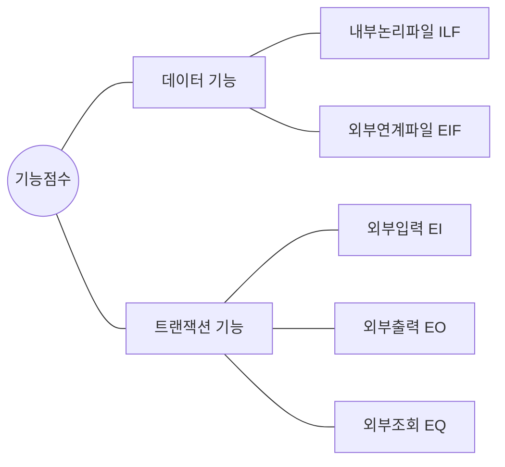

[그림 36] 기능 유형 분류

<!-- PDF page: 106 -->

기능점수법으로 원가를 산정하는 절차는 아래와 같다.

① 측정유형 결정

- 개발 프로젝트/개선 프로젝트/Application 개발 중 선택

② 측정범위와 Application 경계 식별

- 소프트웨어의 전체 범위 결정

- 개별 Application의 경계를 구분

③ 데이터 기능 측정

- 내부논리파일(ILF, Internal Logical File)과 외부연계파일(EIF, External Interface File)로 식별하고, 각각 복잡도와 기여도를 결정하여 데이터 기능 점수 도출

- 복잡도와 기여도는 데이터요소유형(DET, Data Element Type)과 레코드요소유형(RET, Record Element Type)으로 나누어 결정. DET는 속성의 개수, RET는 테이블의 개수로 산정한다.

④ 트랜잭션 기능 측정

- 업무처리단위 프로세스를 식별하고, 개별단위 프로세스별로 EI(External Input). EO(External Output), EQ(External Query)를 분리한 후, 각각 복잡도와 기여도를 결정하여 트랜잭션 기능점수 도출

- 복잡도와 기여도는 데이터요소유형(DET)과 참조파일유형(FTR, File Transfer Reference)으로 나누어 결정

⑤ 미조정 기능점수 결정

- 미조정 기능점수는 데이터기능점수와 트랜잭션기능점수의 합

⑥ 조정인자 결정

- 14개의 조정인자(VAF, Value Adjustment Factor)별로 0 ~ 5점까지의 영향도를 결정하고 합산하여 총 영향도 산출

- 14개의 조정인자는 데이터 통신, 분산 데이터 처리, 성능, 사용환경, 처리율, 온라인 데이터 입력, 사용자 효율성, 온라인 갱신, 복잡도, 재사용성, 설치용이성, 운영용이성, 복수 사이트, 변경용이성

- 조정인자(VAF) =(총 영향도 * 0.01) + 0.65

⑦ 조정 기능점수 결정

- 조정인자(VAF)가 결정되면, Application 유형에 따라 개발/개선/Application 유형에 따라 조정인자 반영하여 최종 기능점수를 산출한다.

- 기능점수 = 미조정 기능점수 * 조정인자

기능점수법은 크게 간이법과 정통법으로 나뉘고, 개발제안 단계에서는 EI/EO/EQ, ILF/EIF 등의 평균값을 활용하여 원가를 산정하고, 요구분석과 설계가 끝난 단계에서는 정통법으로 원가를 산정한다.

<!-- PDF page: 107 -->

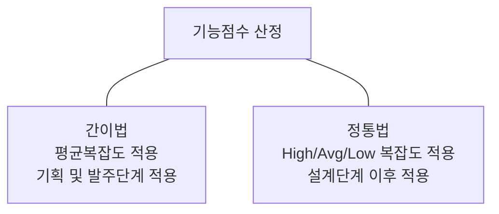

[그림 37] 기능점수 산정 방법

최근 실무에서는 공공 프로젝트 사업의 경우, 기능점수 산정 방식을 활용하여 사용자 중심의 기능 중심으로 원가 산정을 실시하고 있다.

#### 나) 투입공수 산정법(MM, Man/Month)

투입공수 산정법은 과거의 유사사업 수행 경험을 토대로 사업의 투입인력 소요공수를 산정하고, 프로젝트에 투입되는 인력을 기반으로 원가를 산정하는 방식이다.

프로젝트 개발비 = 직접인건비 + 제경비 + 기술료 + 직접경비

통상 투입인력 소요공수 산정을 위한 근거로는 범위관리에서 도출된 작업분류체계(WBS)의 최하위 단위인 작업패키지별로 소요공수를 할당한다.

① 직접인건비 결정

작업패키지별로 소요공수가 할당되면, 공수당 단가를 결정해야 하는데, 국내의 경우 한국소프트웨어산업협회가 공표하는 소프트웨어 기술자 평균 임금을 적용하여 아래와 같은 표를 참조하여 결정한다.

〈표 48〉 2017년 SW기술자 평균임금

<table>
<tr><th>구분</th><th>평균임금(M/M)</th><th>평균임금(M/H)</th></tr>
<tr><td>기술사</td><td>9,414,309</td><td>56,576</td></tr>
<tr><td>특급기술자</td><td>8,134,214</td><td>48,884</td></tr>
<tr><td>고급기술자</td><td>6,351,342</td><td>38,169</td></tr>
<tr><td>중급기술자</td><td>4,981,725</td><td>29,938</td></tr>
<tr><td>초급기술자</td><td>3,979,456</td><td>23,915</td></tr>
<tr><td>고급기능사</td><td>3,976,482</td><td>23,897</td></tr>
<tr><td>중급기능사</td><td>3,296,592</td><td>19,811</td></tr>
<tr><td>초급기능사</td><td>2,390,211</td><td>14,364</td></tr>
<tr><td>자료입력원</td><td>2,370,347</td><td>14,245</td></tr>
</table>

<!-- PDF page: 108 -->

② 제경비와 기술료

제경비는 소프트웨어 개발사업자의 행정운영을 위한 기획, 경영, 총무 분야 등에서 발생하는 간접 경비⁸ 이다. 통상 직접인건비의 110 ~ 120%로 계산한다. 기술료는 소프트웨어 개발사업자가 개발, 보유한 기술의 사용 및 기술축적을 위한 대가로 직접인건비에 제경비를 합한 금액의 20 ~ 40%로 계산한다.⁹

③ 직접경비 산정

직접경비는 소프트웨어 개발에 직접적으로 필요한 비용을 의미하며, 특별히 필요로 하는 컴퓨터 시스템 사용료, SW 도구 사용료, 전문가 비용, 직접 여비, 재료비 등 해당 소프트웨어 개발사업에 특별히 소요되는 직접비용을 말한다.

민간사업의 영역에서는 투입공수 산정 방식으로 프로젝트 개발비 산정이 주로 이루어지고 있고, 최근 공공사업에서 의무화되고 있는 기능점수법과 혼용하여 상호 검증을 위해 사용되기도 한다.

#### 다) COCOMO(Constructive Cost Model)

COCOMO는 소프트웨어 개발 프로젝트의 원가를 산정하는 방법 중 하나로 시스템을 구성하는 모듈과 서브시스템에 투입되는 개발기간, 투입공수, 유지보수비용 등을 변수로 회귀공식을 만들어 원가를 산정하는 방법이다. COCOMO는 산정 모델의 복잡도에 따라 기본형(Basic), 중간형(Intermediate), 발전형(Detailed) COCOMO 3가지로 나뉘어진다. 또한, 적용 프로젝트 유형에 따라 Organic Mode, Semi–Detached Mode, Embedded Mode 3가지로 나뉘어진다. 각각 개발노력과 개발기간, 적정투입인원, 인적비용을 고려하여 산정된다.

간단히 COCOMO 산정 방식을 살펴보면 아래와 같다.

기본형 COCOMO 사례

① 개발노력(Effort Applied) E = a *(KLOC) b

- a 와 b는 프로젝트 유형별 계수(아래 표 참조)

- KLOC는 Kilo Line Of Code. 천단위 코드 라인 수

② 개발기간(Development Time) D = c *(Effort Applied) d

- c 와 d는 프로젝트 유형별 계수(아래 표 참조)

③ 투입인원(People Required) P = Effort Applied / Development Time

〈표 49〉 프로젝트 유형별 계수

| 프로젝트 유형 | a | b | c | d |
| --- | --- | --- | --- | --- |
| Organic | 2.4 | 1.05 | 2.5 | 0.38 |
| Semi–Detached | 3.0 | 1.12 | 2.5 | 0.35 |
| Embedded | 3.6 | 1.2 | 2.5 | 0.32 |

중간형이나 발전형 COCOMO의 경우, 상기 표의 계수 값을 변경 적용하여 계산한다.

8 출처: SW사업 대가산정 가이드 2017년 개정판

9 출처: SW사업 대가산정 가이드 2017년 개정판

<!-- PDF page: 109 -->

#### 라) COCOMO 2(Constructive Cost Model 2)

COCOMO 2는 개발환경 변화에 따라 코드 재사용성, 기성품(off-the-shelf component) 활용, 디자인 및 개발관리 강조 등 기존 COCOMO 모델을 개선하여 소프트웨어 개발원가를 산정하는 방법이다.

COCOMO 2는 응용프로그램 구성모델(Application Composition Model), 초기디자인 모델(Early Design Model), 후반구조 모델(Post-Architecture Model)이라는 3개의 하위 모델을 가지고 있다.

〈표 50〉 COCOMO 2 하위 모델

<table>
<tr><th>유형</th><th>설명</th></tr>
<tr><td>응용프로그램 구성모델 (Application Composition Model)</td><td>• S/W 프로토타입 개발을 위해 GUI Tool, CASE Tool을 사용하는 프로젝트에 적용 • 컴포넌트 개수, 복잡도, 객체점수 등 이용</td></tr>
<tr><td>초기디자인 모델 (Early Design Model)</td><td>• 설계단계에서 대략적인 비용과 일정을 추정하기 위해 적용 • 개발 초기 단계에 규모, 환경, 인력, 프로세스의 세부사항에 대한 정보가 부족할 때 활용</td></tr>
<tr><td>후반구조 모델 (Post—Architecture Model)</td><td>• 아키텍쳐 수립 이후 충분한 자료가 준비된 프로젝트에 적용 • 소프트웨어 생명주기 확립 이후, 미조정 기능점수와 SLOC(Source Line Of Code) 등 이용</td></tr>
</table>

### 04 원가집행 관리기법-획득가치 관리

#### 가) 획득가치 개념

"Value”란 “가치”를 의미한다. 획득가치 관리에서 가치는 일의 화폐가치를 의미하는데 어떤 일에 배정된 예산이 그 일의 가치가 된다.

- Value = 일의 화폐가치 = 일에 배정된 예산

"Earned Value"란 “획득가치"로 번역되는데, 성과를 측정하는 시점에서 실제 완료한 일의 가치를 의미한다. 획득가치는 실행된 일에 배정된 예산으로 계산된다. 획득가치를 BCWP(Budgeted Cost of Work Performed, 수행작업 예산원가)라고도 한다.

- 획득가치(EV, Earned Value) = 실행된 일의 가치 = 실행된 일의 예산

#### 나) 획득가치 관리방법

획득가치관리(EVM, Earned Value Management)는 프로젝트 일정과 비용을 통합관리함으로써 성과를 분석하고 프로젝트 최종 사업의 원가와 일정을 현재 시점에서 예측하는 프로젝트 성과관리 기법이다.

<!-- PDF page: 110 -->

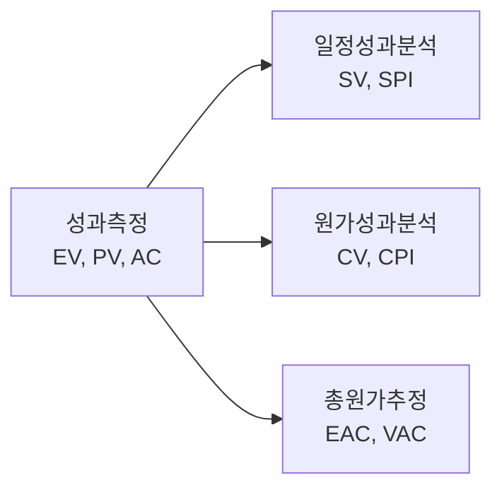

[그림 38] 획득가치 관리(EVM)의 구성

획득가치관리는 원가와 일정을 통합해서 프로젝트 성과를 통제하는 기법으로서, 관련된 용어는 다음과 같다.

〈표 51〉 획득가치 관리 주요용어

| 주요 용어 | 설명 |
| --- | --- |
| 획득 가치 (EV: Earned Value) | 현재까지 수행한 작업에 대하여 할당되어 있는 예산 (예) 5일 80%(진행률) = 5*0.8 = 4일 |
| 계획 가치 (PV: Planned Value) | 활동 또는 작업분류체계 구성요소를 완료하기 위해 수행하는 작업에 배정되어 승인을 받은(계획한) 예산 (예) 5일 |
| 실제 원가 (AC: Actual Cost) | 수행한 작업을 위해 실제 투입된 비용 (예) 5일 활동에 추가 1명, 1일 추가 = 5일*1명 + 1일*1 = 6일이 투여 됨 |
| 일정 차이 (SV: Schedule Variance) | 프로젝트에 대한 일정 성과를 측정하는 척도 SV > 0: 일정 양호, SV < 0: 일정 지연 SV = EV–PV, 4–5 = –1일로, 1일 일정 지연됨 |
| 일정성과지수 (SPI: Schedule Performance Index) | 프로젝트에 대한 일정 성과를 측정하는 척도 SPI = EV / PV SPI > 1: 일정 양호, SPI < 1: 일정 지연 |
| 원가 차이 (CV: Cost Variance) | 프로젝트에 대한 원가 성과를 측정하는 척도 CV > 0: 원가 절감, CV < 0: 원가 초과 CV = EV–AC, 4–6 = –2, 2일만큼 원가 초과 |
| 원가성과지수 (CPI: Cost Performance Index) | 프로젝트에 대한 원가 성과를 측정하는 척도 CPI = EV / AC CPI > 1: 원가 양호, CPI < 1: 원가 초과 |

다음 그래프는 프로젝트의 획득가치 관리 그래프의 한 예이다. 8월 1일 현재 계획가치(PV), 실제원가(AC), 획득가치(EV)를 측정하고 일정차이(SV)와 원가차이(CV)로 분석하여 프로젝트를 예측할 수 있다. 계획된 작업양인 계획가치(PV)보다 실제로 투입된 원가인 실제원가(AC)가 더 많이 지출되었고, 실제 완료된 작업량인 획득가치(EV)는 계획가치(PV)보다 적게 수행하였다. 프로젝트 원가를 분석하면 일정차이(SV) = 획득가치(EV)–계획가치(PV) 이므로 음수가 되어 일정이 지연되고 있으며, 원가차이(CV) = 획득가치(EV)–실제원가(AC) 이므로 음수가 되어 원가가 초과되고 있는 것이다.

<!-- PDF page: 111 -->

<!-- 원본의 누적 원가 곡선 그래프는 생략함. -->

- 세로축: 프로젝트 누적 원가
- 가로축: 프로젝트 일정
- 기준시점: 8월 1일 현재
- 실제 투입된 비용(AC), 계획된 작업량(PV), 실제 완료된 작업량(EV)
- CV(비용 차이) = EV–AC

[그림 39] 획득가치 관리(EVM) 그래프(예시)

완료시점 산정치(EAC, Estimate At Completion)는 “프로젝트 완료 시 총원가 추정 값”으로 “종료 시 추정원가”라고 한다. 획득가치 관리의 중요한 장점은 프로젝트 총원가를 합리적으로 예측할 수 있다는 점이다. 완료시점 산정치(EAC)는 성과측정시점까지 완료된 일에서 실제로 발생한 실제원가(AC)와 남은 일에 대한 추정원가(ETC, Estimate To Completion)의 합으로 구한다. 실제원가(AC)는 성과측정의 결과로 알 수 있으므로, 잔여분산정치(ETC, Estimate to Complete)만 계산하면 완료시점산정치 (EAC)를 구할 수 있다.

잔여분 산정치(ETC)를 구하는 방법은 실행분석의 결과에 따라 세 가지로 구분된다. 기존에 승인된 남은 일에 대한 예산을 원가성과지수(CPI)로 나눈 값을 적용하는 방법

- 잔여분 산정치(ETC) = 완료시점 예산(BAC)-획득가치(EV) / 원가성과지수(CPI)

기존에 승인된 남은 일에 대한 예산을 변경없이 적용하는 방법

- 잔여분 산정치(ETC) = 완료시점 예산(BAC)-획득가치(EV)

기존에 승인된 남은 일에 대한 예산을 무시하고 새롭게 예산을 수립하는 방법

- 잔여분 산정치(ETC) = 잔여 일에 대한 새 추정치

이렇게 구해진 잔여분 산정치(ETC)를 실제원가(AC)와 합해서 완료시점 산정치(EAC)를 아래와 같이 구할 수 있다.

- 완료시점 산정치(EAC) = 실제원가(AC) + 잔여분 산정치(ETC)

성과 측정 시점에서 이미 완료되었거나 시작되지 않은 일의 가치를 판단하는 것은 어려운 작업이다. 그러나, 진행중인 일의 가치를 측정하는 것은 판단의 기준에 따라 객관성이 떨어질 수 있다. 진행중인 작업의 가치는 다음과 같은 방법 중에 적당한 것을 선택하여 사용한다.

<!-- PDF page: 112 -->

- 완료율법(Percent Complete)

완료된 퍼센트로 반영 한다.

예: 40% 완료 ⇨ 예산의 40%를 EV로 반영

- 50/50법

시작 시점에 50%를 반영하고, 종료 시점에 나머지 50%를 반영

예: 진행 중인 작업 ⇨ 배정된 예산의 50%를 EV로 반영

- 20/80법

시작 시점에 20%를 반영하고, 종료 시점에 나머지 80%를 반영

예: 진행 중인 작업 ⇨ 예산의 20%를 EV로 반영

- 0/100법

작업 종료 시점에 예산을 100% 반영

예: 진행 중인 작업 ⇨ EV 반영하지 않음

[참고 및 추천 자료]

[1] 강정배, 서정훈, 이지현, “인사이트 프로젝트 관리”, 한국생산성본부, 2012.

[2] Project Management Institute, “A Guide to the Project Management Body of Knowledge”, 5e., PA: Project Management Institute, 2013.

[3] “http://cafe.naver.com/81th.cafe”, KPC 기술사회

[4] Joseph Phillips, “IT Project Management: On Track from Start to Finish”, NY: McgrawHill, 2010.

[5] Kim Heldman, “CompTIA Project+ Study Guide Authorized Courseware”, NJ: Sybex, 2010.

[6] 김병철, “프로젝트 관리의 이해”, 세화, 2006.

[7] 위키 https://ko.wikipedia.org/wiki/COCOMO.

[8] SW사업 대가산정 가이드 2017년 개정판, 한국데이터진흥원

<!-- PDF page: 113 -->

## XII. 품질관리

### 최근 동향 및 주요 이슈

거대화되고 고기능화된 시스템 구축으로 인하여 소프트웨어 복잡도가 증가하고 있다. 소프트웨어 구축 사업의 납기지연 및 고객의 만족도 저하, 시스템 운영/유지보수에의 과다한 비용 소요 등의 문제점과 함께 품질에 대한 인식이 더욱 중요해지고 있다.

### 학습 목표

1. 품질관리의 개념과 프로세스에 대해 설명할 수 있다.

2. 품질표준과 평가 관점에 대해 설명할 수 있다.

3. 품질보증 및 품질통제에 대해 설명할 수 있다.

### 핵심 키워드

- 품질관리 프로세스: 품질관리 계획수립, 품질보증, 품질통제, PDCA

- 품질표준: ISO/IEC 9126, ISO/IEC 12207, CMMI, 6 Sigma, ISO 9000

- 품질평가 관점: 제품 품질 관점, 프로세스 품질 관점, 프로젝트 품질 관점

- 품질보증과 품질통제 기법: 리뷰(Review), 인스펙션(Inspections), 워크쓰루(Walk-through), 품질감사

<!-- PDF page: 114 -->

### 실무 미리보기

자동차로 먼 길을 운행할 때 수시로 자동차의 이상 유무를 점검하듯이, 실제 프로젝트를 수행할 때에도 프로젝트 품질수준을 점검하여 품질목표를 달성할 수 있도록 하는 일련의 품질관리 활동이 필요하다.

일반적으로 품질관리는 품질 계획, 품질통제, 품질보증 등으로 구성되는데, 전반적인 구성에서는 큰 차이가 없으나, 실제 프로젝트의 품질관리는 제조업의 품질관리와는 다소 차이가 있다. 가령, 제조업의 품질관리가 제품 품질에 대한 것이라면, 프로젝트의 품질관리는 프로세스 품질로 볼 수 있다. 이는 결과물이 생성되는 과정에 따라 일하는 방식이 차이가 나는 데에서 비롯한 것으로, 제조업의 품질관리가 생산된 다수 제품의 불량을 관리하는 것이라면, 프로젝트의 품질관리는 한 개 또는 소수 산출물(예: 시스템)을 오류 없이 관리하는 것이기 때문이다. 다수 제품에 대한 불량관리를 제품 품질 관리, 소수 결과물의 오류관리를 프로세스 품질관리로 볼 수 있다. 특히, IT 프로젝트에서는 산출물이 눈에 보이지 않기 때문에 프로젝트 단계별(예: 분석단계, 설계단계, 구현단계, 테스트단계, 전개단계 등)로 중간산출물에 대한 품질관리를 하여야 한다.

프로젝트 단계별 품질관리 활동은 리뷰(Review), 인스펙션(Inspection), 워크쓰루(Walk—through) 등의 기법을 통해 이루어지며, 이는 품질관리 전문조직(예: 품질관리 팀, 품질보증 팀 등)을 통해 가이드 받을 수 있다.

특히, 전사적인 품질관리가 개별 프로젝트의 품질관리로 이어지려면, PMO(Project Management Office)를 통해 전사 품질표준에 대해 가이드 받거나, 품질수준을 점검 받을 수 있다.

이렇게 다양한 품질관리를 체계적인 절차에 따라 꼼꼼히 수행한다면 프로젝트 종료 시점에 고객(예: 발주기관)이 요구했던 품질목표를 만족시켜 품질 비용이 최소화할 수 있다. 또 다른 이점은 요구사항을 확인(Validation), 검증(Verification)함으로써, 요구사항을 명확히 하여 재작업(Rework)을 줄일 수 있는 데, 이렇게 되면 요구사항 누락을 방지하여 범위관리에도 도움이 되고, 재작업에 의한 시간 낭비를 줄여 일정 관리에도 도움이 된다.

<!-- PDF page: 115 -->

### 01 품질관리의 개념

#### 가) 소프트웨어 품질 개념

① 소프트웨어 품질

주어진 요구사항을 만족시키는 소프트웨어 제품의 특성 및 생산성을 의미한다.

② 소프트웨어 품질의 특성

소프트웨어 품질은 상대적 개념이며 정량적 측정이 어려우며, 비용, 시간, 인력, 도구 등 여러 자원에 종속적이며 서로 연관성을 가진다. 소프트웨어 품질을 측정 및 평가하기 위해서는 먼저 소프트웨어의 품질을 나타내는 요소와 특성을 각각 정의하고, 개발하는 공정에서 품질을 객관적인 측면에서 정량화할 수 있는 품질 모형이 필요한데, 일반적으로 이러한 품질 모형은 계층구조로 세분화되어 표현된다. 제 1계층은 사용자 관점에서의 품질 목표, 제 2계층은 품질 목표를 달성할 수 있는 상위 수준의 품질특성(Quality Characteristics), 제 3계층은 구체적인 부품질특성(Subcharacteristics)으로 구성된다.

〈표 52〉 ISO/IEC 9126-1 품질 특성

<table>
<tr><th>품질 특성</th><th>부품질 특성</th></tr>
<tr><td>기능성</td><td>적절성, 정밀성, 상호운용성, 준수성, 보안성</td></tr>
<tr><td>신뢰성</td><td>성숙성, 고장 허용성, 회복성</td></tr>
<tr><td>사용성</td><td>이해성, 학습성, 운용성</td></tr>
<tr><td>효율성</td><td>시간 행동성, 자원 행동성</td></tr>
<tr><td>유지 보수성</td><td>분석성, 변경성, 안정성, 시험성</td></tr>
<tr><td>이식성</td><td>적응성, 설치성, 적합성, 대체성</td></tr>
</table>

③ 소프트웨어 품질관련 주요 표준모델

ISO/IEC 9126, ISO/IEC 12207, CMMI, 6 Sigma, ISO 9000 등이 있다.

④ 소프트웨어 품질의 평가관점

- 제품관점: 품질자체(측정, 검증, 확인, 평가)

- 프로세스관점: 프로세스 향상과 심사

#### 나) 품질관리 개념

① 품질관리의 정의

사용자의 요구사항을 만족하는 제품 혹은 서비스의 품질을 보존하기 위해 수행되는 제반 기법과 활동을 의미한다.

② 품질관리 프로세스

프로젝트에서 사용자 요구사항을 충족(Fitness for use)시키기 위해 품질정책을 수립하고 품질목표를 설정하며 품질 관련 책임사항 등을 결정하기 위해 수행하는 활동과 프로세스를 의미한다.

<!-- PDF page: 116 -->

〈표 53〉 프로젝트 품질관리 3대 요소

<table>
<tr><th>구분</th><th>개념구분</th><th>사례</th></tr>
<tr><td>품질 계획 (Quality Plan)</td><td>프로젝트에 주어진 품질목표를 달성하기 위하여 필요한 활 동을 식별하고 수행방법 등의 결정을 계획하는 활동</td><td>품질계획서 작성</td></tr>
<tr><td>품질 보증 (Quality Assurance)</td><td>사용자 요구사항과 프로젝트 팀이 수행한 결과물이 일치 하는지 여부를 제3자의 입장에서 검토하는 활동(Review. Inspection, Walk—through)</td><td>프로그램 화면설계서 리뷰미팅</td></tr>
<tr><td>품질 통제 (Quality Control)</td><td>프로젝트 팀의 결과물이 품질목표를 달성하지 못하거나 표 준과의 부적합이 발생한 경우 원인을 찾아 해결하는 활동</td><td>소프트웨어 오류 디버깅</td></tr>
</table>

### 02 품질 관리 프로세스

[그림 40] 품질관리 프로세스

품질관리 프로세스는 크게 품질계획, 품질보증, 품질통제의 3단계로 구분할 수 있다. 즉, 품질계획단계는 품질관리를 위한 전반적인 프로세스와 계획을 수립한다. 품질보증은 업무 또는 제조 프로세스 전 과정에 걸쳐 프로세스상의 품질을 관리하는 과정이다. 품질통제는 최종 제품이나 서비스가 고객에게 전달되기 전 품질을 점검하는 단계이다. 더 세부적인 내용은 아래에서 하나씩 살펴보기로 하자.

#### 가) 품질계획(Quality Plan)

① 품질계획 수립

품질 계획 수립이란, 프로젝트 팀이 주어진 품질목표를 달성하기 위해 수행해야 하는 활동을 식별하고 수행방법 등을 결정하는 계획을 문서화하는 작업이다. 프로젝트 품질은 사후에 검사하기보다는 사전에 먼저 계획되어야 하므로 프로젝트 초기에 품질 계획서를 작성해야 한다.

② 품질비용

품질 비용(Cost of Quality)은 사전에 정해진 품질목표를 달성하기 위한 프로젝트 팀의 제반 활동에 소모되는 비용을 원가로 계산한 개념이다. 품질 비용 관리의 목적은 프로젝트의 실패비용을 줄이는 것이며, 이를 위해 결함을 예방하는 활동에 소모되는 비용(예방비용)과 제품의 품질을 확인/검증하는 활동에 소모되는 비용(평가비용)은 상대적으로 높아진다.

<!-- PDF page: 117 -->

〈표 54〉 품질 비용의 유형

<table>
<tr><th>구분</th><th colspan="2">개념구분</th><th>사례</th></tr>
<tr><td rowspan="2">적합 품질 비용 (Cost of Conformance)</td><td>예방비용 (Prevention Costs)</td><td>결함 예방을 위한 비용</td><td>교육, 훈련, 문서화, 장비. 개선 일정</td></tr>
<tr><td>평가비용 (Appraisal Costs)</td><td>제품 품질 확인/검증을 위한 비용</td><td>테스트, 검사, 파괴 시험비용</td></tr>
<tr><td rowspan="2">부적합 품질 비용 (Cost of Nonconformance)</td><td>내부 실패 비용 (Internal Failure Costs)</td><td>제품 인도 전 결함 수정 비용</td><td>재작업 Wasted materials (폐기물, 폐기처리)</td></tr>
<tr><td>외부 실패 비용 (External Failure Costs)</td><td>고객 인도 후 제품, 서비스 수정에 드는 비용</td><td>법적 책임, 하자보수, 사업손실</td></tr>
</table>

③ 품질 관리계획서

품질 관리 계획서는 정해진 사업 비용으로 일정(사업기간)을 준수하면서 프로젝트 팀이 구축한 결과물(시스템)이 품질을 확보할 수 있도록 프로젝트 초기에 작성하는 프로젝트관리 계획서들 중 하나이다.

<!-- 원본 품질관리계획서 및 품질목표 설정 문서 화면은 생략함. -->

[그림 41] 실제 프로젝트에서 관리하는 품질 관리계획서(예시)

#### 나) 품질보증(Quality Assurance)

① 품질보증 개념

품질 요구사항과 품질 통제의 측정결과를 감시하면서, 해당하는 품질표준을 적용하고 있는지 확인하는 기법 및 활동을 의미한다. 품질통제와는 아래와 같이 구분된다.

<!-- PDF page: 118 -->

〈표 55〉 품질통제와 품질보증의 비교

<table>
<tr><th>구분</th><th>품질 통제</th><th>품질 보증</th></tr>
<tr><td>주활동</td><td>• 검사(Inspection)</td><td>• 품질심사(Quality Audits)</td></tr>
<tr><td>대상</td><td>• 일의 결과 (제품, 프로세스, 성과)</td><td>• 프로젝트 조직 • 품질 관리 활동 전반</td></tr>
<tr><td>주체</td><td>• 주로 프로젝트 팀원</td><td>• 조직 외부의 전문심사기관 • 조직 내부의 전문심사자</td></tr>
<tr><td>결과</td><td>• 제품의 합격/불합격 • 프로세스 조정</td><td>• 조직 전체의 적용 가능한 교훈 • 고객의 신뢰 또는 인증</td></tr>
<tr><td>공통점</td><td colspan="2">품질 개선(Quality Improve) 효과</td></tr>
</table>

② 품질보증 기법 유형

품질 보증 기법은 품질 보증 활동 시점에 따라 Prevention¹⁰과 Inspection¹¹으로 구분할 수 있으며, 품질 보증 목적에 따라 아래와 같이 Review, Inspection, Walkthrough로 구분할 수도 있다.

〈표 56〉 품질보증 기법

<table>
<tr><th>구분</th><th>Technical Review</th><th>Software Inspection</th><th>Walkthrough</th></tr>
<tr><td>목적</td><td>명세서와 계획에 대한 적합성 평가 및 변경의 무결성 보증</td><td>결함을 찾고 해결책을 검증</td><td>결함 발견, 대안 검증, 학습수단 활용</td></tr>
<tr><td>참석자</td><td>개발자</td><td>문서화된 공식적인 참석대상자</td><td>개발자</td></tr>
<tr><td>리더쉽</td><td>고참 엔지니어</td><td>중재자</td><td>개발자 자신</td></tr>
<tr><td>자료량</td><td>목적에 따라 많음</td><td>상대적으로 작음</td><td>상대적으로 작음</td></tr>
<tr><td>산출물</td><td>기술검토보고서</td><td>검사보고서와 결함목록</td><td>검토 보고서</td></tr>
</table>

③ 프로젝트의 품질 보증 활동 사례

프로젝트 수행 시 소프트웨어 품질 보증을 위하여 아래와 같은 활동을 수행한다.

〈표 57〉 품질보증 활동 사례

| 품질 보증 활동 | 세부내용 |
| --- | --- |
| 형상관리 | 형상항목 식별, 통제, 감사, 기록 등 형상항목에 대한 관리활동 ⇨ 프로젝트 현장 스케치 주로 프로그램 소스 및 산출물에 대한 형상관리를 수행하며, 관리를 위한 베이스라인(Baseline)을 설정하면서 시작됨 |

10 Prevention: 작업 중인 중간결과물에 대한 오류발생을 예방하기 위해 수행하는 검사

11 Inspection: 고객에게 프로젝트 결과물을 인도하기 전에 수행하는 오류에 대한 검사

<!-- PDF page: 119 -->

<table>
<tr><th>품질 보증 활동</th><th>세부내용</th></tr>
<tr><td>문서관리</td><td>문서관리 절차 수립, 문서 작성, 문서 보관. 문서 폐기 ⇨ 프로젝트 현장 스케치 프로젝트 종료 후 고객에게 공식적으로 인도되는 공식 산출물과 프로젝트 수행에 필요한 워킹(Working) 산출물로 구분하여 관리</td></tr>
<tr><td>품질기록</td><td>품질 보증 계획 수립. 수행, 결과를 기록 ⇨ 프로젝트 현장 스케치 단위 프로그램 모듈에 대한 단위시험, 시스템에 대한 통합시험, 시스템시험 등 시험에 대한 결과물을 반드시 고객에게 제공하고 있음</td></tr>
<tr><td>합동검토</td><td>마일스톤에 따라 프로젝트의 진행 상황을 공동으로 검토 ⇨ 프로젝트 현장 스케치 주간업무보고, 월간업무보고, 수시보고를 통해 수행</td></tr>
<tr><td>검증 및 확인</td><td>프로젝트 단계별 검증 및 확인 활동 ⇨ 프로젝트 현장 스케치 정기적으로는 프로젝트의 분석단계, 설계단계, 개발단계, 시험단계마다 각 단계별 종료 시점에 수행하며, 비정기적으로 주요 이벤트(Event) 발생 시 수행</td></tr>
<tr><td>시정조치</td><td>해결방안 수립 및 조치 작업 ⇨ 프로젝트 현장 스케치 품질 보증 결과에 대한 Feedback 활동으로써 품질 보증 결과 오류 및 개선사항에 대하여 수행하는 보완 활동</td></tr>
<tr><td>위험관리</td><td>프로젝트 위험에 대한 예상위험 식별/정성적 평가/정량적 평가/대응 목적 ⇨ 프로젝트 현장 스케치 프로젝트 시작 시점에 초기 위험항목을 식별하고 지속적인 모니터링을 통해 위험의 발생을 회피하거나, 피해를 최소화하기 위한 활동을 수행</td></tr>
<tr><td>이슈관리</td><td>고객 요구사항 변경 등의 이슈 분석, 대안설정 및 대응 수행 ⇨ 프로젝트 현장 스케치 위험이 현실적으로 발생한 경우 또는 프로젝트 활동 수행의 제약사항에 대한 해소 활동을 수행</td></tr>
</table>

#### 다) 품질통제(Quality Control)

① 품질 통제 개념

품질 통제는 품질목표를 달성하기 위해 품질활동 수행결과를 기록하고, 감시하는 활동 및 절차를 의미한다. 프로젝트 결과가 품질표준 요구사항을 만족하는지 검증하기 위하여 성과, 일정 및 원가 편차 등을 측정하고 품질 부적합 요인을 분석하여 시정 조치를 제시한다.

② 품질통제도구 및 기법

품질통제를 위한 확인(검사) 작업은 아래 표와 같이 파레토 차트, 인과관계도, 관리도, 산점도 등 통계적 추출의 개념을 대부분 이용하고 있다. 그밖에 흐름도, 점검기록지, 히스토그램을 포함하여 7대 기본 품질 도구라 한다.

- 7대 기본품질도구: PDCA(Plan-Do-Check-Action) 주기 내에서 품질관련 문제를 해결하기 위해 7QC 도구라고도 하는 7대 기본 품질 도구가 사용된다.

<!-- PDF page: 120 -->

〈표 58〉 품질 통제 기법

| 구분 | 설명 |
| --- | --- |
| 파레토 차트(Pareto Chart) | 문제 우선순위 파악을 위해, 발생 빈도 순으로 정렬한 히스토그램 상대적으로 빈도수가 많은 원인이 일반적으로 문제나 결함을 대부분 초래한다는 원칙을 바탕으로 함 문제의 원인, 문제의 발생빈도, 점유율 등을 표시함 |
| 인과관계도(Cause and Effect Diagram) | 결과와 원인이 어떻게 관계되어 있으며, 어떤 영향을 주고 있는가를 한눈으로 알 수 있도록 작성한 다이어그램 특성 요인도(Cause and Effect Diagram), 어골도(Fishbone Diagram), 이시카와도이라고도 하며, 일반적으로 전반적인 효과를 일으키는 잠재적인 요인을 파악하기 위해 제품 설계 및 품질 결함을 방지하는 목적으로 사용함 |
| 관리도(Control Chart) | 공정이 일정한 품질 수준을 유지하는가를 판정하는 도구로, 프로세스가 안정상태인가를 판정하기 위하여 결함 수가 통제한계(Control Limit)를 벗어나면 안정되지 않은 상태에 있다고 판단함 |
| 산점도(Scatter Diagram) | 2개 변수 간의 영향력을 파악하기 위해 활용하는 도구로서, 2개 변수간 원인(요인)과 결과(특성) 관계를 규명하고 이 관계를 시각적으로 표현하고자 할 때 사용함 |

표 안 파레토 차트의 값:

| 항목 | 결함수 | 누적횟수 |
| --- | --- | --- |
| 항목1 | 12 | 12 |
| 항목2 | 10 | 22(12+10) |
| 항목3 | 5 | 27(22+5) |
| 항목4 | 2 | 29(27+2) |
| 항목5 | 1 | 30(29+1) |

항목1(12건)을 관리하면 전체의 40$(=12/30)를 관리하게 됨

<!-- 파레토 막대·누적곡선, 어골도, 관리도 선 그래프와 산점도 이미지는 생략함. 원본의 40$ 표기는 그대로 보존함. -->

표 안 인과관계도: 인력(작업자: 미숙련자, 관심부족 / 고객: 지나친 관심), 도구(개발장비, 플랫폼, 형상도구), 환경(의사소통, 작업시간), 방법(코딩방법, 설계결과 해석)의 원인이 품질 저하와 연결됨.

표 안 관리도 표시: 상한값, 목표값, 하한값.

표 안 산점도 표시: X축, Y축 / 반비례, 정비례, 관계없음.

<!-- PDF page: 121 -->

### 03 품질 평가관점과 품질표준

#### 가) 품질 평가관점

품질에 대한 평가관점은 제품 품질과 프로세스 품질로 구분될 수 있다.

① 제품 품질

프로젝트를 진행하여 완성된 제품에 대해 기능성, 신뢰성 등을 평가하는 기술이며, 품질표준으로 ISO/IEC 9126, 6 Sigma 등이 대표적이다.

② 프로세스 품질

좋은 프로세스에서 좋은 제품이 나온다는 관점에서 프로젝트를 운영함에 있어 프로세스가 정의되어 있고 제대로 운영되고 있는지를 평가하는 기술이며, 품질표준으로 ISO 9000, ISO/IEC 12207, CMMI 등이 대표적이다.

#### 나) 품질표준

① ISO/IEC 9126(現 ISO/IEC 25000–2)

품질의 특성 및 척도에 대한 표준화와 품질 보증을 위한 구체적인 정의가 필요함에 따라 국제표준화기구인 ISO (International Organization for Standardization)에서 사용자 관점에서의 소프트웨어 품질특성에 대한 표준화 작업을 수행하여 작성한 품질모델이다.

〈표 59〉 ISO/IEC 9126(現 ISO/IEC 25000-2) 내용

<table>
<tr><th>구분</th><th>내용</th></tr>
<tr><td>ISO 9126-1</td><td>[품질특성 6개와 부특성 21개로 구성] 구매, 요구사항, 개발, 사용, 평가, 지원, 유지보수, 품질 보증 및 소프트웨어 감사 등과 관련된 인원들이 서로 다른 관점에서 소프트웨어 제품의 품질을 정의하고 평가할 수 있도록 함</td></tr>
<tr><td>ISO 9126-2</td><td>[외부 매트릭스] 사용 시 나타나는 외부적인 성질을 의미하며, 소프트웨어의 완성단계인 최종제품을 사용자 및 관리자 관점에서 측정</td></tr>
<tr><td>ISO 9126-3</td><td>[내부 매트릭스] 내부적인 소프트웨어 속성을 기반으로 소프트웨어 개발단계별 평가요인 항목별 측정표를 작성하여 중간제품을 측정</td></tr>
<tr><td>ISO 9126-4</td><td>완성된 소프트웨어를 사용할 때 효율성, 생산성, 안전성 및 만족성에 대한 목표달성 여부를 측정</td></tr>
</table>

② ISO 12207

소프트웨어 프로세스에 대한 표준화로서, 체계적인 소프트웨어 획득, 공급, 개발 운영 및 유지보수를 위해 소프트웨어 생명주기(SDLC)에 걸친 표준을 제공하는 품질모델이다.

소프트웨어 실무자들이 개발 및 관리함에 있어 의사소통하기 위한 기본틀을 상위 수준에서 정의하여 제시하였다.

<!-- PDF page: 122 -->

〈표 60〉 ISO 12207 생명주기 프로세스

<table>
<tr><th>구분</th><th>내용</th></tr>
<tr><td>획득(Acquisition)</td><td>시스템, 소프트웨어 제품 또는 소프트웨어 서비스를 획득하는 조직이 수행할 활동을 정의</td></tr>
<tr><td>공급(Supply)</td><td>시스템, 소프트웨어 제품 또는 소프트웨어 서비스를 공급하는 조직이 수행할 활동을 정의</td></tr>
<tr><td>개발(Development)</td><td>소프트웨어 제품을 정의하고 구축하는 개발조직이 수행할 활동을 정의</td></tr>
<tr><td>운영(Operation)</td><td>사용자를 위하여 실제 환경(Product 환경)에서 정보시스템 운영서비스를 제공하는 조직이 수행할 활동을 정의</td></tr>
<tr><td>유지보수(Maintenance)</td><td>소프트웨어 제품의 유지보수 서비스를 제공하는 조직이 수행할 활동을 정의</td></tr>
</table>

다음은 ISO/IEC 12207에 근거한 공공 사업의 발주 • 관리 SW표준 프로세스 가운데 발주 • 관리 프로세스 프레임워크이다. 발주 • 관리 프로세스 프레임워크는 소프트웨어 도입을 위한 전체 수명주기에 있어서 기본적인 활동과 활동을 수행하기 위한 프로세스상의 절차 및 작업 내용 등을 관리적이고 공학적인 관점에서 정의한 체계이다. 프레임워크는 핵심, 지원, 조직 수명주기 프로세스 등 3개의 수명주기 프로세스 그룹과 20개의 프로세스로 구성되어 있다.

<!-- 원본 ISO 12207 프레임워크의 복합 구조도는 생략함. 핵심수명주기, 지원수명주기, 조직 수명주기의 세 영역을 배치한 그림이다. -->

[그림 42] ISO 12207 프레임워크

③ Iso 25000

Iso 25000은 국제 표준화 기구에서 제정한 소프트웨어 제품품질 평가를 위한 소프트웨어 품질평가 통합모델이다. 각 영역은 Iso 14598, 9126 등 기존의 품질표준 통합과 IISO/IEC 15288을 참조한 새로운 표준의 개발 등으로 구성되어 있다.

<!-- PDF page: 123 -->

| 위치 | 영역 |
| --- | --- |
| 중앙 | ISO/IEC 2500n: Quality Management Division |
| 왼쪽 위 | ISO/IEC 2501n: Quality Model Division |
| 오른쪽 위 | ISO/IEC 2502n: Measurement Division |
| 왼쪽 아래 | ISO/IEC 2503n: Quality Requirements Division |
| 오른쪽 아래 | ISO/IEC 2504n: Quality Evaluation Division |

[그림 43] ISO 25000

④ CMMI(Capability Maturity Model Integration)

CMMI의 목적은 소프트웨어 제품 또는 서비스를 개발, 획득, 유지보수를 수행하는 조직의 공정 및 능력을 향상시키기 위한 가이드를 제공하기 위한 것이다. 카네기멜론대학 소프트웨어공학 연구소에서 개발한 소프트웨어 개발조직의 성숙도를 측정하는 기준이다.

〈표 61〉 CMMI의 성숙도 레벨

<table>
<tr><th>성숙도 구분</th><th>내용</th></tr>
<tr><td>레벨1</td><td>[Initial] 표준화된 프로세스가 없어서 수행결과 예측이 곤란한 조직</td></tr>
<tr><td>레벨2</td><td>[Managed] 기본 프로세스 구축에 의해 프로젝트가 관리되는 조직</td></tr>
<tr><td>레벨3</td><td>[Defined] 세부 표준 프로세스가 있어 프로젝트가 통제되는 조직</td></tr>
<tr><td>레벨4</td><td>[Quantitatively Managed〕 프로젝트 수행활동을 정량적으로 관리하고 통제하여 성과 예측이 가능한 조직</td></tr>
<tr><td>레벨5</td><td>[Optimizing] 지속적인 개선활동이 정착화되고 최적의 관리로 프로젝트가 수행되는 조직</td></tr>
</table>

다음은 소프트웨어 프로세스 심사 및 인증 제도를 비교한 표이다. 국내의 SP(Software Process)인증과 국제표준(ISO/IEC 15504)인 SPICE(Software Process Improvement and Capability dEtermination), 미국의 CMMI를 대상으로 하였다.

〈표 62〉 국내외 소프트웨어 프로세스 심사 및 인증 제도 비교

| 구분 | 항목 | SP인증(국내) | CMMI(해외) | SPICE(해외) |
| --- | --- | --- | --- | --- |
| 인증기관 | 주관 | 과학기술정보통신부 | SW공학연구소(CMU/SEI) | ISO/IEC |
| 인증기관 | 운영 및 관리 | NIPA SW공학센터 | SEI, CMMI Institute | ISO/IEC JTC1 SC7 WG10 |
| 인증기관 | 특징 | 국내기준 조직 능력성숙도 평가 단계적 모형 | 시장표준(미국) 조직 능력성숙도 평가 단계적 모형, 연속형 모형 | 국제표준 프로세스별 능력성숙도 평가 연속형 모형 |
| 인증기관 | 등급(단계) | 3단계(1~3등급) | 5단계(Level 1~5) | 6단계(Level 0~5) |
| 인증기관 | 프로세스 영역 분류의 차별성 | 프로젝트 관리, 개발, 지원, 조직관리, 프로세스 개선 | Process Management, Project Management, Engineering, Support | 프로세스 참조 모형(PRM: Process Reference Model)에 따라 다름 |
| 인증방법 | 심사방법 | SW프로세스 품질인증 심사방법 | SCAMPIA | SPICE 호환 심사방법 |
| 인증방법 | 심사대상(증거유형) | 문서와 인터뷰 | 문서와 인터뷰 | 문서와 인터뷰 |
| 인증방법 | 인증 유효기간 | 3년 | 3년 | 존재하지 않음 |

<!-- PDF page: 124 -->

| 구분 | 항목 | SP인증(국내) | CMMI(해외) | SPICE(해외) |
| --- | --- | --- | --- | --- |
| 인증주체 | 심사원 | 선임심사원(외부)+심사원(외부) | 선임심사원(내/외부)+심사원(주로 내부) | 선임심사원(외부)+심사원(외부) |
| 인증주체 | 심사 및 인증 | 인증기관 | 선임심사원을 확보한 기업 | 지역시행인증센터(LTC) |
| 인증주체 | 선임심사원 양성 및 관리 | 전문기관(NIPA SW공학센터) | SW공학연구소(CMU/SEI) | 지역시행인증센터(LTC), iNTACS, IntRSA |

⑤ SPICE(ISO 15504)

조직의 소프트웨어 프로세스 성숙도와 개선역량에 대한 측정기준으로서 SW 생명주기 관련 능력을 2차원으로 평가하는 모델이다.

〈표 63〉 SPICE의 특징

<table>
<tr><th>프로세스</th><th>그룹</th><th>설명</th></tr>
<tr><td rowspan="2">기초프로세스</td><td>CUS(고객 공급자)</td><td>고객과 공급자 간 인수, 공급, 요구도출, 운영</td></tr>
<tr><td>ENG(공학)</td><td>시스템과 소프트웨어 개발, 유지보수 등</td></tr>
<tr><td>지원프로세스</td><td>SUP(지원)</td><td>문서화, 형상관리, 품질보증, 검증 및 확인, 감사</td></tr>
<tr><td rowspan="2">조직프로세스</td><td>MAN(관리)</td><td>프로젝트 관리, 위험관리</td></tr>
<tr><td>ORG(조직)</td><td>조직개선활동, 조직인력관리, 측정도구 및 재사용</td></tr>
</table>

[참고 및 추천 자료]

[1] 강정배, 서정훈, 이지현, “PMP 바이블”, 한빛미디어, 2015.

[2] 강정배, 서정훈, 이지현, “인사이트 프로젝트 관리”, 서울: 한국생산성본부, 2012.

[3] Project Management Institute, “A Guide to the Project Management Body of Knowledge”, 5e., PA: Project Management Institute, 2013.

[4] “http://cafe.naver.com/81th.cafe”, KPC 기술사회

[5] 프로젝트관리 표준(Iso 21500) 이행가이드, 산업통상자원부 기술표준원, 2013.

[6] 김병철, “프로젝트 관리의 이해”, 세화, 2006.

[7] ISO, ISO/IEC 9126: Information Technology–Software Quality Characteristics and Metrics, 1998.

[8] ISO, ISO/IEC 9126: Information Technology–Software Quality Characteristics and Metrics, 2000(E).

[9] 권원일, 정창신, “소프트웨어 제품 품질에 관한 국제표준화”, TTA저널, 제85호.

[10] 공공부문 사업 발주 관리 표준 SW · 프로세스, 한국정보통신기술협회, 2005.

[11] 안유환, “소프트웨어 품질개선 기술 및 시장 동향”, TTA저널, 제149호.

<!-- PDF page: 125 -->

## XIII. 위험관리

### 최근 동향 및 주요 이슈

다양한 경영환경의 변화 속에서 기업 경영의 화두는 체계적인 위험관리와 침착한 위기 관리 능력이라 할 수 있다. 기업의 리스크 관리 수준에 대한 기대 및 요구 수준이 높아지고 있으며 기업의 지속적인 성장을 위해서 전사적인 측면에서 통합적으로 관리되어야 한다. 프로젝트 관점에서는 영향을 미칠 수 있는 사항들을 조기에 발견하고 대응하는 것이 프로젝트의 성공적인 완료에 중요하다.

### 학습 목표

1. 위험의 개념과 관리 프로세스를 설명할 수 있다.

2. 위험 대응기법을 활용하여 위험을 관리하는 과정에 대해 설명할 수 있다.

### 핵심 키워드

- 위험관리 프로세스: 위험관리 계획수립, 위험식별, 정성적 위험 분석, 정량적 위험 분석, 위험 대응계획, 위험 통제

- 부정적 위험 대응기법: 회피, 전가, 완화, 수용

- 긍정적 위험 대응기법: 활용, 공유, 증대, 수용

<!-- PDF page: 126 -->

### 실무 미리보기

예상하지 못한 리스크로 인한 커다란 손실에 대해 회사의 존폐가 걸려 있다고 본다면 위험관리는 매우 매력적인 경영관리 기법이다. 이를 활성화하고 효과적으로 적용하기 위해서는 회사의 특성을 반영한 실행지침을 세워야 하고 이에 대한 효과를 지속적으로 측정하여 성과를 관리하고 개별부서가 아닌 전사적인 관점의 프로세스가 구축되어야 한다.

일회성 프로젝트가 아니며 정책, 관리 프로세스, 관련 역할 및 책임의 명확화, 지원 시스템 및 문화 등을 고려하여 유기적으로 이루어져야 한다.

### 01 위험관리의 개념

프로젝트 위험이란, 불확실한 사건이나 조건이 발생하여 프로젝트 범위, 일정, 비용, 품질 등 프로젝트 목적에 부정적인, 혹은 긍정적인 영향을 주는 상황을 의미한다. 위험관리란, 이러한 프로젝트에서 발생할 위험에 대한 관리 방법을 정의하는 프로세스로, 위험 관리의 수준, 유형, 위험이 프로젝트 조직에서 프로젝트 영향 등을 파악하는 활동이다. 위험의 유형들은 다음과 같다.

〈표 64〉 의사소통에 사용되는 기술

<table>
<tr><th>구분</th><th>Known Risk</th><th>Unknown Risk</th></tr>
<tr><td>개념</td><td>발생 가능성을 사전에 식별할 수 있는 위험</td><td>발생 가능성을 사전에 식별할 수 없는 위험</td></tr>
<tr><td>예비비 편성</td><td>우발사태 예비비(Contingency Reserve)를 각 작업 패키지에 할당하여 관리 프로젝트에서 10% 정도 버퍼가 필요</td><td>관리 예비비(Management Reserve)로 프로젝트 외부 경영층이 별도 관리</td></tr>
<tr><td>예비비 계산</td><td>발생 가능성과 영향력의 기대 값으로 산출</td><td>전체 예산의 일정 비율로 산정</td></tr>
<tr><td>대응 방안</td><td>위험 대응 계획을 수립하여 실행</td><td>임기응변으로 수행</td></tr>
</table>

<!-- PDF page: 127 -->

### 02 위험관리 프로세스

위험관리는 일반적으로 다음 4단계에 걸쳐 수행된다.

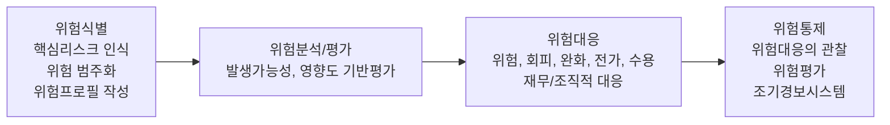

[그림 44] 위험관리 프로세스

#### 가) 위험식별

위험은 가급적 적기에 찾아내는 것이 중요하다. 위험 식별은 프로젝트에 영향을 미칠 수 있는 위험을 식별하고 문서화하는 단계를 포함한다. 일반적으로 많이 사용되는 위험 식별 방법은 문서검토이다. 계약서에 명시된 과업 범위와 일정이야말로 법적인 효력이 있기 때문에 가장 우선적인 위험으로 식별해야 한다. 계약서, 제안서, 프로젝트 수행 계획서를 교차 체크하여 누락된 부분이 없는지 더블 체크해야 한다. 왜냐하면 프로젝트 수행 계획서에서 누락됨으로써, 실제 구현이 되지 않았지만 계약서나 제안서에 명시되어 있었다면 인수조건에 위배되는 사항이기 때문이다.

〈표 65〉 위험식별 방법

<table>
<tr><th>위험 식별 방법</th><th>설명</th></tr>
<tr><td>문서검토 (Documentation Reviews)</td><td>계획서, 가정사항, 이전 관련 프로젝트 파일, 계약서 및 프로젝트 문서 검토 수행</td></tr>
<tr><td>정보 수집 기법(Information Gathering Techniques)</td><td>위험 식별을 위해 브레인스토밍, 델파이 기법, 인터뷰, 근본 원인 분석 등의 기법을 활용</td></tr>
<tr><td>점검목록 분석 (Checklist Analysis)</td><td>유사한 프로젝트나 기타 정보 출처에 축적된 선례 정보와 지식을 바탕으로 체크 리스트 작성. RBS(Risk Breakdown Structure; 위험 분류 체계) 최하위 수준을 위험 점검목록으로 사용 가능</td></tr>
<tr><td>가정사항 분석 (Assumption Analysis)</td><td>가정사항의 타당성을 조사하고 가정사항의 부정확성, 불안정성, 불일치성 또는 불완전성으로 프로젝트 위험 식별</td></tr>
<tr><td>도식화 기법 (Diagramming Techniques)</td><td>인과관계도, 시스템의 다양한 요소들이 상호 연계되는 방법을 표현한 시스템 또는 프로세스 흐름도, 문제 원인의 영향, 다양한 변수와 결과물의 관계를 보여주는 영향 관계도 등의 위험 도식화 기법 사용</td></tr>
<tr><td>SWOT 분석</td><td>내부적으로 발생한 위험을 포함시켜 식별된 위험의 범위를 확장할 수 있도록 SWOT 측면에서 프로젝트를 조사</td></tr>
<tr><td>전문가 판단 (Expert Judgment)</td><td>유사 프로젝트나 비즈니스 분야의 경험을 가진 전문가가 직접 위험을 식별하는 활동</td></tr>
</table>

위험식별의 핵심 산출물인 위험은 식별된 초기상태로 위험관리대장(Risk Register)에 기술된다. 식별된 위험을 위험관리 대장에 등록하고 정성/정량적 분석을 수행하여 위험의 우선순위를 정해 위험대응방안을 수립한다. 이러한 활동의 결과는 위험 관리대장에 기록하여 위험을 체계적으로 추적/관리할 수 있도록 한다.

<!-- PDF page: 128 -->

〈표 66〉 위험 관리대장 예시

| ID | 위험항목 | 확률 | 영향 | 노출도 | 우선순위 | 대응방안 | 담당자 |
| --- | --- | --- | --- | --- | --- | --- | --- |
| R_001 | 요구사항 불명확하게 정의 됨 | 9 | 9 | 81 | 1 | 요구사항 문서화, 주기적 관리 진행 | 홍길동 |
| R_002 | 신규 도입 S/W에 대한 검증 안됨 | 8 | 7 | 56 | 2 | BMT 진행 통한 선정 및 도입 | 홍길순 |
| R_003 | 일정에 대한 기간 촉박함 | 8 | 6 | 48 | 3 | 일정 관리를 위한 리소스 레벨링 | 홍길동 |

#### 나) 위험분석: 정성적 위험분석

정성적 위험분석은 위험 초기에 정성적으로 프로젝트에 얼마만큼의 영향이 있는지 분석하는 것을 의미한다. 정성적 위험분석이란 위험 식별이 마무리된 후 위험의 발생확률과 영향을 평가하여 위험의 우선순위를 지정하는 방법을 의미한다. 확률-영향 매트릭스는 위험의 발생 확률과 목표에 대한 영향을 정성적으로 평가하여 매트릭스 형식으로 분석하는 기법이다.

| 발생확률 / 목표에 대한 영향 | 0.1 | 0.2 | 0.4 | 0.6 | 0.8 |
| --- | --- | --- | --- | --- | --- |
| 0.9 | 0.09 | 0.18 | 0.36 | 0.54 | 0.72 |
| 0.7 | 0.07 | 0.14 | 0.28 | 0.42 | 0.56 |
| 0.5 | 0.05 | 0.10 | 0.20 | 0.30 | 0.40 |
| 0.3 | 0.03 | 0.06 | 0.12 | 0.18 | 0.24 |
| 0.1 | 0.01 | 0.02 | 0.04 | 0.06 | 0.08 |

범례: 낮음, 중간, 높음. <!-- 원본 매트릭스의 배경 명암은 생략함. -->

[그림 45] 확률–영향 매트릭스(예시)

위험 노출도는 'f(발생 가능성, 영향력) = 발생확률(P) Ⅹ 영향도(I)'이다. 발생확률은 거의 없음(0.1)부터 발생가능성 높음(0.9)의 척도를 이용한다. 목표에 대한 영향은 영향도 거의 없음(0.1)부터 영향도 높음(0.8)의 척도를 이용한다. 위험 노출도는 '발생확률 Ⅹ 영향도'를 계산하고 위험 등급을 낮음, 중간, 높음으로 서열화하여 위험에 대한 우선순위를 정하게 된다.

#### 다) 위험분석: 정량적 위험분석

정량적 위험분석은, 정성적 위험분석이 완료된 후, 우선순위가 정해진 위험에 대해 전체 프로젝트 목표에 미치는 영향을 수치(비용, 일정)로 분석하는 위험 분석 절차이다.

〈표 67〉 위험 분석 방법

<table>
<tr><th>위험 분석 방법</th><th>설명</th></tr>
<tr><td>인터뷰(Interviewing)</td><td>• 프로젝트 목표에 미치는 위험의 확률 및 영향을 수량으로 환산하기 위해 경험 및 선례 자료에 의존</td></tr>
<tr><td>확률분포 (Probability Distributions)</td><td>• 모델링 및 시뮬레이션에 광범위하게 사용되는 연속확률분포는 일정 활동 기간 및 프로젝트 구성요소의 원가 등의 값에서 불확실성을 표현</td></tr>
<tr><td>토네이도 다이어그램 (Tornado Diagrams)</td><td>• 투입 데이터에 같은 비율을 적용하여 산출물의 변화량을 설명하는 것으로 결과값은 민감도가 큰 순서대로 막대그래프로 표시</td></tr>
</table>

<!-- PDF page: 129 -->

<table>
<tr><th>위험 분석 방법</th><th>설명</th></tr>
<tr><td>시나리오 분석 (Scenario Analysis)</td><td>• 가정을 토대로 미래 상황을 기술하는 것으로 시스템 경계, 할당 방법, 기술, 시간, 공간 및 가중치 방법 등에 사용된다. 각 산출 결과에 대해 각 가정의 영향을 분석</td></tr>
<tr><td>몬테카를로 시뮬레이션 (Monte Carlo Simulation)</td><td>• 특정 변수를 예측하기 위해 확률모형의 모수나 변수에 대해 반복적으로 여러 수치를 대입하여 확률변수의 분포를 산정 투입되는 데이터의 확률분포에 따른 난수를 생성하여 누적분포를 만들고 누적결과를 분석하여 확률적 모형을 제공하는 통계적 분석</td></tr>
<tr><td>금전적 기대값 분석 (EMV Analysis)</td><td>• 위험을 감안한 기대화폐가치, 발생 가능한 경우에 대한 기대 값(Expected Monetary Value) EMV는 위험을 회피하지도 추구하지도 않는 위험 중립의 가정을 요구하고 각 결과 값에 발생 확률을 골라 곱한 후, 구해진 값들을 합산하여 계산하여 일반적으로 의사결정 트리 분석에서 사용</td></tr>
</table>

#### 라) 위험대응

위험대응은 프로젝트 목표에 위협적인 요인은 경감시키고 기회는 증대시킬 수 있는 대안과 조치를 개발하는 프로세스이다. 위험이 발생하려 하거나 발생한 경우 위험 대처 방안을 사전에 대응 전략에 따라 대응 계획을 실행하게 된다. 위험대응계획은 긍정적인 위험과 부정적인 위험에 따라 대응방법을 적용하게 된다. 부정적인 위험에 대한 전략은 프로젝트 목표에 부정적 영향을 미칠 수 있는 위협이나 위험을 최소화하기 위한 전략으로 회피, 전가, 완화 또는 수용 등의 전략으로 대응한다.

〈표 68〉 부정적인 위험대응 방법

<table>
<tr><th>방법</th><th>설명</th></tr>
<tr><td>회피(Avoid)</td><td>• 위험을 완전히 제거하기 위하여, 프로젝트 관리 계획서를 변경하는 조치를 포함하여 프로젝트의 목표를 위험의 영향 범위에서 고립시키거나 변경할 수 있는 방법. 예를 들면, 일정연장, 전략 변경, 범위 축소 등 조치를 포함</td></tr>
<tr><td>전가(Transfer)</td><td>• 위험으로 인한 영향력 및 대응의 주체를 제3자에게 이동시키는 것을 의미 • 단순히 책임을 넘기는 것일 뿐 위험 제거는 아님 • 위험에 대한 책임 전가는 재정적인 위험 노출을 다루는데 가장 효과적 • 전가 도구로서 보험 활용, 이행 보증, 각종 보증 및 보장 등이 있음</td></tr>
<tr><td>완화(Mitigate)</td><td>수용 가능한 한계선까지 위험의 발생 가능성과 목표에 미치는 영향의 수준을 낮추는 방법 • 예를 들면 프로젝트 초기 조치나 많은 테스트 수행, 단순한 프로세스 선택, 위험 완화 등이 있음</td></tr>
<tr><td>수용(Acceptance)</td><td>위험 제거가 불가능 할 경우 채택되는 전략으로서, 적절한 대응 전략을 수립할 수 없는 경우에는 수동적 수용과 능동적 수용을 선택함 수동적 수용. 전략을 문서화하는 일 외에 어떠한 조치도 필요하지 않으며 발생한 위험은 프로젝트 팀에서 처리 하도록 하는 방법 능동적 수용: 위험을 처리할 시간, 자본 또는 자원을 포함하여 적극적으로 우발사태 예비를 구축하는 방법</td></tr>
</table>

긍정적인 위험에 대한 전략은 프로젝트 목표에 긍정적인 영향을 미칠 수 있는 위험을 처리하기 위한 전략으로 활용, 분담, 증대, 수용으로 대응한다.

〈표 69〉 긍정적인 위험대응 방법

<table>
<tr><th>방법</th><th>설명</th></tr>
<tr><td>활용(Exploit)</td><td>• 프로젝트 수행 기간 동안 기회가 확실하게 나타나도록 불확실성을 제거하는 활동으로 제공 원가를 낮추거나 완료 시간을 단축하기 위해 유능한 자원을 투입하는 등의 조치 필요</td></tr>
<tr><td>분담(Share)</td><td>• 프로젝트 진행에 긍정적 영향이 있는 경우 기회 소유권을 다른 조직과 분담하는 활동을 통해 기회를 실현하는 방법으로 위험 분담 협력사, 특수 목적 조직 등과 같이 협력 관계를 구축하는 방법도 포함</td></tr>
</table>

<!-- PDF page: 130 -->

| 방법 | 설명 |
| --- | --- |
| 증대(Enhance) | 기회의 확률 및 영향을 극대화하기 위한 전략으로 주요 원인을 식별하여 효과를 극대화하기 위한 조치 수행 |
| 수용(Acceptance) | 기회를 활용하지만 적극적으로는 추진하지 않는 것으로 위험이 발생하도록 그대로 두는 것을 선택 |

#### 마) 위험통제

위험통제는 위험 대응 계획을 구현하고 식별된 위험을 추적 관리, 잔여 위험을 모니터링하며 새로운 위험을 식별하고 위험관리 활동을 평가하기 위한 프로세스이다. 식별된 위험 및 위험을 감시하고 위험 관리가 효과가 있는지 조사하여 문서화하는 활동으로 위험 대응책에 대한 유효성을 평가한다.

〈표 70〉 위험 통제 방법

<table>
<tr><th>방법</th><th>설명</th></tr>
<tr><td>위험재평가 (Risk Reassessment)</td><td>• 위험 감시 및 통제 결과로 새로운 위험 식별, 현재 위험 재평가, 시기가 지난 위험의 종결 활동으로 정기적인 일정을 가지고 수행</td></tr>
<tr><td>위험감사 (Risk Audits)</td><td>• 식별된 위험 및 근본 원인을 처리하는 위험 대응책의 효과와 위험 관리 프로세스의 효과를 조사하여 문서화</td></tr>
<tr><td>차이 및 추세 분석 (Variance and Trend Analysis)</td><td>• 계획한 결과물과 실제 결과물을 비교하기 위해 차이 분석 활용, 사건 감시 및 통제 목적으로 성과 정보를 이용하여 프로젝트 실행의 추세 검토</td></tr>
<tr><td>기술적 성과 (Technical Performance Measurement)</td><td>• 프로젝트 실행 동안 기술적 성과를 프로젝트 관리 계획서의 기술적 성과 일정과 비교, 기술적 성과 측정은 중량, 거래 횟수, 결함 상태 인도물의 수, 저장 용량 등을 포함함</td></tr>
</table>

[참고 및 추천 자료]

[1] 강정배, 서정훈, 이지현, “PMP 바이블”, 한빛미디어, 2015.

[2] Project Management Institute, “A Guide to the Project Management Body of Knowledge”, 5e., PA: Project Management Institute, 2013.

[3] 강정배, 서정훈, 이지현, “인사이트 프로젝트 관리,” 서울: 한국생산성본부, 2012.

[4] “http://cafe.naver.com/”, KPC 기술사회

<!-- PDF page: 131 -->

## XIV. 프로젝트 도구 및 평가

### 최근 동향 및 주요 이슈

과거에는 프로젝트가 일정 내 완료 했는지, 예산을 초과하지 않았는지, 최초 계획한 목적을 달성했는지 등의 기준이 프로젝트 성공과 실패를 측정하는 기준이었다면 현재의 프로젝트 평가 기준은 기업의 경영목표 달성과 경쟁력 향상을 위해 정량적과 정성적으로 얼마나 기여했는지 평가하는 기준이다.

### 학습 목표

1. 프로젝트 평가의 개념과 단계별 프로세스를 설명할 수 있다.

### 개념 요약

- 평가 단계: 사전평가, 중간평가, 사후평가

- 평가 유형: IT 투자성과 관리, 성과평가

<!-- PDF page: 132 -->

### 실무 미리보기

프로젝트 평가 기준이 계획된 일정과 예산 범위 내에서 무난히 완료된 경우 성공적인 프로젝트라고 평가 한다면 이런 기준에 반기를 드는 사례가 호주의 오페라하우스이다. 1958년에 기공식과 함께 시작된 프로젝트는 공사기간이 길어지고 비용도 기하급수적으로 증가하여서 공사기간은 당초 계획보다 6년이 늘어났고 비용도 최초 예산 대비 15배가 늘어난 비용이 들어갔다. 공사기간과 비용이 당초 계획대비 엄청나게 늘어난 프로젝트는 프로젝트 관리 측면에서 보면 실패한 프로젝트이다. 하지만 현재는 어떠한가? 매년 1억 명 이상 관광객이 방문해 총 공사비의 몇 배 수익을 올리고 있고 현대 건축물로는 유네스코 세계문화유산으로 지정되기까지 하였다.

기업에서 프로젝트의 성과와 평가는 범위와 일정, 비용의 준수라는 기준을 벗어나지는 못하지만 최초에 설정했던 계획보다 미달되었다고 무조건 실패는 아니다는 것을 염두에 두고 프로젝트 완성물에 대한 가치를 고려한다면 범위, 일정, 비용의 변경에 대해 투명하고 신뢰성 있게 의사결정을 하는 것이 필요하다.

### 01 프로젝트관리 도구 이해

#### 가) 프로젝트관리 도구(Project Management System, PMS)

전사적 대규모 프로젝트의 관리는 많은 인적, 물리적 노력이 들어간다. 프로젝트 관리자는 관리의 효율성을 위하여 몇 가지 실무적인 소프트웨어를 연동하여 프로젝트를 관리한다. 프로젝트관리를 위하여 진척도를 자동관리 해주는 소프트웨어가 있다. 각각의 프로젝트 팀 구성원이 각자의 프로젝트 활동 완료율을 입력하면 엑셀, 프로젝트 관리 시스템(PMS: Project Management System) 등을 이용하여 전체 프로젝트 진척도를 관리한다. PMS는 프로젝트 생성부터 종료까지 전 과정을 관리하는 시스템으로 프로젝트 관리의 효율성과 투명성을 제공하고 위험요소를 제거하고 일정을 관리하기 위한 시스템이다.

대표적인 오픈소스 도구로는 레드마인(Redmine), 간트 프로젝트(Gantt Project), 오픈 프로젝트(Open Project) 등이 있다.

<!-- PDF page: 133 -->

<!-- 원본 프로젝트 진행률 관리 도구의 화면 이미지는 생략함. -->

[그림 46] 프로젝트 진행률 관리 도구(예시)

#### 나) 위험관리 도구(Risk Management System, RMS)

프로젝트 관리자는 프로젝트의 착수에서 종료 프로세스까지 수많은 이슈와 위험 발생을 대비해 프로젝트 끝까지 감시 및 통제를 수행해야 한다. 요구사항 추적표를 이용하여 관리하는 것과 같이, 이슈와 위험도 이슈관리 도구를 사용하여 관리하며 [그림 47]은 이슈 및 요구사항 관리 소프트웨어의 예이다.

<!-- 원본 프로젝트 이슈 및 위험 관리 도구의 화면 이미지는 생략함. -->

[그림 47] 프로젝트 이슈 및 위험 관리 도구(예시)

<!-- PDF page: 134 -->

#### 다) 형상관리도구(Configuration Management System, CMS)

형상관리도구는 여러 명이 동시에 작업하는 환경에서 소스코드나 산출물을 체계적으로 관리하여 중복수정이나 업데이트 된 내용의 소실을 방지하는 관리 도구이다. 주로 소스코드나 산출물의 이력을 추적하고 버전관리(version)등을 수행한다. 이를 지원하는 대표적인 도구들은 CVS, Subversion, Git 등이 있다.

| 항목 | CVS | SVN | GIT |
| --- | --- | --- | --- |
| 라이선스 | GNU GPL v2.0 | Apache License v2.0 | GNU GPL v2.0 |
| 적용언어 | 무관 | 무관 | 무관 |
| OS | Windows/Linux Mac은 써드 파티 도구 | Windows/Linux/Mac | Windows/Linux/Mac |
| 실행환경 | Comamand Line Interface | Comamand Line Interface | Comand Line Interface |
| GUI | TortoiseCVS 등 써드 파티 도구 | TortoiseSVN, WinSVN 등 써드 파티 도구 | 번들로 제공 SourceTree, GitEye, git–cola 등 다양한 써드 파티 도구 |

[그림 48] 형상관리 도구의 비교

#### 라) 프로젝트 관리시스템 활용의 장점

프로젝트관리 시스템을 활용하면 다음과 같은 장점을 얻을 수 있다.

① 성공적인 프로젝트관리

전체적인 프로젝트 진행에 대한 가시성을 확보할 수 있다. 즉, 전체 프로젝트의 진행이 어디까지 진행되었고 앞으로 어떠한 작업들이 남아있는지 예측하며 진행이 가능하다. 따라서 계획적인 프로젝트관리가 가능한 장점이 있다.

② 효과적인 팀 관리

효과적으로 각 업무 테스크를 팀원들에게 배정하고 일정관리가 가능하다. 큰 프로젝트의 목표달성을 위해 쪼개어진 업무 단위를 팀, 팀원별로 나누어 분배하고 역할 관리하는 작업이 편리해진다.

③ 조직역량의 향상

전체 진행되는 프로젝트의 전 과정에 걸친 히스토리가 기록되며 각 단계별 산출물이 등록되어 조직의 자산(Asset)이 관리된다. 이를 통해 유사한 프로젝트를 진행할 경우 참조모델로 활용이 가능하여 조직의 전체적인 수행역량이 향상된다.

### 02 프로젝트 모니터링 및 평가의 개념

#### 가) 프로젝트 모니터링 및 평가의 개념

프로젝트 모니터링 및 평가는 프로젝트가 계획된 시간 안에 납기가 완료되었는지, 비용이 예산에 비해 과도하게 초과되지는 않았는지 등을 평가하는 과정이다. 이러한 평가를 진행하는 이유는 첫째, IT에 대한 투자가 얼마나 비즈니스 목표달성에 기여하였는지를 평가하기 위함이고 둘째는, 프로젝트에 대한 회고를 통해 각 단계별로 진행에 문제는 없었는지, 과정상 대응에 문제가 될만한 부분은 어디인지를 파악하고 향후 프로젝트 진행에 반영하기 위함이다. 따라서 프로젝트 평가는 첫째, 재무적인 관점, 둘째, 관리적인 관점, 셋째, 기술적인 관점의 총 3가지 측면에서 일반적으로 진행하게 된다. 재

<!-- PDF page: 135 -->

무적인 관점에서는 투자 평가, ROI 등을 평가하게 되며 관리적인 관점에서는 프로젝트 진행의 프로세스(일정, 범위, 품질, 위험관리 등) 평가, 기술적인 관점에서는 프로젝트에 적용된 기술, 솔루션 등의 관점에서 평가하게 된다.

#### 나) 프로젝트 평가 수행

프로젝트는 많은 투자 관리가 필요하기 때문에 기업에서는 일반적으로 프로젝트를 복수로 진행하며 체계적인 관리를 필요로 한다. 프로젝트 평가 내용은 프로젝트 착수부터 프로젝트 종료 후, 프로젝트 투자에 대한 평가이다.

PMO(Project Management Office)

| 프로젝트 착수 단계 | 전사 프로젝트 포트폴리오 관리 | 프로젝트 투자 평가 |
| --- | --- | --- |
| 프로젝트 투자 의사판단 참여(4C, 7S, SWOT 분석) 프로젝트 진입 통로 및 관리 프로젝트 Resource Acquisition | 프로젝트 통합관리 프로젝트 범위관리 프로젝트 일정관리 프로젝트 비용관리 프로젝트 품질관리 프로젝트 인력관리 프로젝트 의사소통 관리 프로젝트 위험관리 프로젝트 구매관리 프로젝트 이해관계자 관리 | 프로젝트 투자 평가 관리 프로젝트 결과 분석 프로젝트 Gap 분석 |

Planning → Execution → Closing

Control & Monitoring

[그림 49] PMO를 통한 프로젝트 투자 평가 프로세스

프로젝트가 완전히 종료되었다고 해서 모든 것이 마무리되는 것은 아니다. 하나의 프로젝트에 많은 인원 및 비용이 투자되었기 때문에 공정한 사후평가 프로세스 수행이 필요하다. 아래 예시는 프로젝트 정보시스템의 가치 및 인식에 대한 평가 항목이다.

<!-- PDF page: 136 -->

| 프로젝트 평가항목 | 비율 |
| --- | --- |
| 투자 대비 회수 금액 | 51% |
| 경영전략 일치성 | 38% |
| 매출증대효과 | 27% |
| 비용절감효과 | 22% |
| 사용자 만족도 | 20% |
| 경쟁적 차별성 | 18% |
| 프로세스 향상 | 16% |
| 재활용 | 13% |

[그림 50] 프로젝트 평가항목(예시)

다음 프로젝트의 결과는 프로젝트에 대한 프로젝트 현장에서 수립한 프로젝트 목표와 4개월이 지난 시점에 결과를 평가를 한 사례이다. 월 매출 기준으로 월별 프로젝트의 성과를 파악하여 프로젝트의 투자평가와 함께, 향후 운영, 개선사항을 도출하기 위한 목적으로 사용된다.

| 기간(X축) | 매출(억, Y축) 왼쪽 막대 | 매출(억, Y축) 오른쪽 막대 |
| --- | --- | --- |
| 4월 | 5.0 | 3.6 |
| 5월 | 7.0 | 15.2 |
| 6월 | 10.0 | 20.1 |
| 7월 | 13.0 | 19.2 |
| 8월 | 0.0 | 0 |
| 9월 | 0.0 | 0 |

<!-- 원본 막대그래프에 계열 범례가 없어 좌우 위치로 구분함. -->

[그림 51] OO 프로젝트 결과 4개월 성과 측정(X축: 기간, Y축: 매출(억))(예시)

프로젝트 관리자는 프로젝트 관리 도구 및 평가 작업을 통해, 기획서 및 비즈니스 케이스(Business Case)를 확인하여 목표에 도달했는지 프로젝트를 정량적으로 파악하고, 이를 통해, 지속적인 프로세스 개선에 적극 관리 • 지원하는 일을 수행해야 한다.

#### 다) 프로젝트 평가단계와 주안점

프로젝트 평가단계는 IT의 성과를 앞서 살펴본 3가지 측면에서 기업의 경영목표 달성에 얼마나 기여했는가를 분석하는 작업으로 프로젝트 평가하는 시기에 따라 사전 평가, 중간 평가, 사후 평가로 구분할 수 있다.

<!-- PDF page: 137 -->

〈표 71〉 프로젝트 평가 단계

<table>
<tr><th>평가 단계</th><th>설명</th></tr>
<tr><td>사전 평가 (Ex-Ante)</td><td>프로젝트의 사전 타당성을 분석하고 IT 투자에 대한 의사결정을 지원 • 여러 프로젝트에 대해 우선순위를 결정 • 평가는 수시로 진행되며 IT 프로젝트에 대한 추진 결정 및 대안 선택 • 기업에서는 매년 내년도 예산 수립을 위해 우선순위를 결정</td></tr>
<tr><td>중간 평가 (Interim—Ante)</td><td>프로젝트 진행 중에 이루어지는 평가, 감리 및 점검 등의 형식으로 실시 • 목표 달성에 대한 IT 투자 위험 관리</td></tr>
<tr><td>사후 평가 (Post-Ante)</td><td>• 프로젝트가종료된 후 일정 기간 경과 후에 수행하는 평가 IT 투자에 대한 기업의 경영목표 달성 여부 확인 프로젝트의 효과성 및 투자 타당성 확인 • 분기, 반기, 연차별 정기적인 평가 • 평가 후 향후 개선방안 도출과 IT 운영 효율성 제고</td></tr>
</table>

이러한 3단계의 평가과정을 거쳐 얻는 장점으로는 다음의 4가지를 들 수 있다.

- IT 투자의 비즈니스 목표지원의 효과성 검증

- 향후 프로젝트 성과개선을 위한 교훈 도출

- 프로젝트 진행의 개선포인트 도출 및 개선안 마련

- 점진적, 지속적 프로젝트 관리 프로세스의 향상

[참고 및 추천 자료]

[1] 강정배, 서정훈, 이지현, “PMP 바이블”, 한빛미디어, 2015.

[2] 강정배, 서정훈, 이지현, “인사이트 프로젝트 관리”, 서울: 한국생산성본부, 2012.

[3] Project Management Institute, “A Guide to the Project Management Body of Knowledge”, 5e., PA: Project Management Institute, 2013.

[4] “http://cafe.naver.com/81th.cafe”, KPC 기술사회

[5] 프로젝트관리 표준(Iso 21500) 이행가이드, 산업통상자원부 기술표준원, 2013.

<!-- PDF page: 138 -->

<!-- 빈 페이지 -->

<!-- PDF page: 139 -->

<!-- 빈 페이지 -->
