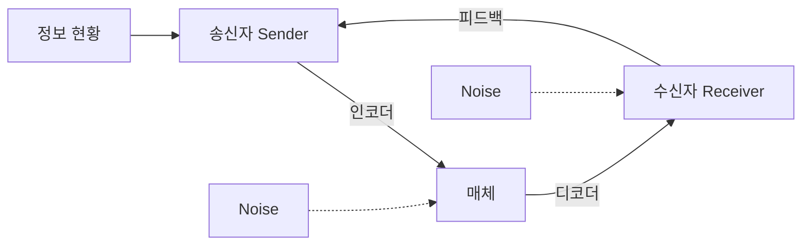

<!-- PDF page: 018 -->

### 01 비즈니스 커뮤니케이션 개념 및 요소

비즈니스 커뮤니케이션이란 무엇인지에 대해 살펴보기 위해서 우선 각각 비즈니스와 커뮤니케이션에 대해 살펴보고, 이후 비 즈니스 커뮤니케이션에 대한 최종 정의를 내려보고자 한다. 마지막으로 비즈니스 커뮤니케이션을 구성하는 핵심요소들을 살펴봄으로써 비즈니스 커뮤니케이션의 전반적인 개요를 이해하고자 한다.

#### 가) 비즈니스 커뮤니케이션의 정의

비즈니스란 사전적 의미로 어떤 일을 일정한 목적과 계획을 가지고 짜임새 있게 지속적으로 경영함1을 의미한다. 통상 적으로 비즈니스라는 용어는 일반 기업이 하는 제반 활동들을 의미하지만, 사업 아이템이나 사업 분야를 말하는 경우 도 있다. 경영학에서는 비즈니스란 고객에게 제품과 서비스를 제공하고 대가로 이익을 획득하는 일련의 활동이라고 할 수 있다.

영어로 communication은 라틴어 communicare 에서 유래했고 공유한다는 의미이다. 커뮤니케이션은 서로 다른 두 사람 혹은 집단 간에 상호 이해가능한 수단으로 정보나 의미를 공유하는 시스템이나 프로세스를 말한다.

비즈니스 커뮤니케이션은 결국 기업이 고객에게 제품이나 서비스를 제공하고 이윤을 획득하는 일련의 비즈니스 수행 과 정 속에서 발생하는 정보나 의미들을 다양한 이해관계자들과 공유하는 시스템이자 프로세스 일체를 말한다. 이를 통해 비즈니스 목표달성을 이루려고 하는 것이 목적이다.

비즈니스 목표달성의 과정 속에서 정보를 공유하기 위해서는 전달(Transference)과 상호이해(Understanding)를 바탕으 로 개인 또는 집단 간을 불문하고 다양한 이해관계자들과 회의를 하거나 통화를 하고, e-메일을 주고받고, 발표자료를 만드는 등 여러 가지 방식으로 이루어진다.

#### 나) 비즈니스 커뮤니케이션의 요소

[그림 1] 비즈니스 커뮤니케이션 프로세스와 요소

1 출처: 네이버 국어사전

2 출처: 위키피디아
