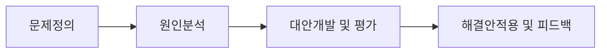

<!-- PDF page: 025 -->

### 01 비즈니스 문제해결 기법

#### 가) 비즈니스 문제해결 개념

비즈니스 환경에서 문제란 크게 새로운 기회를 창출하는 기획과 내부 프로세스의 개선, 두 가지로 정의해 볼 수 있다. 기 획은 사업기회인 '블루오션'을 찾는 과정이라고 말할 수 있으며 이는 현재 문제점이 있으나 이를 해결할 수 있는 방안을 통해 새로운 시장을 창출하는 과정을 말한다. 내부 프로세스 개선은 현재 가지고 있는 기회시장을 보다 효율적으로 운영 하기 위한 과제이다. 두 경우 모두 정확히 인식되고 정의하고 해결할 때, 비즈니스의 안정적 연속성을 보장할 수 있고 새 로운 기회창출이 가능해진다. 따라서 비즈니스 문제는 최적의 문제해결 프로세스와 비즈니스적 사고를 통해 해결해 나 가는 것이 무엇보다도 중요하다.

| 폭넓고 깊이있는 지식/정보 | + 최적의 조합을 찾아내는 노력 | = 문제해결(지혜) |
|---|---|---|
| 좋은 정보를 확보하기 위한 다양한 노력 자세히 관찰하고 구체적으로 분석하여 깊이있는 지식을 얻는 역량 남으로부터 양질의 노하우를 얻어내는 역량 | 고정관념을 뛰어넘어 항상 원점에서 다시 생각해보는 제로베이스 사고 남의 말에 귀를 열고 듣는 노력 감정을 배제한 냉철함 | 직관(체험)없는 개념은 공허하고, 개념없는 직관은 맹목적이다(칸트). |

[그림 5] 지식/정보와 최적 조합의 노력을 통한 문제해결 프로세스

#### 나) 비즈니스 문제해결 프로세스

비즈니스 문제해결 프로세스는 업무수행 과정에서 발생하는 다양한 형태의 문제를 인식하고, 이를 분석하여 해결하기까 지의 과정을 이해하고 합리적인 근거를 바탕으로 기존의 문제해결 방식을 적절하게 응용하여 새로운 해결 방안을 제시하는 것이다. 문제해결 기법은 일반적으로 다음과 같이 제시된다.

| 문제정의 | 원인분석 | 대안개발 및 평가 | 해결안적용 및 피드백 |
|---|---|---|---|
| 문제의 인식 문제정의 기술 | 프로파일링 및 분석기법 활용 | 평가기준 & 가중치 기반 평가 | 실행 및 평가 피드백 및 개선 |

[그림 6] 일반적 문제해결 프로세스 상세
