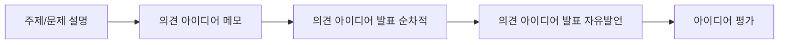

<!-- PDF page: 026 -->

① 1단계: 문제정의

- 문제정의 단계에서는 해결하고자 하는 문제가 무엇인지를 정한다. 문제기술서 작성을 통하여 문제의 핵심을 파악할 수 있도록 정리하고, 문제가 근본적인 해결이 가능한지를 확인하여야 한다. 문제정의 시에는 하나의 문제가 아닌 MECE5한 형태로 분류하여 정의하는 것이 보다 정확한 문제정의에 도움이 된다.

② 2단계: 원인분석

- 원인분석 단계에서는 정의된 문제를 논리적인 기준에 따라 분류하고 단계별 구조를 형성한다. 구조화된 문제는 발생하 게 된 원인을 구체적으로 분석하기 위해 가장 큰 문제점부터 논리적인 순서에 따라 작은 단위로 분해하여 트리 형태로 정리하는 이슈트리를 이용한다. 정리된 문제의 하위부터 프로파일링과 다양한 분석기법을 활용하여 문제의 근본원인을 찾아낸다. 또한 최종적으로 식별된 문제의 원인들은 우선순위를 정하여 문제해결의 근본에서 중요하지 않은 원인들을 덜어내는 과정이 필요하다.

③ 3단계: 대안개발 및 평가

- 대안개발 및 평가 단계에서는 원인분석 단계에서 최종 도출된 문제의 원인을 해결하기 위한 다양한 측면의 대안을 개발 한다. 문제의 근본원인으로부터 다양한 가설을 수립하고 프로파일링으로 발견된 사실들을 대입하여 개발된 대안들은 평 가기준과 각 기준별 가중치를 통해 평가되고 하나 또는 몇 가지 대안이 최종 선택된다.

④ 4단계: 해결안 적용 및 피드백

- 해결안 적용 및 피드백 단계에서는 최종 선택된 대안을 검증하는 단계이다. 수립된 대안을 가장 효율적으로 검증가능한 테스트베드와 방법을 찾고 이를 실행하기 위한 준비를 하도록 한다. 상세 WorkpIan을 기반으로 대안을 실행함과 동시에 효과성을 정량적으로 피드백하여 대안의 타당성을 검증 및 피드백하도록 한다.

#### 다) 창의적 사고기법

직무수행 과정에서 발견되는 일상적인 문제를 명확히 정의하고 이를 해결하기 위한 솔루션이나 프로세스를 다양한 아이 디어를 통해 이끌어내는 것이 중요하다. 이를 위해서는 사고의 흐름을 적절한 기법을 통해 의식적으로 유도할 필요가 있 다. 이러한 수평적 프로세스를 통해 창의적으로 문제를 해결하는 사고기법에는 다음과 같은 방법이 있다.

① 브레인 스토밍(Brainstorming)

1940년대 미국의 광고업자 알렉스 오스본(AIex Osborn)이 아이디어를 내기 위한 일종의 회의방법으로 고안해 낸 것으로. Brainstorming이란 말의 원래 의미는 정신병 환자의 두뇌 산란상태를 말하는 것이다. 즉, 두뇌에서 폭풍우가 몰아치는 것 과 같은 이상현상을 회의에서의 아이디어 발상법으로 사용하고 있다. 문제의 원인분석, 해결안의 도출, 평가기준 개발 및 실행계획의 수립 등 문제해결 전 과정에서 활용될 수 있다.

[그림 7] 브레인스토밍의 흐름

② 여섯 가지 생각모자(6 Thinking Hat)

여섯 가지 생각모자는 에드워드 드보노(Edward de Bono)에 의해 개발된 방법으로 단순하면서도 효과적으로 사고하기 위
