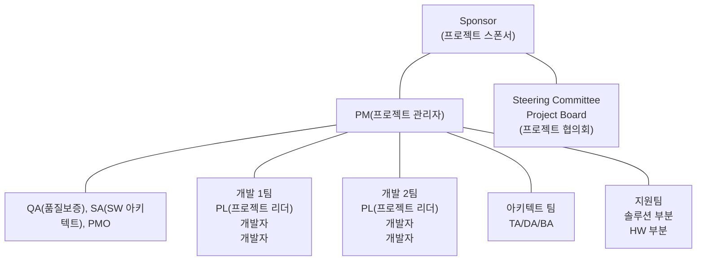

<!-- PDF page: 071 -->

〈표 33〉 프로젝트 조직구조

| 구분 | 기능 조직 | 약한 매트릭스 | 균형 매트릭스 | 강한 매트릭스 | 프로젝트 중심 조직 |
| --- | --- | --- | --- | --- | --- |
| 권한 수준 | 거의 없음 | 최소 | 최소~보통 | 보통~강함 | 모든 권한 |
| 시간 투자 | 시간제 | 시간제 | 종일제 | 종일제 | 종일제 |
| 역할 | 촉진자 | 촉진자 | 조정자 | 관리자 | 관리자 |

일반적으로 SW 개발이나 시스템 구축을 위한 프로젝트를 진행하는 경우에는 고객사의 프로젝트 담당자들과 IT 개발사 인원들이 합쳐져서 프로젝트 조직을 꾸리게 된다.

[그림 19] 프로젝트 수행 조직도

프로젝트 수행 조직은 프로젝트 관리자(PM, Project Manager)와 각 개발팀을 이끄는 프로젝트 팀장(PL, Project Leader), 개발자, 프로젝트 관리자의 직속 스태프인 품질보증 담당(QA, Quality Assurance), 아키텍트 지원 SA(Software Architect), 사업관리 지원 PMO(Project Management Office), 프로젝트를 지원하는 지원조직(UI 디자인팀, 테스트 조직 등), 아키텍트 팀, PM을 포함하여, 프로젝트의 범위나 일정상의 변경 같은 상위 의사결정을 지원하는 운영위원회 및 스폰서 등이 있다. 물론 프로젝트 수행 조직은 개별 프로젝트마다 목표와 성격에 따라 달라질 수 있다.

#### 나) 프로젝트 관리자의 책임과 역할

“프로젝트 관리자란 누구를 말하며, 그는 프로젝트에서 무엇을 하는 사람일까?”

'프로젝트 관리자는 프로젝트에 대한 전체범위와 일정을 책임을 지고 있는 사람이다. 즉 프로젝트 초기 단계부터 종료 시점까지 품질과 이해관계자에 대한 이슈와 위험의 해결뿐 아니라 프로젝트 진행률 전체를 관할하며 의사소통 하는 담당자’라고 할 수 있겠다. 프로젝트 관리자가 하나의 프로젝트를 수행하기 위해서는 다음의 3가지 구분된 역량을 이해하고, 수행할 수 있어야 한다.
