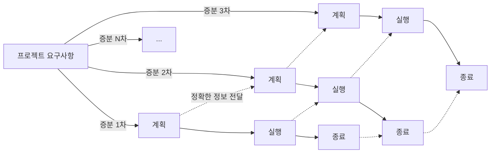
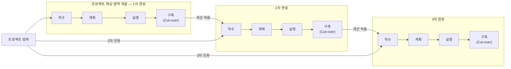

<!-- PDF page: 078 -->

명주기는 증분형과 진화형으로 나눌 수 있다.

- 증분형 생명주기: 프로젝트 범위를 N단계로 분할하여 프로젝트를 점진적이고 반복적인 병렬로 중첩해서 수행한다.

- 진화형 생명주기: 프로젝트 단계를 여러 단계로 구분하고 반복 자체를 순차적으로 진행한다.

[그림 22] 증분형 생명주기

[그림 23] 진화형 생명주기

적응적 생명주기는 외부 변화에 민첩하게 반응하는 애자일 프로세스를 얘기하는 것이며 프로젝트의 가치에 맞게 요구사항 변화에 유연하게 대응하는 것이 목적이다.

#### 나) 프로젝트 기획 및 착수

프로젝트가 계약되어 착수되기 이전의 단계를 간단히 살펴보자면, 크게 기획단계와 발주단계, 계약단계를 거치게 된다.

기획단계에서는 해당 프로젝트의 타당성 분석, 예산편성 등의 선행 작업이 수행된다. 발주단계에서는 사업범위 정의 및 제안요청서(RFP, Request For Proposal) 작업이 이루어지고, 필요 시 제안요청 설명회를 개최할 수 있다. 이후 계약단계에서는 사업자를 선정하기 위해 제출된 제안서를 평가하고, 기술협상 등을 통하여 최종 사업자선정 및 계약이 이루어지게 된다.
