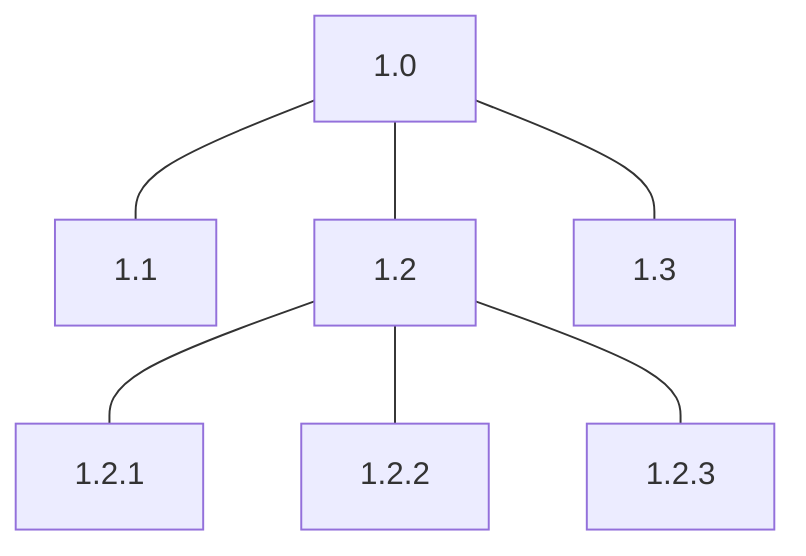

<!-- PDF page: 088 -->

② 작업분류체계(WBS)의 구조

작업분류체계는 트리 구조 형식을 가장 많이 사용하며 마치 부모-자식 간의 관계로 요소들을 표현하여 상하 관계를 직관적으로 파악하기 용이하다.

[그림 27] 작업분류체계 구조

③ 작업분류체계(WBS)의 구성 요소

작업분류체계의 구성 요소는 작업 패키지, 식별 번호, WBS 사전, RAM이며 이에 대한 설명은 다음과 같다.

〈표 38〉 작업분류체계의 구성 요소

<table>
<tr><th>구성 요소</th><th>설명</th></tr>
<tr><td>작업 패키지 (Work Package)</td><td>일정을 계획하고 원가를 산정, 감시, 통제할 수 있는 단위로 분할이 완료된 시점의 최하위 단위</td></tr>
<tr><td>식별 번호 (Code of Account)</td><td>작업분류체계의 구성요소에서 넘버링 체계를 가지는 고유한 ID, 이를 통해 작업 패키지에 유일한 번호가 부여됨</td></tr>
<tr><td>WBS 사전 (WBS Dictionary)</td><td>각 작업 패키지의 상세한 내용을 기술한 것(개요, 일정, 책임자, 예산)</td></tr>
<tr><td>RAM(Responsibility Assignment Matrix)</td><td>각 담당자별로 각 단계별 승인자, 품질검토자, 투입물 책임자 등의 기준이 됨</td></tr>
</table>

④ 작업분류체계(WBS)의 작성 방법

작업분류체계는 범위 기술서에 기술된 주요 인도물 및 작업을 식별할 수 있도록 작고, 관리 가능한 작업 패키지 수준으로 세분화하여 작성한다.

〈표 39〉 작업분류체계의 작성 방법

| 작성 원칙 | 설명 |
| --- | --- |
| 산출물 중심 | 업무 범위를 통제하여 관리하기 위한 명확한 실체를 갖는 산출물 중심 |
| 관리 가능 | 작업 성과를 통제하기 용이하게 WBS의 최하위 단위는 통상 80시간(2주) 내외의 기간으로 분할 |
| 상세 세분화 | 프로젝트 수행 인원이 보통 1~2주 안에 처리 할 수 있는 단위로 세분화 |
| 전후관계 정의 | 각 WBS별 선후 관계 및 연관 관계의 파악이 가능하도록 정의 |
