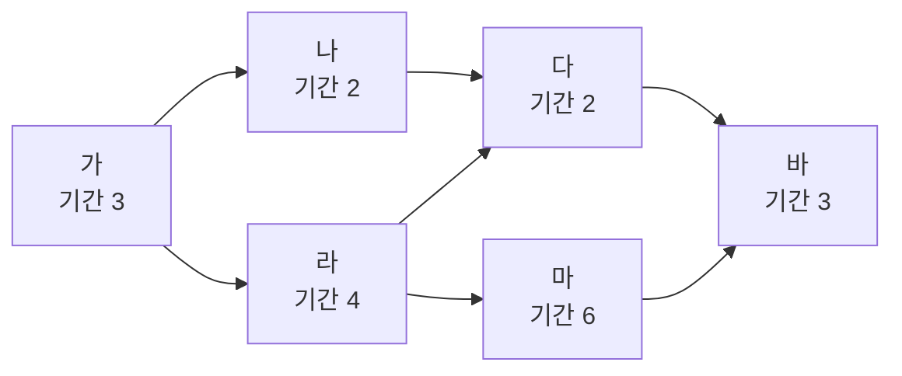

<!-- PDF page: 096 -->

<table>
<tr><td>구성요소</td><td>특징 및 설명</td></tr>
<tr><td>늦은 종료일</td><td>LF, Late Finish • 프로젝트 종료일에 영향을 주지 않으면서 어떤 활동이 가장 늦게 종료되는 날</td></tr>
<tr><td>총 여유시간</td><td>• Total Float • 프로젝트 종료일을 지연시키지 않으면서 한 활동이 가질 수 있는 총 여유시간 • 총 여유 = 늦은 종료일(LF)–빠른 종료일(EF) = 늦은 개시일(LS)–빠른 개시일(ES)</td></tr>
</table>

임계 경로법으로 일정을 수기로 산정하기 위해서 활동을 다음과 같이 표현한다.

<table>
<tr><td>ES</td><td>기간</td><td>EF</td></tr>
<tr><td colspan="3">활동 이름</td></tr>
<tr><td>LS</td><td>여유 시간</td><td>LF</td></tr>
</table>

[그림 29] 활동 표현 방법

아래는 임계 경로법으로 일정을 산정하는 예이다. 아래 예시를 통하여 임계 경로법에 대해 자세히 살펴보기로 한다.

〈표 44〉 임계 경로법 활동(예시)

| 활동 이름 | 기간 | 선행활동 |
| --- | --- | --- |
| 가 | 3일 | |
| 나 | 2일 | 가 |
| 다 | 2일 | 나, 라 |
| 라 | 4일 | 가 |
| 마 | 6일 | 라 |
| 바 | 3일 | 다, 마 |

① 활동정의 및 기간산정

프로젝트의 활동이 정의되고 각 활동마다 기간이 산정된다면 다음과 같이 선후관계에 따라 활동을 연결한다. 선후관계에 따라 식별된 활동을 배열하고 활동이름과 기간을 입력한다.

[그림 30] 주공정법①(예시)
