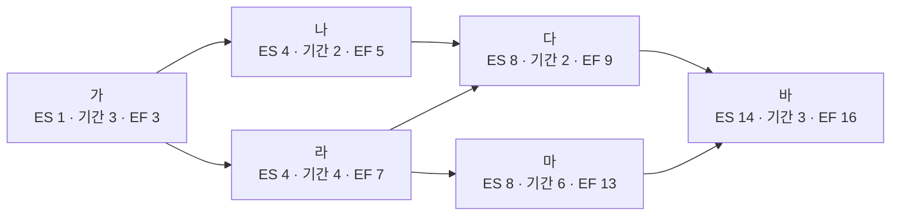

<!-- PDF page: 097 -->

활동 이름 “나”의 경우, 선행활동이 “가”이므로 활동 “가”의 뒤에 위치하고, 활동 “나”의 기간은 2일이므로 “기간”에 2라고 입력한다. 다른 모든 활동들도 이와 같이 선행활동을 파악하여 순서를 배치하고, 해당 활동의 기간을 활동이름 상단에 기입한다.

② 전진계산

각 활동의 빠른 개시일(ES), 빠른 종료일(EF)을 계산하는데, 계산식은 아래와 같다.

- ES = 선행 EF + 1

- EF = 당행 ES + 기간–1

〈표 45〉 각 활동별 전진계산 결과

| 활동 이름 | ES(Early Start) | 기간 | EF(Early Finish) |
| --- | --- | --- | --- |
| 가 | 1 | 3 | 3(1 + 3–1) |
| 나 | 4(3 + 1) | 2 | 5(4 + 2–1) |
| 다 | 6(5 + 1) 8(7 + 1) | 2 | 9(8 + 2–1) |
| 라 | 4(3 + 1) | 4 | 7(4 + 4–1) |
| 마 | 8(7 + 1) | 6 | 13(8 + 6–1) |
| 바 | 14(13 + 1) | 3 | 16(14 + 3–1) |

“가” 활동의 경우, 선행 EF가 없으므로, ES는 1로 시작한다.

“다” 활동의 경우, 선행 활동이 “나”와 “라” 두가지가 있다. 이 경우, “다” 활동은 결국 “나” 와 “라” 활동 모두가 종료된 이후에 시작할수 있으므로, ES 계산 시 사용하는 선행 EF는 “라” 활동의 EF 인 7이 된다. 따라서, “다” 활동의 ES = 7 + 1= 8이 된다. 개별 활동의 ES 와 EF를 모두 계산한 후, 아래 그림과 같이 기입한다.

[그림 31] 임계 경로법②(예시)

③ 후진계산

각 활동의 늦은 개시일(LS), 늦은 종료일(LF)를 계산하는데, 계산식은 아래와 같다.

- LS= 당행 LF-기간 +1 이다.

- LF = 후행 LS–1
