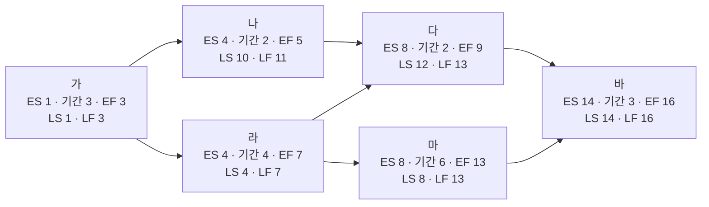

<!-- PDF page: 098 -->

〈표 46〉 각 활동별 후진계산 결과

| 활동 이름 | LS(Late Start) | 기간 | LF(Late Finish) |
| --- | --- | --- | --- |
| 가 | 1(3–3 + 1) | 3 | 9(10–1) 3(4–1) |
| 나 | 10(11–2 + 1) | 2 | 11(12–1) |
| 다 | 12(13–2 + 1) | 2 | 13(14–1) |
| 라 | 4(7–4 + 1) | 4 | 11(12–1) 7(8–1) |
| 마 | 8(13–6 + 1) | 6 | 13(14–1) |
| 바 | 14(16–3 + 1) | 3 | 16 |

“바” 활동의 경우, 후행 LS가 없으므로, LF는 16으로 시작한다. “라” 활동의 경우, 후행 활동이 “다”와 “마” 두가지가 있다. 이경우, “라” 활동이 끝나야 “다” 와 “마” 활동이 시작될 수 있는데, “다” 활동은 늦어도 12일에는 시작해야 하고(LS, Late Start). “마” 활동은 늦어도 8일에는 시작해야 한다. 따라서, “라” 활동이 7일에는 늦어도 끝나야(Late Finish), 두 활동 중 빠른 “마” 활동이 정상적으로 8일에 시작될 수 있다. 그래서, “라” 활동의 LF는 “마” 활동의 LS 8 에서 1을 뺀 7이 된다. 이어서 “라” 활동의 LS 또한, 7–4+ 1 = 4가 된다. 개별 활동의 LS 와LF 를 모두 계산한 후, 아래 그림과 같이 기입한다.

[그림 32] 임계 경로법③(예시)

④ 총 여유시간(Total Float) 확인, 임계경로 계산

개별 활동별 총 여유시간의 계산식은 아래와 같다.

- TF = LF—EF 또는

- TF = LS—ES

총 여유시간을 계산하는 이유는 임계경로(Critical Path)를 결정하기 위함이다. 즉, 임계경로는 총 여유시간이 '0'인 활동들을 연결한 경로다. 따라서, 다음 그림처럼 본 예시의 임계 경로는 붉은색으로 표시된 “가–라–마–바”가 된다.
