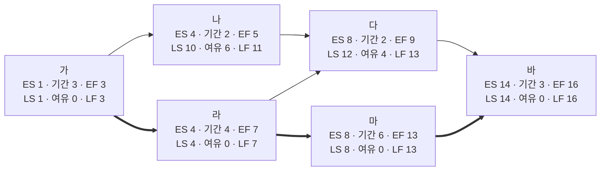
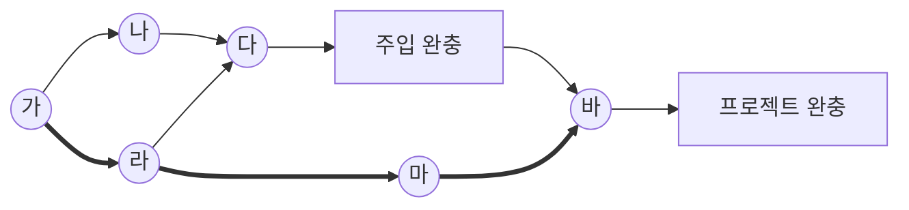

<!-- PDF page: 099 -->

[그림 33] 임계 경로법④(예시)

해당 임계경로상의 활동이 지체되는 경우 전체 프로젝트 일정이 늦어지게 된다. 따라서, 임계경로상의 활동들은 일정관리의 집중적 대상이 된다.

#### 나) 일정개발 기법-주공정연쇄기법(CCM: Critical Chain Method)

주공정연쇄기법 혹은 주공정연쇄법은 프로젝트 팀에서 한정된 자원과 프로젝트 불확실성을 고려하여 프로젝트 일정 경로에 완충(Buffer)을 둘 수 있는 일정 계획 방법이다. 임계경로법으로 결정된 임계경로에 자원할당, 자원최적화, 자원평준화, 활동기간 불확실성이 미치는 영향을 고려하기 위해 주공정법에 완충과 완충관리라는 개념을 도입한다.

아래는 임계경로법 예시를 바탕으로 활동기간 불확실성을 상정하여 완충(Buffer)을 둔 그림이다.

[그림 34] 주공정 연쇄법(예시)

주공정 연쇄의 끝에 추가된 완충을 프로젝트 완충(Project Buffer)이라고 하며, 목표 종료일이 주공정 연쇄에서 벗어나지 않도록 노력한다.

주공정 경로(붉은 색 경로)에 속하지 않은 종속 활동 경로가 주공정 경로에 주입되는 각 지점에 주입 완충(Feeding Buffer)이라고 하는 추가 완충을 배치한다. 주입 완충의 크기는 해당 완충까지 연결된 종속 활동 연쇄의 기간 불확실성을 고려하여 결정해야 한다.

완충 일정활동을 결정한 후에는 가능한 최근 예정개시일과 예정종료일로 예정된 활동의 일정을 계획한다. 결과적으로 주공정 연쇄법에서는 네트워크 경로의 총 여유를 관리하는 대신 활동 연쇄의 잔여 기간 대비 잔여 완충기간을 관리하는 데 주력한다.
