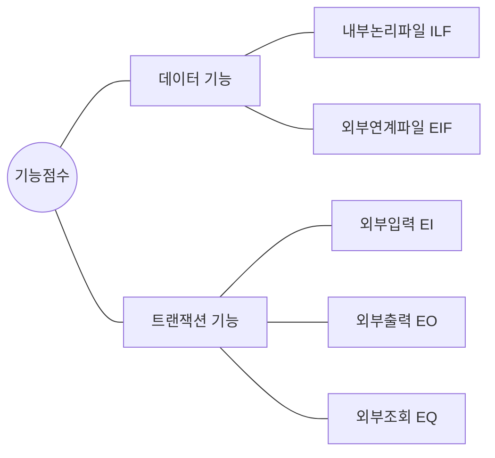

<!-- PDF page: 105 -->

<!-- 원본 프로젝트 관리 도구의 원가 통제 화면은 생략함. 글쓰기 작업의 기간 5일, 완료율 90%를 보여 주는 예시이다. -->

[그림 35] 원가 통제 화면(예시)

### 03 원가산정 기법

대표적인 프로젝트 원가산정 기법은 기능점수법(FP, Function Point). 투입공수 산정법(M/M, Man/Month), COCOMO 등이 있다.

#### 가) 기능점수법(FP, Function Point)

기능점수법은 소프트웨어 개발규모를 기능점수(FP)로 측정하고, 기능점수당 단가를 곱하여 비용을 산출하는 방식이다. 소프트웨어 개발자 중심의 산정 방식에서 벗어나 사용자 관점에서 사용자가 요구하고, 사용자에게 인도되는 기능을 정량적으로 산정하는 국제 표준(ISO/IEC 14143)이며, 소프트웨어 개발, 유지관리 및 운영을 위한 비용산정 방법이다. LOC(Line Of Code) 기반의 COCOMO 방식이나 투입공수 기반의 공수산정법에 비해 사용자의 요구기능을 파악하여 개발 프로젝트 규모를 개발 이전에 파악하는 특징이 있다.

소프트웨어 기능은 데이터 기능과 트랜잭션 기능으로 나뉘어지며, 다시 세분하여 데이터기능은 내부논리파일과 외부연계파일, 트랜잭션 기능은 외부입력, 외부출력, 외부조회의 3가지로 나뉜다.

[그림 36] 기능 유형 분류
