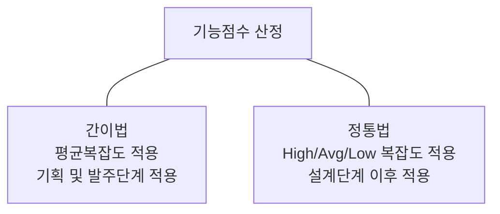

<!-- PDF page: 107 -->

[그림 37] 기능점수 산정 방법

최근 실무에서는 공공 프로젝트 사업의 경우, 기능점수 산정 방식을 활용하여 사용자 중심의 기능 중심으로 원가 산정을 실시하고 있다.

#### 나) 투입공수 산정법(MM, Man/Month)

투입공수 산정법은 과거의 유사사업 수행 경험을 토대로 사업의 투입인력 소요공수를 산정하고, 프로젝트에 투입되는 인력을 기반으로 원가를 산정하는 방식이다.

프로젝트 개발비 = 직접인건비 + 제경비 + 기술료 + 직접경비

통상 투입인력 소요공수 산정을 위한 근거로는 범위관리에서 도출된 작업분류체계(WBS)의 최하위 단위인 작업패키지별로 소요공수를 할당한다.

① 직접인건비 결정

작업패키지별로 소요공수가 할당되면, 공수당 단가를 결정해야 하는데, 국내의 경우 한국소프트웨어산업협회가 공표하는 소프트웨어 기술자 평균 임금을 적용하여 아래와 같은 표를 참조하여 결정한다.

〈표 48〉 2017년 SW기술자 평균임금

<table>
<tr><th>구분</th><th>평균임금(M/M)</th><th>평균임금(M/H)</th></tr>
<tr><td>기술사</td><td>9,414,309</td><td>56,576</td></tr>
<tr><td>특급기술자</td><td>8,134,214</td><td>48,884</td></tr>
<tr><td>고급기술자</td><td>6,351,342</td><td>38,169</td></tr>
<tr><td>중급기술자</td><td>4,981,725</td><td>29,938</td></tr>
<tr><td>초급기술자</td><td>3,979,456</td><td>23,915</td></tr>
<tr><td>고급기능사</td><td>3,976,482</td><td>23,897</td></tr>
<tr><td>중급기능사</td><td>3,296,592</td><td>19,811</td></tr>
<tr><td>초급기능사</td><td>2,390,211</td><td>14,364</td></tr>
<tr><td>자료입력원</td><td>2,370,347</td><td>14,245</td></tr>
</table>
