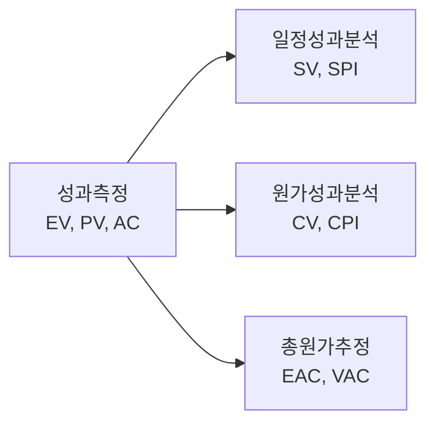

<!-- PDF page: 110 -->

[그림 38] 획득가치 관리(EVM)의 구성

획득가치관리는 원가와 일정을 통합해서 프로젝트 성과를 통제하는 기법으로서, 관련된 용어는 다음과 같다.

〈표 51〉 획득가치 관리 주요용어

| 주요 용어 | 설명 |
| --- | --- |
| 획득 가치 (EV: Earned Value) | 현재까지 수행한 작업에 대하여 할당되어 있는 예산 (예) 5일 80%(진행률) = 5*0.8 = 4일 |
| 계획 가치 (PV: Planned Value) | 활동 또는 작업분류체계 구성요소를 완료하기 위해 수행하는 작업에 배정되어 승인을 받은(계획한) 예산 (예) 5일 |
| 실제 원가 (AC: Actual Cost) | 수행한 작업을 위해 실제 투입된 비용 (예) 5일 활동에 추가 1명, 1일 추가 = 5일*1명 + 1일*1 = 6일이 투여 됨 |
| 일정 차이 (SV: Schedule Variance) | 프로젝트에 대한 일정 성과를 측정하는 척도 SV > 0: 일정 양호, SV < 0: 일정 지연 SV = EV–PV, 4–5 = –1일로, 1일 일정 지연됨 |
| 일정성과지수 (SPI: Schedule Performance Index) | 프로젝트에 대한 일정 성과를 측정하는 척도 SPI = EV / PV SPI > 1: 일정 양호, SPI < 1: 일정 지연 |
| 원가 차이 (CV: Cost Variance) | 프로젝트에 대한 원가 성과를 측정하는 척도 CV > 0: 원가 절감, CV < 0: 원가 초과 CV = EV–AC, 4–6 = –2, 2일만큼 원가 초과 |
| 원가성과지수 (CPI: Cost Performance Index) | 프로젝트에 대한 원가 성과를 측정하는 척도 CPI = EV / AC CPI > 1: 원가 양호, CPI < 1: 원가 초과 |

다음 그래프는 프로젝트의 획득가치 관리 그래프의 한 예이다. 8월 1일 현재 계획가치(PV), 실제원가(AC), 획득가치(EV)를 측정하고 일정차이(SV)와 원가차이(CV)로 분석하여 프로젝트를 예측할 수 있다. 계획된 작업양인 계획가치(PV)보다 실제로 투입된 원가인 실제원가(AC)가 더 많이 지출되었고, 실제 완료된 작업량인 획득가치(EV)는 계획가치(PV)보다 적게 수행하였다. 프로젝트 원가를 분석하면 일정차이(SV) = 획득가치(EV)–계획가치(PV) 이므로 음수가 되어 일정이 지연되고 있으며, 원가차이(CV) = 획득가치(EV)–실제원가(AC) 이므로 음수가 되어 원가가 초과되고 있는 것이다.
