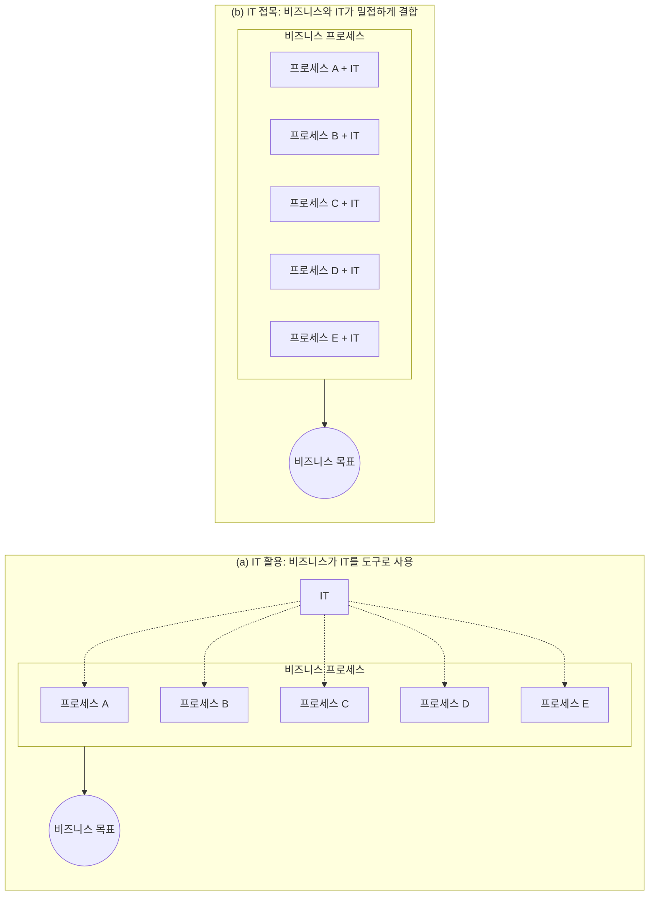

<!-- PDF page: 019 -->

#### 가) IT 비즈니스의 정의

IT 비즈니스는 기업의 궁극적인 비즈니스 목표를 달성하기 위해 다양한 프로세스에 IT를 접목하여 전략적으로 전개하는 모든 활동을 의미한다.

20세기 기업에서 컴퓨터는 전산실 중심으로 사용되었으며 기업의 일반 업무환경에서는 매우 제한적으로 활용되었다. 하지만 1990년대 이후부터 컴퓨터 기술의 발달과 웹 기술의 대중화가 이루어지면서 컴퓨터는 일반 업무환경에서 점진적으로 활용의 폭이 확대되기 시작했다.

이러한 컴퓨터 기술의 대중화는 21세기에 접어들어 산업 전반에 IT가 접목되면서 더욱 가속화되었다. 이 시기부터 대중들의 라이프 스타일이 디지털 중심으로 전환되기 시작했으며, 산업 전반에 걸쳐 비즈니스 프로세스의 중심에 IT가 핵심 역할을 담당하기 시작했다. 즉, 기업에서 업무에 부분적으로 컴퓨터를 활용한다는 개념이 아닌, 전사적인 관점에서 IT가 기업의 의사결정 과정에 핵심 역할을 담당하기 시작한 것이다.

2005년 이후부터 'IT 비즈니스'라는 개념이 IT가 중심이 된 상품을 판매하는 기업들을 중심으로 산업현장에서 본격적으로 거론되고 인식되기 시작했다. 2010년 이후 기업들의 비즈니스 프로세스에 IT 접목이 급속도로 확장되면서 IT 비즈니스의 개념은 기업의 경쟁우위를 확보하기 위해 비즈니스 프로세스에 IT가 밀접하게 결합되는 구조로 발전되었다. 특히 기업의 의사결정자들은 급변하는 경영환경에서 양질의 정보를 확보하려면 비즈니스와 IT 접목이 매우 중요하다는 것을 인식하기 시작했다. [그림 2]는 IT 비즈니스의 개념이 어떻게 발전되어 왔는지 설명하고 있다.

[그림 2] IT 비즈니스 개념의 발전

---
