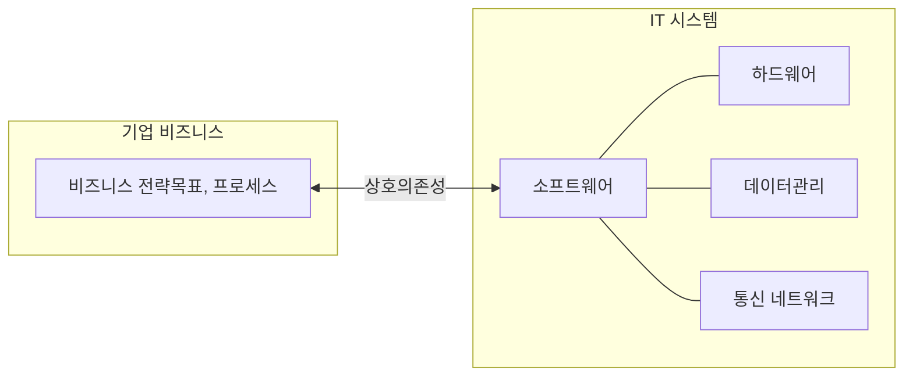
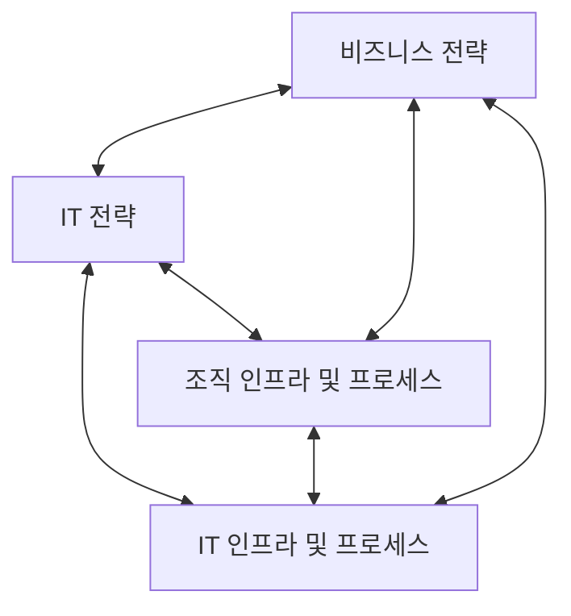

<!-- PDF page: 020 -->

#### 나) 비즈니스와 IT의 연계

IT 비즈니스에서 IT는 단순한 도구 또는 지원 기능이 아니라 비즈니스 전략목표 및 프로세스와의 상호의존성이 극대화된 개념으로 자리잡아가고 있다. 이러한 상호의존성의 극대화는 기업의 비즈니스 모델의 경쟁력을 강화할 뿐 아니라 새로운 비즈니스 가치의 창출에도 큰 역할을 담당한다. [그림 3]은 기업 비즈니스와 IT 시스템 간의 상호의존성을 나타낸다.

[그림 3] 기업 비즈니스와 IT 시스템 간의 상호의존성

IT 비즈니스에서 비즈니스와 IT의 연계(alignment)는 IT 응용프로그램, IT 인프라, 그리고 IT 조직이 비즈니스 전략과 비즈니스 프로세스를 지원 및 구현하는 수준으로 정의된다.

비즈니스와 IT의 전략적 연계 모델은 [그림 4]와 같이 비즈니스와 IT의 연계성을 이차원 도표로 나타낸다. 여기서 전략적 적합성 차원은 비즈니스 환경에 대한 외부 초점 및 관리 구조에 대한 내부 초점으로 구분되며, 기능적 통합성 차원은 비즈니스와 IT를 구분한다.

[그림 4] 비즈니스와 IT의 전략적 연계

| 전략적 적합성 / 기능적 통합성 | 비즈니스 | IT |
| --- | --- | --- |
| 외부 | 비즈니스 전략 | IT 전략 |
| 내부 | 조직 인프라 및 프로세스 | IT 인프라 및 프로세스 |

이 모델은 전략적 연계를 달성하기 위해 비즈니스 전략, IT 전략, 조직 인프라 및 프로세스, IT 인프라 및 프로세스 등 서로 조화된 4개의 영역을 정의하며, 이들 영역은 각각 고유의 범위, 능력, 거버넌스, 인프라, 프로세스, 기술 등의 구성요소를 갖는다.

---
