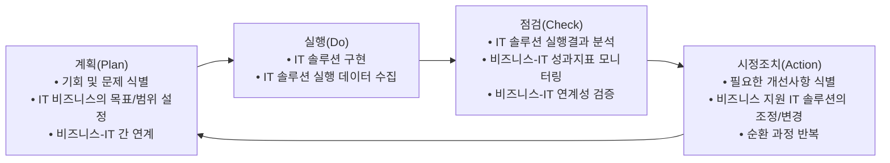

<!-- PDF page: 025 -->

또한, 전자상거래도 새로운 비즈니스 가치 창출의 대표적인 사례이다. IT를 통한 가상의 온라인 시장은 지금까지 존재해 온
전통적인 상거래의 개념을 변화시켜 오픈마켓 및 소셜커머스 등 다양한 상거래 비즈니스 가치를 창출시켜 나가고 있다.

##### ③ 글로벌 비즈니스 확산

오늘날 많은 기업들은 그들의 생존과 번영을 위해서 새로운 시장의 개척과 글로벌 비즈니스를 추구하고 있다. IT 자원을
활용한 글로벌 협업 환경은 그동안 로컬 비즈니스에 머물렀던 기업들에게 새로운 시장을 제시해 주고, 기존의 글로벌 비즈니스를 추구하기 위해 필요했던 비용과 인력 그리고 시간에 대한 전통적 관점을 변화시켰다.
예를 들어 화상회의 시스템 구축은 급변하는 비즈니스 환경에서의 의사결정 신속성과 효율성을 확보해 주었고, 인트라넷
시스템을 통한 시간과 공간의 제약이 없는 정보 교류는 글로벌 비즈니스에서 큰 경쟁우위를 가져다 주었다.

#### 다) IT 비즈니스를 위한 관리활동 및 구조

IT 비즈니스의 순환적 관리활동은 계획(Plan), 실행(Do), 점검(Check), 시정조치(Action)로 이루어진 전통적인 PDCA 관리
사이클을 따른다. 계획(P) 단계에서는 기회 및 문제 식별, IT 비즈니스의 목표/범위의 설정, 비즈니스와 IT 간 연계 아래 IT
비즈니스 계획을 수립한다.
실행(D) 단계에서는 IT 비즈니스를 설계 및 구현하고 실행 데이터를 수집한다.
점검(C) 단계에서는 IT 비즈니스 실행결과 분석, 비즈니스와 IT의 성과지표 모니터링 및 연계성 검증 등을 수행한다.
시정조치(A) 단계에서는 필요한 개선사항 식별, IT 비즈니스를 지원하기 위한 IT의 조정/변경 등을 거쳐 다시 계획(P) 단계
로 진입함으로써 순환 과정을 반복하게 된다.
[그림 8] IT 비즈니스의 순환적 관리

IT 비즈니스의 순환적 관리구조는 [그림 8]과 같다. IT 비즈니스에서 비즈니스(프로세스)가 성과를 올리도록 IT 서비스와 IT
인프라는 운영을 지원한다. IT 비즈니스 관리에서는 IT 부문의 운영지원 서비스 품질과 조직의 비즈니스 성과로부터 새로
운 IT-비즈니스 성과지표를 도출하여 IT 부문으로 전달하며, 이러한 목표달성을 지원하기 위한 결정 지원, 조정, 투자 등
을 제공한다.

---
