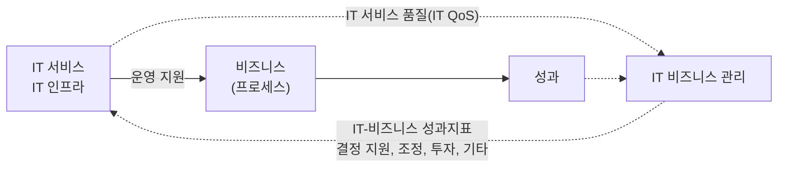

<!-- PDF page: 026 -->

[그림 9] IT 비즈니스의 관리 및 통제 구조

### 04 IT 비즈니스 가치사슬

#### 가) 가치사슬 개요

가치사슬 모델은 기업 조직의 궁극적인 방향성을 가치(Value)라는 개념으로 설정하고 이를 위한 기업 조직의 구조를 체
계적으로 제안한 것으로서, 가치사슬 모델은 오늘날까지 기업의 비즈니스 활동을 분석하는 데 매우 중요한 경영이론으로
인식되고 있다. 또한 가치사슬 모델은 각 기업의 경쟁우위를 활동 관점에서 분석하고 이해하는 데 매우 중요한 프레임워크를 제공할 뿐 만 아니라, 이 모델에서 제안하고 있는 주요활동과 지원활동 개념은 기업 조직구조의 중요한 참고기준이
되고 있다.
비즈니스 가치사슬에는 전통적 제조기업과 전자상거래 기업에 대한 두 가지 개념으로 접근할 수 있다. 전통적 제조기업
의 영리 및 비영리적 관점에서 궁극적인 목적을 달성하기 위해 기업의 주요활동인 입고물류, 운영(생산), 출고물류, 마케팅 및 판매, 서비스 등과 지원 활동인 기업인프라, 인사 관리, 기술 개발, 구매 활동 등이 어떻게 구성되고 전개되어야 하
는지 설명하고 있다. 전자상거래 기업의 가치사슬에는 비즈니스 프로세스를 전자적으로 해결함으로써 비즈니스의 효율
성과 효과성을 높이고 있다. 주요활동은 전자조달, 무재고 생산, 제3자 물류, 네트워크 판매, 온라인 서비스 등이며, 지원활동은 통합 정보플랫폼 및 네트워크 인프라 구축, 인터넷 고용, 온라인 협력업체 관리 등이다.

[그림 10] 비즈니스 가치사슬

| 구분 | 지원활동 | 주요활동 | 결과 |
| --- | --- | --- | --- |
| (a) 전통적 제조기업 | 기업 인프라 기술 개발 인사 관리 구매 활동 | 입고 물류 → 운영(생산) → 출고 물류 → 마케팅 & 판매 → 서비스 | 부가가치 |
| (b) 전자상거래 기업 | 통합 정보 플랫폼 및 네트워크 인프라 구축 인터넷 고용, 훈련 등 온라인 협력업체 관리 | 전자 조달 → 무재고 생산 → 제3자 물류 → 네트워크 판매 → 온라인 서비스 | 부가가치 |

---
