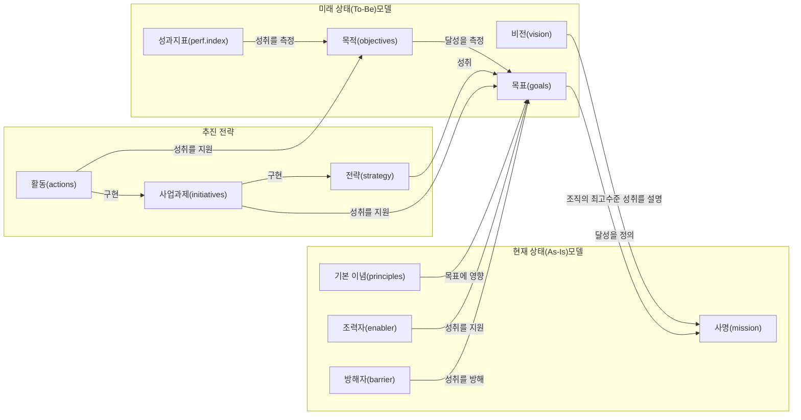

<!-- PDF page: 032 -->

〈표 3〉 전략수립의 구성요소

| 구성요소 | 설명 |
| --- | --- |
| 기본정보 | 기업의 사명과 목적/목표, 그리고 정량적 성과 등 |
| 현재상태 모델 | 현재 기업의 내부/외부 환경, 비즈니스 원칙과 가치를 사명 관점에서 설명 |
| 미래목표 모델 | 미래 기업이 성취하고자 하는 비전과 목표 |
| 추진 전략 | 기업의 목적, 목표, 사명을 달성하기 위한 경로 |

일반적인 전략수립에서는 기업 모델로서 현재 상태(As-Is) 모델의 분석과 미래 목표(To-Be) 모델의 수립이 제시되며, 이러한 기업 모델 사이의 전환 및 이행을 구현하기 위한 추진전략이 제공된다. 전략수립 구성요소 간의 관계를 나타내면 다
음 그림과 같다.

[그림 11] 전략수립 구성요소 간의 관계

##### 사명(Mission)

기업의 사명은 기업의 목적 또는 주요 사업이다. 사명은 기업이 자신의 이익을 위하여 무엇을 하는지 설명하며, 시간적으로 제한되지 않은 목표이다.

##### 비전(Vision)

기업이 추구하는 이상적인 미래 모습이다. 비전은 사명의 성공적인 수행으로 얻어진다. 기업의 비전은 영감의 원천이며,
기업의 능력을 확장시킨다.

##### 목표(Goals)

사명의 달성을 지원하는 측정 가능한 높은 수준의 목표이다.

---
