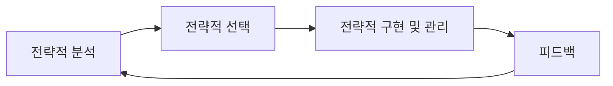

<!-- PDF page: 033 -->

##### 목적(Objectives)

목표 달성을 나타내는 특정되고 정량화된 낮은 수준의 목표이다.

##### 기본 이념(Principles)

기업이 목표 달성 방법의 선택에 고려할 제약사항을 명시한다. 기본 이념은 기업의 핵심 가치를 나타내며 기업의 전략을
형성하는 데 사용된다.

##### 조력자(Enablers)

목표와 목적을 달성하려는 기업의 능력을 촉진하는 외부 환경과 기업의 강점이다.

##### 방해자(Barriers)

목표와 목적을 달성하려는 기업의 능력을 방해하는 외부 환경과 기업의 약점이다.

##### 전략(Strategy)

기업이 사명, 목표, 목적을 달성하기 위한 접근방법이다. 전략은 기업의 비전을 지원하며, 조력자, 방해자, 기본 이념에 의
해 영향 받는다.

##### 전략계획(Strategic Plan)

전략계획 수립 활동으로 얻어지는 문서이다. 전략계획은 기업 전략과 기업 전략에 영향을 미치는 요소를 설명한다.

##### 사업과제(Initiatives)

전략을 실행하는 특정한 활동의 집합이다.

##### 활동(Actions)

목표와 목적을 달성하기 위한 구체적인 절차이다. 일반적으로 활동은 담당자를 배정하고 일정상 제약이 존재한다.

##### 성과지표(Performance Index)

각 목표에 대한 성과 목표치를 설명한다.

#### 다) 전략수립 프로세스

전략수립 프로세스는 전략적 분석, 전략적 선택, 전략적 구현 및 관리, 피드백 등으로 이루어진다. 먼저 전략적 분석에서
기업의 기본 정보를 조사하며 현재 상태(As-Is) 모델을 분석하고, 전략적 선택에서 미래 목표(To-Be) 모델과 목표 모델에
도달하기 위한 추진전략을 수립한다. 전략적 구현 및 관리에서 전략을 구현하고 운영하며 필요한 경우 전략 계획의 적절
한 변경을 실시한다.

[그림 12] 전략수립 프로세스

---
