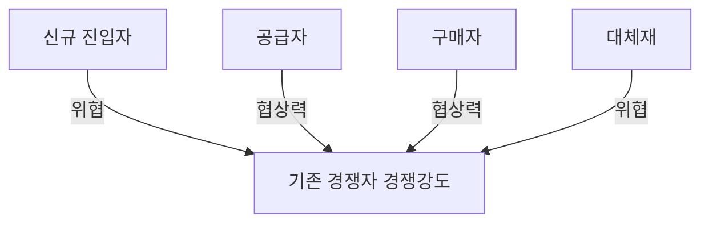

<!-- PDF page: 035 -->

### 03 IT 비즈니스 환경분석

#### 가) 외부 환경분석

##### ① PEST 분석

거시적 외부환경분석기법으로서 PEST 분석은 정치(Political), 경제(Economic), 사회(Social) 및 기술(Technological)의 기회
요인과 위협 요인의 영향을 분석하는 도구이다. PEST 분석에서는 제품과 비즈니스 서비스가 진출하려는 목표 시장으로서
국가나 지역의 특성에 대한 브레인스토밍을 사용한다. 아래의 표는 PEST 분석 항목 사례를 나타낸 것이다.
〈표 4〉 PEST 분석과 세부 항목 사례

| 구분 | 분석 항목 |
| --- | --- |
| 정치(P) | 정부의 종류와 안정성, 사회의 고용 법제, 규제와 규제 완화 동향, 조세 정책, 무역 및 관세, 확률이 높은 정치 환경의 변화, 환경·소비자 보호법 등 |
| 경제(E) | 현재와 미래의 경제 성장, 실업과 노동 공급, 인플레이션 및 금리, 인건비, 세계화의 영향, 가처분 소득과 소득 분배 수준, 경제 환경의 변화 등 |
| 사회, 문화(S) | 인구 증가율과 나이, 교육, 인구의 건강, 사회적 유동성 및 이러한 태도, 고용 시장의 자유와 직업에 대한 태도, 인구의 고용 형태, 사회적 금기 등 |
| 기술환경(T) | 신기술의 영향, 인터넷의 영향, 통신 비용 절감 및 원격 작업, 연구 개발 활동, 기술 이전의 효과 등 |

PEST 분석은 앞에서 살펴본 4개의 요소와 함께 법적 요소(Legal)와 환경적 요소(Environmental)를 포함하여 PESTLE 또는
PESTEL로 확장하여 사용하기도 한다.

##### ② 5 Forces 분석

기업이 속한 산업 구조를 분석하는 미시적 외부 환경분석 기법인 5 Forces 분석 기법은 제품 또는 비즈니스 서비스에 관
한 기업의 경쟁우위 확보를 위한 전략을 수립할 때 사용된다. 이 모델에서는 다음과 같은 다섯 가지 관점에서 해당 산업의
구조를 분석한다.
[그림 13] 마이클 포터의 5 Force 분석

---
