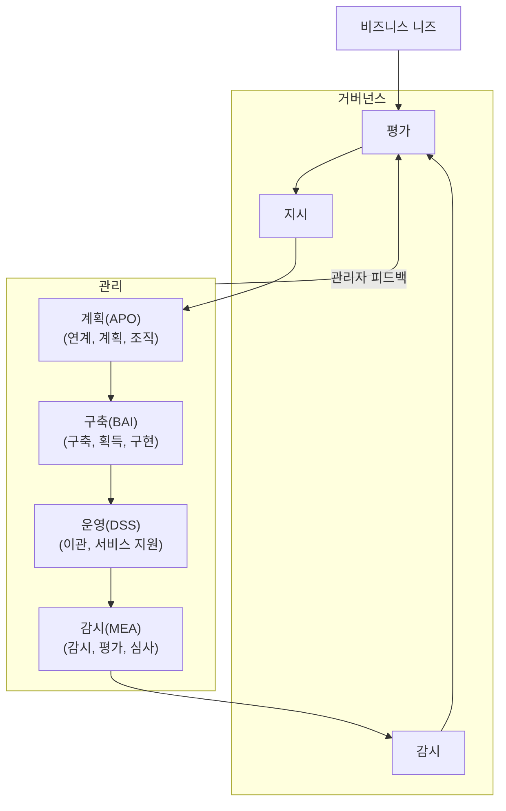

<!-- PDF page: 043 -->

#### 나) IT 거버넌스 프레임워크

IT 거버넌스에서는 IT와 기업의 경영목표를 전략적으로 연계시킴으로써 IT의 가치가 기업의 사업적 성과를 얻는 데 기여
하도록 하며 IT 운영을 위한 위험관리와 핵심 IT 자원의 관리를 통해서 IT 자원에 대한 역할과 책임을 명확하게 규정함으
로써 IT 통제에 대한 신뢰성과 투명성을 확보하도록 IT 거버넌스를 구성한다.
다음 그림은 IT 거버넌스 프레임워크로 널리 알려진 COBIT 5(Control Objectives for Information and Related Technology
5)에서 제공하는 거버넌스 프레임워크 참조모델이다. 참조모델에서는 기업의 거버넌스 프로세스와 관리 프로세스를 분할
하여 구성하고 있다.
[그림 17] IT 거버넌스 참조모델 COBIT 5

##### ① 거버넌스 영역

각각 평가(E), 지시(D), 감시(M) 등의 실무절차를 갖는 5개의 프로세스로 구성됨

- EDM 1. 거버넌스의 프레임워크와 측정 기준의 수립

- EDM 2. 이익 제공

- EDM 3. 위험 최적화

- EDM 4. 자원의 최적화

- EDM 5. 이해관계자의 투명성

##### ② 관리 영역

계획(APO), 구축(BAI), 운영(DSS), 감시(MEA) 등 4개의 프로세스 영역으로 구성됨

- 계획(APO) 단계: 연계, 계획

- 구축(BAI) 단계: 구축, 획득, 구현

- 운영(DSS) 단계: 이관, 서비스 지원

- 감시(MEA) 단계: 감시, 평가, 심사

IT 거버넌스 프레임워크는 국제표준인 ISO/IEC 38500과 연결되어 있으며 이 표준 또한, 기업의 IT 활용을 평가(Evaluate),
지휘(Direct), 감시(Monitoring)하는데 필요한 원칙과 프레임워크를 동시에 제공하고 있다.

---
