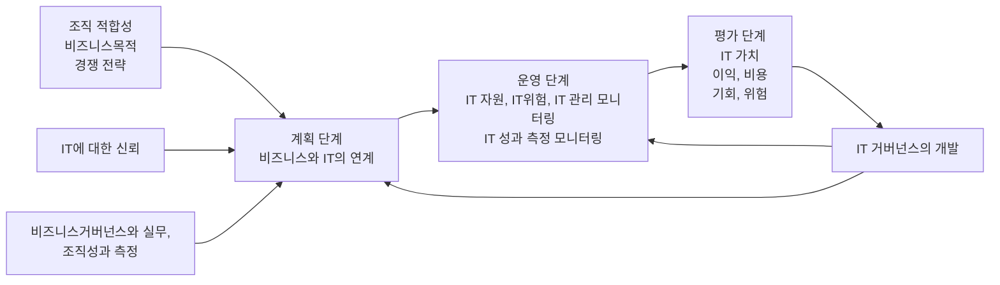

<!-- PDF page: 044 -->

#### 다) IT 거버넌스 프로세스

IT 거버넌스 프로세스는 계획 단계, 운영 단계, 평가 단계, 피드백 등으로 구성된다.
[그림 18] IT 거버넌스 프로세스

##### ① 계획 단계

비즈니스와 IT의 연계는 기업이 비즈니스와 IT를 연계 및 정렬하고 IT 목표를 설정하며, IT에 관련된 활동, 자원 사용, 위험
관리, 거버넌스 구조, 성과측정 등을 조직화하는 원칙에 대한 구조, 활동, 관련 메커니즘을 포함한다.

##### ② 운영 단계

IT 자원, IT 위험, IT 관리에 대한 모니터링은 기업이 IT 자원, IT 위험 및 IT 관리를 감시하도록 지원하는 구조, 활동, 관련 메
커니즘을 포함한다. IT 성과 측정 모니터링은 기업이 IT 자원, IT 위험, IT 관리 성과에 대한 목표치를 설정하고 이들 목표의
성취도를 측정하도록 지원하는 구조, 활동, 관련 메커니즘을 포함한다.

##### ③ 평가 단계

IT 가치는 비즈니스에 제공할 미래의 비즈니스 기회, 이익과 비용에 의해 평가되며, 전략적, 경제적, 위험 관리, 기술적, 사
회적, 그리고 품질 이익 등이 포함된다. IT 가치는 IT가 지원하는 비즈니스 기회에서 비즈니스의 위험 비용 및 잠재적인 기
타 위험 비용을 차감한 것이다.

##### ④ 피드백 단계

피드백 정보의 평가와 우선순위화된 필요에 따라 IT 거버넌스와 활동을 개선하도록 시정조치를 수행하여 기업이 IT 거버넌스 프로세스와 관련 실무를 개선하는 구조, 활동, 관련 절차를 포함한다.

#### 라) IT 거버넌스 주요 관심영역

IT 거버넌스는 5개의 주요 관심영역을 가지고 있다. IT 거버넌스가 핵심적으로 바라보고 있는 영역은 기업의 전략과 연결
되고 그 전략이 IT 가치와 어떻게 접목되어 활용되는지를 관찰한다. 또한 기업의 리스크 요소에 대한 관리 및 자원에 대
한 관리, 그리고 활동에 따른 성과평가 체계를 포함하고 있다.

---
