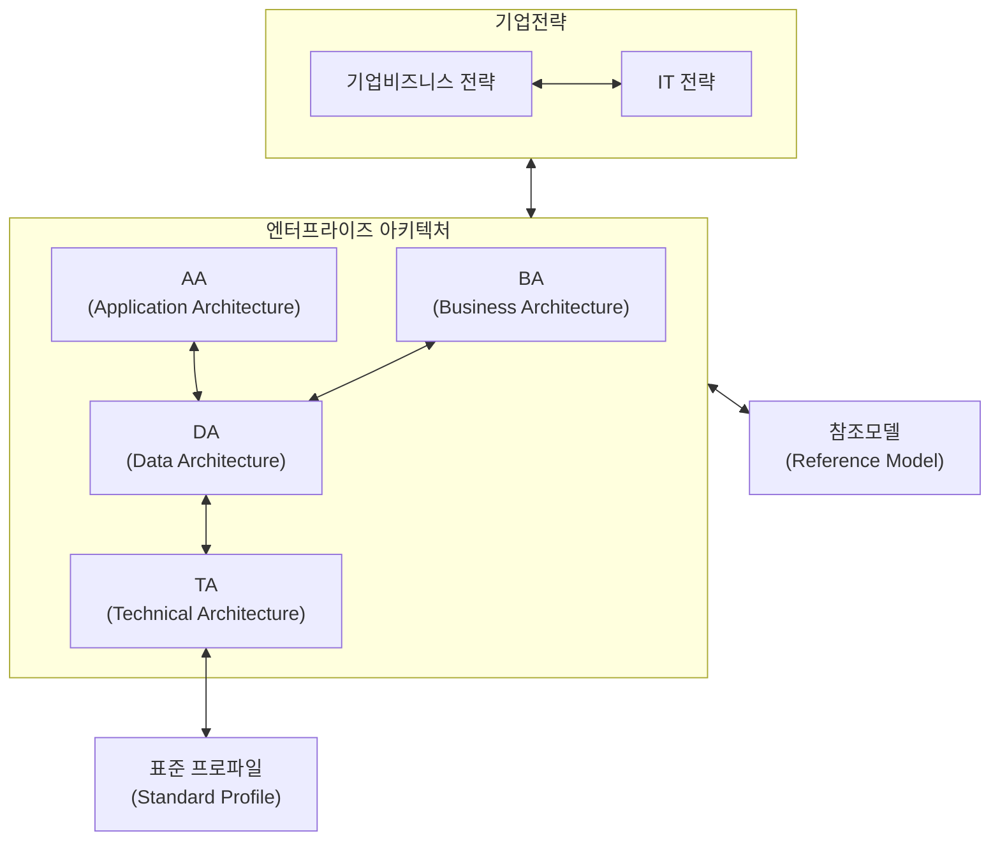

<!-- PDF page: 046 -->

#### 나) EA 개념도 및 구성요소

##### ① EA의 개념도

EA 구축은 기업 비즈니스 전략으로부터 시작된다. 기업 비즈니스 전략은 IT 전략과 융합하게 되고, 그 융합된 결과물로 EA
가 탄생하게 된다.
[그림 19] EA의 개념도

##### ② EA의 구성요소

EA는 IT 거버넌스의 통제체계를 위임 또는 상속받는다. 더 정확하게 표현하자면 EA수립 자체가 IT 거버넌스 행위이며, IT
거버넌스의 통제수단이다.
EA의 핵심 구성요소로는 IT 거버넌스 이 외에 업무아키텍처(BA), 응용아키텍처(AA), 데이터아키텍처(DA), 기술아키텍처
(TA)로 구분된다. 표준프로파일(SP)는 기술아키텍처의 하부구조로서, 기술명세에 대한 상세 스펙을 정의한 것이라고 이해
하면 된다.

〈표 7〉 EA의 구성요소

<table>
<tr><th>구성요소</th><th>특징</th><th>연관참조모델</th></tr>
<tr><td>IT 거버넌스(IT Governance)</td><td>• IT가 기업의 비즈니스 목표와 Align이 되도록하는 프로세스, 조직의 관리 방법</td><td>COBIT COSO</td></tr>
<tr><td>업무아키텍처(BA)(Business Architecture)</td><td>• 경영전략 및 비즈니스 환경분석을 기반으로 Activity를 통해서 사람, 프로세스, 정보를 체계적으로 디자인하고 상호 연관성을 수립</td><td>성과참조모델(PRM)</td></tr>
<tr><td>응용아키텍처(AA)(Application Architecture)</td><td>• 업무에 필요한 정보를 도출하고, 조작 관리하는 활동에 대해 식별하고 정의하는 단계. 어플리케이션 실현에 필요한 기능, 적용업무의 속성과 환경을 정의하는 표준서 작성</td><td>서비스컴포넌트참조모델(SRM)</td></tr>
<tr><td>데이터아키텍처(DA)(Data Architecture)</td><td>• 비즈니스 모델에서 정의된 활동에 필요한 자료를 파악하고 정의 • 모든 정보와 데이터 구조, 데이터 간의 상호관계 등을 파악하여 데이터 모델을 설계</td><td>데이터참조모델(DRM)</td></tr>
<tr><td>기술아키텍처(TA)(Technical Architecture)</td><td>• 비즈니스, 데이터 어플리케이션을 지원하는 인프라와 기타 테크놀로지 선정기준과 이들이 지원하는 기술적 서비스 구조 정의</td><td rowspan="2">기술참조모델(TRM)</td></tr>
<tr><td>Standard Profile</td><td>• 기술아키텍처(TA)에 대한 세부 기술명세서를 정의 예) 자바아키텍처 버전: JDK 2.0</td></tr>
</table>

---
