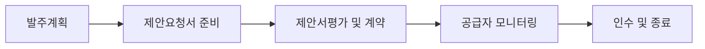

<!-- PDF page: 053 -->

### 01 학습내용 요약

IT 비즈니스 도입은 IT 비즈니스 전략과 계획에 따라 실시하게 된다. 기업의 조직규모와 대외환경의 변화 등에 맞추어 비즈니스 도입 방식과 절차를 마련하게 되며, 기업의 비핵심 영역 또는 프로세스에 대해서는 IT 아웃소싱을 고려하게 된다.
IT 비즈니스 도입 절차에서는 발주프로세스와 ISO/IEC 12207의 소프트웨어개발 생명주기를 활용한다. 이는 IT의 핵심가치는
소프트웨어로 구현되기 때문이며 소프트웨어개발의 성공여부가 IT 비즈니스 도입에 중요한 열쇠이기 때문이다.
IT 아웃소싱은 외부의 전문자원을 활용할 수 있어 기업의 경쟁력 향상에 큰 도움이 되지만 업무적, 기술적 종속(Lock-in)의 문
제는 몇 가지 제도적 보완을 통하여 해결해야 할 숙제이다.

### 02 IT 비즈니스 도입 프로세스

IT 비즈니스를 도입하기 위한 절차로는 기업의 발주프로세스가 기본적으로 활용된다. 발주의 주체는 요구사항을 발행하는 부
서나 담당자이며 개발의 주체는 주로 기업 내부의 전산부서 또는 외부 아웃소싱 전문가로 구성된다.
또한, 소프트웨어 도입에 따른 라이프사이클(SDLC, Software Development Lifecycle) 관리는 ISO/IEC 12207에 정의된 표준 절차를 따르게 된다.

#### 가) IT 비즈니스 발주프로세스

IT 비즈니스 발주프로세스는 발주자의 활동 및 작업을 정의하고 있으며 시스템 또는 소프트웨어나 서비스를 도입하기 위
한 일련의 과정을 말한다.
또한, 발주 대상에 대한 개념정의 및 요구사항 상세화를 시작으로 제안요청서 준비, 제안서 평가 및 계약, 공급자 관리를
거쳐 목표 산출물에 대한 인수까지의 활동을 포괄한다.

[그림 20] IT 비즈니스 발주프로세스

기업은 IT 비즈니스 발주프로세스를 이용함으로써 정보시스템 도입에 따른 발주자와 공급자의 활동을 정의하고 정보화
사업의 성공률을 제고할 수 있다.
그리고 발주자와 공급자 간의 의사소통을 위한 공통 수단을 제공하고 IT 비즈니스 도입의 가시성을 제공하여 예측 가능
한 절차를 제공한다.

---
